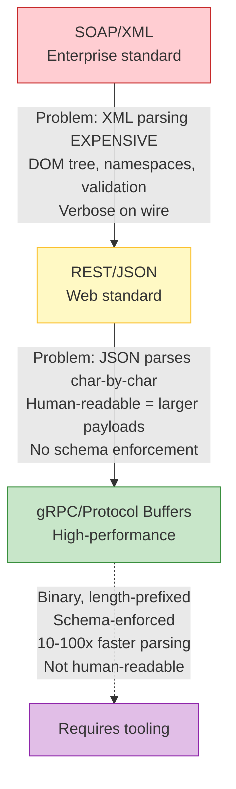
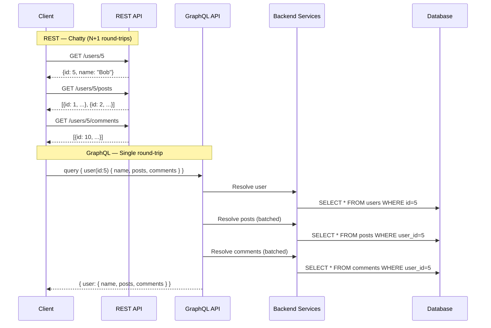
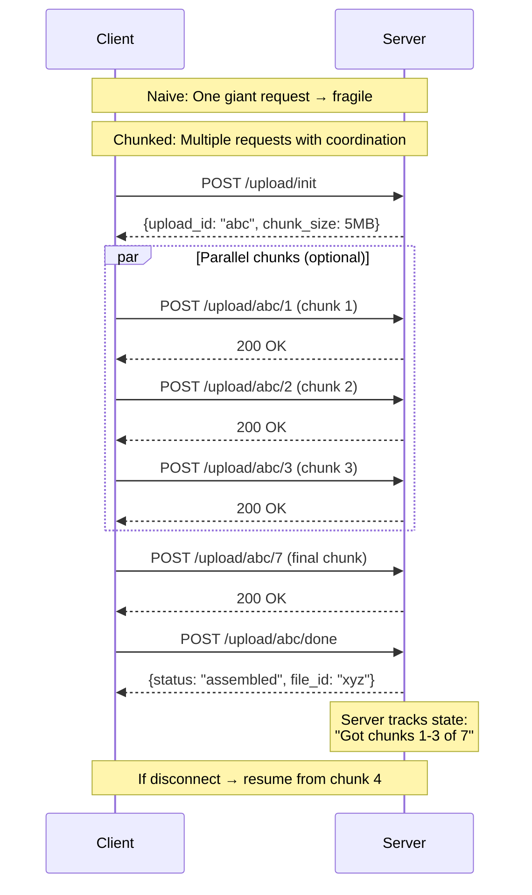

# Lecture 7: Request Response — Complete Lesson

## Status: Completed ✅

---

## The Core Mental Model We Built

### Request/Response Is Not "Simple" — It's Deceptively Complex

The pattern looks trivial: client asks, server answers. But every request carries **hidden costs at every layer**:

```mermaid
flowchart TB
    subgraph Client["CLIENT"]
        S1[1. SERIALIZE<br/>Domain object → wire format<br/>(JSON/protobuf)]
        S2[2. FRAME & WRITE REQUEST<br/>Add protocol headers, delimiters,<br/>boundary markers]
        S3[3. TCP CONNECTION<br/>(if new)<br/>SYN → SYN-ACK → ACK]
        S10[10. PARSE & DESERIALIZE]
        S11[11. CONSUME<br/>Use data → maybe trigger<br/>next request]
    end

    subgraph Network["NETWORK"]
        N1[4. TRANSMIT<br/>TCP segments → IP packets<br/>→ routing → reordering]
        N2[9. TRANSMIT<br/>Response packets → routing<br/>→ reordering]
    end

    subgraph Server["SERVER"]
        S5[5. REASSEMBLE & PARSE BOUNDARIES<br/>Reorder segments → find request<br/>START and END]
        S6[6. DESERIALIZE<br/>Wire bytes → internal<br/>data structures]
        S7[7. PROCESS<br/>"visible" work:<br/>Auth → validation → DB → logic]
        S8[8. SERIALIZE RESPONSE]
    end

    S1 --> S2 --> S3 --> N1 --> S5 --> S6 --> S7 --> S8 --> N2 --> S10 --> S11

    style Client fill:#e3f2fd,stroke:#1976d2
    style Network fill:#fff3e0,stroke:#f57c00
    style Server fill:#e8f5e9,stroke:#388e3c
```

**Key insight**: Most engineers only think about step 7. **Steps 1-6 and 8-11 are where performance lives or dies.**

---

## The Boundary Problem — The Hidden Fundamental

This was the biggest "aha" moment from the lecture.

**In TCP, data is just a continuous byte stream.** There are no built-in message boundaries.

The server must answer three questions for every incoming connection:

| Question | Why It's Hard |
|----------|---------------|
| Where does this request **start**? | After previous request ends, or connection start |
| Where does it **end**? | No universal answer — protocol-dependent |
| Is this **one request or three**? | Must parse boundaries correctly |

**Every protocol solves this differently:**
- **HTTP**: CRLF headers + `Content-Length` or chunked encoding
- **Protocol Buffers**: Length prefix before each message
- **DNS**: Fixed header with query ID in UDP datagram
- **Custom binary**: Delimiter byte or length field

> **The cost of parsing boundaries is NOT free.** A 10MB JSON body takes measurable CPU. That's why high-throughput systems use binary protocols with length prefixes — they parse in O(1) instead of scanning for delimiters.

---

## Parsing ≠ Processing ≠ Serialization (Three Different Things)

We clarified this distinction because the lecture (and many engineers) blur them:

| Phase | Responsibility | Example |
|-------|---------------|---------|
| **Parse** | Find boundaries, understand structure | "This is HTTP GET /users/5" |
| **Deserialize** | Convert wire bytes to usable objects | `{"id":5}` → `UserRequest{id:5}` |
| **Process** | Execute the actual intent | `SELECT * FROM users WHERE id=5` |
| **Serialize** | Convert result to wire format | `User{name:"Bob"}` → `{"name":"Bob"}` |
| **Frame** | Add protocol headers | `HTTP/1.1 200 OK\r\nContent-Length: 15\r\n\r\n` |

**Why this matters**: You can optimize each independently. Fast parser + slow deserializer = bad. Fast deserializer + slow processor = bad. They're different problems.

---

## The Serialization Evolution — Why It Matters

We traced the industry progression and the **engineering reasoning** behind each shift:



**Critical insight**: JavaScript has a **native advantage** with JSON because `JSON.parse()` is implemented in the engine (C++), not userland. In C++/Go/Java, you pay the full parsing cost.

> **Trade-off**: Human-readability (debugging ease) vs. parsing speed + payload size. There's no free lunch.

---

## Request/Response Is the Universal Substrate

We mapped the pattern across the **entire stack** — it's not just HTTP:

| Layer | Protocol | It's Still Request/Response |
|-------|----------|----------------------------|
| **API** | REST, GraphQL, gRPC | ✅ |
| **Database** | PostgreSQL wire protocol, MySQL protocol | ✅ |
| **Infrastructure** | DNS (UDP-based!) | ✅ |
| **Inter-service** | RPC, gRPC, Thrift | ✅ |
| **Cache** | Redis RESP protocol | ✅ |
| **Message queue** | Kafka produce/fetch, RabbitMQ AMQP | ✅ |

**Everything you touch is Request/Response underneath.** Understanding this once pays dividends everywhere.

---

## GraphQL — The Architectural Insight

We discussed why GraphQL exists and what it actually solves:



**But here's the key**: GraphQL doesn't eliminate the multiple queries — it **moves them from the network layer to the backend layer**. The backend can now:
- Batch database queries
- Use dataloaders to eliminate N+1
- Create materialized views
- Optimize with knowledge of the full query tree

> **The network round-trip cost is replaced by backend coordination cost.** Sometimes that's a win, sometimes not.

---

## The Timeline Visualization — Our Most Valuable Mental Model

Hussein's timeline breaks down where time actually goes:

```mermaid
gantt
    title Request/Response Timeline — Hidden Costs
    dateFormat  X
    axisFormat  %S

    section Client
    Serialize & Frame     :crit, t1, 0, 2
    Write Request         :crit, t2, 2, 2
    Receive Response      :crit, t5, 30, 2
    Parse & Deserialize   :crit, t6, 32, 2

    section Network
    Request Transfer      :crit, net1, 2, 2
    Response Transfer     :crit, net2, 30, 2

    section Server
    Parse Boundaries      :crit, s1, 2, 5
    Deserialize           :crit, s2, 7, 3
    Process (DB, Logic)   :crit, s3, 10, 20
    Serialize Response    :crit, s4, 30, 2
```



**Each segment has distinct costs:**
- **T-2→T0**: Client-side serialization + framing (often ignored)
- **T0→T2**: Network RTT + TCP segmentation + IP routing + packet reordering
- **T2→T30**: Boundary parsing + deserialization + **actual work** (DB, logic)
- **T30→T32**: Response serialization + network RTT + client parsing

**The trap**: Monitoring tools show you T2→T30 (your code). The rest is "invisible" but can dominate latency.

---

## Chunked Upload — Extending the Pattern Creatively

We analyzed the image upload example as a **pattern extension**, not a new pattern:



**Why this works**:
- Each chunk is a normal Request/Response (fits existing infra)
- Server tracks state → enables **resume** after disconnect
- Client can parallelize chunk uploads
- Backpressure handled naturally (slow client = slow chunks)

> **The pattern didn't change. The execution strategy did.**

---

## When Request/Response Is the Wrong Tool — Deep Dive

We identified the **failure modes** that drive the next lectures. Each failure mode reveals a fundamental mismatch between what Request/Response assumes and what the situation requires.

### The Core Assumption of Request/Response

> **Request/Response assumes the CLIENT drives the interaction.** The client knows what it wants, when to ask, and can wait for the answer.

When this assumption breaks, the pattern fights you.

---

### Failure Mode 1: Server Has Info, Client Doesn't Know to Ask (The Notification Problem)

```
┌─────────────────────────────────────────────────────────────────┐
│  USER A uploads video                                            │
│       │                                                         │
│       ▼                                                         │
│  BACKEND: "Video uploaded!" ──needs to notify──► USER B          │
│                                                                  │
│  PROBLEM: User B's client doesn't know to ask                   │
│           "Hey, any new videos?"                                │
└─────────────────────────────────────────────────────────────────┘
```

**Request/Response workaround**: Polling
```
Client: "Any notifications?" → Server: "No"
Client: "Any notifications?" → Server: "No"  
Client: "Any notifications?" → Server: "Yes! Here's one"
```

**Why it fails**: 
- Wasted requests (99% empty responses)
- Latency = polling interval
- Doesn't scale (10K clients polling = 10K requests/sec)

**Patterns that solve it**: **Push / SSE / WebSocket** (Lectures 8, 12)

---

### Failure Mode 2: Long-Running Operations Exceed Client Timeout

```
┌─────────────────────────────────────────────────────────────────┐
│  Client: POST /process-video (5GB file)                         │
│       │                                                         │
│       ▼                                                         │
│  Server: Processing... 30 seconds... 60 seconds... 120 seconds  │
│       │                                                         │
│       ▼                                                         │
│  Client: ⏱️ TIMEOUT (default 30-60s)                            │
│       │                                                         │
│       ▼                                                         │
│  Client: RETRIES → Duplicate work!                              │
│  Server: Still processing original...                           │
└─────────────────────────────────────────────────────────────────┘
```

**Why it fails**:
- Client can't wait indefinitely
- Retries cause duplicate processing
- No way for client to know "still working" vs "failed"

**Patterns that solve it**: **Async + Callback / Webhook / Polling** (Lecture 9)

---

### Failure Mode 3: Chatty Clients (N+1 Requests)

```
REST: One resource = one endpoint = one request

Client needs: User + Posts + Comments + Followers
              │
              ├── GET /users/5
              ├── GET /users/5/posts
              ├── GET /users/5/comments  
              └── GET /users/5/followers
              
= 4 round-trips, 4x latency, 4x connection overhead
```

**GraphQL helps** but still Request/Response — just moves chattiness to backend.

**Patterns that solve it**: **GraphQL / Batching** (this lecture)

---

### Failure Mode 4: Large Data Transfer = Fragile

```
7GB upload → 90% complete → Network blip → CONNECTION RESET

Result: 6.3GB wasted, start from zero
```

**Chunked upload extends the pattern** but adds complexity (state tracking, resume logic).

**Patterns that solve it**: **Chunked / Resumable** (pattern extension)

---

### Failure Mode 5: High-Frequency Updates

```
Stock ticker: Price changes 100x/second
Chat app: Messages every few seconds
Live dashboard: Metrics updating constantly

Polling: "Any updates?" 100x/sec = DDoS yourself
Request/Response: Wrong direction (client pulls, server pushes)
```

**Patterns that solve it**: **Pub/Sub / WebSocket** (Lecture 13)

---

### Failure Mode 6: Massive Concurrent Connections

```
10,000 clients connected simultaneously
Thread-per-request = 10,000 threads = OOM / context switch hell
```

**Patterns that solve it**: **Multiplexing / async I/O / event loop** (Lecture 14)

---

## The Pattern-First Mapping

| Failure Mode | Why Request/Response Fails | Pattern That Solves It |
|--------------|---------------------------|------------------------|
| **Server has event, client doesn't know to ask** | Client must poll ("Anything? No. Anything? No.") | **Push / SSE / WebSocket** (Lectures 8, 12) |
| **Operation exceeds client timeout** | Client hangs, retries, duplicates work | **Async + callback/polling** (Lecture 9) |
| **Client needs many related resources** | N+1 requests, head-of-line blocking | **GraphQL / Batching** (this lecture) |
| **Large/unreliable transfer** | Failure = total loss, no resume | **Chunked / Resumable** (pattern extension) |
| **High-frequency updates** | Polling wastes resources, wrong direction | **Pub/Sub / WebSocket** (Lecture 13) |
| **Massive concurrent connections** | Thread-per-request doesn't scale | **Multiplexing / async I/O** (Lecture 14) |

---

**This is the pattern-first thinking**: Don't ask "which technology?" Ask **"which failure mode am I hitting?"**

---

## When Request/Response Is the Wrong Tool (Summary)

| Failure Mode | Why Request/Response Fails | Next Pattern |
|--------------|---------------------------|--------------|
| **Server has event, client doesn't know to ask** | Client must poll ("Anything? No. Anything? No.") | **Push / SSE / WebSocket** (Lectures 8, 12) |
| **Operation exceeds client timeout** | Client hangs, retries, duplicates work | **Async + callback/polling** (Lecture 9) |
| **Client needs many related resources** | N+1 requests, head-of-line blocking | **GraphQL / Batching** (this lecture) |
| **High-frequency updates** | Polling wastes resources, push needed | **Pub/Sub** (Lecture 13) |
| **Massive concurrent connections** | Thread-per-request doesn't scale | **Multiplexing / async I/O** (Lecture 14) |

**This is the pattern-first thinking**: Don't ask "which technology?" Ask "which failure mode am I hitting?"

---

## The Curl Demo — What We Learned from the Wire

Command: `curl -v --trace-ascii output.txt http://google.com`

**What the trace reveals**:
1. **TCP handshake first** — connection cost before any request
2. **DNS resolution** — separate UDP request/response before HTTP
3. **Request headers** — text format, CRLF-delimited, ends with blank line
4. **Response headers first** — status line + headers, then body
5. **Headers arrive incrementally** — not atomically (streaming parse)
6. **301 redirect** — Location header tells client where to go next

**Two critical backend principles demonstrated**:
- **"Don't trust order"** — DNS uses query IDs because 100 concurrent requests = out-of-order responses. HTTP pipelining died because of head-of-line blocking.
- **Protocols are designed for streaming parse** — you process headers as they arrive, not after full receipt.

---

## The Deeper Principle We Extracted

> **Request/Response is the *default* because it's simple to reason about. But simplicity at the API level hides massive complexity at the transport, parsing, and serialization levels.**

A backend engineer who internalizes the **full cycle** makes fundamentally better decisions:

| Decision | Junior thinks | Senior (with this model) thinks |
|----------|---------------|----------------------------------|
| **Protocol** | "REST is standard" | "gRPC saves parsing + enables streaming for this workload" |
| **API design** | "One endpoint per resource" | "GraphQL reduces client round-trips; dataloaders fix N+1" |
| **Large data** | "Increase upload limit" | "Chunked upload with resume = resilience + backpressure" |
| **Timeouts** | "Set timeout to 60s" | "This operation is async; return job ID + webhook/callback" |
| **Performance** | "Optimize the DB query" | "Serialization + network RTT dominate; fix those first" |

---

## Vocabulary We Anchored

| Term | Our Definition |
|------|---------------|
| **Boundary detection** | Finding start/end of a message in a byte stream |
| **Framing** | Adding protocol structure (headers, length, delimiters) around payload |
| **Serialization** | Domain object → wire bytes |
| **Deserialization** | Wire bytes → domain object |
| **Head-of-line blocking** | Request B waits behind slow Request A on same connection |
| **Query ID** | Correlation token matching responses to requests (DNS, RPC) |
| **Chunked encoding** | Streaming body in length-prefixed chunks (no Content-Length needed) |
| **Leaky abstraction** | RPC hides "this is remote" until latency/failure exposes it |

---

## Questions We're Carrying Forward

- How do modern HTTP/2 and HTTP/3 change the timeline (multiplexing, QUIC)?
- What's the real-world JSON vs Protobuf parsing difference in our stack?
- When exactly does gRPC's HTTP/2 multiplexing beat REST/HTTP/1.1?
- How do load balancers and proxies affect the boundary parsing?

---

## Notes for Next Lecture (Push)

The lecture ended by setting up **Push** as the answer to the notification problem:
- "Server has info, client doesn't know to ask"
- Polling is the naive Request/Response workaround
- Push, SSE, WebSocket, Pub/Sub are the real solutions
- We'll see how they differ in delivery guarantees, connection management, scalability

**Our lens for the next lecture**: "What problem does Push solve that Request/Response cannot, and what new problems does Push introduce?"

---

*Documented from our shared analysis and discussion. This captures our mental models, not just the transcript.*