# Lecture 7: Request / Response — Built Up, Unit by Unit

## Status: Completed ✅

> **How to read this doc:** Each unit builds on the previous one. Don't skip. Units 1–2 are the foundation; if those are shaky, nothing after them will make sense. Each unit ends with a **Checkpoint** — answer it in your own words before moving on.

---

## Unit 0 — The Whole Lecture in One Sentence

**A client asks a question, a server answers it, and nothing happens until someone asks again.**

That's it. That's Request/Response.

Everything in this lecture is an answer to one question: *what actually happens during those two arrows?*

---

## Unit 1 — The Core Loop

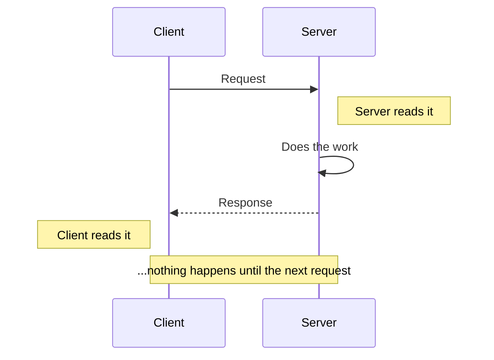

Two properties define this pattern:

| Property | Meaning |
|---|---|
| **Client-initiated** | The *client* decides when communication happens. The server never starts a conversation. |
| **Stateless by default** | Each request stands alone. Request #2 knows nothing about request #1. |

**Why this matters immediately:** everything that later looks "hard" (polling, long polling, push, WebSockets) is an attempt to *break one of these two properties*. Keep this in mind — it explains the entire rest of the section.

---

## Unit 2 — What a Request Actually *Is*

This is where most people's mental model breaks, so let's fix it first.

**Common (wrong) mental model:**
```
Request = a structured object like { method: "GET", path: "/users" }
```

**What's actually true:**
```
Request = a stream of BYTES on a socket, with a FORMAT that says how to read them
```

A request is not an object. It's **bytes**. The structure you see in code (`req.method`, `req.path`) only exists *after* something reads those bytes and interprets them using a format. That "something" is a **parser**, and the format is the **protocol**.

So there are always two separate things:

| Layer | Question it answers | Example |
|---|---|---|
| **Protocol / Framing** | *Where does a message start and end?* | HTTP headers + blank line |
| **Message Format** | *What do the bytes inside mean?* | JSON, XML, Protobuf |

**Checkpoint:** If a request is just bytes, what happens if the server has no idea where one request ends and the next begins?

---

## Unit 3 — The Boundary Problem

This is the most important unit in the lecture. If you get this, you understand something most working engineers never explicitly think about.

**The situation:** TCP gives you a **pipe of bytes**. It does not preserve your messages.

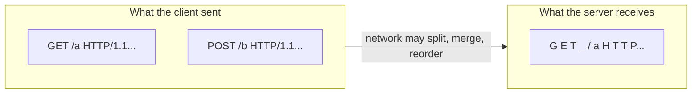

The server receives:
```
G E T _ / a H T T P / 1 . 1 \r \n H o s t : x \r \n \r \n P O S T _ / b H T T P...
```

**One continuous flow of bytes.** No messages. No markers. The server cannot tell:
- Where request #1 starts
- Where request #1 **ends** and request #2 **begins**
- Whether this is 2 requests, or 1 giant malformed one

**Why it's hard:** TCP is free to split, merge, and reorder. A message can be split across packets, and multiple messages can arrive in one packet. The protocol must therefore define its own boundaries — the network will never do it for you.

> **This is why parsing is real work, and why "the cost of parsing a request is not cheap."** The server is running a state machine, byte by byte, to find structure.

**Checkpoint:** You have a TCP connection carrying bytes. The client sends 3 requests back to back. How does the server know it got 3 and not 1 giant one?

---

## Unit 4 — Framing: How Protocols Solve It

**Framing** = the technique a protocol uses to mark message boundaries in a byte stream.

Every protocol picks one:

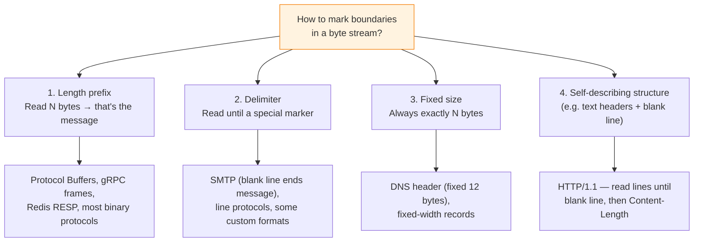

### Real examples

**HTTP/1.1** — self-describing + length:
```
GET /users HTTP/1.1\r\n     ← request line
Host: example.com\r\n        ← headers, one per line
Accept: */*\r\n
\r\n                          ← BLANK LINE = end of headers
{...}                         ← body, size given by Content-Length
```
The blank line marks the header/body boundary. `Content-Length` marks the message end.

**Protocol Buffers** — length prefix:
```
[0x00 0x00 0x1F] "UserRequest{ id: 5, name: 'Bob' }"
└──── 31 bytes ────┘
└─ read this many, then parse ─┘
```
Fast: the server knows the size immediately, no scanning.

**DNS** — fixed header + query ID:
```
[12-byte fixed header][question][answer]
```
Fixed size, plus a **query ID** so the client can match responses to questions (more on this in Unit 9).

**Why length prefixes are faster:** with a length prefix, finding the message end is a single integer read — O(1). With a delimiter, you must scan byte-by-byte until you find it — O(n) and more CPU work.

**Checkpoint:** Which framing does HTTP/1.1 use? Which does Protobuf? Why would a high-performance system prefer Protobuf's approach?

---

## Unit 5 — Serialization: What's *Inside* the Message

Framing tells you **where** the message is. Serialization tells you **what it means**.

```
Your object            Serialization           Bytes on wire
{ id: 5, name: "Bob" }  ──────────────►        {"id":5,"name":"Bob"}
                        ◄──────────────
                      Deserialization
```

- **Serialization** = object → bytes (before sending)
- **Deserialization** = bytes → object (after receiving)

**The cost is real.** Converting bytes into a structure your language can use takes CPU and memory. For large payloads, it can be slow enough to matter — Hussein mentions JSON parsers taking *seconds* on large documents.

### The industry progression (and *why*)

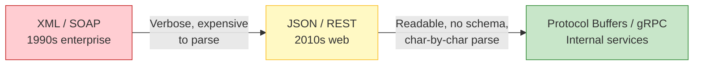

| Format | Readable | Parse speed | Size | Schema enforced |
|---|---|---|---|---|
| XML | Yes | Slow | Large | Sometimes |
| JSON | Yes | Fast-ish (native in JS) | Medium | No |
| Protobuf | No | Very fast | Small | Yes |

**The trade-off:** readability (easy debugging) vs. speed and size (performance). You pick per boundary.

**JavaScript's advantage:** `JSON.parse()` is built into the engine, so it's fast. In C++/Go/Java you pay full parsing cost for the same payload.

**Checkpoint:** A teammate says "let's just use Protobuf everywhere for speed." What's the cost of taking that advice?

---

## Unit 6 — The Full Lifecycle

Now we can see the whole picture. This is the refined version of the cycle — grouped by *who's doing the work*:

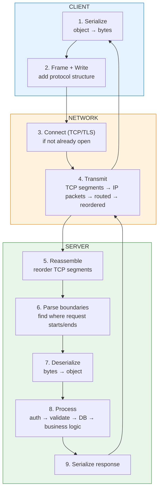

**Read it as three questions:**
1. **Who pays the cost?** Both sides. Client serializes, server deserializes, server serializes, client deserializes. Four conversions per exchange.
2. **What's "your code"?** Only step 8. Steps 1–7 and 9 happen in libraries, the OS, and the network.
3. **Where does time actually go?** Not just step 8 — see Unit 7.

**Key distinction people blur:**

| Term | What it does | Example |
|---|---|---|
| **Parse** | Find structure & boundaries | "This is an HTTP GET to /users/5" |
| **Deserialize** | Convert payload to a usable object | `{"id":5}` → `UserRequest{id:5}` |
| **Process** | Execute the intent | `SELECT * FROM users WHERE id=5` |

Knowing the method (parse) is not the same as doing the work (process). The server does both.

**Checkpoint:** Your API's p99 latency is 800ms. The DB query is 50ms. Where are the other 750ms?

---

## Unit 7 — Where the Time Goes

Hussein's timeline, expressed as proportions rather than absolute units:

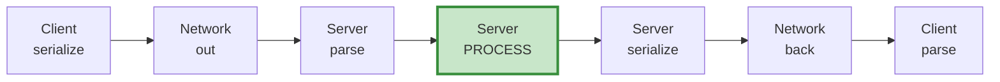

- The **green** box is the only part your APM dashboard shows as "application time."
- Everything else is real, measurable, and frequently dominant.

**Costs people forget:**

| Hidden cost | Why it happens |
|---|---|
| TCP handshake | ~1 RTT before you can send anything (3-way) |
| TLS handshake | Another 1–2 RTT |
| Connection reuse | Amortized only if the connection is kept alive |
| Packet reordering | Assembled by the OS, but costs latency |
| Boundary parsing | CPU, scales with payload size |
| Serialization | CPU on both ends |
| Network RTT | Physical distance, ×2 per round trip |

**Practical consequence:** shaving 40ms off a DB query is invisible if you've ignored a 300ms TLS handshake on every request. Measure the whole cycle, not your function.

**Checkpoint:** A team moves from HTTP/1.0 to keep-alive HTTP/1.1. What's the improvement, and what didn't improve?

---

## Unit 8 — Request/Response Is Everywhere

This pattern is not an HTTP feature. It's the substrate under nearly everything:

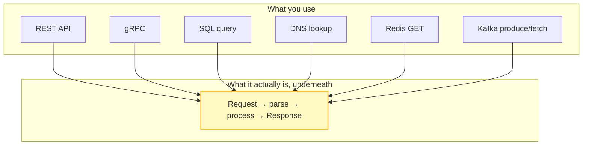

Concrete examples:

| System | The "request" | The "response" |
|---|---|---|
| **HTTP** | `GET /users/5` | `{id:5, name:"Bob"}` |
| **DNS** | "What's the IP for google.com?" | `142.250.190.46` |
| **SQL** | `SELECT * FROM users WHERE id=5` | Rows |
| **Redis** | `GET session:abc` | The session string |
| **gRPC** | `GetUser(id=5)` | `User{...}` |
| **Kafka** | Produce to topic | Offset ack |

**Why this is worth internalizing:** once you see that DNS, SQL, and Redis are all the same shape, you stop treating them as unrelated tools. Their *performance characteristics* also become comparable — they all pay framing + serialization + network RTT.

**Checkpoint:** A Redis `GET` is "just an in-memory lookup, basically free." Why is that reasoning wrong?

---

## Unit 9 — Two Revealing Variations

### 9a. DNS: correlation, not order

DNS uses **UDP** and can have hundreds of queries in flight. Responses can come back in any order. So how does the client know which answer belongs to which question?

**Answer: a query ID.** The client generates an ID, puts it in the query, and matches it in the response.

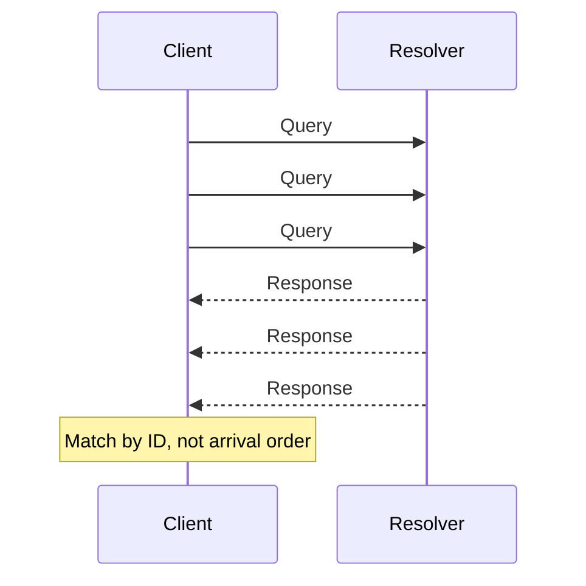

> **Never assume responses arrive in the order you sent requests.** This is a foundational backend principle, and it's why HTTP pipelining (send request B before A's response arrives) was abandoned — a slow A blocks B.

### 9b. RPC: the abstraction that leaks

RPC tries to make a remote call look like a local function call:

```
userService.getName(5)   ← looks local
```

**The appeal:** the developer doesn't care that it's remote. Clean code.

**The leak:** the moment it matters, the abstraction breaks down.

| Question a local function can't raise | Question a remote call must raise |
|---|---|
| "Why is this slow?" | "How slow is the network, and did it timeout?" |
| "Did it work?" | "Did it fail, or did the *response* get lost?" |
| "What if I call it twice?" | "Is this call idempotent?" |
| "It's an error — retry?" | "Did my first attempt already succeed?" |

This is called a **leaky abstraction** — the illusion breaks under real-world conditions (latency, partial failure, network partitions).

> **Lesson:** abstractions that hide "this is remote" always leak eventually. Design for the leak: timeouts, retries with idempotency keys, and explicit failure handling are not optional extras.

**Checkpoint:** You call a remote method that times out. The client retries. What's the danger, and what's the standard fix?

---

## Unit 10 — GraphQL: Fixing the "Chatty Client" Problem

**The problem:** REST is resource-oriented, and the client must know the shape of the data in advance. To build one screen, the client makes many round trips:

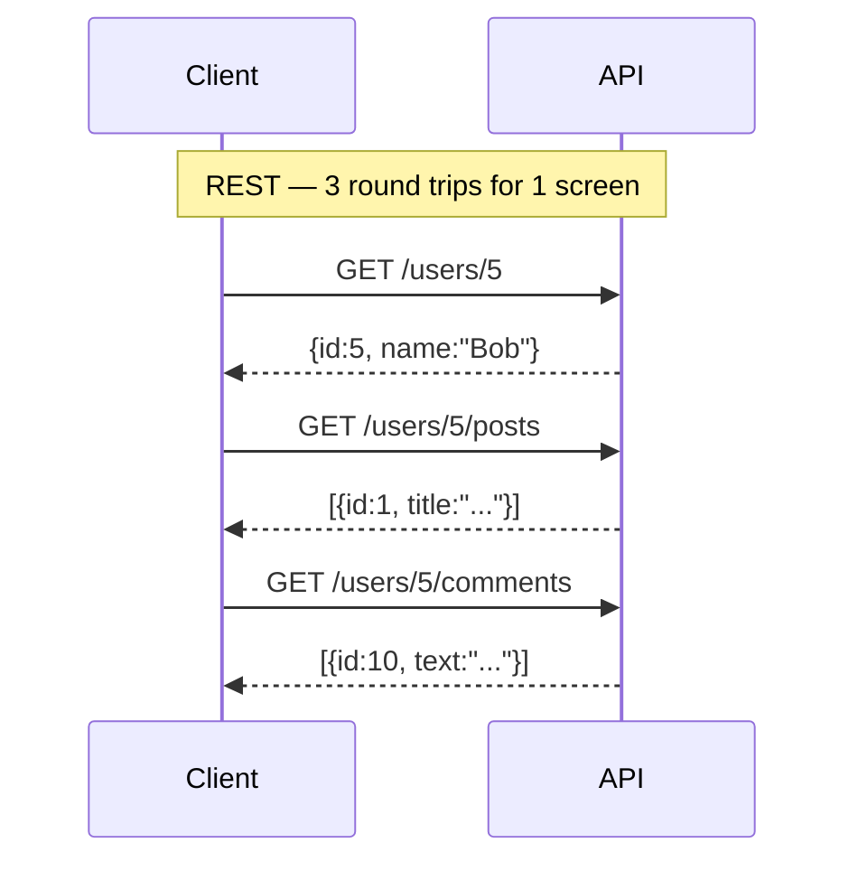

**The cost:** each round trip is a full network latency. Three trips = 3× the wait, before any data is even useful. This is the **N+1 problem** at the HTTP layer.

**GraphQL's answer:** let the client describe *exactly* what it wants in one request.

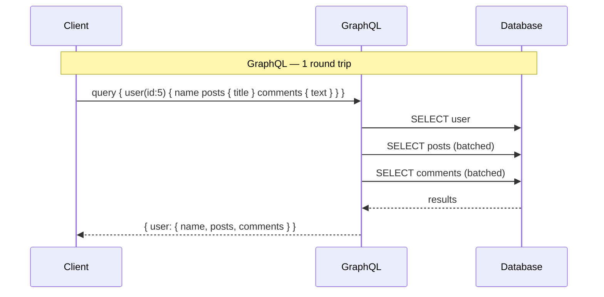

**The crucial nuance (and the part people miss):** GraphQL did **not** eliminate the multiple queries. It **moved them from the network to the backend.**

```
REST:    3 network round trips + 3 DB queries
GraphQL: 1 network round trip + 3 DB queries (but batched, sometimes merged into fewer)
```

The win is real — but only because the backend now has **full knowledge of the query**, so it can batch, merge, or use a dataloader. You traded network latency for backend coordination. Sometimes that's a win; sometimes it isn't.

**Checkpoint:** A GraphQL endpoint still takes 400ms. You removed 2 network round trips. Why might it still be slow?

---

## Unit 11 — Chunked Upload: Same Pattern, Different Strategy

For huge uploads (7GB video), naive Request/Response breaks:

```
POST /upload  (7GB)  →  90% done  →  network blip  →  connection reset
                                              ↑
                                    6.3 GB wasted, start over
```

**Why it fails:** one request = one atomic success or total failure. No resume.

**The fix — still Request/Response, just split:**

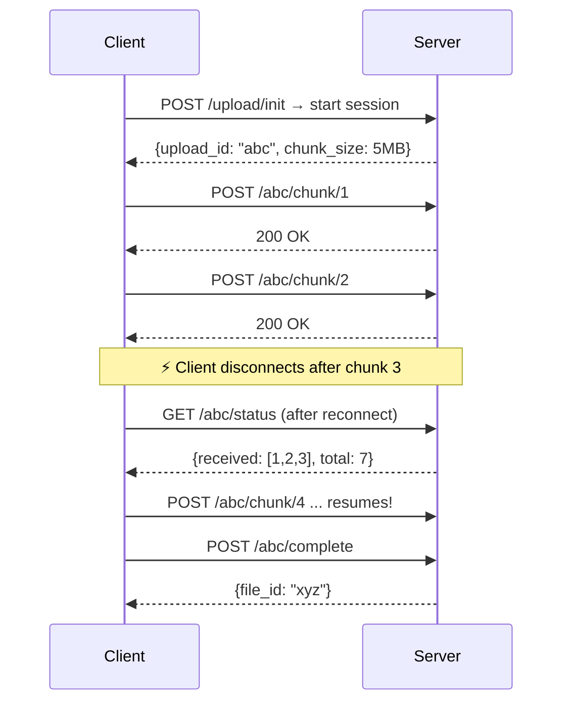

**What this teaches us:** the *pattern* didn't change — still request, still response. What changed is the **execution strategy**: we're now keeping state on the server, which makes the operation **resumable**.

This is the same insight behind idempotency keys, resumable downloads, and multipart uploads. It also foreshadows Lecture 9 (sync vs async): when work is long-running, the request shouldn't have to stay open.

**Checkpoint:** Why can't the server just guess which chunks are missing, without the client asking?

---

## Unit 12 — Seeing It on the Wire

Hussein's `curl` demo makes the abstract concrete:

```bash
curl -v --trace-ascii trace.txt http://google.com
```

What actually happened, in order:

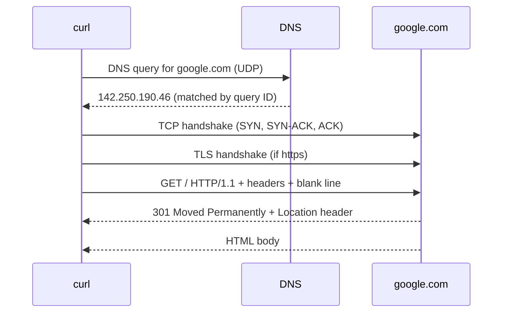

**Things to notice:**

1. **DNS happened first** — a separate Request/Response, over UDP, before HTTP even started.
2. **The handshake is cost** — you pay it *before* your request unless the connection is reused.
3. **Headers arrive incrementally** — the client parses as bytes arrive, not after full receipt. This is why streaming parsers exist.
4. **301 + `Location`** — the server's response says "go ask over there." The response *instructs* a future request. Classic example of Request/Response in action.

**Why this matters:** the trace shows that a single `GET` involves *multiple* protocols, each with its own Request/Response. "How does a browser load a page?" is not one exchange — it's DNS + TCP + TLS + HTTP, four layers, each with framing and its own costs.

**Checkpoint:** Your API is slow and you see high DNS resolution time. Which part of the request/response cycle is hurting you, and what would you change?

---

## Unit 13 — Where the Pattern Breaks Down

Request/Response rests on two assumptions (Unit 1). Here is exactly what breaks when those assumptions fail:

| # | Assumption that breaks | Scenario | What goes wrong | Next pattern |
|---|---|---|---|---|
| 1 | Client-initiated | Notification: someone commented on your post | Client doesn't know to ask → must poll | **Push / SSE / WebSocket** |
| 2 | Request stays open | Report generation takes 5 minutes | Client times out, retries, duplicates work | **Async + job queue** |
| 3 | One resource per request | Screen needs user + posts + comments | N+1 round trips | **GraphQL / batching** |
| 4 | One shot is atomic | 7GB upload | Failure = total loss | **Chunked / resumable** |
| 5 | Low frequency | Live stock prices, chat | Polling = self-inflicted DDoS | **WebSocket / Pub/Sub** |
| 6 | Connections are cheap | 100K concurrent clients | Thread-per-connection = collapse | **Multiplexing / async I/O** |

### The master insight

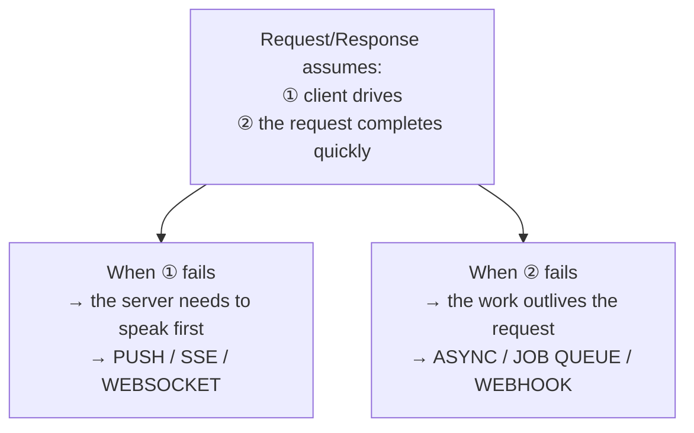

> **Every pattern in the rest of this section is a deliberate violation of one of these two assumptions — and a careful engineering of what you lose by violating it.**

That is the through-line. Push breaks #1. Async breaks #2. Pub/Sub, multiplexing, and sidecar are variations on the same theme.

**Checkpoint:** For each of the 6 rows above — is it breaking assumption ①, assumption ②, or neither?

---

## Summary — The Mental Model to Keep

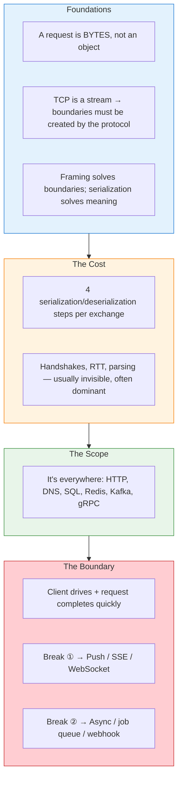

**If you remember only three things:**

1. **A request is bytes.** Framing finds its edges; serialization gives it meaning. Both cost CPU.
2. **Request/Response is a universal substrate** — once you see it in DNS and SQL, you see it everywhere.
3. **The pattern assumes the client drives and the request is short.** Every other pattern in this section is a deliberate break of one of those assumptions.

---

## Vocabulary

| Term | Meaning |
|---|---|
| **Byte stream** | TCP delivers a continuous flow of bytes with no inherent message structure |
| **Framing** | The technique a protocol uses to mark message boundaries |
| **Length prefix** | A framing technique: store the message size, read exactly that many bytes |
| **Delimiter** | A framing technique: read until a special marker byte/sequence |
| **Boundary detection** | The server's work of finding where a message starts and ends |
| **Serialization** | Converting an object into bytes for transmission |
| **Deserialization** | Converting received bytes back into a usable object |
| **Payload** | The actual data being carried, excluding protocol framing |
| **Round trip (RTT)** | Time for a request to reach the server and the response to return |
| **Handshake** | Setup exchange before real data flows (TCP SYN, TLS) |
| **Idempotency** | An operation that produces the same result if repeated |
| **Leaky abstraction** | An abstraction that hides important details until they cause failures |
| **Head-of-line blocking** | A slow message delays everything queued behind it on the same stream |
| **N+1 problem** | One request returning data that requires many follow-up requests |

---

## Self-Test — Can You Answer These?

If any answer is unclear, revisit that unit.

1. Why can't the server rely on TCP to tell it where one request ends and the next begins? *(Unit 3)*
2. What's the difference between framing and serialization? *(Units 2 & 5)*
3. A `Content-Length: 0` header vs. a blank line — what does each tell the server? *(Unit 4)*
4. Your endpoint's DB query is 10ms but p99 latency is 900ms. What are the likely suspects? *(Unit 7)*
5. Why must DNS responses be matched by query ID rather than arrival order? *(Unit 9a)*
6. What makes RPC a leaky abstraction, and what mitigations exist? *(Unit 9b)*
7. In what sense did GraphQL *not* actually solve the N+1 problem? *(Unit 10)*
8. Chunked upload is still Request/Response — what actually changed? *(Unit 11)*
9. Loading a webpage involves how many distinct Request/Response exchanges? *(Unit 12)*
10. A chat app's messages arrive late and out of order. Which assumption was broken, and what's the fix? *(Unit 13)*

---

## Carried Into Lecture 8 (Push)

| Question we'll answer next |
|---|
| How does the server start a conversation when Request/Response is client-initiated? |
| What's the cost of keeping connections open, and who pays it? |
| How do you deliver a message to a client that might be asleep, offline, or behind a flaky network? |
| Push, SSE, and WebSockets all "push" — what makes them different problems? |

---

*Built up unit by unit. Each unit depends on the one before it.*
