# Lecture 8: Push — Built Up, Unit by Unit

## Status: In Progress 🔄

> **How to read this doc:** Each unit builds on the previous one. Don't skip. Units 1–3 are the foundation; the rest layer consequences on top. Each unit ends with a **Checkpoint** — answer it in your own words before moving on.

---

## Unit 0 — The Whole Lecture in One Sentence

> **Push = the server writes to an open connection the moment something happens, without the client asking.**

Same wire. Same connection. Opposite trigger.

---

## Unit 1 — The Contrast with Request/Response

You already know Request/Response. Push is that pattern with **who initiates** inverted.

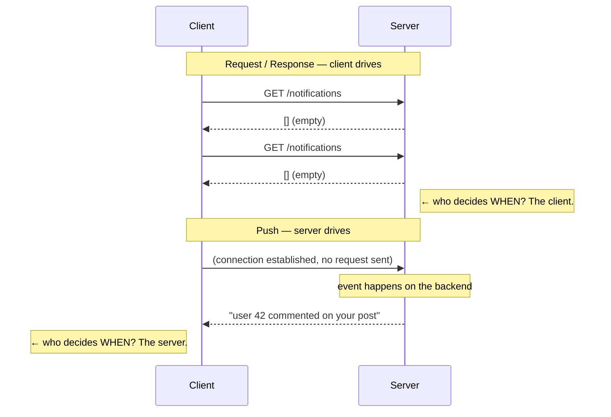

**Same connection. Same bytes. Different direction of initiation.**

That is the entire difference. Everything else in this lecture is a *consequence* of that one change.

---

## Unit 2 — The Knowledge Problem (Why Push Exists)

The lecture's framing: **who has the knowledge?**

| Situation | Who knows the information? |
|---|---|
| User wants their profile data | The **client** — it knows what it wants |
| Someone uploaded a video | The **server** — the client has no reason to ask |
| Someone commented on your post | The **server** |
| A stock price changed | The **server** |

Request/Response works perfectly when the **client** holds the knowledge. It breaks down when the **server** does:

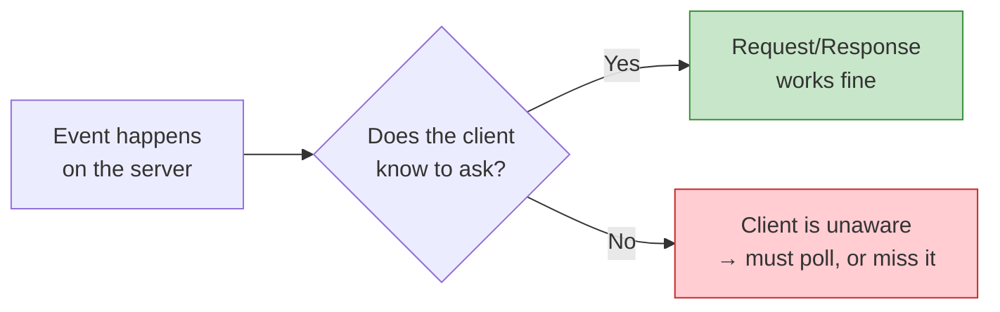

> **Push is the answer to: "The server has information the client doesn't know to ask for."**

**Checkpoint:** Why doesn't Request/Response work for the "someone commented on your post" case?

---

## Unit 3 — What Push Actually Is Mechanically

Hussein's key clarification: **"it's not really magic."**

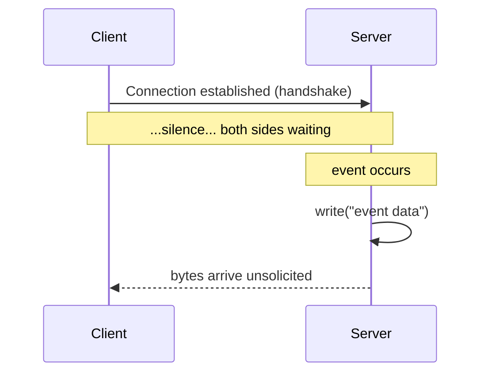

That's it. Three steps:

1. A connection exists
2. Something happens
3. The server **writes to the socket**

**No special protocol, no magic.** The word "push" describes **when** the server writes, not a different technology. The only thing that changed vs. Request/Response is the *trigger*.

**Checkpoint:** What is the actual technical action the server performs in a push?

---

## Unit 4 — The Cost Model

Push trades *request overhead* for *connection overhead*. This is the fundamental economic shift.

| | Request/Response | Push |
|---|---|---|
| **Idle client costs** | Nothing — no connection needed | Live socket + buffers + memory |
| **Delivering one event** | Client must ask; N events = N requests | Server writes; cost ≈ 0 |
| **Slow or absent client** | Irrelevant — nobody asked | **Problem.** Writing into the void |

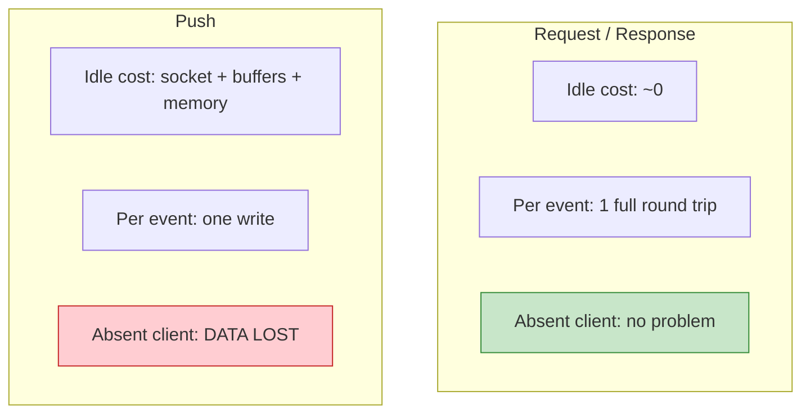

**The trade in one line:** push makes delivery *fast* by making *idleness expensive*.

**Checkpoint:** 100,000 users open a dashboard. Most of the time nothing is happening. What does push cost you that Request/Response doesn't?

---

## Unit 5 — Disadvantage 1: The Client Must Be Online

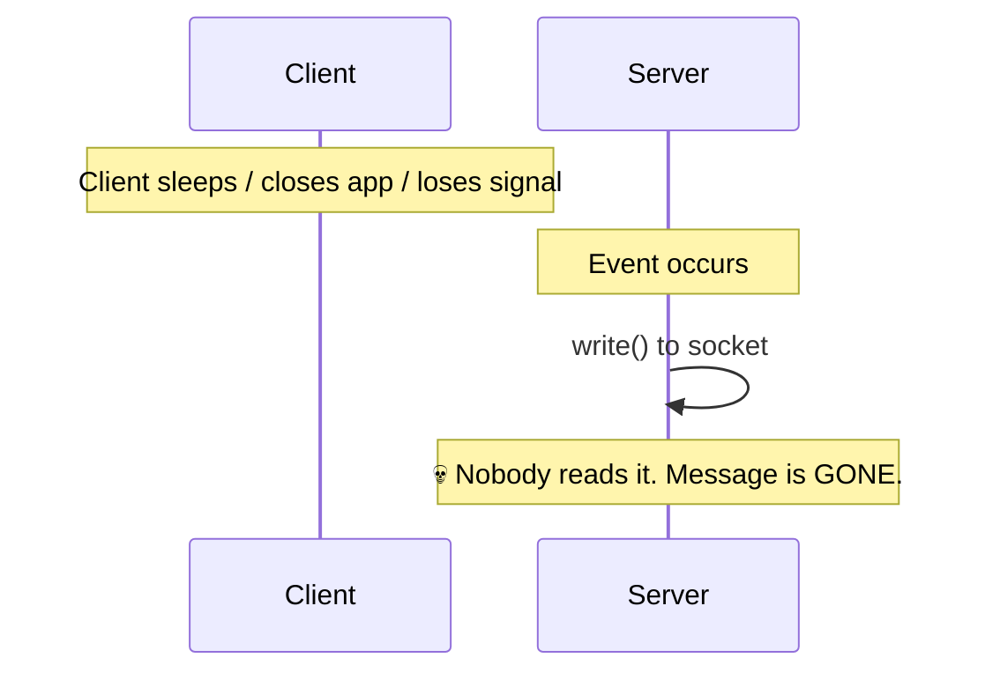

**You cannot push to someone who isn't connected.** The bytes are written to a socket with no reader.

This is a **correctness** problem, not a feature gap. There is:
- No message record
- No queue
- No acknowledgement
- No way to know it was "sent"

Compare with a database write: the data persists. A push has no persistence at all.

> **Push delivery is not a guarantee. It's a best effort that requires a listener.**

**Checkpoint:** A user closes the app at 10:00. A notification fires at 10:01. Where did that notification go?

---

## Unit 6 — Disadvantage 2: No Flow Control

**Flow control** = the mechanism that prevents a fast sender from overwhelming a slow receiver.

Push removes the receiver's ability to exert it.

```mermaid
flowchart LR
    S["Server pushes<br/>at full speed"] --> C["Client processes<br/>slowly"]
    S -->|"buffers fill"| B["Kernel socket buffer"]
    B -->|"overflows"| D["Data dropped<br/>or client crashes"]
    C -.->|"I can't keep up!"| S
    Note right of S: ⚠️ Server has no<br/>feedback channel here
```

**The mechanism in Request/Response:** the client pulls. It only asks again when it has capacity. **The rate limiter IS the client.**

**The mechanism in Push:** the server writes. It has no idea whether the client is ready. The only possible backpressure is TCP-level flow control (the socket window) — but that only protects the *kernel buffer*, not the application's ability to process.

> **Push removes the client's ability to say "not right now."**

For a lightweight client (IoT sensor, embedded device, old phone), this is fatal. Polling is strictly better there.

**Checkpoint:** Your push server writes 10,000 messages/sec to a client that can process 100/sec. What happens, and where exactly does it break?

---

## Unit 7 — Disadvantage 3: No "Leisure"

| | Polling | Push |
|---|---|---|
| **Client chooses when to fetch** | ✅ Yes — "I have CPU now" | ❌ No — server chooses the moment |
| **Client is busy** | Waits, tries later | Must still receive |
| **Good for** | Lightweight clients, bulk data | Rare, important events |

The word "leisure" matters: polling lets the client integrate incoming work into whatever it was doing. Push **interrupts** — the client has to drop what it's doing.

**Push is right for:** rare, unpredictable, genuinely important events.
**Polling is right for:** frequent, predictable, or bulk data the client isn't waiting on.

**Checkpoint:** You need to sync a device that receives 50,000 new data points per minute. Push or poll?

---

## Unit 8 — The Scale Wall

Hussein's YouTube example: a creator with 100 million subscribers uploads a video.

### Attempt 1 — Keep everyone connected
- 100M live sockets, each needing memory, buffers, file descriptors
- **Impossible.** YouTube actually turned push notifications **off by default** because they couldn't do it

### Attempt 2 — Push directly to each
- Even if all were connected, the server must loop over 100M connections per upload
- Astronomically expensive

### Attempt 3 — What YouTube actually does (delegation)

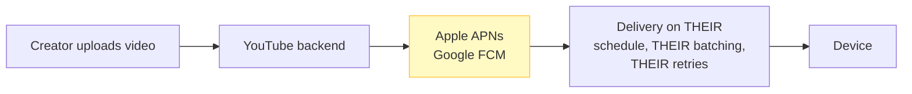

The backend **pushes to Apple and Google, not to users**. They already hold the connection to the device — and they throttle, batch, and retry on their own infrastructure.

> **At extreme scale, push doesn't disappear — it gets delegated to an intermediary that already has the connection.**

This is the pub/sub idea arriving early. We formalize it in Lecture 13.

**Checkpoint:** Why can't YouTube just push directly to 100M phones? What specifically breaks?

---

## Unit 9 — RabbitMQ vs Kafka: The Design Lesson

Same problem — deliver a message to consumers. **Opposite architectural choices.**

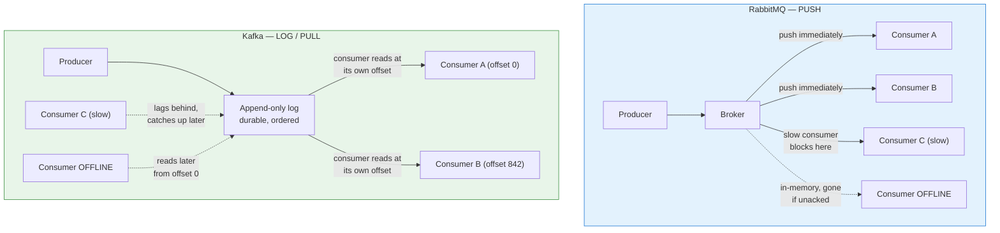

### Side-by-side

| | RabbitMQ (Push) | Kafka (Log / Pull) |
|---|---|---|
| **Model** | Push to connected consumers | Append to log; consumers read at their pace |
| **Consumer relationship** | Broker knows who's connected | Broker doesn't know or care |
| **Consumer offline** | Message lost (unless acked) | Message **waits in the log** |
| **Slow consumer** | **Backpressure on the producer** | No backpressure — consumer just lags |
| **Where backpressure lives** | Pushed onto the producer | Taken by the consumer itself |
| **Best for** | Low latency, task distribution | High throughput, durable replay, event streaming |

### Why Kafka rejected push

Push forces the producer to wait for slow consumers. Kafka inverts it:
- Produce is **always instant** — append to disk, done
- A slow consumer is **its own problem** — it catches up when it can
- Nothing is ever lost; the log is the buffer

> **This is the deepest point in the lecture: push and pull don't do the same thing differently — they assign responsibility for backpressure to different parties.**

- **Push** → backpressure is the **producer's** problem
- **Pull** → backpressure is the **consumer's** problem

Both are defensible. It depends on whether producers or consumers are the constrained resource.

**Checkpoint:** Your event-logging service must never lose messages, and consumers are frequently offline for days. Which model, and why?

---

## Unit 10 — Push in Protocols

Hussein noted gRPC supports server-side streaming. Here's the full spectrum:

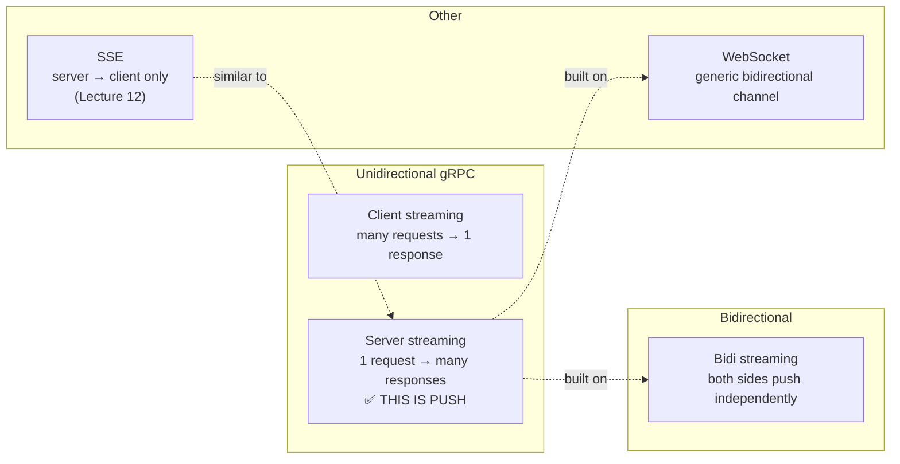

| Protocol | Push support |
|---|---|
| HTTP/1.1, REST | ❌ — response only after request |
| **gRPC server streaming** | ✅ — one request, stream of responses |
| **gRPC bidi streaming** | ✅ — both sides push |
| **WebSocket** | ✅ — generic bidirectional channel |
| SSE (Lecture 12) | ✅ — server → client only |
| HTTP/2 Server Push | ⚠️ Deprecated — rarely used |

**Checkpoint:** gRPC server streaming is push, but the client still "makes a request." How is that possible, given push is supposed to have no request?

---

## Unit 11 — WebSocket Mechanics

The demo surfaced something important: **WebSocket starts as HTTP.**

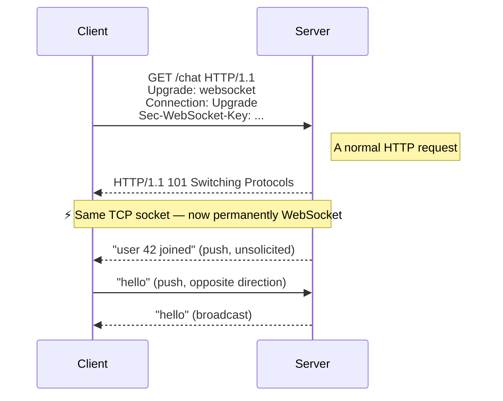

**The crucial insight:** the *transport* (one TCP connection) never changes. Only the *protocol running on top of it* changes.

This is why the **4-tuple uniquely identifies a client**:

```
(source IP, source port, destination IP, destination port)
```

Each of those is fixed for the life of the connection. That's why the demo used `remotePort` as a user identifier.

### The demo's architecture — centralized

```mermaid
flowchart TB
    C1["Client A"] <-->|"connected"| S["Central Server"]
    C2["Client B"] <-->|"connected"| S
    C3["Client C"] <-->|"connected"| S
    S -->|"loops over connections<br/>and broadcasts"| OUT["everyone receives"]

    Note bottom of S: Clients never talk to each other.<br/>The server owns all fan-out.
```

**Checkpoint:** Why can't clients A and B send messages directly to each other in this design? Is that a limitation of push?

---

## Unit 12 — The Bug That Wasn't Just Bad Code

Hussein deliberately closed a client and kept sending. Two real problems surfaced.

### Problem 1 — stale connections accumulate
The array still holds a dead socket. Every broadcast iterates over garbage forever. Memory leak + wasted CPU.

### Problem 2 — one dead client breaks delivery to everyone

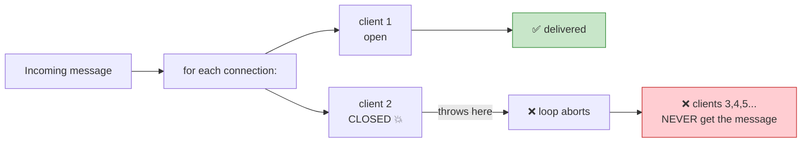

**The fix in production:**
```javascript
// Evict on disconnect
ws.on('close', () => {
  clients = clients.filter(c => c !== ws);
});

// Check state before every write
clients.forEach(c => {
  if (c.readyState === WebSocket.OPEN) c.send(msg);
});
```

### But the deeper lesson isn't the code

This is a **genuine property of push**, not demo sloppiness:

- Push is a **broadcast** operation — cost is proportional to *all* connections, live or dead
- One failure contaminates the whole batch unless explicitly defended against
- **Delivery correctness becomes your responsibility**, because nobody is asking

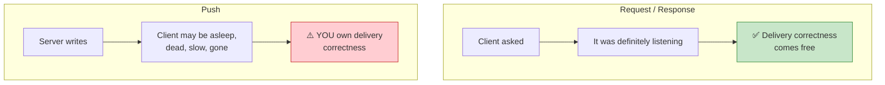

> **In Request/Response, delivery correctness is free — the client asked, so it was listening.**
> **In push, you're writing into a world where you cannot know who is listening.**

### What production push systems therefore require

| Requirement | Why |
|---|---|
| Connection state check before every write | Dead sockets break the loop |
| Eviction on `close` event | Prevents unbounded growth |
| Heartbeats / ping-pong | Detects *dead but not closed* connections |
| Reconnection with resume | `Last-Event-ID` or message replay |
| Backpressure queues | Buffer for slow consumers, not drop |

**Checkpoint:** A client "laptop sleeps → wakes 10 minutes later." Which of the four requirements above is this the problem for, and which one did the demo not cover?

---

## Unit 13 — When to Use Push

| Situation | Verdict | Why |
|---|---|---|
| Chat messages | ✅ Great | Rare-ish, latency-sensitive, client can handle it |
| Live notifications ("someone liked your post") | ✅ Great | Infrequent, worth interrupting for |
| Live scoreboards / trading | ✅ Great | Genuinely real-time |
| Thousands of IoT sensors reporting | ⚠️ Careful | Devices may be low-power; consider pull |
| Bulk data sync (50k rows/min) | ❌ Use polling | Push the *pointer*, let the client pull the data |
| Notifications when client is often offline | ❌ Use a queue | Push loses them; a queue retains them |
| 100M concurrent subscribers | ❌ Delegate | Use APNs/FCM, don't hold connections yourself |

### The decision heuristic

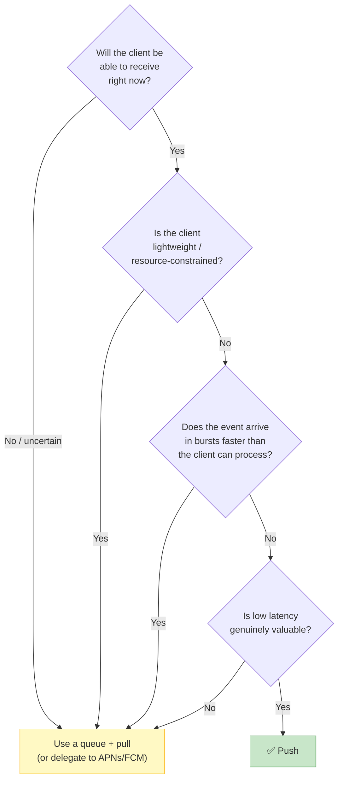

**Checkpoint:** A live sports app. Score updates ~50 times per match, ~2 hours long. Push or poll? What changes your answer during a 10-minute injury timeout?

---

## Summary — The Mental Model to Keep

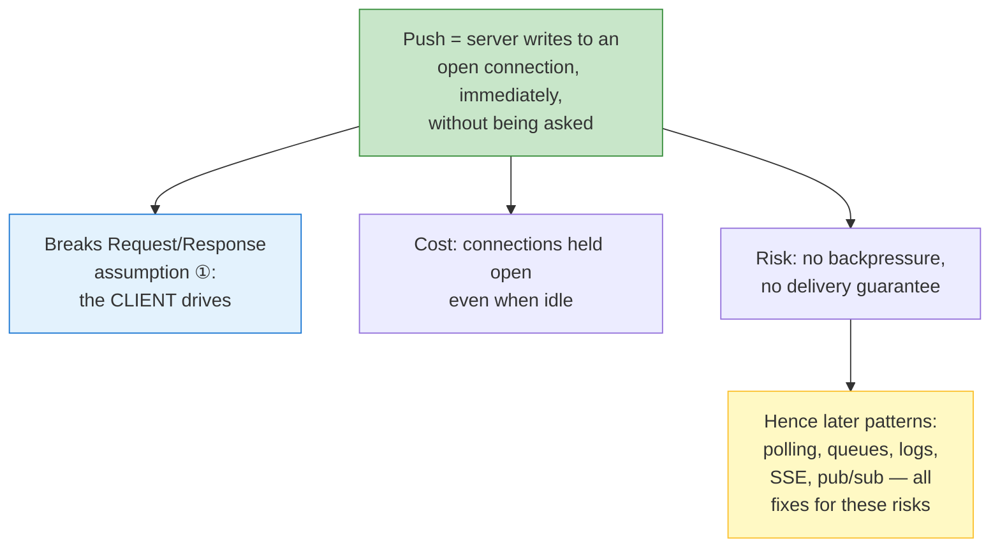

### The one-sentence takeaway

> **Push is the pattern where the *server* decides when to talk — and it inherits every consequence of that decision.**

### Three things to remember

1. **Mechanically trivial** — a connected socket plus a `write()`. The word "push" describes *when*, not *what technology*.
2. **Expensive when idle, cheap when active** — you pay connections continuously to make delivery instant.
3. **You own delivery correctness** — no acknowledgement, no backpressure, no persistence. Push is best-effort that requires a listener.

---

## Vocabulary

| Term | Meaning |
|---|---|
| **Push** | Server writes to an open connection immediately, without a request |
| **Client-initiated** | The pattern where the client decides when communication happens |
| **Backpressure** | Mechanism preventing a fast sender from overwhelming a slow receiver |
| **Flow control** | Receiver-side signal telling the sender to slow down (e.g. TCP window) |
| **Fan-out** | Delivering one message to many recipients |
| **Idempotent consumer** | A consumer that can safely read the same message multiple times |
| **Consumer offset** | Kafka's per-consumer position in the log |
| **101 Switching Protocols** | HTTP response that upgrades a connection to WebSocket |
| **4-tuple** | (source IP, source port, destination IP, destination port) — uniquely identifies a TCP connection |
| **Socket buffer** | Kernel-space queue between sender and receiver; fills when receiver is slow |
| **Log-based messaging** | Kafka's model — append-only durable log, consumers pull at their own offset |
| **Heartbeat / ping** | Periodic probe to detect dead-but-not-closed connections |
| **Last-Event-ID** | SSE header letting a reconnecting client request missed events |

---

## Self-Test — Can You Answer These?

If any answer is unclear, revisit that unit.

1. What is the *one* concrete action a server performs when it "pushes"? *(Unit 3)*
2. Why does push cost more when a client is **idle** than when it's busy? *(Unit 4)*
3. Is "client must be online" a feature limitation or a correctness problem? Why? *(Unit 5)*
4. In polling, who is the rate limiter — and how does that differ in push? *(Unit 6)*
5. Why did YouTube delegate notifications to APNs/FCM instead of pushing directly? *(Unit 8)*
6. Explain the RabbitMQ vs Kafka difference purely in terms of *where backpressure lives*. *(Unit 9)*
7. gRPC server streaming is "push" — so where did the request go? *(Unit 10)*
8. What changes about the transport when WebSocket upgrades? What stays the same? *(Unit 11)*
9. Why is the closed-client crash a *fundamental* push problem, not just a coding mistake? *(Unit 12)*
10. You're building a live scoreboard. At what point does push become the wrong answer? *(Unit 13)*

---

## Carried Into Lecture 9 (Synchronous vs Asynchronous Workloads)

| Question we'll answer next |
|---|
| What actually changes in a system when work is done synchronously vs. asynchronously? |
| How does the HTTP request *lifetime* relate to the work *lifetime*? |
| Why do queues exist, and what do they guarantee? |
| What's the relationship between the push model and the async model — are they the same thing? |

---

*Built up unit by unit. Each unit depends on the one before it.*