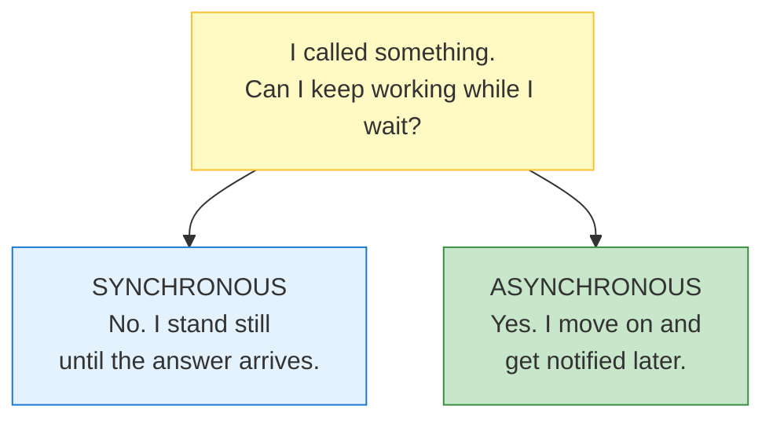
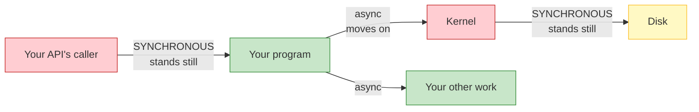
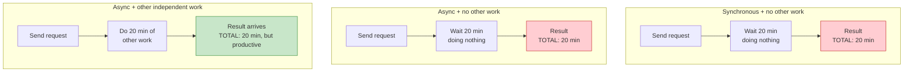

# Lecture 9: Synchronous vs Asynchronous Workloads — Built Up, Unit by Unit

## Status: In Progress 🔄 (Unit 1 documented)

> **How to read this doc:** Each unit builds on the previous one. This lecture is long (43min), so it's split into **10 units**. Don't skip ahead — Unit 4 assumes Unit 2, and Unit 7 assumes everything before it. Each unit ends with a **Checkpoint** — answer it in your own words before moving on.

---

## Lecture Map

| Unit | Content |
|---|---|
| **1** | **The one question that defines everything** — can I work while I wait? |
| 2 | What "blocked" actually means — CPU context switching and wasted time |
| 3 | How async learns about completion — readiness vs. completion |
| 4 | The Node.js trick — thread pool + event loop |
| 5 | Promises and async/await — syntax vs. reality |
| 6 | The real-life analogy — and the caller-relative insight |
| 7 | **Backend async processing** — the queue + job ID flip |
| 8 | Postgres — WAL and asynchronous commit |
| 9 | OS async I/O, async replication, and `fsync` |
| 10 | The demo + summary |

**Unit 7 is the payoff** — it's the one that connects directly to the message-broker material in [`message-brokers-rabbitmq-vs-kafka.md`](message-brokers-rabbitmq-vs-kafka.md).

---

## Unit 1 — The One Question That Defines Everything

### The Core Question

The whole lecture reduces to a single question:

> **"Can I do work while waiting for whatever I just did?"**

Everything called *synchronous* or *asynchronous* is simply an answer to that one question.

---

### The Two Answers



| | Meaning |
|---|---|
| **Synchronous** | You make a call and are *stuck* until it finishes. Nothing else in your program runs. |
| **Asynchronous** | You make a call, *continue*, and the result comes to you later. |

That's the entire distinction. The rest of this lecture is the **consequences** of each choice.

---

### Where the Word Comes From

The etymology clarifies things more than the definition does:

- **Synchronous** — Greek *syn* ("same") + *chronos* ("time") → **same time, in lockstep**
- **Asynchronous** — *a* ("not") + synchronous → **not in lockstep**

**The image:** two sine waves. Synchronous = **same phase**, rising and falling together. Asynchronous = **out of phase**, each doing its own thing.

"In sync" means **both sides advance together at the same pace** — requester and responder move as a single unit.

---

### The Counter-Intuitive Part

| Domain | Goal | Why |
|---|---|---|
| **Motors / electricity** | Keep phases matched **at all costs** | Out-of-phase motors wreck each other — vibration, tearing, failure |
| **Software** | Let each side work **independently** | The user shouldn't be locked to the server's rhythm |

**In machinery, synchronisation is what you fight for. In software, we actively want asynchrony.**

The reason: **in software, the client almost always has independent work to do.** Locking it to the server's pace throws that work away for nothing.

---

### The Insight That Unlocks the Lecture

There are **two separate facts** that people blend into one:

| | Fact | Whose decision is it? |
|---|---|---|
| **1** | The operation happened and took 5ms | **Nobody's.** It's a fact. |
| **2** | Your program stood still for those 5ms | **Yours.** You chose it. |

> **"Synchronous" and "asynchronous" are not properties of the operation. They are properties of *the caller's choice*.**

The disk read is a disk read. Nobody's opinion is involved. What varies is **what the caller does while it happens.**

---

### Analogy: The Restaurant Phone Call

You call a restaurant to place a large order.

**Version A — you stand there**
You call, place the order, then stay on the line saying nothing for 20 minutes while they cook. You can't cook dinner. You can't read. You just exist, holding a phone, waiting. Then: "Great, thanks."

**Version B — you get on with your life**
You call, place the order, and ask: *"Can I hang up and will someone message me when it's ready?"* They say yes. You hang up. You cook, clean, read. Twenty minutes later: *ping* — your food is downstairs.

#### What stayed identical

| | Version A | Version B |
|---|---|---|
| The restaurant | Same | Same |
| The order | Same | Same |
| Cooking time (20 min) | Same | Same |
| The food | Same | Same |
| **What YOU did for 20 min** | **Stood still** | **Lived your life** |

Nothing about the restaurant changed. **The only thing that changed is what you did while waiting.**

Therefore:
- ❌ *"Is the restaurant synchronous?"* — meaningless question
- ✅ *"Is my phone call synchronous?"* — meaningful question

> **"Synchronous" describes a *relationship* between an operation and the thing waiting on it — not a property of the operation itself.**

---

### The Same Thing in Code

```javascript
// ── Program A ──
const result = fetchBlocking(url);
console.log("A did other things");   // ← runs AFTER the 200ms

// ── Program B ──
fetchNonBlocking(url, () => { /* handle result */ });
console.log("B did other things");   // ← runs IMMEDIATELY, before the 200ms
```

**The request is byte-for-byte identical.** Same URL, same 200ms, same server doing the same work. The only difference is Program B's *relationship* to it.

So when someone says **"HTTP is asynchronous"** — that's sloppy phrasing. What's actually true is:

> **An asynchronous HTTP client does not block while waiting. A synchronous HTTP client does.**

HTTP itself never changed. The client's behaviour did.

*Compare: saying "gravity is asynchronous for people who jump."* Nonsense — gravity is constant. What varies is how a given person interacts with it.

---

### The Precision Rule: "Async *With Respect To* What?"

**Asynchronous is always relative to a specific pair** — *the operation* and *one particular participant*.

Look at a single disk read and ask what's happening for **each** participant:

| # | Participant | During those 5ms | Experience |
|---|---|---|---|
| 1 | Your program | Ran other code | **Async** |
| 2 | The kernel | Sat waiting for the disk | **Sync** |
| 3 | The disk controller | Reading bytes | Working |
| 4 | The SSD itself | Fetching cells | Working |
| 5 | The database (if any) | Waiting for the result | **Sync** |
| 6 | The caller of *your* API | Waiting on the HTTP response | **Sync** |

Six participants. **Different experiences of one event.**



Green = moving on. Red = frozen. **One event, both.**

### Getting the wording right

| Saying this | Meaning | Correct? |
|---|---|---|
| "The disk read is asynchronous" | The read itself is async | ❌ Incomplete — ambiguous |
| "The disk read is **synchronous for the kernel**" | The kernel waited | ✅ Precise |
| "It was **asynchronous for our program**" | Our program moved on | ✅ Precise |

The operation itself has **no label**. It's a neutral event. Each participant *experiences* it differently, and we describe the **relationship** — never the thing.

> **Rule: when someone says "this is async," always ask "async with respect to *whom*?" If the answer isn't given, the statement is incomplete.**

---

### Corollary 1 — Async ≠ Parallel

Two *different* properties that are constantly confused:

| | Question it answers | Type |
|---|---|---|
| **Async** | *Do I wait, or do I move on?* | **Timing** |
| **Parallel** | *How many things run at the same instant?* | **Concurrency** |

**The alarm clock:**
- **Synchronous:** you lie in bed awake, staring at the ceiling, 11pm → 7am. Seven hours of doing nothing.
- **Asynchronous:** you set the alarm and go to sleep. Seven hours pass. It rings.

Did you run **in parallel with the alarm**? Obviously not — there's one of you and one alarm. What changed is that you **went to sleep** instead of standing there watching it.

> **Async = "I didn't stand there." Parallel = "there was more than one of me."**

Unit 4 proves this for real: Node.js runs its entire async model on **one single thread**. Genuinely non-blocking. Zero parallelism. Both true at once.

---

### Corollary 2 — Async ≠ Faster

**Total work is identical.** Nothing got quicker. The operation still took 5ms. What changed is that **you stopped wasting your own 5ms standing still.**

| | Sync | Async |
|---|---|---|
| Cooking time | 20 min | 20 min |
| **Your time wasted** | **20 min** | **0 min** |

The kitchen didn't get faster. **Your utilisation of your own life got better.**

### The consequence that surprises people

If you have **nothing else to do**, async gives you almost nothing:



**All three totals are 20 minutes.** Async never shortened the operation. It only bought back *your* time — and only if you had something to spend it on.

> **This is why "make everything async" is a trap.** Async pays off only when you have **independent work** to do while waiting. Otherwise it's added complexity for zero gain.

---

### The Framing That Makes the Whole Lecture Obvious

> **You never "make something asynchronous." You change *your own* behaviour from waiting to not-waiting. Everyone else's experience is unchanged.**

Everything after this follows from it:

| Question | Answered by |
|---|---|
| Why does my UI freeze on slow network calls? | You're synchronously waiting — *you* are the red box |
| Why doesn't my server crash under load? | It hands work off and moves on |
| Why is a fast API that blocks the event loop so damaging? | Every caller becomes a red box |
| Why does making *my* code async not speed up *my* callers? | They still stand there waiting → **Unit 7** |

---

## Checkpoint

1. A program calls a 500ms function and executes other lines during those 500ms. Synchronous or asynchronous? **Now: which entity in that scenario is still waiting?**
2. Your program writes to an SSD (5ms). Is the SSD "asynchronous"?
3. In one sentence each — why do we *want* synchrony in motors but *want* asynchrony in software?
4. Async vs. parallel: a single-threaded event loop doing "non-blocking I/O" — is it parallel?
5. Async vs. faster: you `await` a 3-second API call and have nothing else to do. How much time did async save?

---

## Vocabulary

| Term | Meaning |
|---|---|
| **Synchronous** | The caller waits and does nothing until the operation completes |
| **Asynchronous** | The caller continues immediately and handles the result later |
| **Blocking** | The caller's execution is suspended until the operation finishes |
| **Non-blocking** | The caller is free to continue while the operation proceeds |
| **Lockstep / in sync** | Both sides advance together at the same pace (same phase) |
| **Out of phase** | Each side advances independently — the basis of async |
| **Parallelism** | Multiple things executing at the same instant |
| **Concurrency** | Structuring a program as independently progressing tasks |
| **Throughput** | Amount of work completed per unit time |
| **Latency** | Time for one operation to complete |
| **Utilisation** | How much of your available time is spent doing useful work |
| **Independent work** | Work that does not depend on the pending result — the prerequisite for async paying off |

---

*Unit 1 of 10. Documented from our shared discussion.*