# Lecture 9: Synchronous vs Asynchronous Workloads — Built Up, Unit by Unit

## Status: In Progress 🔄 (Units 1–6 documented)

> **How to read this doc:** Each unit builds on the previous one. This lecture is long (43min), so it's split into **10 units**. Don't skip ahead — Unit 4 assumes Unit 2, and Unit 7 assumes everything before it. Each unit ends with a **Checkpoint** — answer it in your own words before moving on.

---

## Lecture Map

| Unit | Content |
|---|---|
| **1** | **The one question that defines everything** — can I work while I wait? |
| 2 | What "blocked" actually means — CPU context switching and wasted time |
| 3 | How async learns about completion — readiness vs. completion |
| 4 | The Node.js trick — thread pool + event loop |
| 5 | Promises and async/await — syntax vs. reality |
| 6 | The real-life analogy — and the caller-relative insight |
| 7 | **Backend async processing** — the queue + job ID flip |
| 8 | Postgres — WAL and asynchronous commit |
| 9 | OS async I/O, async replication, and `fsync` |
| 10 | The demo + summary |

**Unit 7 is the payoff** — it's the one that connects directly to the message-broker material in [`message-brokers-rabbitmq-vs-kafka.md`](message-brokers-rabbitmq-vs-kafka.md).

---

## Unit 1 — The One Question That Defines Everything

### The Core Question

The whole lecture reduces to a single question:

> **"Can I do work while waiting for whatever I just did?"**

Everything called *synchronous* or *asynchronous* is simply an answer to that one question.

---

### The Two Answers

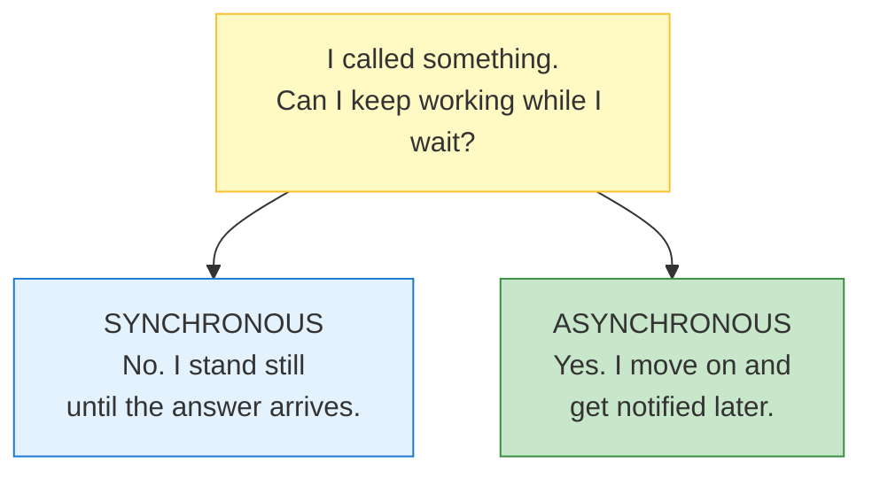

| | Meaning |
|---|---|
| **Synchronous** | You make a call and are *stuck* until it finishes. Nothing else in your program runs. |
| **Asynchronous** | You make a call, *continue*, and the result comes to you later. |

That's the entire distinction. The rest of this lecture is the **consequences** of each choice.

---

### Where the Word Comes From

The etymology clarifies things more than the definition does:

- **Synchronous** — Greek *syn* ("same") + *chronos* ("time") → **same time, in lockstep**
- **Asynchronous** — *a* ("not") + synchronous → **not in lockstep**

**The image:** two sine waves. Synchronous = **same phase**, rising and falling together. Asynchronous = **out of phase**, each doing its own thing.

"In sync" means **both sides advance together at the same pace** — requester and responder move as a single unit.

---

### The Counter-Intuitive Part

| Domain | Goal | Why |
|---|---|---|
| **Motors / electricity** | Keep phases matched **at all costs** | Out-of-phase motors wreck each other — vibration, tearing, failure |
| **Software** | Let each side work **independently** | The user shouldn't be locked to the server's rhythm |

**In machinery, synchronisation is what you fight for. In software, we actively want asynchrony.**

The reason: **in software, the client almost always has independent work to do.** Locking it to the server's pace throws that work away for nothing.

---

### The Insight That Unlocks the Lecture

There are **two separate facts** that people blend into one:

| | Fact | Whose decision is it? |
|---|---|---|
| **1** | The operation happened and took 5ms | **Nobody's.** It's a fact. |
| **2** | Your program stood still for those 5ms | **Yours.** You chose it. |

> **"Synchronous" and "asynchronous" are not properties of the operation. They are properties of *the caller's choice*.**

The disk read is a disk read. Nobody's opinion is involved. What varies is **what the caller does while it happens.**

---

### Analogy: The Restaurant Phone Call

You call a restaurant to place a large order.

**Version A — you stand there**
You call, place the order, then stay on the line saying nothing for 20 minutes while they cook. You can't cook dinner. You can't read. You just exist, holding a phone, waiting. Then: "Great, thanks."

**Version B — you get on with your life**
You call, place the order, and ask: *"Can I hang up and will someone message me when it's ready?"* They say yes. You hang up. You cook, clean, read. Twenty minutes later: *ping* — your food is downstairs.

#### What stayed identical

| | Version A | Version B |
|---|---|---|
| The restaurant | Same | Same |
| The order | Same | Same |
| Cooking time (20 min) | Same | Same |
| The food | Same | Same |
| **What YOU did for 20 min** | **Stood still** | **Lived your life** |

Nothing about the restaurant changed. **The only thing that changed is what you did while waiting.**

Therefore:
- ❌ *"Is the restaurant synchronous?"* — meaningless question
- ✅ *"Is my phone call synchronous?"* — meaningful question

> **"Synchronous" describes a *relationship* between an operation and the thing waiting on it — not a property of the operation itself.**

---

### The Same Thing in Code

```javascript
// ── Program A ──
const result = fetchBlocking(url);
console.log("A did other things");   // ← runs AFTER the 200ms

// ── Program B ──
fetchNonBlocking(url, () => { /* handle result */ });
console.log("B did other things");   // ← runs IMMEDIATELY, before the 200ms
```

**The request is byte-for-byte identical.** Same URL, same 200ms, same server doing the same work. The only difference is Program B's *relationship* to it.

So when someone says **"HTTP is asynchronous"** — that's sloppy phrasing. What's actually true is:

> **An asynchronous HTTP client does not block while waiting. A synchronous HTTP client does.**

HTTP itself never changed. The client's behaviour did.

*Compare: saying "gravity is asynchronous for people who jump."* Nonsense — gravity is constant. What varies is how a given person interacts with it.

---

### The Precision Rule: "Async *With Respect To* What?"

**Asynchronous is always relative to a specific pair** — *the operation* and *one particular participant*.

Look at a single disk read and ask what's happening for **each** participant:

| # | Participant | During those 5ms | Experience |
|---|---|---|---|
| 1 | Your program | Ran other code | **Async** |
| 2 | The kernel | Sat waiting for the disk | **Sync** |
| 3 | The disk controller | Reading bytes | Working |
| 4 | The SSD itself | Fetching cells | Working |
| 5 | The database (if any) | Waiting for the result | **Sync** |
| 6 | The caller of *your* API | Waiting on the HTTP response | **Sync** |

Six participants. **Different experiences of one event.**

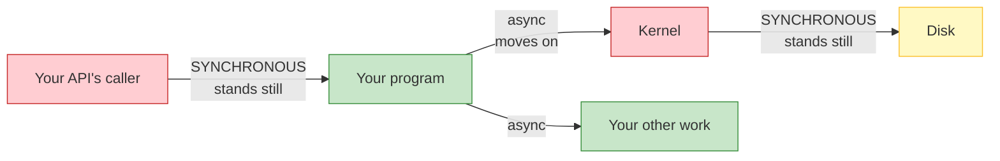

Green = moving on. Red = frozen. **One event, both.**

### Getting the wording right

| Saying this | Meaning | Correct? |
|---|---|---|
| "The disk read is asynchronous" | The read itself is async | ❌ Incomplete — ambiguous |
| "The disk read is **synchronous for the kernel**" | The kernel waited | ✅ Precise |
| "It was **asynchronous for our program**" | Our program moved on | ✅ Precise |

The operation itself has **no label**. It's a neutral event. Each participant *experiences* it differently, and we describe the **relationship** — never the thing.

> **Rule: when someone says "this is async," always ask "async with respect to *whom*?" If the answer isn't given, the statement is incomplete.**

---

### Corollary 1 — Async ≠ Parallel

Two *different* properties that are constantly confused:

| | Question it answers | Type |
|---|---|---|
| **Async** | *Do I wait, or do I move on?* | **Timing** |
| **Parallel** | *How many things run at the same instant?* | **Concurrency** |

**The alarm clock:**
- **Synchronous:** you lie in bed awake, staring at the ceiling, 11pm → 7am. Seven hours of doing nothing.
- **Asynchronous:** you set the alarm and go to sleep. Seven hours pass. It rings.

Did you run **in parallel with the alarm**? Obviously not — there's one of you and one alarm. What changed is that you **went to sleep** instead of standing there watching it.

> **Async = "I didn't stand there." Parallel = "there was more than one of me."**

Unit 4 proves this for real: Node.js runs its entire async model on **one single thread**. Genuinely non-blocking. Zero parallelism. Both true at once.

---

### Corollary 2 — Async ≠ Faster

**Total work is identical.** Nothing got quicker. The operation still took 5ms. What changed is that **you stopped wasting your own 5ms standing still.**

| | Sync | Async |
|---|---|---|
| Cooking time | 20 min | 20 min |
| **Your time wasted** | **20 min** | **0 min** |

The kitchen didn't get faster. **Your utilisation of your own life got better.**

### The consequence that surprises people

If you have **nothing else to do**, async gives you almost nothing:

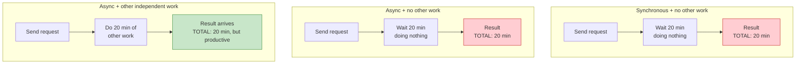

**All three totals are 20 minutes.** Async never shortened the operation. It only bought back *your* time — and only if you had something to spend it on.

> **This is why "make everything async" is a trap.** Async pays off only when you have **independent work** to do while waiting. Otherwise it's added complexity for zero gain.

---

### The Framing That Makes the Whole Lecture Obvious

> **You never "make something asynchronous." You change *your own* behaviour from waiting to not-waiting. Everyone else's experience is unchanged.**

Everything after this follows from it:

| Question | Answered by |
|---|---|
| Why does my UI freeze on slow network calls? | You're synchronously waiting — *you* are the red box |
| Why doesn't my server crash under load? | It hands work off and moves on |
| Why is a fast API that blocks the event loop so damaging? | Every caller becomes a red box |
| Why does making *my* code async not speed up *my* callers? | They still stand there waiting → **Unit 7** |

---

## Checkpoint

1. A program calls a 500ms function and executes other lines during those 500ms. Synchronous or asynchronous? **Now: which entity in that scenario is still waiting?**
2. Your program writes to an SSD (5ms). Is the SSD "asynchronous"?
3. In one sentence each — why do we *want* synchrony in motors but *want* asynchrony in software?
4. Async vs. parallel: a single-threaded event loop doing "non-blocking I/O" — is it parallel?
5. Async vs. faster: you `await` a 3-second API call and have nothing else to do. How much time did async save?

---

## Unit 2 — What "Blocked" Actually Means

Unit 1 said sync/async is about **whether you wait**. Now let's see what waiting *actually is* at the machine level — because it is not what most people picture.

### 2.1 — What Blocking Feels Like

Hussein's memory is the perfect illustration. Early VB5 (late 90s), single-threaded:

```javascript
// In a VB5-style app
function OnButtonClick() {
    processEnormousFile();     // takes 20 seconds
}

button.onClick = OnButtonClick;
```

While `processEnormousFile()` runs:

| You do this | What happens |
|---|---|
| Click the button again | **Nothing.** The button won't even light up. |
| Drag the window | **Frozen.** |
| Type into a text field | **Ignored.** |
| Anything at all | **Ignored.** |

Not "slow." Not "laggy." **Completely unresponsive.** The program is one thread, and that thread is standing still waiting. There is nothing else in the program capable of noticing your click.

> **Blocking doesn't mean "slow." It means "the part of the program that could respond to you is unable to run."**

That distinction matters enormously. Unit 4 shows how async fixes this without the thread ever having to *not* be waiting.

### 2.2 — What the CPU Actually Does

Here is the part that reframes everything. You might assume: *"the program is waiting, so the CPU sits idle."*

**That is not what happens.** The CPU does this:

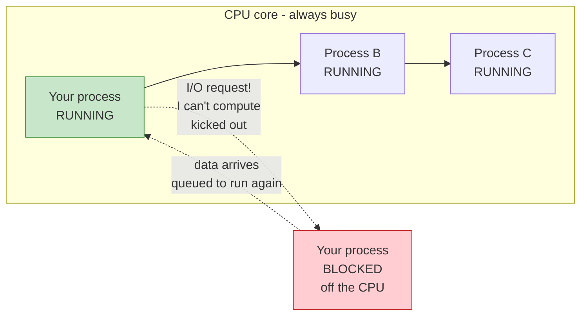

The moment your code does I/O, your process **stops executing instructions**. There are no instructions left to run — you are waiting on data.

So the kernel does something almost counterintuitive:

> **"You're blocked. You're not computing anything. Get off the core — I'll put someone else on."**

Your process is **removed from the CPU**, and another process runs in its place. Your instructions, your register values, your position in the code — saved somewhere, so they can be restored later.

**This is the same trick as push (Lecture 8) applied to the CPU itself:** the kernel is now *pushing work onto* the CPU rather than letting it idle.

### 2.3 — The Three Steps of a Context Switch

Whenever your process goes off the core and later comes back, the kernel performs a **context switch**:

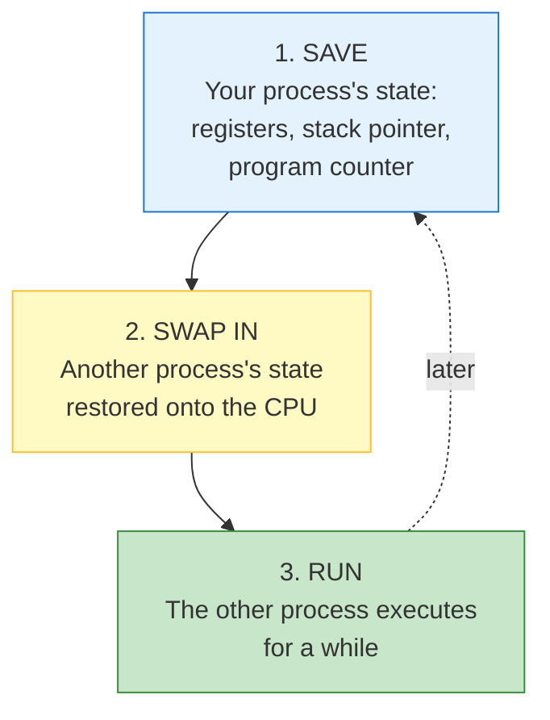

**Why it takes three steps:** your process is a *continuation*. It paused mid-function, with live values in registers. To bring it back, the kernel must restore that exact state — otherwise your program would resume with corrupted variables.

> **A context switch is literally "stop one story mid-sentence, bookmark the page, start another story, then come back later."**

### 2.4 — The Cost

Saving and restoring state is **not free**. The kernel must:

- Save ~a dozen CPU registers
- Save/restore the stack pointer
- Invalidate/rebuild CPU caches (the new process has different data)
- Update page tables in some cases
- Run scheduler bookkeeping

**Order of magnitude: microseconds.** One context switch might be 1–10 µs.

Sounds negligible. It isn't — because:

| Operation | Time |
|---|---|
| One context switch | ~1–10 **microseconds** |
| One disk read | ~1,000,000–10,000,000 **microseconds** (1–10 ms) |
| One network round trip to another continent | ~100,000,000 **microseconds** (100 ms) |

> **The context switch cost is tiny relative to the I/O — but it happens on *every* switch, in *every* thread, across the whole system, constantly.**

Hussein's phrasing: *"It's microseconds, but I do it a lot. It adds up."*

And it compounds in one direction that matters: **more threads → more switching → more overhead.** Which is why you don't spawn 10,000 threads for 10,000 clients (that's the wall Lecture 14 — Multiplexing — walks straight into).

### 2.5 — The Complete Waste

Now the payoff promised in Unit 1. Here is that participant table — **the same six participants, during a blocking disk read**:

| # | Participant | During those 5ms | Experience |
|---|---|---|---|
| 1 | Your program | **Standing still** | 🔴 Blocked |
| 2 | The kernel | **Standing still**, waiting on the device | 🔴 Blocked |
| 3 | The disk controller | Reading bytes | 🟢 Working |
| 4 | The SSD | Fetching cells | 🟢 Working |
| 5 | Your API's caller | Waiting on the HTTP response | 🔴 Blocked |

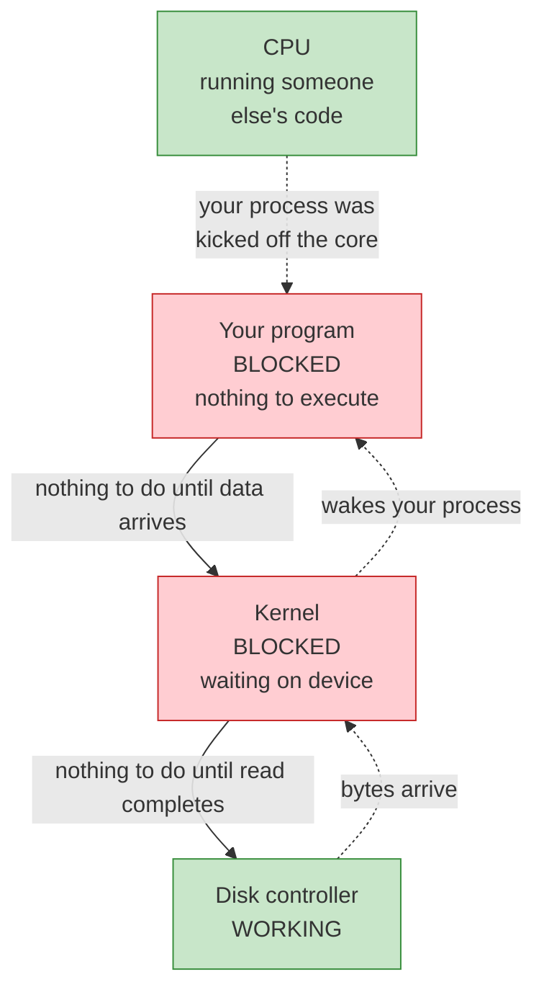

Now look at what Hussein called out:

> *"Neither the kernel is doing any work nor the application is doing any work here. The device is doing all of it."*

And his complaint — worth reading as if you were the process:

> *"Why do you block me here? Why did you take me off the CPU? **I'm just waiting.**"*

**Two participants frozen, doing nothing, while two do all the work.** Your program isn't slow because it's doing difficult work. It's slow because it's *idle*.

> **Blocking doesn't mean "slow." It means "not working." And the CPU capacity you're not using isn't wasted globally — it's just not available *to you*.**

### 2.6 — The Important Nuance

There is a trap in the previous section worth catching, because people get it wrong in the opposite direction.

**"Blocking" does not mean "the CPU is idle."**

The CPU stayed busy the whole time — running *other processes*. That is the whole point of preemptive multitasking: **aggregate CPU utilisation is kept high.**

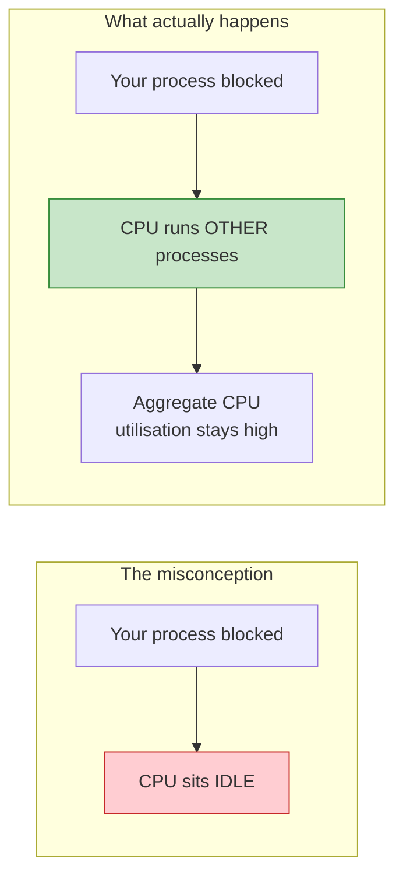

**This is why blocking is normally fine** — and why it is not the problem people think it is:

| Situation | Is blocking bad? |
|---|---|
| One process waits on disk while 500 others run | **Totally fine.** The CPU is busy. That is the design working. |
| Your thread waits, and it was the *only* thing to do | **Bad.** Your latency is pure idle time. |

The CPU being efficient and *your program* being slow are **two different facts**. Only the second one is your problem.

### 2.7 — `DoEvents`: The Hack That Reveals the Problem

Hussein's first language was VB5, and VB5 shipped a function called `DoEvents` for exactly this.

```javascript
function processEnormousFile() {
    step1();
    DoEvents();   // "if the user clicked anything, handle it now"
    step2();
    DoEvents();
    step3();
}
```

`DoEvents` pumps the message queue — it lets the single thread **briefly stop waiting and handle UI events** mid-operation.

**The honest truth: it worked, and it was a lie.**

| It did | It didn't |
|---|---|
| Made the UI responsive | Make the operation itself faster |
| — | Make the code simpler |
| — | Remove the underlying problem |
| — | Scale to more than one user |

And it introduced a classic bug: the user could click "Delete" *in the middle of* a save operation. `DoEvents` invites re-entrancy into code not designed for it.

> **`DoEvents` is the historical shape of every async solution: break the wait, handle other work, come back. Modern async does the same thing — but *structurally*, not by sprinkling hand-placed calls through your code.**

That is the bridge to Unit 3: the modern answer is not "remember to sprinkle something" — it is "the *system* handles the waiting for you."

### Checkpoint

1. You assume a blocked process means an idle CPU. Correct or incorrect, and what actually happens?
2. What are the *three* steps of a context switch, and why does restoring require all of them?
3. A context switch is ~5µs; a disk read is ~5ms. If the switch is 10,000× cheaper than the read, why does the cost matter at all?
4. During a blocking read, how many of the six participants from Unit 1 are doing useful work? Name them.
5. Your process is blocked, but the CPU shows 90% utilisation. Is that a contradiction? Explain.
6. What did `DoEvents` actually fix, and what did it hide?

---

## Unit 3 — How Async Learns About Completion

Unit 2 ended with the waste: your program frozen, the kernel frozen, the device working. Async fixes that by **not waiting**. But that immediately creates a new problem — and this unit is about solving it.

### 3.1 — The Problem Async Creates

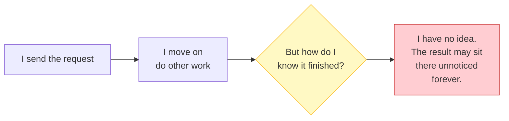

Synchronous code didn't have this problem — you were standing right there when the answer arrived.

Async code walks away. So something must **tell it** when to come back. And there are exactly **two philosophies** for how that notification works.

Both are non-blocking. Both are async. They differ in **who does the work**.

---

### 3.2 — Design A: Readiness ("Is it ready?")

**The idea:** you ask the OS *"is this thing ready yet?"* over and over. When it says yes, **you** perform the operation.

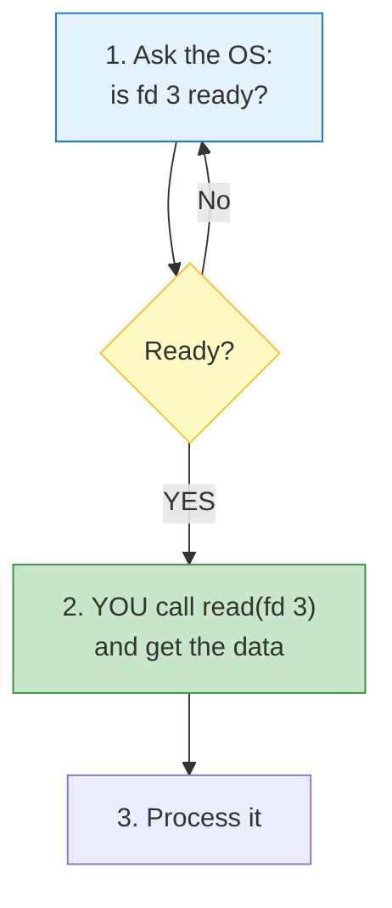

**The OS's role is small:** it is a *notifier*. It says "go ahead," then gets out of the way.

### The progression

| API | Era | Limit |
|---|---|---|
| `poll` | Ancient | You pass the **whole list** of fds on every call |
| `select` | Ancient | Hard cap (1024 fds) and **mutates your fd_set** |
| `epoll` | Linux, modern | You **register once**, then ask "anything ready among all of them?" |

`epoll` is the important one. You hand the kernel your fd list **once** at setup:

```c
epoll_ctl(epfd, EPOLL_CTL_ADD, fd, &event);   // once, at startup

while (running) {
    n = epoll_wait(epfd, events, MAX, -1);    // blocks until ANY is ready
    for (i = 0; i < n; i++) {
        if (events[i].data.fd == listen_fd)   accept_new_client();
        else                                  handle_read(events[i].data.fd);
    }
}
```

**One `epoll_wait` serves thousands of connections.** That is the whole scalability trick — and it only works because you registered once. (See the fd clarification below for what `fd` actually is.)

### The crucial subtlety: "ready" ≠ "data is there"

Readiness strictly means:

> **"An operation on this fd will not block."**

Not "you'll get everything you asked for." Three consequences that bite in production:

**a) One readiness event may not satisfy your read**
```c
epoll_wait(...) → fd 3 is readable
read(fd3, buf, 1024);   // returns only 40 bytes!
```
A socket delivers whatever has arrived. 40 bytes ≠ 1024 requested. You must loop until you have enough — or until the connection would block again.

**b) Readiness is about *conditions*, not data**
One fd can be readable *and* writable. A socket is nearly always writable (send buffer has space). Programs often care about only one direction.

**c) Level-triggered vs edge-triggered** — a real production footgun:

| Mode | Fires | Danger |
|---|---|---|
| **Level-triggered** (default) | Every call, *while* ready | Safe, slightly more syscalls |
| **Edge-triggered** | Only on the *transition* to ready | If you don't read everything, **you'll never be told again** |

**And the catch that connects directly to Unit 4:**

> **`epoll` cannot watch a regular file on disk.**

A disk file has no meaningful "ready" transition — it's either already in the page cache (always ready) or it isn't (and epoll has no way to learn about it). Readiness notification is a **socket** concept. Disks don't work that way.

This is precisely why Node.js reads files using a **thread pool**. Full explanation in the fd clarification below and Unit 4.

---

### 3.3 — Design B: Completion ("It's done, here's the result")

**The idea:** you hand the OS the work *and* the notification in one go. The kernel **performs the operation itself**, then posts a completion record to a queue you drain later.

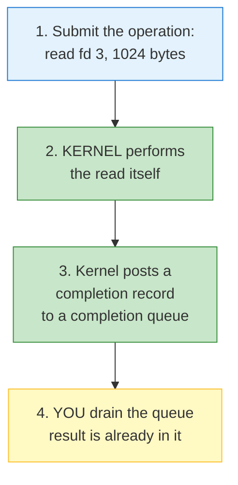

**The OS's role is large:** it is not a notifier, it's a **worker**. By the time you hear about it, the work is already done.

### The APIs

| API | Platform | Note |
|---|---|---|
| **IOCP** — I/O Completion Ports | Windows | The classic; drives Node.js on Windows |
| **`io_uring`** | Linux | Modern, faster, the successor to `epoll` |

```c
// io_uring — you never call read() yourself
io_uring_get_sqe(&ring);
io_uring_prep_read(sqe, fd3, buf, 1024, 0);
io_uring_submit(&ring);                    // hand it to the kernel

n = io_uring_peek_cqe(&ring, &cqe);        // drain completions
// cqe already contains fd, result byte-count, and the buffer contents
```

---

### 3.4 — The Precise Difference

This is the table that makes the whole unit click:

| | **Readiness** (`epoll`) | **Completion** (`io_uring`, IOCP) |
|---|---|---|
| **The OS says** | *"You may proceed."* | *"It's done. Here's the result."* |
| **Who performs the read?** | **You** | **The kernel** |
| **Steps** | **Two**: wait for ready → perform | **One**: submit → reap |
| **Your process is** | A **worker** | A **reaper** |
| **The kernel is** | A cheap **notifier** | An expensive **worker** |
| **Work happens** | In your process | In the kernel |
| **Multi-queue scaling** | One queue, must loop | **Can have multiple queues<br/>across multiple threads** |
| **Best for** | Sockets, pipes, anything with a ready-transition | Very high-concurrency I/O, files included |

### The one-line version

> **Readiness says "go." Completion says "done."**

In readiness, the moment of notification and the moment of work are **two separate events**. In completion, they are **the same event** — that is why it is one step instead of two.

---

### 3.5 — The Participant Reframe

Recall Unit 1's framing — different participants experience the same operation differently. Here is how it shifts between the two designs:

| Participant | Readiness design | Completion design |
|---|---|---|
| **Your program** | 🔵 Does the actual read work | 🟢 Just collects finished results |
| **The kernel** | 🟢 Cheap — just reports state | 🔴 Expensive — performs all the I/O |
| **Cost sits on** | Your process's CPU | The kernel's queues |

**That is the real trade.** Readiness keeps work in your process (cheap kernel, more work for you). Completion pushes work into the kernel (simpler code, heavier kernel).

And it explains a practical difference:

> **Completion scales across cores better**, because you can have several completion queues, each drained by a different thread. Readiness tends to have one dispatcher thread doing the reads.

---

### 3.6 — Node.js Uses Both

Node.js isn't opinionated — it **picks per platform**.

| Platform | Mechanism |
|---|---|
| **Linux** | `epoll` → readiness |
| **Windows** | IOCP → completion |
| **macOS / BSD** | `kqueue` / `evpoll` → readiness |

> **So the "async I/O" you write in Node.js is actually two different designs underneath, chosen automatically for you.**

### Checkpoint

1. State the problem async creates that synchronous code never had to solve.
2. In readiness, who performs the read — you or the kernel?
3. Readiness means "an operation won't block." What does that **not** guarantee about how much data you'll receive?
4. Why does `epoll` fail when you point it at a regular file on disk?
5. Your program uses readiness and does heavy processing per event. Your program uses completion and just hands results out. Which is heavier on the kernel?
6. Readiness is two steps, completion is one. What is the reason for that difference?
7. Which design lets you scale better across multiple cores, and why?

---

---

## Unit 4 — The Node.js Trick: Thread Pool + Event Loop

Unit 3 ended with a problem: **`epoll` can't watch a disk file.** Node.js has to read files. This unit is the answer — and it's the most important unit in the lecture, because it's how async actually gets *implemented*.

### 4.1 — The Problem Returns

What Node.js is actually facing:

| Operation | Can `epoll` handle it? | What Node.js must use instead |
|---|---|---|
| TCP socket / HTTP data | ✅ Yes | `epoll` / IOCP — event loop handles it |
| Pipe, stdin | ✅ Yes | `epoll` / IOCP |
| **Read a file from disk** | ❌ **No** | **Something else** |
| DNS lookup | ❌ Not really | Something else |
| `crypto.pbkdf2` (password hashing) | ❌ Not at all | Something else |

**A whole category of blocking operations has no async OS mechanism at all.**

Node.js's solution is the classic engineering trick: **if you can't avoid blocking, move the blocking to somewhere you don't care about.**

### 4.2 — The Trick

Hussein's framing: *"Let someone else be blocked while itself not blocked."*

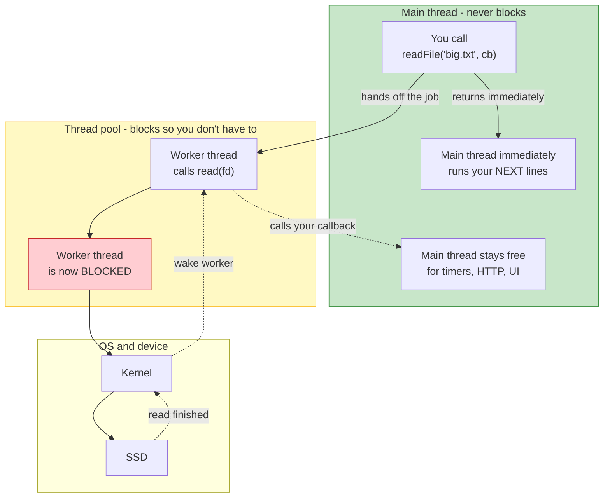

**The mechanism, step by step:**

1. You call `readFile(...)`
2. Node.js **hands the job to a worker thread** from its pool
3. That worker calls the genuinely blocking `read()` and **freezes**
4. **Your main thread never froze.** It ran your next line immediately
5. The OS removed the *worker* from the CPU (Unit 2's context switch) — **not your main thread**
6. The read completes, the worker wakes, and **calls your callback**

> **The blocking didn't disappear. It was relocated to a thread whose blocking you don't feel.**

That's the entire trick. And Hussein's summary of it is the best line in the lecture:

> **"Software is full of tricks. Computers are dumb, and we play tricks on them."**

### 4.3 — Is It *Actually* Async? The Honest Answer

**No.** And you should understand why, because it affects how you scale.

| | Real async (event loop + `epoll`) | Thread pool |
|---|---|---|
| Does a thread block? | **No** | **Yes** |
| What does the kernel do? | Notifies readiness; you read | Actually performs the read |
| Threads needed for 10,000 concurrent file reads | **1** | **10,000** |
| Memory per unit of concurrency | One event loop | A whole thread (stack + buffers) |

> **The thread pool doesn't make I/O non-blocking. It makes blocking *someone else's* problem.**

**But** — and this is why it works — **for I/O-bound work, threads spend almost all their time blocked, not computing.** Waking a few sleeping threads costs far less than you'd fear. That's why the trick works in practice.

### 4.4 — The Event Loop: How One Thread Reaps Everything

The thread pool handles what `epoll` can't. But what handles the *thousands of sockets*? **The event loop** — a single thread that owns `epoll` and does nothing but wait and dispatch.

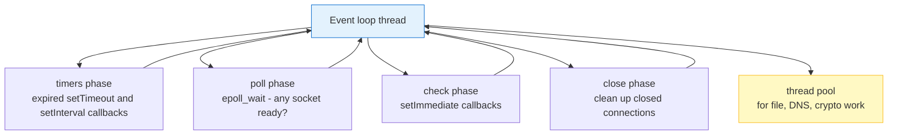

**One thread. Thousands of connections. Zero blocking.**

```javascript
// This is genuinely all it does, conceptually
while (true) {
    run_expired_timers();
    n = epoll_wait(sockets_ready);      // blocks here - but it's *supposed* to
    for (each ready socket) {
        handle_its_event();             // fast, non-blocking
    }
    handle_immediate_callbacks();
}
```

**The crucial difference from the thread pool:** when a socket is ready, the event loop **does the work itself** — it doesn't hand it to a thread. No thread is created, nothing blocks. That's why Node.js can hold 10,000+ WebSocket connections (Lecture 8's idle cost, amortised across one thread).

### Both mechanisms together — the real architecture

| Work type | Handled by | Blocks a thread? |
|---|---|---|
| Sockets, HTTP, timers | **Event loop** (`epoll`/IOCP) | No |
| File reads, DNS, `crypto` | **Thread pool** (~4 threads) | Yes, but not yours |
| Your JavaScript callbacks | **Event loop** | No |

### 4.5 — Callbacks: How You Get Notified

Every async Node.js API is built on the same primitive: **"do this later, and call me when it's done."**

```javascript
const fs = require('fs');

console.log('1');
const data = fs.readFileSync('test.txt');   // blocking
console.log('2');
```

Synchronous — output is always `1`, `2`, then the content.

Asynchronous version:

```javascript
console.log('1');
fs.readFile('test.txt', function onReadFinished(err, data) {
    console.log('3   <- callback ran LATER');
    console.log(data.toString());
});
console.log('2');
```

Output:

```
1
2
3   <- callback ran LATER
<contents>
```

**Look at the ordering.** Line `2` printed **before** the file content — even though the file was ready almost instantly. That's the event loop: your synchronous code runs to completion first, *then* the callback queue gets drained.

> **The callback doesn't interrupt your code. It gets appended to a queue that the event loop drains when your current synchronous run finishes.**

That is why a long synchronous loop starves timers and I/O callbacks — the event loop never gets a turn.

### 4.6 — Sizing the Thread Pool

Node.js defaults to **4 worker threads** (`libuv`'s `UV_THREADPOOL_SIZE`).

| Your workload is | Threads vs. CPU cores | Why |
|---|---|---|
| **CPU-bound** (hashing, image processing, compression) | **≈ number of cores** | More threads than cores = pure context-switching thrash (Unit 2's cost) |
| **I/O-bound** (file reads, DB queries, network waits) | **Can exceed cores** | Threads spend most time **blocked**, not computing — extra threads are nearly free |

```bash
UV_THREADPOOL_SIZE=8 node app.js    # Linux/macOS
```

**And this is the practical payoff Hussein emphasises:**

> *"Understanding what the backend is doing lets you configure the heck out of it, and optimize and squeeze all the performance. If you don't understand how things work, you can't optimize anything."*

You can't tune what you can't explain. Why is 4 threads slow for your app? Now you know where to look.

### 4.7 — The Cost of the Trick

One real cost, so you aren't surprised:

```javascript
// 100 tiny file reads
for (let i = 0; i < 100; i++) {
    fs.readFile(`file${i}.txt`, callback);   // queued to 4 threads
}
// → 100x thread hand-off + context switch
//
// vs ONE read of a directory listing:
// → 1 file read
```

**The thread pool makes many *small* operations expensive.** Batch them, or use streams, or read a directory instead of 1000 files.

> **Rule of thumb: the thread pool is a fallback for operations the OS can't make async. The event loop is the fast path. Prefer fewer, larger operations.**

### Checkpoint

1. `epoll` can't watch a disk file. What does Node.js do instead?
2. In the thread-pool trick, whose thread actually blocks — yours or the worker's?
3. Honest question: is the thread pool *genuinely* non-blocking, or is it a relabeling? Why does it still work in practice?
4. Which Node.js mechanism handles a WebSocket message, and which handles `fs.readFile`?
5. Your app holds 100 concurrent WebSocket connections. Roughly how many threads are involved?
6. You have 4 CPU-bound workers on a 2-core machine. What happens, and why?
7. Your app does 1000 individual `fs.readFile` calls for 1000 small files. Why is that slow, and what's the fix?

---

---

## Unit 5 — Promises and `async`/`await`: Syntax vs. Reality

Unit 4 gave you the machinery. This unit covers the **three layers of syntax** Node.js puts on top of it — and the crucial fact that `await` *looks* blocking but isn't.

### 5.1 — The Progression

Hussein walks through three eras of the same problem:

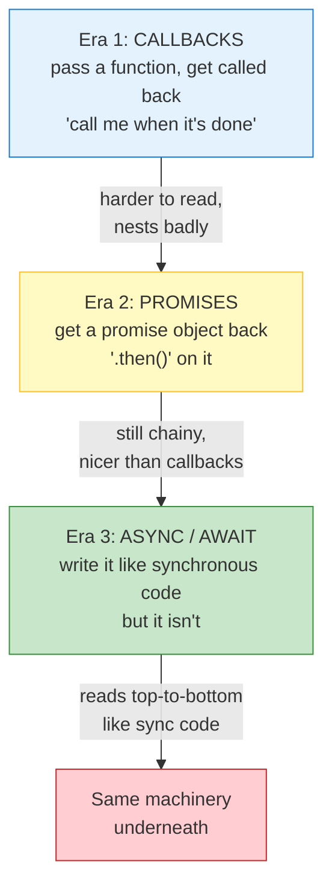

**Critical:** the arrow into the red box. **All three run on the identical event loop + thread pool from Unit 4.** No new capability is added. Only the way you *write* it changes.

> Hussein's verdict on the whole progression: *"We're just playing games here."* Not dismissive — he's pointing out that the "magic" is presentation, not power.

### 5.2 — Era 1: Callbacks

The primitive: **pass a function, get called when the work finishes.**

```javascript
executeSomething(function whenDone(result) {
    console.log('work finished:', result);
});
```

**The problem:** when work must happen *in sequence*, callbacks nest.

```javascript
getUser(id, function(user) {
    getOrders(user.id, function(orders) {
        getItems(orders[0].id, function(items) {
            getPrices(items, function(prices) {
                console.log(prices);
                // 🔴 four levels deep, real work at the bottom
            });
        });
    });
});
```

Known as the **pyramid of doom**. Every real-world callback API has this shape, and it gets worse past three levels.

### 5.3 — Era 2: Promises

A **promise is a container for a value that doesn't exist yet.**

```javascript
const p = fetchUser(5);        // returns immediately — no user yet
// p is a Promise: a placeholder that will settle later

p.then(user => console.log(user));    // "when it settles, do this"
```

Hussein's comparison: *"A promise in Node.js is very similar to futures in C++."*

### The three states

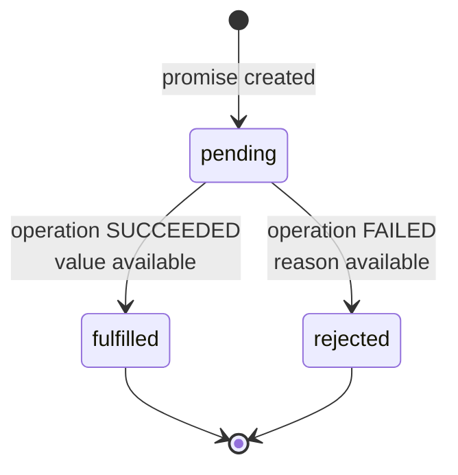

A promise starts `pending` and settles **exactly once** — into `fulfilled` or `rejected`. Never both, never twice.

### The chainable version — flattening the pyramid

```javascript
getUser(id)
    .then(user => getOrders(user.id))
    .then(orders => getItems(orders[0].id))
    .then(items => getPrices(items))
    .then(prices => console.log(prices))
    .catch(err => console.error('failed:', err));   // one place for all errors
```

**Flat. Left-to-right. One error handler.** That was the entire motivation.

| Method | Runs when |
|---|---|
| `.then(fn)` | Promise fulfills (pass a 2nd arg to handle rejection) |
| `.catch(fn)` | Promise rejects |
| `.finally(fn)` | Always, either way — cleanup |

### 5.4 — Era 3: `async` / `await`

Still fully asynchronous — but it reads top-to-bottom.

```javascript
async function main() {
    const user    = await getUser(id);        // pauses HERE
    const orders  = await getOrders(user.id);
    const items   = await getItems(orders[0].id);
    const prices  = await getPrices(items);
    console.log(prices);
}
```

**No indentation. Reads like synchronous code. Looks like it blocks. It doesn't** — which is the whole subject of the next section.

---

### 5.5 — The Key Insight: `await` Suspends, It Does Not Block

This is the single most important thing in the unit.

**First, a correction worth internalising.** This code prints `A`, `B`, `C` — **in that order:**

```javascript
async function main() {
    console.log('A');
    await somethingAsync();
    console.log('B');
    console.log('C');
}
```

**Output: `A`, `B`, `C`.** Not `A`, `C`, `B`.

All four lines belong to **one execution flow**. When the promise settles, the function resumes at the line after `await` and runs forward normally. `B` is written before `C`, so `B` prints first.

#### The correct rule

> **`await` pauses the async function — it yields control *outside* the function, while preserving order *inside* it.**

Two separate effects that are easy to conflate:

| Effect | What it means |
|---|---|
| **Inside the function** | Order is **strictly preserved**. `await` is a **barrier** — nothing after it runs until it settles. |
| **Outside the function** | Control was **released**. Other code got a chance to run. |

`await` is not "a place where things jump around." It is a **barrier inside your function, and a yield point for everyone else.** Both at once.

#### Where interleaving *does* happen — `C` outside the function

```javascript
async function doWork() {
    console.log('A');
    await somethingAsync();
    console.log('B');
}

doWork();          // ← note: NOT awaited
console.log('C');
```

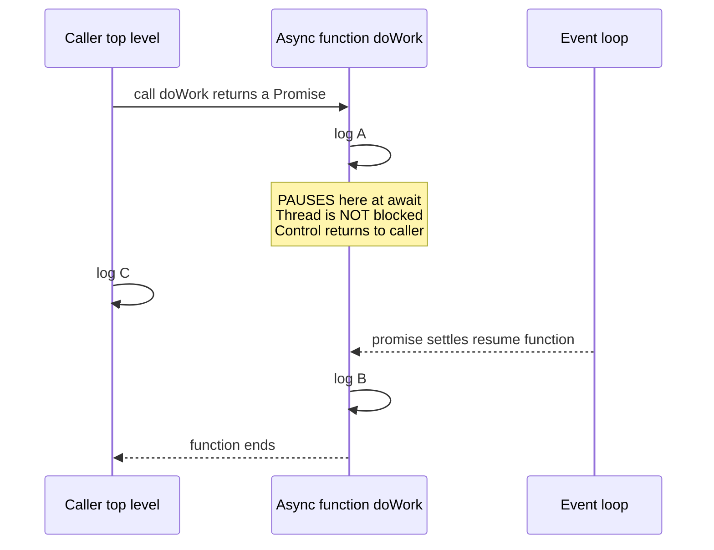

**Output: `A`, `C`, `B`** ✅

And note **why** `C` got its chance: `doWork()` was called **without `await`**. The caller didn't wait for it, so the caller carried on immediately.

### This is Unit 2's Lesson, Restated

| | Unit 2 (blocking) | Unit 5 (`await`) |
|---|---|---|
| **Thread** | ❌ Suspended — removed from the CPU | ✅ **Free** — runs other callbacks |
| **Other code** | ❌ Cannot run | ✅ **Runs** — that's the yield |
| **This function** | ❌ Cannot run | ✅ Paused — order preserved |

A **blocked** thread stops everything, including itself.
An **`await`ing** function stops only itself, and gives the thread away while it waits.

> **Same word — "waiting." Completely different cost.** That is why Unit 2 needed two separate words and this unit doesn't.

### The two rules

```javascript
// Rule 1: await may only appear inside an async function
// (the sole exception: top-level await in an ES module)
async function ok() { await fetchData(); }

// Rule 2: an async function ALWAYS returns a promise, never a plain value
async function f() { return 42; }
f()              // → Promise { 42 }   ← wrapped, automatically
```

---

### 5.6 — Why We Accept the Illusion

Hussein's answer for why `await` is written to look blocking:

> *"Sometimes you want the code to be in order. If the rest of the code depends on this value, you want your code to go block, wait here until we get the result. But we're not really waiting. We're not blocked. We can do other stuff."*

**Because sometimes the next line genuinely depends on the result.**

```javascript
const user = await fetchUser(id);
console.log(user.name);        // 🔴 meaningless without await
```

Without `await`, `user` is a *Promise object* and `user.name` is `undefined` — the code runs instantly against a placeholder.

So `async`/`await` buys something real:

| Benefit | Why it matters |
|---|---|
| **Correct ordering** | The next line *needs* the value |
| **Readability** | No pyramid, no `.then()` chain |
| **One error handler** | `try`/`catch` instead of `.catch()` |
| **Debuggable** | Real stack traces, real line numbers |

> **The rule: `await` when the next line depends on the result. Don't await when it doesn't.**

Because order inside is *enforced*, sequential `await` is how you accidentally author a dependency:

```javascript
// 🔴 total 3s — the 2s call doesn't start until the 1s finishes
const a = await fetchA();
const b = await fetchB();

// ✅ total ≈ 2s — both in flight together
const [a, b] = await Promise.all([fetchA(), fetchB()]);
```

> **Awaiting in sequence turns independent work into dependent work.** The barrier is a feature — which is exactly why misusing it is a bug.

---

### 5.7 — Error Handling Differs Across the Three

```javascript
// Callbacks — error is just another argument. Easy to forget.
fs.readFile(path, (err, data) => {
    if (err) { /* 😰 forget this and it crashes later */ }
});

// Promises — one handler, but you can forget .catch()
fetchData().then(d => use(d));

// async/await — normal try/catch, the safest of the three
try {
    const d = await fetchData();
    use(d);
} catch (err) {
    handle(err);
}
```

---

### 5.8 — All Three Are the Same Machine

Strip the syntax away:

| Layer | What it really is |
|---|---|
| `async function` | *"Run this; if it hits `await`, park it and return control"* |
| `await x` | *"If `x` is a Promise, park me until it settles; otherwise continue"* |
| `Promise` | A container for a future value, with callbacks attached |
| `.then()` | *"When it settles, call me"* |
| **Underneath** | **The event loop + thread pool from Unit 4. Nothing else.** |

> **No layer here adds a single new capability. They only change how you *write* the same non-blocking work.**

### Refinement — `await` resumes on the microtask queue

`await` doesn't just resume "when the loop gets around to it." It resumes on the **microtask** queue, which drains *before* the next timer or I/O event:

```javascript
console.log('1');
setTimeout(() => console.log('timer'), 0);
Promise.resolve().then(() => console.log('microtask'));
console.log('2');
// Output: 1, 2, microtask, timer
```

That is why `await` continuations feel instant — they jump the queue relative to timers and I/O.

### Checkpoint

1. Three eras of syntax for the same problem. What machinery sits underneath all three?
2. A promise has three states. Name them. Which two are terminal?
3. What does `await` do to the **function**, and what does it do to the **thread**?
4. All four lines inside one `async function` — what's the output order of `A`, `await`, `B`, `C`?
5. Under what specific condition does `A → C → B` actually occur?
6. Why must a function containing `await` be marked `async`?
7. Two independent calls taking 1s and 2s. Sequential `await` vs `Promise.all` — total time for each? What rule did the first one violate?
8. Why is forgetting `await` a bug — and what exactly does `await` give you that `.then()` doesn't?

---

---

## Unit 6 — The Real-Life Analogy, and Why Sync Is a *Client* Property

Hussein says sync/async confused him for a long time until he found a physical example. Then he lands the point that reframes the whole lecture. Both in this unit.

### 6.1 — Synchronous Communication: The Meeting

You're in a meeting with John. You ask him a question:

> *"Hey John — did you actually send that pull request?"*

Now imagine **John doesn't answer.** Just silence.

**It's awkward.** Weird, even. Because:

- You're *talking to him right now*
- He is *right there*
- So he's expected to reply *now*
- If he doesn't, you have to prompt him: *"Where are you?"*

That awkwardness **is** synchronous communication, felt physically.

| Property | In the meeting |
|---|---|
| Both parties present | John is here, you're here |
| Immediate response expected | Silence is socially unacceptable |
| You cannot proceed without the answer | You need his answer to continue |
| Waiting is *visible* | Everyone can see you waiting |

### 6.2 — Asynchronous Communication: Email

Now send John an email:

> *"Hey John — did you send that PR?"*

Then close the laptop and go do something else. He might reply in 20 minutes. He might reply tomorrow. **You don't care.** Silence is completely normal with email.

You have **moved on with your life**, and his answer will find you later.

| Property | In email |
|---|---|
| Parties not co-present | He's wherever; you're wherever |
| No immediate response expected | Delay carries no social cost |
| You proceed independently | You do other work regardless |
| Waiting is invisible | Nobody knows you're waiting |

**Same message. Different relationship.** And that relationship — *is the person waiting allowed to do other things?* — is exactly the definition of sync vs async.

### 6.3 — The Diagnostic That Actually Works

Hussein's example gives you a test you can use on any situation:

> **"If the other party stayed silent, would it be *awkward*?"**
>
> - **Awkward** → synchronous
> - **Completely normal** → asynchronous

| Channel | Silent other party... | Verdict |
|---|---|---|
| Meeting / face-to-face | Very awkward | **Synchronous** |
| Phone call | Unbearable | **Synchronous** |
| Email | Totally normal | **Asynchronous** |
| Slack / Teams | Depends who's typing | **Ambiguous** |
| GitHub issue comment | Normal for hours | **Asynchronous** |

Chat sits in the middle — and that isn't a flaw in the analogy, it's the truth. A quick back-and-forth in Slack *feels* synchronous; a message you read next morning is completely async. **Same channel, different relationship**, depending on expectations.

> **The "channel" doesn't determine synchronicity. The *expectation of an immediate reply* does.**

### 6.4 — The Reframing: Sync Is a *Client* Property

This is the part that matters for the backend, and it's Hussein's key move.

He's been discussing sync/async in **method calls** — one program calling another. Then he moves it up a level to **Request/Response**, where there are two genuinely separate entities: a client and a server. And then:

> **"Synchronicity is really, if you think about it, it's a client property."**

### Why?

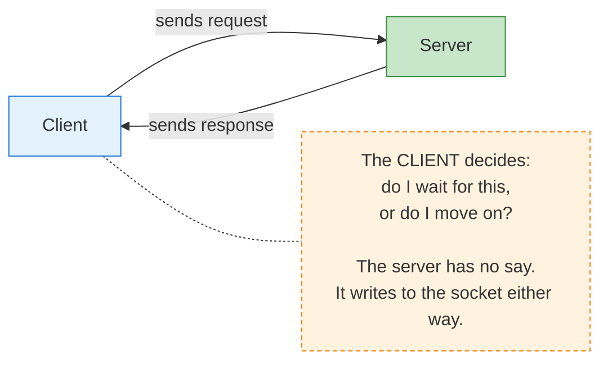

Look at what actually happens on the wire (Lecture 7, Unit 6). The server:

1. receives the request
2. processes it
3. writes the response

**At no point does the server "decide" anything about synchronicity.** It can't. It doesn't know whether you're sitting there blocking or whether you walked away to make coffee. The bytes are identical either way.

**Only the client knows which one it's doing.**

> **The client is the only participant that can be synchronous — because it's the only one that has to choose to wait.**

### The two questions that define it

Whenever you see "is this sync or async?", ask:

1. **Who is the party that would have to wait?**
2. **Did they choose to wait?**

| | Who waits? | Chose to wait? | Verdict |
|---|---|---|---|
| Client blocks on `fetch()` | Client | ✅ Yes | **Synchronous** (client's view) |
| Client `await`s a `fetch()` | Client | ❌ No | **Asynchronous** (client's view) |
| Server processing the request | Server | ✅ Yes | **Synchronous** (server's view) |

**Same request. Three different experiences.** Unit 1's framing again — now applied to the system as a whole.

### 6.5 — Why No Modern Client Is Synchronous

> *"Almost no client library today is synchronous anymore. It's always asynchronous, because we know we send a lot of requests and network calls, and we want to do other stuff while we send the request."*

Pure Unit 1 + Unit 4 economics:

| If the client blocked... | Consequence |
|---|---|
| Per request | You waste the entire latency doing nothing |
| With many requests | You serialise them for no reason |
| On a slow network | Your app is unusable |
| On a fast network | Still wasteful — you have local work available |

So `fetch`, `axios`, `http.request`, database drivers — **all async by default.** Not a style choice; the only sensible default once you understand the cost of blocking.

```javascript
// What every modern client actually does
send(request);
doOtherWork();              // ← the whole point
onResponse(() => { ... });   // ← called later
```

### The Node.js Event Loop, Revisited

The client-side dispatcher that does nothing but watch for work:

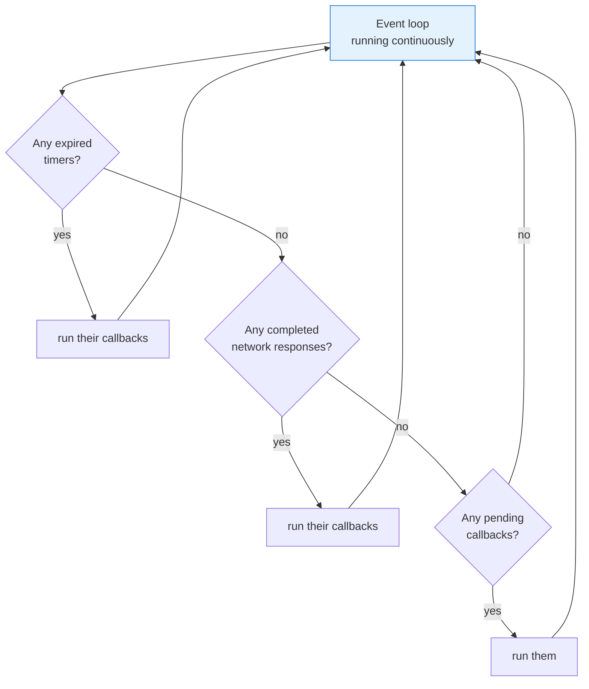

That's the whole client-side architecture in one loop: **keep asking "is anything ready?" — if yes run it, if no go back to sleep.** A continuous readiness check — precisely Unit 3's `epoll` model applied to your own callbacks.

### 6.6 — The Part That Sets Up Unit 7

The consequence, and the reason Unit 7 exists:

**Your client being asynchronous does not make the system asynchronous.**

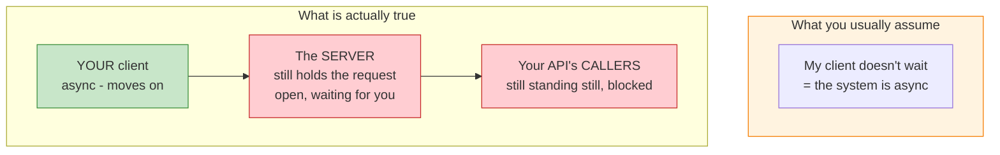

**The server is doing synchronous processing** — still executing that handler, still holding that connection, still working on your request. It has no idea you walked away.

And every caller of *your* API? **Synchronous.** They're waiting for your response exactly the way John is not answering you.

> **Making your own client asynchronous is a local optimisation. It frees *you*. It frees nobody else.**

This is the trap Hussein walks straight into:

> *"The client is asynchronous, but the whole thing, the system is synchronous. That's synchronous processing — because the backend still thinks, 'someone is actually waiting for me. I got to finish.'"*

And then the turn:

> **"Now move the lens to the back end."**

That lens move **is** Unit 7, and it's the most important unit in the lecture.

### Checkpoint

1. State the meeting case and the email case. What single question separates them?
2. Your teammate hasn't replied to your Slack message for three hours. Sync or async? What changed the answer?
3. Why can a channel like Slack be neither purely sync nor async?
4. Hussein says synchrony is a *client* property. Why can't the server choose whether the interaction is sync or async?
5. Your client uses `await`. Your server's handler is still running. Which of the two is synchronous, and why?
6. Name three reasons no modern HTTP client is synchronous.
7. You make your own API client fully async. Which participants are *still* synchronous — and who exactly is being hurt?

---

## Clarification — What Is a File Descriptor (fd)?

Unit 3 uses `fd` constantly, so it needs its own explanation. This is not a side note — **it is the mechanism Unit 3 is built on.**

### The Definition

**A file descriptor is just an integer that indexes a table inside your process.** The table maps integers to "things that are open."

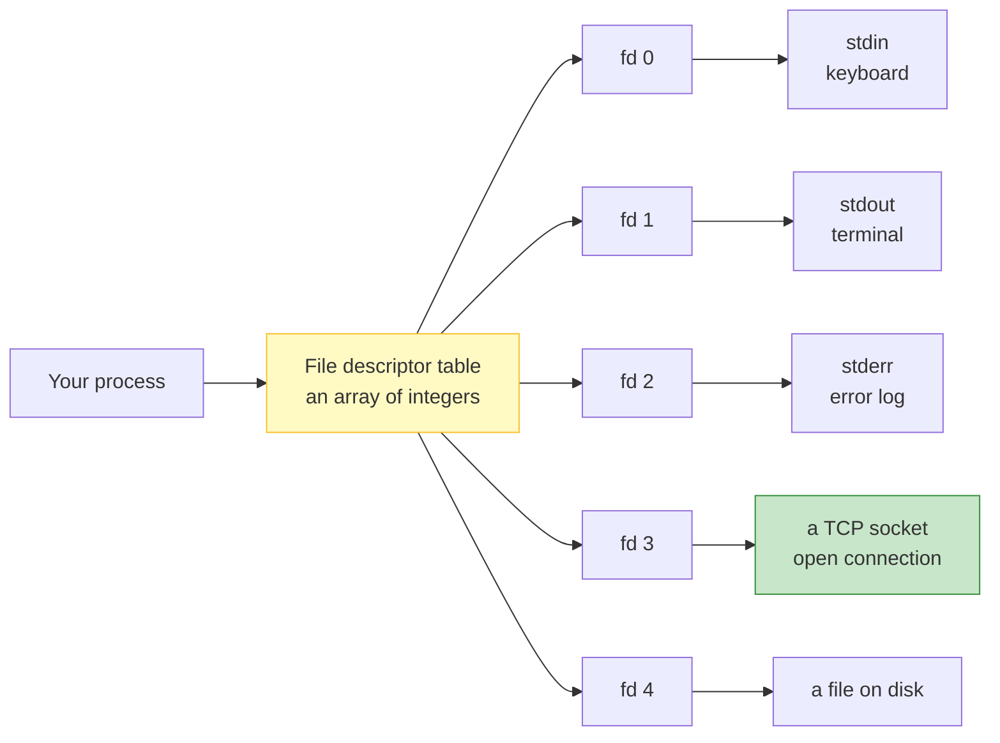

The integer itself carries **no meaning**. `fd 3` isn't special. If your process closes fd 3 and opens a pipe, **fd 3 now refers to the pipe.** The number is just a slot in the array.

### The Ones You Already Use

| fd | Name | Points at |
|---|---|---|
| **0** | `stdin` | Input — your keyboard |
| **1** | `stdout` | Normal output — your terminal |
| **2** | `stderr` | Errors — also your terminal |

That is why `echo hi 1>&2` redirects "normal output" to "errors" — you're telling the shell to make **fd 1 point at stderr's destination.**

### The Unix Philosophy That Makes This Relevant

Unix's core design idea:

> **"Everything is a file."**

Not a metaphor — a literal design decision. The kernel gives **all** of these the same interface (`read` / `write` / `close`) and the same kind of integer handle:

| Real thing | Is it a file? | Gets an fd? |
|---|---|---|
| A file on disk | Obviously | ✅ |
| A **TCP socket** | Yes | ✅ |
| A **pipe** (shell `\|`) | Yes | ✅ |
| stdin / stdout | Yes | ✅ |
| `/dev/urandom` | Yes | ✅ |

**So a network connection gets a file descriptor**, exactly like a file does. This is the entire reason `epoll` can watch a socket at all — sockets and files share one mechanism.

### Why This Matters for Unit 3

Now the lecture's phrasing makes sense:

```c
n = epoll_wait(epfd, events, MAX, -1);
// → "fd 3 is ready to read"
```

`epoll` is watching a **set of integers**. That is literally all it is. It returns which slots in your table have something to do.

And when your server accepts a connection:

```c
int client_fd = accept(listen_fd, ...);   // returns a NEW integer, e.g. 7
// fd 7 now points at the new client's socket
```

Every connection gets its own fd — which is how you keep track of who's who. That is the practical role of an fd in a backend.

### The Case That Doesn't Work

This resolves Unit 3's central puzzle:

| Resource | fd exists? | Readiness transition? | `epoll` works? |
|---|---|---|---|
| TCP socket | ✅ | ✅ data arrives → becomes readable | ✅ |
| Pipe | ✅ | ✅ writer writes → becomes readable | ✅ |
| **Regular file on disk** | ✅ | ❌ — always "ready" | ❌ |

A file on disk is **always ready** — there is no state *transition* for `epoll` to observe. There is nothing to notify you about, because "readiness" is decided the instant you call.

> **This is why Node.js reads files with a thread pool instead of `epoll`.** The OS's async mechanism fundamentally cannot express "wait for this disk read," so Node.js delegates it to a real thread that really does block.

### Don't Confuse It With the 4-Tuple

From Lecture 8 you have the **4-tuple**. It is a different concept:

| | What it is | Answers |
|---|---|---|
| **fd** | An integer handle **inside your process** | "Which of *my* open things do I mean?" |
| **4-tuple** (src IP, src port, dst IP, dst port) | Network-layer identity | "Which *connection* on the internet is this?" |

They are related: **one TCP connection ↔ one fd on each side.** But the fd is a *local handle*; the 4-tuple is the *global address*.

### See It Yourself

```bash
# Watch a process's open fds
ls -l /proc/<pid>/fd

# Which process is using port 443?
ls -l /proc/*/fd 2>/dev/null | grep socket
```

The fd number for stdin/stdout in a shell: `ls -l /proc/self/fd`.

> **The one line to remember: a file descriptor is an integer handle into your process's table of open things — and because Unix treats sockets as files, a network connection gets one too.**

---

## Vocabulary

| Term | Meaning |
|---|---|
| **Synchronous** | The caller waits and does nothing until the operation completes |
| **Asynchronous** | The caller continues immediately and handles the result later |
| **Blocking** | The caller's execution is suspended until the operation finishes |
| **Non-blocking** | The caller is free to continue while the operation proceeds |
| **Lockstep / in sync** | Both sides advance together at the same pace (same phase) |
| **Out of phase** | Each side advances independently — the basis of async |
| **Parallelism** | Multiple things executing at the same instant |
| **Concurrency** | Structuring a program as independently progressing tasks |
| **Throughput** | Amount of work completed per unit time |
| **Latency** | Time for one operation to complete |
| **Utilisation** | How much of your available time is spent doing useful work |
| **Independent work** | Work that does not depend on the pending result — the prerequisite for async paying off |
| **Context switch** | Saving one process's CPU state and restoring another's |
| **Preemptive multitasking** | The OS switching the CPU between processes automatically |
| **Re-entrancy** | Re-entering a function while it is still executing (the `DoEvents` hazard) |
| **CPU utilisation** | How busy the CPU is *in aggregate* — not the same as your process running |
| **Message pump / event queue** | The queue `DoEvents` drains to handle pending UI events |
| **Idle time** | Time spent waiting rather than computing — the real cost of blocking |
| **File descriptor (fd)** | An integer handle indexing your process's table of open things |
| **Readiness notification** | The OS tells you an operation won't block; you then perform it |
| **Completion notification** | The OS performs the operation and tells you it's done |
| **`poll`** | Ancient readiness API — passes the whole fd list every call |
| **`select`** | Ancient readiness API — 1024 fd cap, mutates your fd_set |
| **`epoll`** | Linux readiness API — register fds once, then query all of them |
| **`kqueue`** | BSD/macOS readiness API, the `epoll` equivalent |
| **IOCP** | Windows I/O Completion Ports — completion model |
| **`io_uring`** | Linux completion API — the modern successor to `epoll` |
| **Level-triggered** | Readiness fires every call *while* ready (safe default) |
| **Edge-triggered** | Readiness fires only on the *transition* to ready — must read fully |
| **Completion queue** | The queue the kernel posts finished-operation records to |
| **Thread pool** | Pre-spawned workers that perform operations the event loop cannot |
| **Event loop** | Single thread that waits for readiness and dispatches callbacks |
| **libuv** | The C library under Node.js that implements the event loop and thread pool |
| **`UV_THREADPOOL_SIZE`** | Env var controlling Node.js worker-thread count (default 4) |
| **CPU-bound** | Work limited by computation; more threads than cores only adds thrash |
| **I/O-bound** | Work limited by waiting; threads spend most time blocked, so extra threads are cheap |
| **Callback queue** | Pending callbacks drained by the event loop when sync code finishes |
| **Timer starvation** | Long synchronous code preventing the event loop from running callbacks |
| **Promise** | A container for a value that doesn't exist yet, with callbacks attached |
| **`pending` / `fulfilled` / `rejected`** | The three promise states; the latter two are terminal |
| **Settling** | A promise transitioning once from `pending` to fulfilled or rejected |
| **`.then()` / `.catch()` / `.finally()`** | Fulfil / rejection / always handlers |
| **`async` function** | A function that always returns a promise and may contain `await` |
| **`await`** | Suspends *that function* until a promise settles, preserving its internal order |
| **Pyramid of doom** | Deeply nested callback indentation |
| **`Promise.all()`** | Runs promises concurrently and resolves when all settle |
| **Microtask queue** | Where promise continuations run — drained before timers and I/O |
| **Top-level await** | `await` at ES module scope, allowed without an enclosing `async function` |
| **Blocking vs awaiting** | Blocked: whole thread stops. Awaiting: one function pauses, thread is freed |
| **Mermaid reserved words** | In sequence diagrams, `loop`, `end`, `opt`, `alt`, `par`, `rect`, `box`, `critical`, `break`, `activate`, `note` cannot be used as participant aliases — e.g. naming a participant `Loop` silently breaks the diagram |
| **Synchronous communication** | Both parties present; silence would be socially awkward (a meeting) |
| **Asynchronous communication** | Parties independent; silence is normal (email) |
| **The awkwardness test** | If the other party staying silent would be awkward → synchronous |
| **Client property** | Only the waiting party can choose synchronicity; the responder has no say |
| **Local optimisation** | Making your client async frees you but frees nobody else — the server and your callers still wait |

---

*Units 1–6 of 10 documented, plus the file-descriptor clarification. Documented from our shared discussion.*