# Lecture 9: Synchronous vs Asynchronous Workloads — Built Up, Unit by Unit

## Status: In Progress 🔄 (Units 1–3 documented)

> **How to read this doc:** Each unit builds on the previous one. This lecture is long (43min), so it's split into **10 units**. Don't skip ahead — Unit 4 assumes Unit 2, and Unit 7 assumes everything before it. Each unit ends with a **Checkpoint** — answer it in your own words before moving on.

---

## Lecture Map

| Unit | Content |
|---|---|
| **1** | **The one question that defines everything** — can I work while I wait? |
| 2 | What "blocked" actually means — CPU context switching and wasted time |
| 3 | How async learns about completion — readiness vs. completion |
| 4 | The Node.js trick — thread pool + event loop |
| 5 | Promises and async/await — syntax vs. reality |
| 6 | The real-life analogy — and the caller-relative insight |
| 7 | **Backend async processing** — the queue + job ID flip |
| 8 | Postgres — WAL and asynchronous commit |
| 9 | OS async I/O, async replication, and `fsync` |
| 10 | The demo + summary |

**Unit 7 is the payoff** — it's the one that connects directly to the message-broker material in [`message-brokers-rabbitmq-vs-kafka.md`](message-brokers-rabbitmq-vs-kafka.md).

---

## Unit 1 — The One Question That Defines Everything

### The Core Question

The whole lecture reduces to a single question:

> **"Can I do work while waiting for whatever I just did?"**

Everything called *synchronous* or *asynchronous* is simply an answer to that one question.

---

### The Two Answers

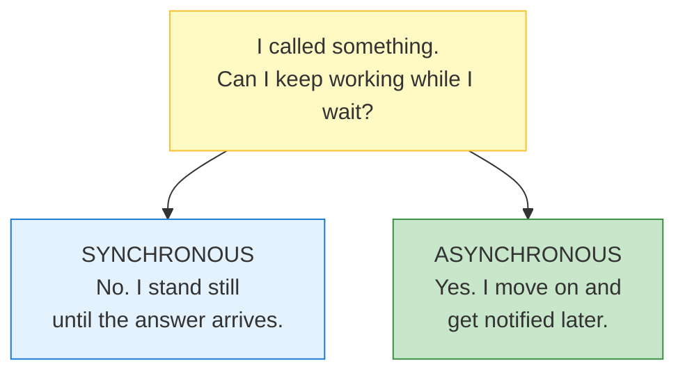

| | Meaning |
|---|---|
| **Synchronous** | You make a call and are *stuck* until it finishes. Nothing else in your program runs. |
| **Asynchronous** | You make a call, *continue*, and the result comes to you later. |

That's the entire distinction. The rest of this lecture is the **consequences** of each choice.

---

### Where the Word Comes From

The etymology clarifies things more than the definition does:

- **Synchronous** — Greek *syn* ("same") + *chronos* ("time") → **same time, in lockstep**
- **Asynchronous** — *a* ("not") + synchronous → **not in lockstep**

**The image:** two sine waves. Synchronous = **same phase**, rising and falling together. Asynchronous = **out of phase**, each doing its own thing.

"In sync" means **both sides advance together at the same pace** — requester and responder move as a single unit.

---

### The Counter-Intuitive Part

| Domain | Goal | Why |
|---|---|---|
| **Motors / electricity** | Keep phases matched **at all costs** | Out-of-phase motors wreck each other — vibration, tearing, failure |
| **Software** | Let each side work **independently** | The user shouldn't be locked to the server's rhythm |

**In machinery, synchronisation is what you fight for. In software, we actively want asynchrony.**

The reason: **in software, the client almost always has independent work to do.** Locking it to the server's pace throws that work away for nothing.

---

### The Insight That Unlocks the Lecture

There are **two separate facts** that people blend into one:

| | Fact | Whose decision is it? |
|---|---|---|
| **1** | The operation happened and took 5ms | **Nobody's.** It's a fact. |
| **2** | Your program stood still for those 5ms | **Yours.** You chose it. |

> **"Synchronous" and "asynchronous" are not properties of the operation. They are properties of *the caller's choice*.**

The disk read is a disk read. Nobody's opinion is involved. What varies is **what the caller does while it happens.**

---

### Analogy: The Restaurant Phone Call

You call a restaurant to place a large order.

**Version A — you stand there**
You call, place the order, then stay on the line saying nothing for 20 minutes while they cook. You can't cook dinner. You can't read. You just exist, holding a phone, waiting. Then: "Great, thanks."

**Version B — you get on with your life**
You call, place the order, and ask: *"Can I hang up and will someone message me when it's ready?"* They say yes. You hang up. You cook, clean, read. Twenty minutes later: *ping* — your food is downstairs.

#### What stayed identical

| | Version A | Version B |
|---|---|---|
| The restaurant | Same | Same |
| The order | Same | Same |
| Cooking time (20 min) | Same | Same |
| The food | Same | Same |
| **What YOU did for 20 min** | **Stood still** | **Lived your life** |

Nothing about the restaurant changed. **The only thing that changed is what you did while waiting.**

Therefore:
- ❌ *"Is the restaurant synchronous?"* — meaningless question
- ✅ *"Is my phone call synchronous?"* — meaningful question

> **"Synchronous" describes a *relationship* between an operation and the thing waiting on it — not a property of the operation itself.**

---

### The Same Thing in Code

```javascript
// ── Program A ──
const result = fetchBlocking(url);
console.log("A did other things");   // ← runs AFTER the 200ms

// ── Program B ──
fetchNonBlocking(url, () => { /* handle result */ });
console.log("B did other things");   // ← runs IMMEDIATELY, before the 200ms
```

**The request is byte-for-byte identical.** Same URL, same 200ms, same server doing the same work. The only difference is Program B's *relationship* to it.

So when someone says **"HTTP is asynchronous"** — that's sloppy phrasing. What's actually true is:

> **An asynchronous HTTP client does not block while waiting. A synchronous HTTP client does.**

HTTP itself never changed. The client's behaviour did.

*Compare: saying "gravity is asynchronous for people who jump."* Nonsense — gravity is constant. What varies is how a given person interacts with it.

---

### The Precision Rule: "Async *With Respect To* What?"

**Asynchronous is always relative to a specific pair** — *the operation* and *one particular participant*.

Look at a single disk read and ask what's happening for **each** participant:

| # | Participant | During those 5ms | Experience |
|---|---|---|---|
| 1 | Your program | Ran other code | **Async** |
| 2 | The kernel | Sat waiting for the disk | **Sync** |
| 3 | The disk controller | Reading bytes | Working |
| 4 | The SSD itself | Fetching cells | Working |
| 5 | The database (if any) | Waiting for the result | **Sync** |
| 6 | The caller of *your* API | Waiting on the HTTP response | **Sync** |

Six participants. **Different experiences of one event.**

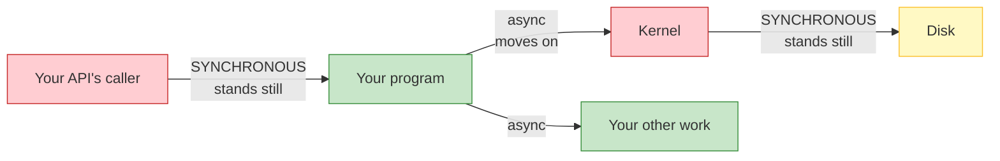

Green = moving on. Red = frozen. **One event, both.**

### Getting the wording right

| Saying this | Meaning | Correct? |
|---|---|---|
| "The disk read is asynchronous" | The read itself is async | ❌ Incomplete — ambiguous |
| "The disk read is **synchronous for the kernel**" | The kernel waited | ✅ Precise |
| "It was **asynchronous for our program**" | Our program moved on | ✅ Precise |

The operation itself has **no label**. It's a neutral event. Each participant *experiences* it differently, and we describe the **relationship** — never the thing.

> **Rule: when someone says "this is async," always ask "async with respect to *whom*?" If the answer isn't given, the statement is incomplete.**

---

### Corollary 1 — Async ≠ Parallel

Two *different* properties that are constantly confused:

| | Question it answers | Type |
|---|---|---|
| **Async** | *Do I wait, or do I move on?* | **Timing** |
| **Parallel** | *How many things run at the same instant?* | **Concurrency** |

**The alarm clock:**
- **Synchronous:** you lie in bed awake, staring at the ceiling, 11pm → 7am. Seven hours of doing nothing.
- **Asynchronous:** you set the alarm and go to sleep. Seven hours pass. It rings.

Did you run **in parallel with the alarm**? Obviously not — there's one of you and one alarm. What changed is that you **went to sleep** instead of standing there watching it.

> **Async = "I didn't stand there." Parallel = "there was more than one of me."**

Unit 4 proves this for real: Node.js runs its entire async model on **one single thread**. Genuinely non-blocking. Zero parallelism. Both true at once.

---

### Corollary 2 — Async ≠ Faster

**Total work is identical.** Nothing got quicker. The operation still took 5ms. What changed is that **you stopped wasting your own 5ms standing still.**

| | Sync | Async |
|---|---|---|
| Cooking time | 20 min | 20 min |
| **Your time wasted** | **20 min** | **0 min** |

The kitchen didn't get faster. **Your utilisation of your own life got better.**

### The consequence that surprises people

If you have **nothing else to do**, async gives you almost nothing:

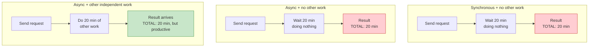

**All three totals are 20 minutes.** Async never shortened the operation. It only bought back *your* time — and only if you had something to spend it on.

> **This is why "make everything async" is a trap.** Async pays off only when you have **independent work** to do while waiting. Otherwise it's added complexity for zero gain.

---

### The Framing That Makes the Whole Lecture Obvious

> **You never "make something asynchronous." You change *your own* behaviour from waiting to not-waiting. Everyone else's experience is unchanged.**

Everything after this follows from it:

| Question | Answered by |
|---|---|
| Why does my UI freeze on slow network calls? | You're synchronously waiting — *you* are the red box |
| Why doesn't my server crash under load? | It hands work off and moves on |
| Why is a fast API that blocks the event loop so damaging? | Every caller becomes a red box |
| Why does making *my* code async not speed up *my* callers? | They still stand there waiting → **Unit 7** |

---

## Checkpoint

1. A program calls a 500ms function and executes other lines during those 500ms. Synchronous or asynchronous? **Now: which entity in that scenario is still waiting?**
2. Your program writes to an SSD (5ms). Is the SSD "asynchronous"?
3. In one sentence each — why do we *want* synchrony in motors but *want* asynchrony in software?
4. Async vs. parallel: a single-threaded event loop doing "non-blocking I/O" — is it parallel?
5. Async vs. faster: you `await` a 3-second API call and have nothing else to do. How much time did async save?

---

## Unit 2 — What "Blocked" Actually Means

Unit 1 said sync/async is about **whether you wait**. Now let's see what waiting *actually is* at the machine level — because it is not what most people picture.

### 2.1 — What Blocking Feels Like

Hussein's memory is the perfect illustration. Early VB5 (late 90s), single-threaded:

```javascript
// In a VB5-style app
function OnButtonClick() {
    processEnormousFile();     // takes 20 seconds
}

button.onClick = OnButtonClick;
```

While `processEnormousFile()` runs:

| You do this | What happens |
|---|---|
| Click the button again | **Nothing.** The button won't even light up. |
| Drag the window | **Frozen.** |
| Type into a text field | **Ignored.** |
| Anything at all | **Ignored.** |

Not "slow." Not "laggy." **Completely unresponsive.** The program is one thread, and that thread is standing still waiting. There is nothing else in the program capable of noticing your click.

> **Blocking doesn't mean "slow." It means "the part of the program that could respond to you is unable to run."**

That distinction matters enormously. Unit 4 shows how async fixes this without the thread ever having to *not* be waiting.

### 2.2 — What the CPU Actually Does

Here is the part that reframes everything. You might assume: *"the program is waiting, so the CPU sits idle."*

**That is not what happens.** The CPU does this:

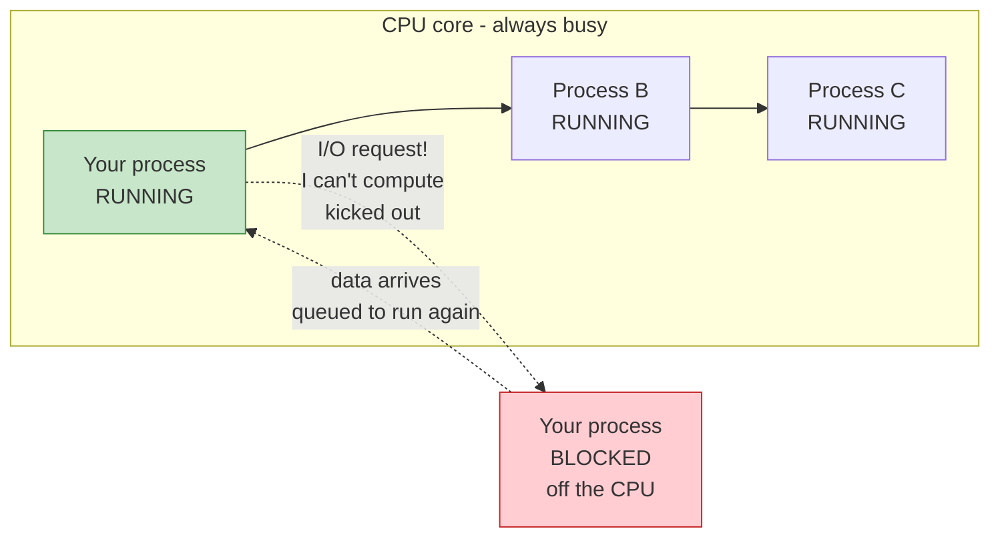

The moment your code does I/O, your process **stops executing instructions**. There are no instructions left to run — you are waiting on data.

So the kernel does something almost counterintuitive:

> **"You're blocked. You're not computing anything. Get off the core — I'll put someone else on."**

Your process is **removed from the CPU**, and another process runs in its place. Your instructions, your register values, your position in the code — saved somewhere, so they can be restored later.

**This is the same trick as push (Lecture 8) applied to the CPU itself:** the kernel is now *pushing work onto* the CPU rather than letting it idle.

### 2.3 — The Three Steps of a Context Switch

Whenever your process goes off the core and later comes back, the kernel performs a **context switch**:

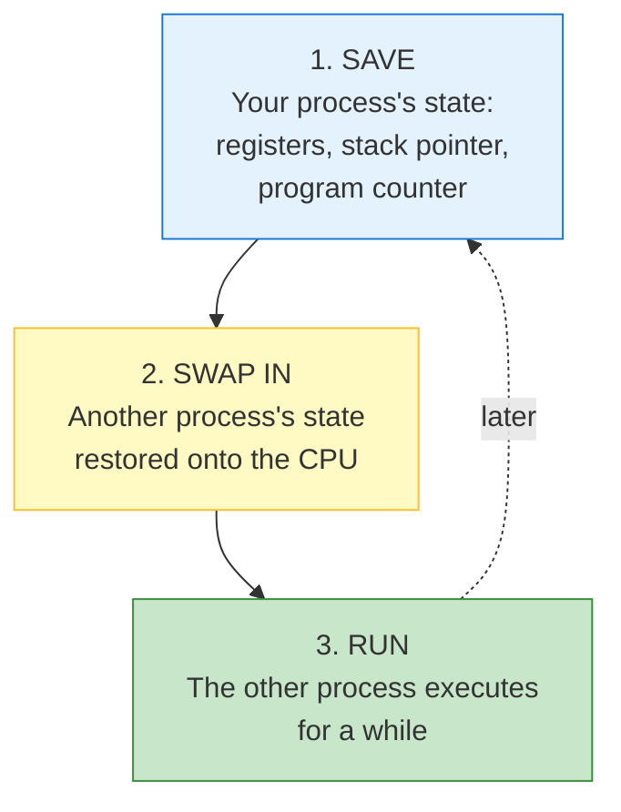

**Why it takes three steps:** your process is a *continuation*. It paused mid-function, with live values in registers. To bring it back, the kernel must restore that exact state — otherwise your program would resume with corrupted variables.

> **A context switch is literally "stop one story mid-sentence, bookmark the page, start another story, then come back later."**

### 2.4 — The Cost

Saving and restoring state is **not free**. The kernel must:

- Save ~a dozen CPU registers
- Save/restore the stack pointer
- Invalidate/rebuild CPU caches (the new process has different data)
- Update page tables in some cases
- Run scheduler bookkeeping

**Order of magnitude: microseconds.** One context switch might be 1–10 µs.

Sounds negligible. It isn't — because:

| Operation | Time |
|---|---|
| One context switch | ~1–10 **microseconds** |
| One disk read | ~1,000,000–10,000,000 **microseconds** (1–10 ms) |
| One network round trip to another continent | ~100,000,000 **microseconds** (100 ms) |

> **The context switch cost is tiny relative to the I/O — but it happens on *every* switch, in *every* thread, across the whole system, constantly.**

Hussein's phrasing: *"It's microseconds, but I do it a lot. It adds up."*

And it compounds in one direction that matters: **more threads → more switching → more overhead.** Which is why you don't spawn 10,000 threads for 10,000 clients (that's the wall Lecture 14 — Multiplexing — walks straight into).

### 2.5 — The Complete Waste

Now the payoff promised in Unit 1. Here is that participant table — **the same six participants, during a blocking disk read**:

| # | Participant | During those 5ms | Experience |
|---|---|---|---|
| 1 | Your program | **Standing still** | 🔴 Blocked |
| 2 | The kernel | **Standing still**, waiting on the device | 🔴 Blocked |
| 3 | The disk controller | Reading bytes | 🟢 Working |
| 4 | The SSD | Fetching cells | 🟢 Working |
| 5 | Your API's caller | Waiting on the HTTP response | 🔴 Blocked |

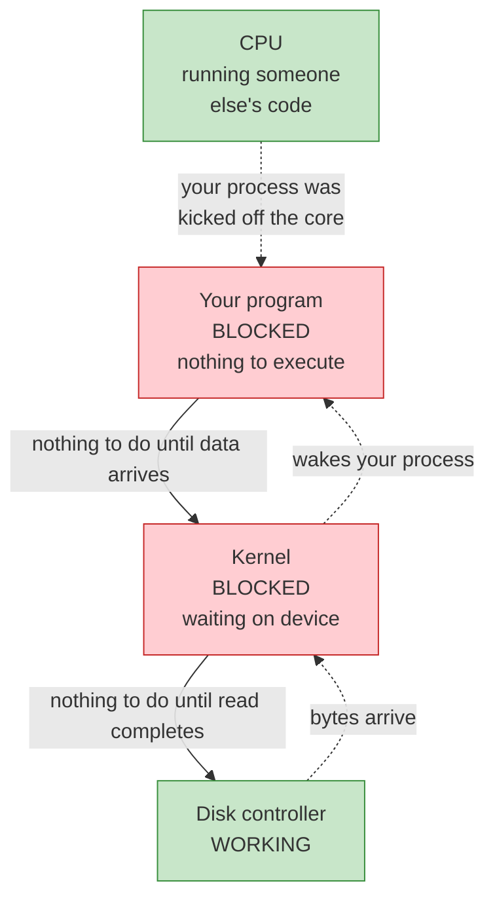

Now look at what Hussein called out:

> *"Neither the kernel is doing any work nor the application is doing any work here. The device is doing all of it."*

And his complaint — worth reading as if you were the process:

> *"Why do you block me here? Why did you take me off the CPU? **I'm just waiting.**"*

**Two participants frozen, doing nothing, while two do all the work.** Your program isn't slow because it's doing difficult work. It's slow because it's *idle*.

> **Blocking doesn't mean "slow." It means "not working." And the CPU capacity you're not using isn't wasted globally — it's just not available *to you*.**

### 2.6 — The Important Nuance

There is a trap in the previous section worth catching, because people get it wrong in the opposite direction.

**"Blocking" does not mean "the CPU is idle."**

The CPU stayed busy the whole time — running *other processes*. That is the whole point of preemptive multitasking: **aggregate CPU utilisation is kept high.**

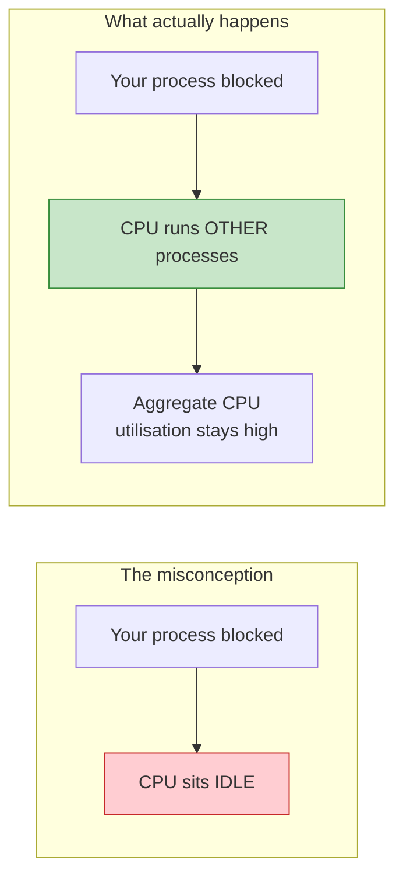

**This is why blocking is normally fine** — and why it is not the problem people think it is:

| Situation | Is blocking bad? |
|---|---|
| One process waits on disk while 500 others run | **Totally fine.** The CPU is busy. That is the design working. |
| Your thread waits, and it was the *only* thing to do | **Bad.** Your latency is pure idle time. |

The CPU being efficient and *your program* being slow are **two different facts**. Only the second one is your problem.

### 2.7 — `DoEvents`: The Hack That Reveals the Problem

Hussein's first language was VB5, and VB5 shipped a function called `DoEvents` for exactly this.

```javascript
function processEnormousFile() {
    step1();
    DoEvents();   // "if the user clicked anything, handle it now"
    step2();
    DoEvents();
    step3();
}
```

`DoEvents` pumps the message queue — it lets the single thread **briefly stop waiting and handle UI events** mid-operation.

**The honest truth: it worked, and it was a lie.**

| It did | It didn't |
|---|---|
| Made the UI responsive | Make the operation itself faster |
| — | Make the code simpler |
| — | Remove the underlying problem |
| — | Scale to more than one user |

And it introduced a classic bug: the user could click "Delete" *in the middle of* a save operation. `DoEvents` invites re-entrancy into code not designed for it.

> **`DoEvents` is the historical shape of every async solution: break the wait, handle other work, come back. Modern async does the same thing — but *structurally*, not by sprinkling hand-placed calls through your code.**

That is the bridge to Unit 3: the modern answer is not "remember to sprinkle something" — it is "the *system* handles the waiting for you."

### Checkpoint

1. You assume a blocked process means an idle CPU. Correct or incorrect, and what actually happens?
2. What are the *three* steps of a context switch, and why does restoring require all of them?
3. A context switch is ~5µs; a disk read is ~5ms. If the switch is 10,000× cheaper than the read, why does the cost matter at all?
4. During a blocking read, how many of the six participants from Unit 1 are doing useful work? Name them.
5. Your process is blocked, but the CPU shows 90% utilisation. Is that a contradiction? Explain.
6. What did `DoEvents` actually fix, and what did it hide?

---

## Unit 3 — How Async Learns About Completion

Unit 2 ended with the waste: your program frozen, the kernel frozen, the device working. Async fixes that by **not waiting**. But that immediately creates a new problem — and this unit is about solving it.

### 3.1 — The Problem Async Creates

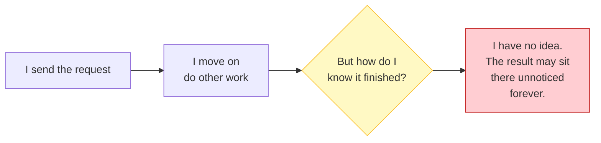

Synchronous code didn't have this problem — you were standing right there when the answer arrived.

Async code walks away. So something must **tell it** when to come back. And there are exactly **two philosophies** for how that notification works.

Both are non-blocking. Both are async. They differ in **who does the work**.

---

### 3.2 — Design A: Readiness ("Is it ready?")

**The idea:** you ask the OS *"is this thing ready yet?"* over and over. When it says yes, **you** perform the operation.

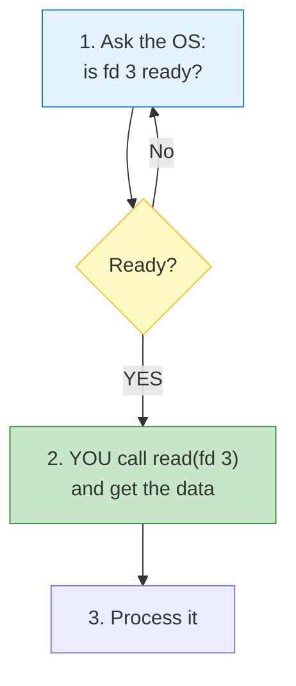

**The OS's role is small:** it is a *notifier*. It says "go ahead," then gets out of the way.

### The progression

| API | Era | Limit |
|---|---|---|
| `poll` | Ancient | You pass the **whole list** of fds on every call |
| `select` | Ancient | Hard cap (1024 fds) and **mutates your fd_set** |
| `epoll` | Linux, modern | You **register once**, then ask "anything ready among all of them?" |

`epoll` is the important one. You hand the kernel your fd list **once** at setup:

```c
epoll_ctl(epfd, EPOLL_CTL_ADD, fd, &event);   // once, at startup

while (running) {
    n = epoll_wait(epfd, events, MAX, -1);    // blocks until ANY is ready
    for (i = 0; i < n; i++) {
        if (events[i].data.fd == listen_fd)   accept_new_client();
        else                                  handle_read(events[i].data.fd);
    }
}
```

**One `epoll_wait` serves thousands of connections.** That is the whole scalability trick — and it only works because you registered once. (See the fd clarification below for what `fd` actually is.)

### The crucial subtlety: "ready" ≠ "data is there"

Readiness strictly means:

> **"An operation on this fd will not block."**

Not "you'll get everything you asked for." Three consequences that bite in production:

**a) One readiness event may not satisfy your read**
```c
epoll_wait(...) → fd 3 is readable
read(fd3, buf, 1024);   // returns only 40 bytes!
```
A socket delivers whatever has arrived. 40 bytes ≠ 1024 requested. You must loop until you have enough — or until the connection would block again.

**b) Readiness is about *conditions*, not data**
One fd can be readable *and* writable. A socket is nearly always writable (send buffer has space). Programs often care about only one direction.

**c) Level-triggered vs edge-triggered** — a real production footgun:

| Mode | Fires | Danger |
|---|---|---|
| **Level-triggered** (default) | Every call, *while* ready | Safe, slightly more syscalls |
| **Edge-triggered** | Only on the *transition* to ready | If you don't read everything, **you'll never be told again** |

**And the catch that connects directly to Unit 4:**

> **`epoll` cannot watch a regular file on disk.**

A disk file has no meaningful "ready" transition — it's either already in the page cache (always ready) or it isn't (and epoll has no way to learn about it). Readiness notification is a **socket** concept. Disks don't work that way.

This is precisely why Node.js reads files using a **thread pool**. Full explanation in the fd clarification below and Unit 4.

---

### 3.3 — Design B: Completion ("It's done, here's the result")

**The idea:** you hand the OS the work *and* the notification in one go. The kernel **performs the operation itself**, then posts a completion record to a queue you drain later.

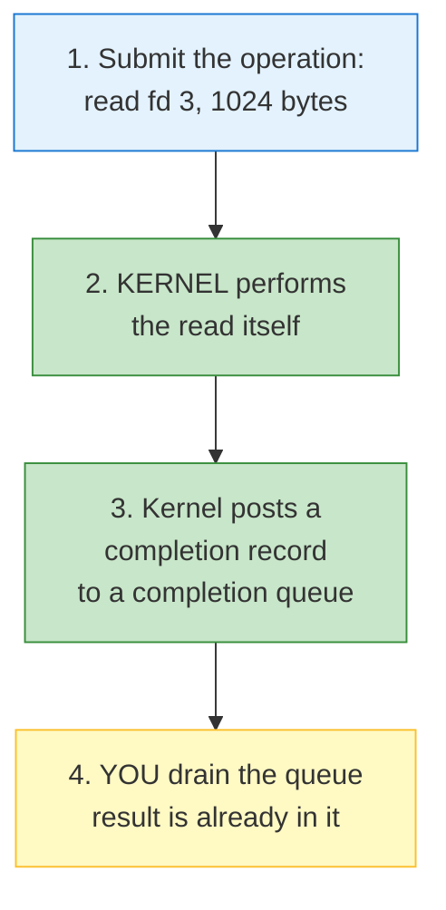

**The OS's role is large:** it is not a notifier, it's a **worker**. By the time you hear about it, the work is already done.

### The APIs

| API | Platform | Note |
|---|---|---|
| **IOCP** — I/O Completion Ports | Windows | The classic; drives Node.js on Windows |
| **`io_uring`** | Linux | Modern, faster, the successor to `epoll` |

```c
// io_uring — you never call read() yourself
io_uring_get_sqe(&ring);
io_uring_prep_read(sqe, fd3, buf, 1024, 0);
io_uring_submit(&ring);                    // hand it to the kernel

n = io_uring_peek_cqe(&ring, &cqe);        // drain completions
// cqe already contains fd, result byte-count, and the buffer contents
```

---

### 3.4 — The Precise Difference

This is the table that makes the whole unit click:

| | **Readiness** (`epoll`) | **Completion** (`io_uring`, IOCP) |
|---|---|---|
| **The OS says** | *"You may proceed."* | *"It's done. Here's the result."* |
| **Who performs the read?** | **You** | **The kernel** |
| **Steps** | **Two**: wait for ready → perform | **One**: submit → reap |
| **Your process is** | A **worker** | A **reaper** |
| **The kernel is** | A cheap **notifier** | An expensive **worker** |
| **Work happens** | In your process | In the kernel |
| **Multi-queue scaling** | One queue, must loop | **Can have multiple queues<br/>across multiple threads** |
| **Best for** | Sockets, pipes, anything with a ready-transition | Very high-concurrency I/O, files included |

### The one-line version

> **Readiness says "go." Completion says "done."**

In readiness, the moment of notification and the moment of work are **two separate events**. In completion, they are **the same event** — that is why it is one step instead of two.

---

### 3.5 — The Participant Reframe

Recall Unit 1's framing — different participants experience the same operation differently. Here is how it shifts between the two designs:

| Participant | Readiness design | Completion design |
|---|---|---|
| **Your program** | 🔵 Does the actual read work | 🟢 Just collects finished results |
| **The kernel** | 🟢 Cheap — just reports state | 🔴 Expensive — performs all the I/O |
| **Cost sits on** | Your process's CPU | The kernel's queues |

**That is the real trade.** Readiness keeps work in your process (cheap kernel, more work for you). Completion pushes work into the kernel (simpler code, heavier kernel).

And it explains a practical difference:

> **Completion scales across cores better**, because you can have several completion queues, each drained by a different thread. Readiness tends to have one dispatcher thread doing the reads.

---

### 3.6 — Node.js Uses Both

Node.js isn't opinionated — it **picks per platform**.

| Platform | Mechanism |
|---|---|
| **Linux** | `epoll` → readiness |
| **Windows** | IOCP → completion |
| **macOS / BSD** | `kqueue` / `evpoll` → readiness |

> **So the "async I/O" you write in Node.js is actually two different designs underneath, chosen automatically for you.**

### Checkpoint

1. State the problem async creates that synchronous code never had to solve.
2. In readiness, who performs the read — you or the kernel?
3. Readiness means "an operation won't block." What does that **not** guarantee about how much data you'll receive?
4. Why does `epoll` fail when you point it at a regular file on disk?
5. Your program uses readiness and does heavy processing per event. Your program uses completion and just hands results out. Which is heavier on the kernel?
6. Readiness is two steps, completion is one. What is the reason for that difference?
7. Which design lets you scale better across multiple cores, and why?

---

## Clarification — What Is a File Descriptor (fd)?

Unit 3 uses `fd` constantly, so it needs its own explanation. This is not a side note — **it is the mechanism Unit 3 is built on.**

### The Definition

**A file descriptor is just an integer that indexes a table inside your process.** The table maps integers to "things that are open."

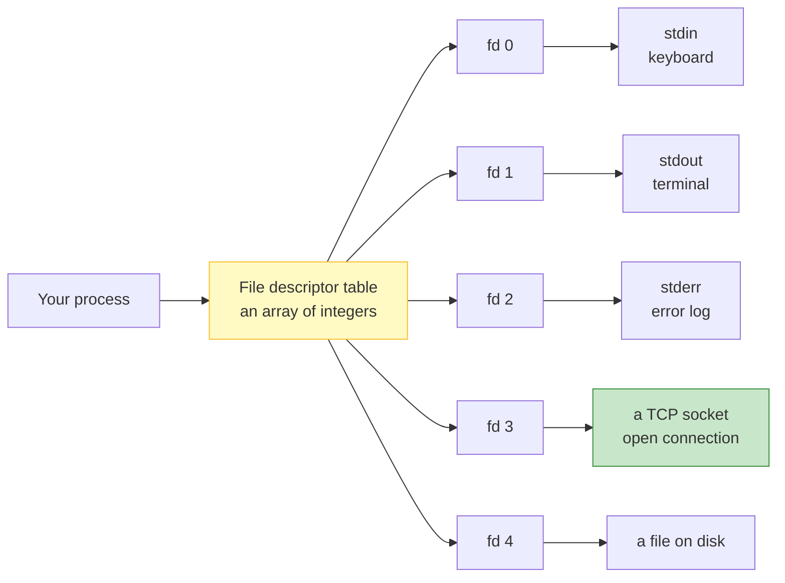

The integer itself carries **no meaning**. `fd 3` isn't special. If your process closes fd 3 and opens a pipe, **fd 3 now refers to the pipe.** The number is just a slot in the array.

### The Ones You Already Use

| fd | Name | Points at |
|---|---|---|
| **0** | `stdin` | Input — your keyboard |
| **1** | `stdout` | Normal output — your terminal |
| **2** | `stderr` | Errors — also your terminal |

That is why `echo hi 1>&2` redirects "normal output" to "errors" — you're telling the shell to make **fd 1 point at stderr's destination.**

### The Unix Philosophy That Makes This Relevant

Unix's core design idea:

> **"Everything is a file."**

Not a metaphor — a literal design decision. The kernel gives **all** of these the same interface (`read` / `write` / `close`) and the same kind of integer handle:

| Real thing | Is it a file? | Gets an fd? |
|---|---|---|
| A file on disk | Obviously | ✅ |
| A **TCP socket** | Yes | ✅ |
| A **pipe** (shell `\|`) | Yes | ✅ |
| stdin / stdout | Yes | ✅ |
| `/dev/urandom` | Yes | ✅ |

**So a network connection gets a file descriptor**, exactly like a file does. This is the entire reason `epoll` can watch a socket at all — sockets and files share one mechanism.

### Why This Matters for Unit 3

Now the lecture's phrasing makes sense:

```c
n = epoll_wait(epfd, events, MAX, -1);
// → "fd 3 is ready to read"
```

`epoll` is watching a **set of integers**. That is literally all it is. It returns which slots in your table have something to do.

And when your server accepts a connection:

```c
int client_fd = accept(listen_fd, ...);   // returns a NEW integer, e.g. 7
// fd 7 now points at the new client's socket
```

Every connection gets its own fd — which is how you keep track of who's who. That is the practical role of an fd in a backend.

### The Case That Doesn't Work

This resolves Unit 3's central puzzle:

| Resource | fd exists? | Readiness transition? | `epoll` works? |
|---|---|---|---|
| TCP socket | ✅ | ✅ data arrives → becomes readable | ✅ |
| Pipe | ✅ | ✅ writer writes → becomes readable | ✅ |
| **Regular file on disk** | ✅ | ❌ — always "ready" | ❌ |

A file on disk is **always ready** — there is no state *transition* for `epoll` to observe. There is nothing to notify you about, because "readiness" is decided the instant you call.

> **This is why Node.js reads files with a thread pool instead of `epoll`.** The OS's async mechanism fundamentally cannot express "wait for this disk read," so Node.js delegates it to a real thread that really does block.

### Don't Confuse It With the 4-Tuple

From Lecture 8 you have the **4-tuple**. It is a different concept:

| | What it is | Answers |
|---|---|---|
| **fd** | An integer handle **inside your process** | "Which of *my* open things do I mean?" |
| **4-tuple** (src IP, src port, dst IP, dst port) | Network-layer identity | "Which *connection* on the internet is this?" |

They are related: **one TCP connection ↔ one fd on each side.** But the fd is a *local handle*; the 4-tuple is the *global address*.

### See It Yourself

```bash
# Watch a process's open fds
ls -l /proc/<pid>/fd

# Which process is using port 443?
ls -l /proc/*/fd 2>/dev/null | grep socket
```

The fd number for stdin/stdout in a shell: `ls -l /proc/self/fd`.

> **The one line to remember: a file descriptor is an integer handle into your process's table of open things — and because Unix treats sockets as files, a network connection gets one too.**

---

## Vocabulary

| Term | Meaning |
|---|---|
| **Synchronous** | The caller waits and does nothing until the operation completes |
| **Asynchronous** | The caller continues immediately and handles the result later |
| **Blocking** | The caller's execution is suspended until the operation finishes |
| **Non-blocking** | The caller is free to continue while the operation proceeds |
| **Lockstep / in sync** | Both sides advance together at the same pace (same phase) |
| **Out of phase** | Each side advances independently — the basis of async |
| **Parallelism** | Multiple things executing at the same instant |
| **Concurrency** | Structuring a program as independently progressing tasks |
| **Throughput** | Amount of work completed per unit time |
| **Latency** | Time for one operation to complete |
| **Utilisation** | How much of your available time is spent doing useful work |
| **Independent work** | Work that does not depend on the pending result — the prerequisite for async paying off |
| **Context switch** | Saving one process's CPU state and restoring another's |
| **Preemptive multitasking** | The OS switching the CPU between processes automatically |
| **Re-entrancy** | Re-entering a function while it is still executing (the `DoEvents` hazard) |
| **CPU utilisation** | How busy the CPU is *in aggregate* — not the same as your process running |
| **Message pump / event queue** | The queue `DoEvents` drains to handle pending UI events |
| **Idle time** | Time spent waiting rather than computing — the real cost of blocking |
| **File descriptor (fd)** | An integer handle indexing your process's table of open things |
| **Readiness notification** | The OS tells you an operation won't block; you then perform it |
| **Completion notification** | The OS performs the operation and tells you it's done |
| **`poll`** | Ancient readiness API — passes the whole fd list every call |
| **`select`** | Ancient readiness API — 1024 fd cap, mutates your fd_set |
| **`epoll`** | Linux readiness API — register fds once, then query all of them |
| **`kqueue`** | BSD/macOS readiness API, the `epoll` equivalent |
| **IOCP** | Windows I/O Completion Ports — completion model |
| **`io_uring`** | Linux completion API — the modern successor to `epoll` |
| **Level-triggered** | Readiness fires every call *while* ready (safe default) |
| **Edge-triggered** | Readiness fires only on the *transition* to ready — must read fully |
| **Completion queue** | The queue the kernel posts finished-operation records to |
| **Thread pool** | Pre-spawned workers that perform operations the event loop cannot |

---

*Units 1–3 of 10 documented, plus the file-descriptor clarification. Documented from our shared discussion.*