# Lecture 10: Polling — Built Up, Unit by Unit

## Status: Complete ✅ (Units 1–7 studied)

> ### 📋 Read this before continuing
>
> | Units | State | What that means |
> |---|---|---|
> | **1–7** | ✅ **Studied** | Worked through together. Concepts questioned and confirmed. |
>
> **Units 1–3 are the mechanism; Units 4–5 are the verdict.** The first three explain what polling *is*. The next two weigh it. Read both halves — a pattern understood but not evaluated is useless, and a pattern evaluated without its mechanism is unfair.
>
> **Every claim in this lecture was tested rather than accepted.** Three corrected, four gaps the transcript never mentioned were found. See *Unit 7.8*.
>
> **Unit 7.4 made a prediction about long polling — relocated cost, not removed cost. [Lecture 11](lecture-11-long-polling.md) tests it.**

> **How to read this doc:** Each unit builds on the previous. Each unit ends with a **Checkpoint** — answer it in your own words before moving on.

---

## Lecture Map

| Unit | Content | State |
|---|---|---|
| **1** | **The problem polling solves** — long work, and you need a handle back | ✅ Studied |
| **2** | **The mechanism** — three lifetimes, and every poll is itself a Request/Response | ✅ Studied |
| **3** | **Why "short"** — and the delivery-vs-state distinction | ✅ Studied |
| **4** | **The upside** — simplicity, compatibility, safe resume, zero idle cost | ✅ Studied |
| **5** | **The bill** — the scaling math, and why 98% is waste | ✅ Studied |
| **6** | **The demo** — six bugs hiding in 25 lines of "elegant" code | ✅ Studied |
| **7** | **Recap** — the Kafka answer, the ladder, and what we corrected | ✅ Studied |

**Why the order matters:** Units 4 and 5 are a matched pair — you cannot weigh a pattern before you understand it, and you cannot judge it fairly before you've said what's good about it. Unit 5's cost argument is unintelligible without Unit 2's exact description of what each poll costs.

### Claims flagged for testing

Hussein's transcript makes three claims that this study pressure-tests rather than accepts:

| # | Claim | Why it needs testing | Status |
|---|---|---|---|
| 1 | "Client saves the job ID to disk, disconnects, another client picks it up" | His demo keeps jobs in a **Node.js dictionary in memory** — neither durable nor shared across servers | ⏳ Unit 6 |
| 2 | "Long polling — the better approach **used by Kafka**" | Kafka consumers *do* long-poll the broker, but Kafka's delivery model is log-based pub/sub | ⏳ Unit 7 |
| 3 | "It's a very elegant idea" | Elegant in the single-server case. What survives at 10,000 users? | ⏳ Unit 5 |

### And one the transcript never raises

| # | Gap | Why it matters |
|---|---|---|
| 4 | How long does a finished result stay readable? | Polling replaces "your result may never arrive" with "your result may expire." That's a policy decision the transcript skips entirely — covered in **Unit 3.4** |

---

## Unit 1 — The Problem Polling Solves

### 1.1 — The Shape of the Bad Situation

Start from [Lecture 7](lecture-07-request-response.md). Vanilla Request/Response, one request, one response:

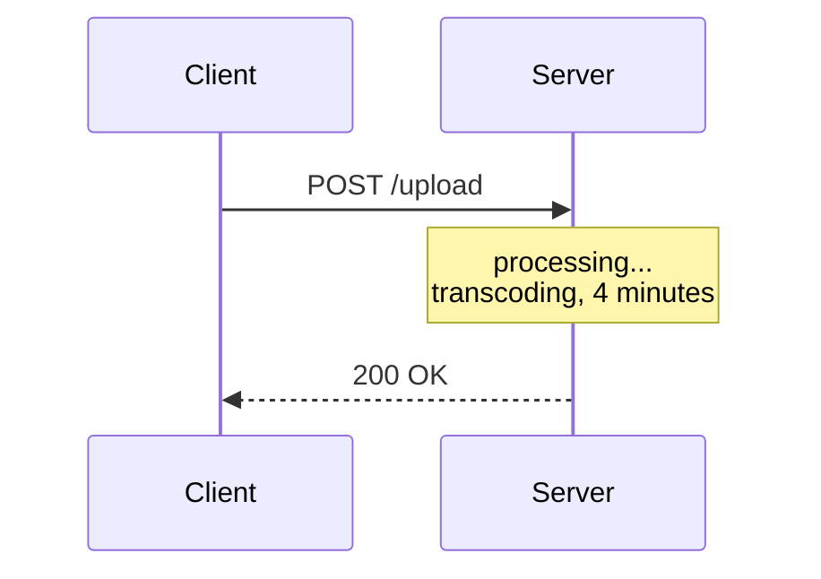

**The client's connection is pinned for the entire duration.** It cannot do anything else. It cannot close the tab. If it does, the response goes nowhere.

### 1.2 — The Concrete Case: Video Upload

Hussein's example — you upload to YouTube.

| Step | Reality |
|---|---|
| 0:00 | You hit upload |
| 0:01 | **You get an upload ID immediately** |
| 0:01–4:00 | Progress bar advances |
| 4:00 | Done |

You are **not** holding one connection open for four minutes. You get a receipt in the first second, then you watch a progress bar.

> **That's polling's entire reason for existing: work that outlives a single request/response exchange.**

### 1.3 — Why Request/Response Can't Do This

Three reasons, and they're structural — not fixable by "just making the server faster":

**1. Duration is unbounded.** The server has no idea in advance whether this request takes 200ms or 40 minutes. One connection can't be held open for an unknown amount of time without risking timeouts, load balancer limits, and deploys that kill in-flight work.

**2. The client is stuck.** A thread, a socket, a browser tab — all occupied doing nothing but waiting.

**3. Failure destroys the work.** Client disconnects at 90%? With vanilla request/response:

> *"The server is not going to keep the response around… we just lost a beautiful response."*

The processing happened. The result existed. Nobody can ever have it.

### 1.4 — Polling's Answer

Change *what the first response contains*. Instead of the result, return a **handle**:

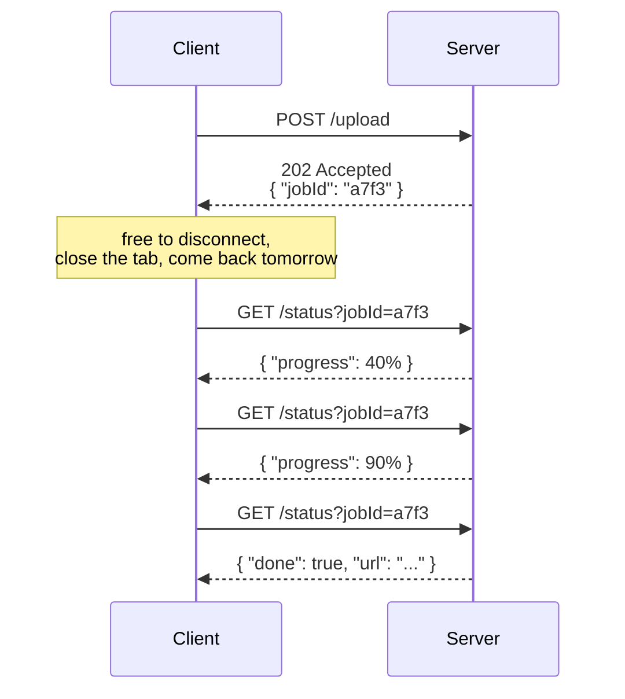

**Notice what moved.** The *waiting* left the request. The client now holds a string, and the string is durable — it survives a refresh, a crash, a redeploy.

This is [Lecture 9](lecture-09-sync-vs-async.md) Unit 7's queue + job ID pattern, seen from the **client's side**: the job ID *was* the handle. This lecture is about how the client cashes it in.

### 1.5 — The Naming, Decoded

Hussein says people saying "polling" almost always mean **short polling**. So:

| Term | Meaning |
|---|---|
| **Polling** | Broad family: *the client repeatedly checks* |
| **Short polling** | Each check returns **immediately**, result or not |

> **"Short" describes how long the server holds each poll — not the whole job.**

A 4-minute job checked every 5 seconds is short polling: each individual exchange is milliseconds long.

---

## Unit 2 — The Mechanism: Three Lifetimes

### 2.1 — The Single Move

Everything in Unit 1 comes down to one change to the first response:

| | Before | After |
|---|---|---|
| **POST /upload returns** | The finished video | `202 Accepted` + a job ID |

That's it. The client trades *waiting for a result* for *holding a reference*.

And a reference is fundamentally different from the thing it points at:

> **A handle is O(1) regardless of the result's size.** 8 characters of job ID whether the job returns a 1 KB JSON object or a 2 GB video.

This is why the pattern scales at all — the client never carries the work.

### 2.2 — Three Things With Three Different Lifetimes

This is the part people miss. Polling isn't two steps. It's **three**, and they don't share a lifetime:

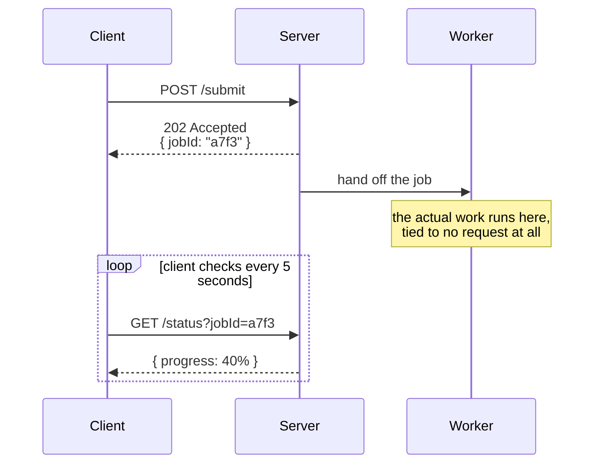

| | What | Lifetime | Visible to client? |
|---|---|---|---|
| **1. The acceptance** | `POST /submit` → job ID | Milliseconds | ✅ Yes |
| **2. The work** | The actual processing | Minutes to hours | ❌ **No** |
| **3. The observation** | Repeated `GET /status` | Milliseconds each | ✅ Yes |

> **The work lives in the middle — and the client cannot see it, cannot hold it, and does not control it.**

That middle section is the whole architectural point. It's the *same* middle section as [Lecture 9](lecture-09-sync-vs-async.md) Unit 7's queue — seen from the server's side there, the client's side here. Same mechanism, two viewpoints.

### 2.3 — Every Poll Is Itself a Request/Response

Hussein says this almost in passing, and it's the conceptual unlock:

> *"Technically, it is request response when you look at the polling from a very narrow angle… multiple short requests as request response. As Paul's right, we broke down, instead of one big request-to-response into multiple requests response which are presented to us as polls."*

**Polling invented no new protocol.** It reused the existing one, N times.

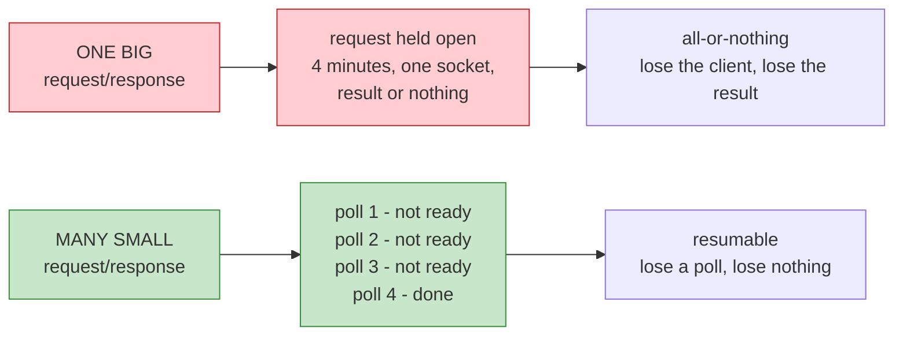

Three consequences worth stating plainly:

**1. Nothing new to build.** No new framing, no new connection handling, no new failure mode. If you have HTTP, you have polling. That's why it survived from 1995 to now.

**2. The failure granularity changed.** In the one-big design, losing the connection loses everything. In the many-small design, losing a poll loses *one poll* — the next one carries on. **This is the resilience argument, and it's the strongest case for the pattern.**

**3. The cost moved.** You traded one long-held connection for many short ones. That's the bill Unit 5 comes due on.

### 2.4 — The Misconception Worth Killing Now

**Polling does not drive the work. It only observes it.**

The work proceeds whether or not anyone ever polls. Prove it: submit a job, never poll again, come back in an hour — the job still finished. Polling had zero influence on that.

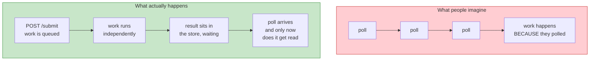

**Why this matters practically:** it explains the limit of polling's responsiveness.

The job finishes at second 37. Your next poll is at second 40. **You find out 3 seconds late.** The interval *is* your latency floor — Unit 5's math has teeth because of this.

> **Polling latency is bounded below by the polling interval. No amount of server speed changes that.**

### 2.5 — Where Does the Job Live?

Hussein lists three options for what the backend does after handing out the ID:

| Option | Where the job sits | Survives restart? | Shared across servers? |
|---|---|---|---|
| **Queue** | A real queue | ✅ | ✅ |
| **Persist to disk** | File / database | ✅ | ✅ |
| **In memory** | A dictionary in the process | ❌ | ❌ |

All three are legitimate. The transcript's demo uses the third.

**The two "no" columns are the entire cost of the third** — and they will matter enormously. In Unit 6 we will find out what breaks when the job lives in memory. File that now.

---

## Unit 3 — Why "Short," and the Lost-Response Trap

### 3.1 — Why "Short": The Server Never Waits

> *"The reason we call it short is because we immediately go and get that result."*

Hussein's demo makes the point by sheer repetition:

> *"Is X ready? — Nope. Is it ready? — Nope. Is it ready? — Yes."*

Each answer arrives immediately. **The server never holds the request open.**

| | What the server does when polled |
|---|---|
| **Short polling** | **Looks up** the answer and returns instantly — ready or not |
| **Long polling** | **Waits** for the answer before responding — Lecture 11 |

> **Short polling is a lookup, not a wait.**

That's the whole distinction, and it's why the two have different names. Long polling isn't developed until Lecture 11 — but the contrast has to be stated here, because otherwise "short" is a word with nothing to be short *relative to*.

### 3.2 — Anatomy of One Poll

Three outcomes are possible, and only one is interesting:

| Server state | Response | Meaning |
|---|---|---|
| Job finished | `200` + the result | ✅ This is the one you wanted |
| Job still running | `200` + `{progress: 40%}` | ❓ Nothing new |
| **No such job** | `404` | ⚠️ Gone, expired, or never existed |

**Critical detail:** all three are complete, ordinary HTTP exchanges. The `200 + "not ready"` poll is not free — it consumed a connection, a request line, headers, and a response. Unit 5 prices this.

And here's the subtle part:

> **The poll that finally gets the result is byte-for-byte indistinguishable from the polls that got nothing.**

Same method, same URL, same latency, same status code. The client discovers completion from the **payload**, not from the fact that a response arrived:

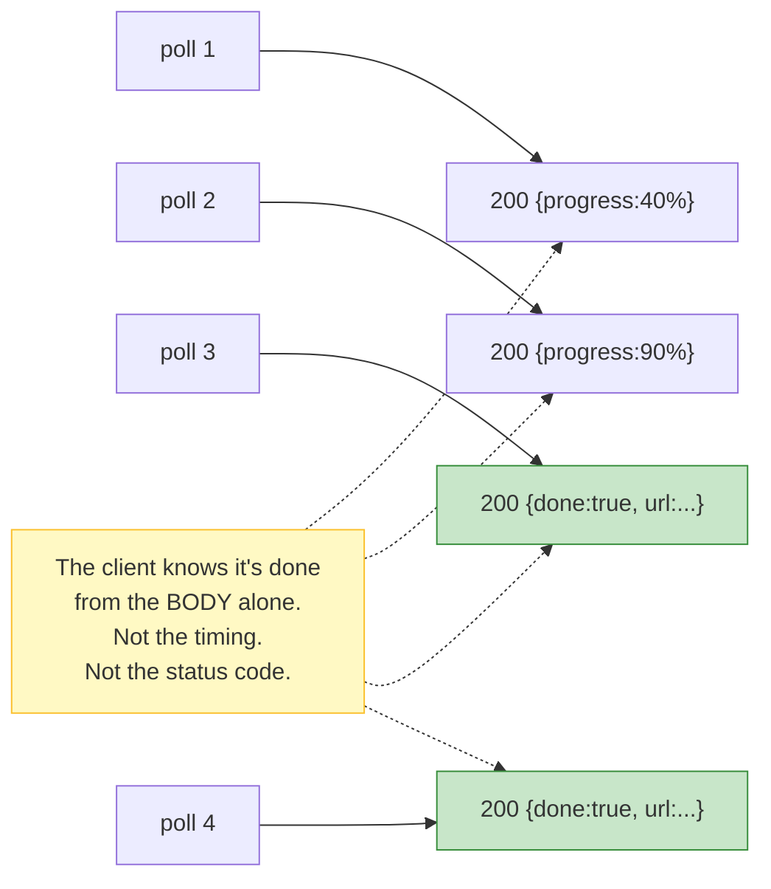

**Note that poll 4 also returns the result.** Nothing was consumed by poll 3. This is the setup for 3.3.

### 3.3 — The Core Idea: Delivery vs. State

This is the distinction the entire lecture is built on. Two ways a result can reach a client:

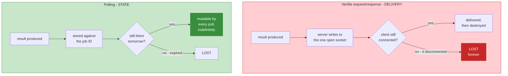

> **In vanilla request/response the response is a delivery — a one-shot event. In polling the result is state — a readable fact.**

Hussein describes the vanilla failure precisely:

> *"If we disconnect, the server will try to respond. The client in this case was disconnected and we just lost a beautiful response. The server is not going to keep the response around."*

And then the polling version:

> *"We didn't deliver it to the client. We only delivered the response when the request was actually completed. So that next poll will actually have immediately the response."*

**Read those two quotes as a pair.** Same scenario, opposite outcomes — and the difference is entirely *whether the server stored the result*.

#### What this buys you

| | Vanilla R/R | Polling |
|---|---|---|
| Client disconnects at 95% | Work lost to you | **Work continues** |
| Client returns tomorrow | Nothing to check | **Result is there** |
| Result read twice | Impossible — it was consumed | **Fine — it's idempotent** |
| Server restart | Response gone | **Gone too — see Unit 6** |
| Client crash mid-transfer | Truncated response | **Just another missed poll** |

That last row is the deep one. **A failed delivery is no longer a failure — it's just a poll that didn't happen.** The system needs no recovery logic, because there's nothing to recover.

### 3.4 — The Bill Comes Due Immediately

Deferring delivery doesn't make the problem disappear. It **moves** it — and creates one genuinely new question.

Hussein raises it himself:

> *"How long do you keep a job that has been finished in the back end? It's up to you, the backend engineer, to configure."*

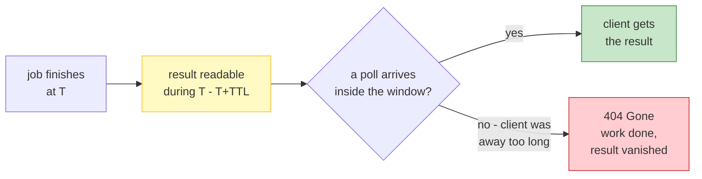

**A TTL on finished results is a design decision, and it's a real trade:**

| Choose | You get | You suffer |
|---|---|---|
| **Short** (minutes) | Cheap storage | Legitimate clients get `404`s |
| **Long** (days) | Clients can always catch up | **Storage grows with every job, forever** |

Notice the failure mode flips direction. Vanilla request/response loses results for clients that *disconnect*. Polling with an aggressive TTL loses results for clients that are *slow* — a different and larger population.

> **You have exchanged "the result might not arrive" for "the result might expire." Neither is free.**

And this is where polling starts revealing its seams. Unit 5 shows the cost of the *requests*. This cost — **storage and retention policy** — is the one that decides whether polling is viable at all at scale.

---

## Unit 4 — The Upside

Units 1–3 established the mechanism. Unit 4 is the case *for* it — and one advantage in here is the most underrated in the whole lecture.

### 4.1 — Simple to Build, on Both Sides

Hussein says it plainly:

> *"It's a very simple thing to implement. The client is very simple to build. And if you think about it, the back end is also relatively simpler to build."*

The entire protocol:

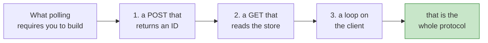

Compare what the next three lectures require: SSE needs connection management, event parsing, reconnection with `Last-Event-ID`, and proxy cooperation. WebSocket needs an upgrade handshake, ping/pong, and a persistent connection. **Polling needs a store and two endpoints.**

#### The advantage nobody counts: compatibility

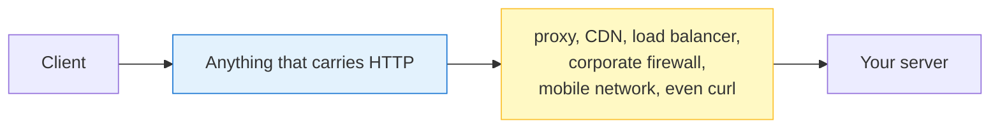

**Polling works through every layer that might block a fancier protocol.** Enterprise proxies routinely strip or mangle SSE and WebSocket upgrades. Polling survives because it isn't a special protocol — it's ordinary requests.

> **This is why polling is the fallback, not the naive option.** When SSE or WebSocket fail in production, teams fall back to polling. It's the floor of the design space, and that makes it the safety net.

**Corollary worth internalising:** simplicity isn't only elegance. It's why a technique survives contact with the real world.

### 4.2 — Safe Disconnect, and the Resume Loop

This is the prize. Hussein calls it *"a very attractive feature"*:

> *"The client can disconnect safely in this case… it will persist the moment it receives the job ID or the task ID or the request ID, you can just save it to disk. And then the more the next moment you respawn, you read from disk and these are the pending jobs and you can just loop and say, 'Hey, is this thing ready?'"*

Read that as an algorithm — three moves:

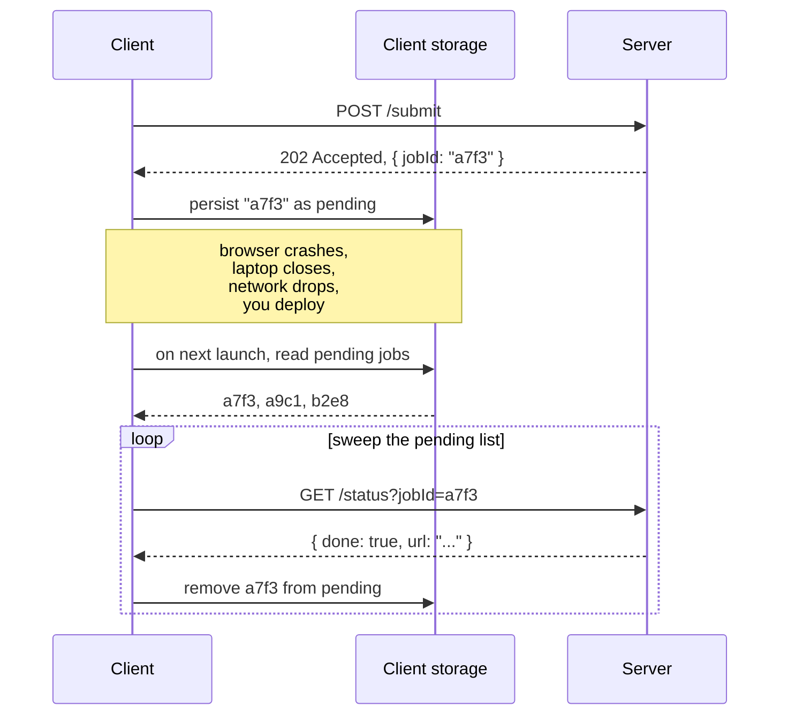

#### Why this is bigger than it looks

**You can now lose the client entirely and not lose the work.** Crash, reboot, plane, coffee on the laptop — the pending list survives. On next launch the client *reconciles* it.

Not a trick — it's the exact shape of things you already know:

| What you know | Where you've met it |
|---|---|
| Local-first sync engines | Reconcile a local pending-op log on launch |
| Mobile offline queues | Sync when connectivity returns |
| `git push` after a failed push | Your commits are local; push later |
| CI retry queues | Persist the intent, retry later |

> **Persist the intent locally, reconcile against the server on restart.** Polling hands you the ID that makes this possible. That's Unit 1's whole trick paying off.

#### And the condition it depends on

The resume loop only works if the result is **still readable when the client returns** — which is Unit 3.4's TTL, exactly.

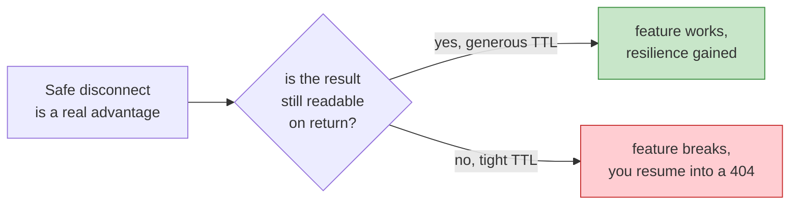

> **Unit 3.4 gates Unit 4.2.** The resume loop is only as good as your retention policy — and that policy is yours to choose.

### 4.3 — The Native Fit for Long Work

The third advantage is about *fit* rather than mechanics:

| Work duration | Polling |
|---|---|
| 50ms | ❌ Overhead exceeds the work — just respond |
| 30 seconds | ✅ Fine either way |
| 4 minutes | ✅ **The right answer** |
| 6 hours | ✅ Necessary |
| Unbounded | ✅ The only option |

Polling isn't a compromise for long work. It's the design that makes long work *possible* at all over Request/Response. Unit 1's YouTube example is exactly this.

**The pattern:** choose the mechanism that matches the duration, not the one that looks most modern.

### 4.4 — Zero Idle Cost (the Inverse of Lecture 8)

This one deserves an explicit diagram, because it's the direct mirror of what [Lecture 8](lecture-08-push.md) cost you:

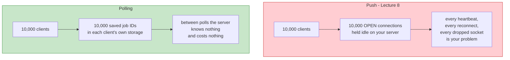

| | Push | Polling |
|---|---|---|
| Idle client | Holds a connection, a buffer, a heartbeat | **Holds nothing** |
| Server must track | Every live client, continuously | Only clients mid-poll |
| Client drops | Reconnect logic, backoff, resume tokens | **Just poll again** |
| Protocol changes | WebSocket/HTTP2 upgrade | **None** |

**The trade in one line:** push buys lower latency by paying in permanent server-held state. Polling buys statelessness by paying in wasted requests. Unit 5 prices that bill.

### 4.5 — Also Worth Noticing

**1. Many clients can watch the same job.** Nothing ties a job ID to the client that created it. A second device, a monitoring script, a colleague — all can poll `a7f3`.

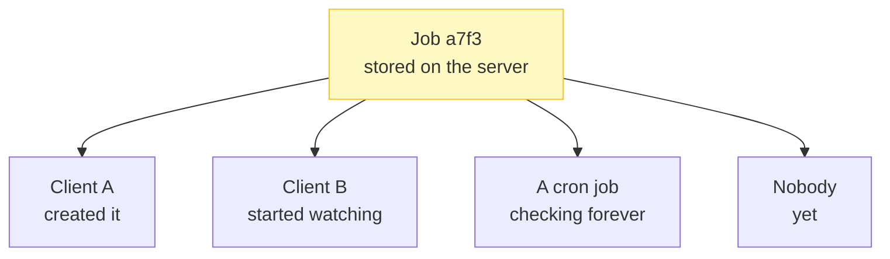

Watch the bottom edge of that diagram. **Polling drifts toward pub/sub** — one event, many observers, no coordination. That's [Lecture 13](lecture-13-pubsub.md), already visible. The server has no idea how many watchers exist.

**2. The server's freedom.** Unit 2.5's option table is the point: the backend may queue, persist, or hold in memory, then execute whenever it likes. **Polling decouples the request's lifetime from the work's lifetime** — the request is over in 5ms, the work takes an hour. Nothing forces them together.

---

## Unit 5 — The Bill

Hussein's own transition: *"Nothing is perfect, right?"*

He calls polling **"too chatty"** and then puts numbers on it. Let's do the math properly, because the transcript gestures at it and the actual figures are worse than he states.

### 5.1 — First, a Naming Correction

Before the costs, Hussein stops to correct a term:

> *"It receives a pull request — not pull request, a poll. Request, poll — not GitHub, not 'PR'."*

A genuine misnomer:

| Word | In GitHub | In HTTP |
|---|---|---|
| "PR" | Pull Request — merge someone's branch | **POST** — `POST /jobs` |
| **Poll** | — | `GET /status?jobId=...` |

> **A poll is a request, not a *pull* request.** Nothing is being pulled or merged — you're *reading state*. PR already means something else, and using it for "poll" makes conversation harder than it needs to be.

Same instinct as [Lecture 7](lecture-07-request-response.md)'s framing lesson: **name things precisely or you'll reason about them wrongly.** Polling *reads*. It never pulls.

### 5.2 — The Scaling Math

This is the core of the unit. Hussein sets it up:

> *"Imagine you scaled this up. You deployed your backend, you scaled it with H.R. proxy or in Gen X… thousands and thousands of people… each app is making 10 to 20 to 30 to 40 polls."*

Now the arithmetic. Assume **10,000 users**, one job in flight each:

$$\text{polls/second} = \frac{\text{users}}{\text{interval}}$$

| Interval | Polls / second | Per minute | Per day |
|---|---|---|---|
| **1 s** | 10,000 | 600,000 | 864 million |
| **5 s** | **2,000** | 120,000 | 172 million |
| 10 s | 1,000 | 60,000 | 86 million |
| 30 s | 333 | 20,000 | 29 million |
| 60 s | 167 | 10,000 | 14 million |

> **At a 5-second interval, polling one job for 10,000 people means 2,000 requests per second — forever, just to learn whether work finished.**

Note the last column: a single polling feature becomes **172 million requests per day**. One feature. One number.

### 5.3 — The 99% Waste, Computed Precisely

Hussein says *"maybe 99% of them are useless."* Here's the exact figure for his own demo scenario:

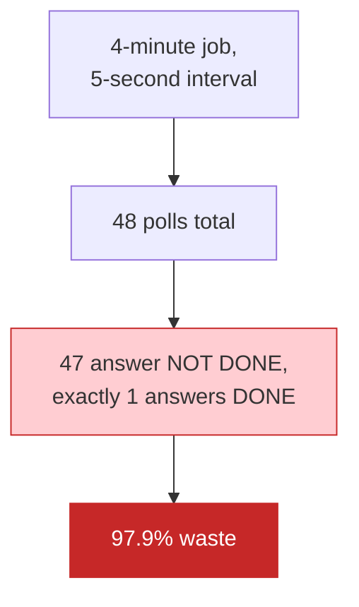

The general formula:

$$\text{waste} = 1 - \frac{\text{interval}}{\text{job duration}}$$

| Job duration | Interval | Waste |
|---|---|---|
| 4 minutes | 5 s | 97.9% |
| 4 minutes | 30 s | 87.5% |
| 30 seconds | 5 s | 83% |
| 6 hours | 60 s | 99.3% |

> **Waste rises with job duration and falls with interval. Long jobs — exactly polling's target use case — are its worst case.**

That last row is the sting: **the workloads polling is *for* are the workloads where polling wastes most.**

#### The waste isn't just requests — it's information

The sharper observation:

> **A poll that returns "not ready" carries zero new information. The client already knew it wasn't ready — otherwise it wouldn't have polled.**

Forty-seven responses, each confirming what the caller already believed. **The client asked a question whose answer it already had**, at a fixed interval, until the answer changed.

> **That is not communication — that's a timer with network overhead.**

### 5.4 — Where the Bytes Go: Bandwidth Is Money

Those 2,000 requests/second have weight. Estimate ~600 bytes per poll round-trip (request line, headers, response headers, TCP/IP overhead — the body is a few bytes):

$$2{,}000 \times 600 = 1.2 \ \text{MB/s} \;\Rightarrow\; \approx 100\ \text{GB/day} \;\Rightarrow\; \approx 3\ \text{TB/month}$$

The payload efficiency is brutal. Of those ~600 bytes, maybe 10 carry information:

| | Bytes | Share |
|---|---|---|
| TCP/IP + TLS headers | ~110 | ~18% |
| HTTP request line + headers | ~300 | ~50% |
| HTTP response headers | ~180 | ~30% |
| **Actual payload** (`{"done":false}`) | **~10** | **~2%** |

> **~98% of every poll is protocol tax.** And that mirrors the 98% request waste — two independent 98%s.

Now Hussein's point, which is why this matters beyond technical curiosity:

> *"If we learned anything, the network bandwidth, especially on the back end, is really precious. Because if you put everything in the cloud, that's how you get billed, right? So your backend architecture can make or break your backend application."*

**This is a cost argument, not a performance argument.** At 100 GB/day you're paying for 98% of that egress to deliver nothing. And it's *egress* — usually the more expensive direction.

### 5.5 — The Server's Time, with an Honest Nuance

> *"When a backend receives a poll, it has to do a check. And that check takes a finite amount of time. This resource could have been spent serving actual requests and doing useful things."*

Right — but be precise, because a single status lookup is genuinely cheap. One poll costs roughly:

1. Connection setup (or reuse — see below)
2. TLS termination
3. HTTP parsing, **auth check**, routing
4. A store lookup — memory or Redis, microseconds
5. Response serialization

**Individually trivial. Collectively the story changes** — and the sharpest version of Hussein's point is one he doesn't make:

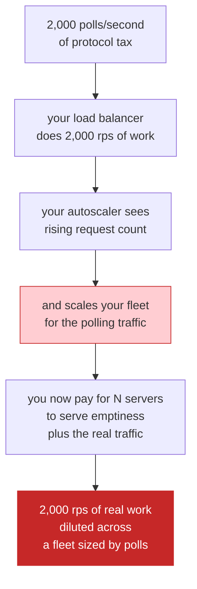

> **You scale your infrastructure to serve the absence of information.** Autoscaling counts requests, not useful requests.

**A production detail that makes it much worse:** if your client doesn't reuse connections, every poll pays a **full TCP + TLS handshake** — roughly 1–2 KB and an extra round trip. Polling without keep-alive is catastrophic; with keep-alive it's merely expensive.

### 5.6 — You Cannot Tune Your Way Out

Hussein's honest note:

> *"You can play with the configuration. You can minimize the poll, but that's the problem — too chatty."*

The interval is the only dial, and it controls two things that fight each other:

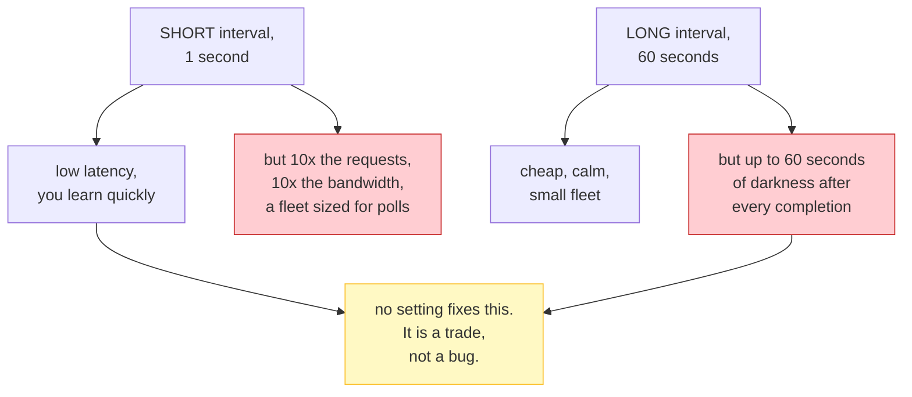

Worse, **the two costs have different shapes:**

| Cost | Behaviour as interval shrinks |
|---|---|
| **Bandwidth, fleet size, money** | Grows **linearly** — smooth, predictable |
| **User-perceived staleness** | Bounded by interval, but the *worst case* is what users feel |

So you're trading a cost you can measure precisely against a latency users feel. That's why polling intervals get argued about forever.

### 5.7 — The Ledger

| | |
|---|---|
| ✅ **Gained (Unit 4)** | Simplicity, compatibility, safe resume, long-work fit, zero idle cost |
| 💸 **Paid (this unit)** | 2,000 rps to learn one bit · ~98% waste · ~100 GB/day · a fleet sized for emptiness |
| ⏱️ **Inherited** | Latency floor = the interval (Unit 2.4) |

> **The irony: polling wastes the most on exactly the long-running jobs it was built to serve.** Long duration maximizes the ratio of empty polls to useful ones.

**Which is why the next lecture is Long Polling.** Its entire purpose is to delete the empty polls — keep the request open until there's actually something to say. Same client idea, one change that removes the waste:

> **Short polling asks and gets told "no." Long polling waits until it can answer "yes."**

---

## Unit 6 — The Demo

The payoff unit. Two reasons: it makes the pattern concrete in thirty seconds, **and** it contains the answer to the claim flagged before Unit 1 — plus several bugs Hussein doesn't mention.

### 6.1 — What the Demo Does

Reconstructed from his walkthrough (not verbatim — the logic, not the exact code):

```javascript
const express = require('express');
const app = express();

const jobs = {};            // jobId -> progress percent

function updateJob(jobId) {
  setTimeout(() => {
    if (jobs[jobId] >= 100) return;
    jobs[jobId] = jobs[jobId] + 10;
    updateJob(jobId); // keep going until 100
  }, 5000);
}

app.post('/submit', (req, res) => {
  const jobId = Date.now(); // Hussein: "bad idea"
  jobs[jobId] = 0;
  updateJob(jobId);
  res.send(`job:${jobId}`);
});

app.get('/checkstatus', (req, res) => {
  const jobId = req.query.jobId;
  res.send(`job:${jobId} status: ${jobs[jobId]}%`);
});

app.listen(8080);
```

And the run:

```
$ curl -X POST localhost:8080/submit
job:1759650000000

$ curl "localhost:8080/checkstatus?jobId=1759650000000"
job:1759650000000 status: 40%

$ ... (repeating)
job:1759650000000 status: 90%
job:1759650000000 status: 100%
```

Then he submits a **second** job and polls both — two independent progress counters running in parallel. That's Unit 2.2's three lifetimes in action, and it's the moment the pattern clicks.

### 6.2 — Why It Works, Honestly Assessed

Before the bugs — the demo is genuinely good teaching:

| It does well | Why that matters |
|---|---|
| Whole mechanism in ~25 lines | Proves Unit 4.1's claim rather than asserting it |
| Two jobs in parallel | Shows job IDs fully decouple work from client |
| Progress numbers visible | Makes "state, not delivery" (Unit 3.3) tangible |

> **The demo is the pattern. The bugs below are the engineering.** Most real systems are this plus a queue, auth, persistence, and retries.

### 6.3 — Bug 1: `Date.now()` Collides, and Leaks Data

Hussein flags it himself:

> *"I use the time. Bad idea. Of course, if two people happen to have executed in the same millisecond, you're going to get a conflict job ID."*

He's right, and the consequence is **worse than he says**:

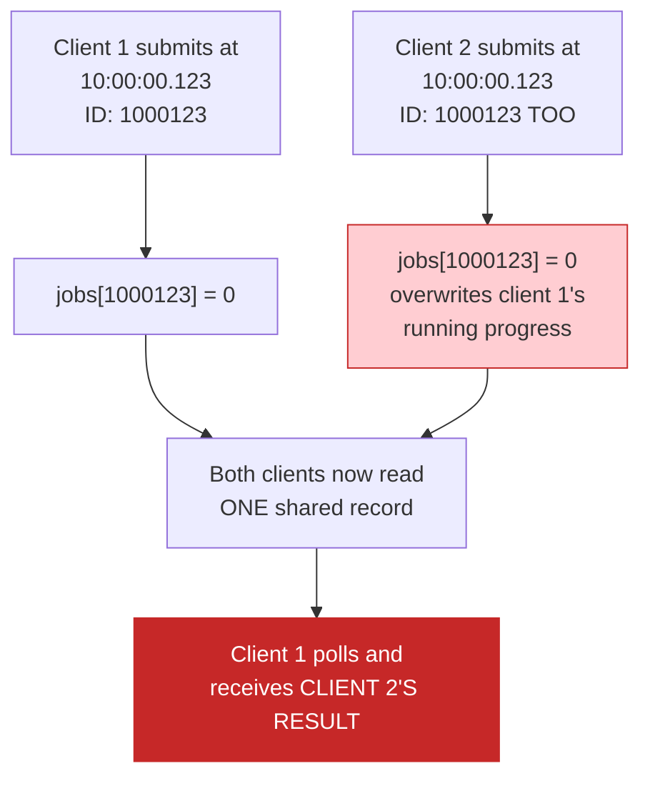

**This isn't just a lost job — it's two users' data collapsing into one record.** Client 1 could receive client 2's file URL. That's a privacy breach, not a bug.

**Fix:** `crypto.randomUUID()`.

**The principle:** *an identifier that isn't unique is an authorization bypass waiting to happen.*

### 6.4 — Bug 2: The In-Memory Store (Our Flagged Claim, Answered)

This is the claim flagged before Unit 1:

> ❓ *"The client saves the job ID to disk, disconnects, another client can pick it up."*

**Verdict: the client half works. The server half doesn't.**

Look at Unit 4.2's resume loop — the client faithfully persists `a7f3`. Now watch what the server does with it:

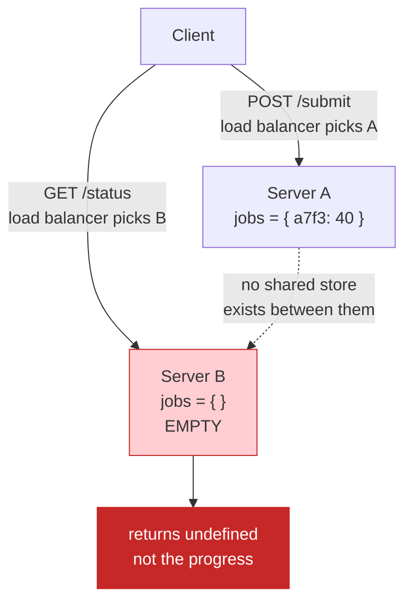

Three failures, one cause:

| Event | Result |
|---|---|
| **Server restart / redeploy** | Dictionary empty. Every job vanishes. |
| **Two servers behind a load balancer** | Submit to A, poll B → `undefined` |
| **PM2 cluster / k8s replicas** | Same, permanently — each process has its own dict |

**This is Unit 2.5's option table coming back to collect.** In-memory was the option with **❌ survives restart? ❌ shared across servers?** Those two "no"s were the whole cost. Unit 2 filed it; Unit 6 cashes it.

> **The resume loop from Unit 4.2 is a two-sided protocol. The client must persist the job ID *and* the server must own a durable, shared store. The demo does the first and not the second — so the feature is real but not yet available.**

And the fix is already in our vocabulary: **the queue option.** Redis, Postgres, RabbitMQ — any shared store makes this work. That the demo reaches for neither is exactly why production can't.

### 6.5 — Bug 3: An Unknown Job Returns 200, Not 404

Unit 3.2 promised three outcomes. The demo implements two and conflates them:

```javascript
jobs["does-not-exist"]              // undefined — no exception thrown
res.send(`status: ${jobs[jobId]}%`); // "status: undefined%"
```

The client receives **`200 OK`** with `status: undefined%`. Not a `404`.

| Should be | Demo returns |
|---|---|
| `200 {progress: 40}` | ✅ `200 ...40%` |
| `404` unknown job | ⚠️ **`200 ... undefined%`** |

**Consequence:** a client can't tell "this job doesn't exist" from "this job exists but hasn't started." Its resume loop can't distinguish *keep waiting* from *stop asking* — so it polls a dead ID forever.

That's Unit 3.2's third outcome, missing — and it breaks the resume loop's exit condition.

### 6.6 — Bugs 4, 5, 6 — The Rest

| Bug | In the demo | Consequence | Fix |
|---|---|---|---|
| **Unbounded growth** | Completed jobs stay in `jobs{}` forever | Memory grows with every job, ever | **Unit 3.4's TTL** — delete on completion + expiry |
| **No cancellation** | `updateJob` runs to 100% regardless | Abandoned jobs burn CPU for nothing. No `DELETE` endpoint | A cancel flag the timer checks |
| **No ownership check** | Any job ID, any caller | **Anyone can read anyone's job** | Scope queries to the authenticated user |
| **One timer per job** | 10,000 jobs = 10,000 `setTimeout`s in one event loop | Memory + event-loop pressure | **One worker consuming from a queue** |

Two of those deserve more air.

**The timer-per-job pattern is a Node.js-specific mistake**, and it ties straight back to [Lecture 9](lecture-09-sync-vs-async.md) Unit 4. The right shape is **one worker draining a queue** — not N independent timers. Same job, completely different resource profile.

**"No ownership check" is a security bug, not a feature gap** — see 6.7.

### 6.7 — Guessable IDs Are a Second Security Hole

This one isn't a bug in the code — it's a bug in the *ID choice* interacting with the missing auth.

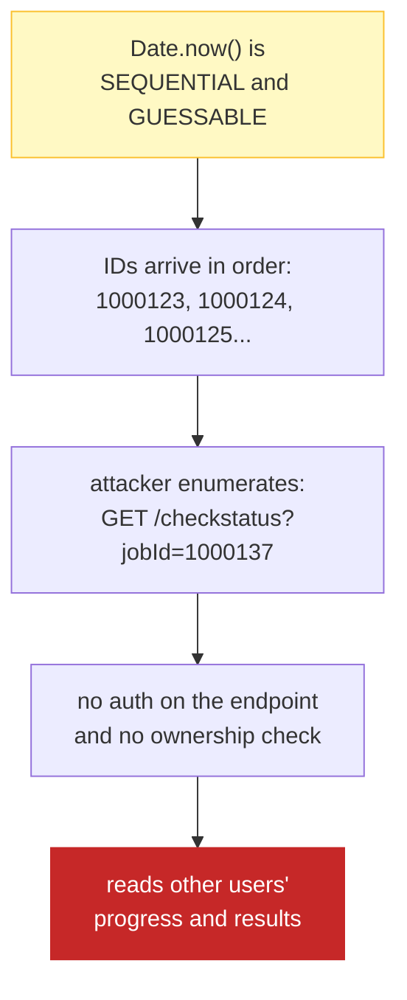

This is a textbook **IDOR** (Insecure Direct Object Reference). Two mistakes compound:

1. **Guessable IDs** — sequential timestamps are enumerable, not random
2. **No ownership check** — possessing an ID grants full access

**Either one alone is survivable. Together they're an open door.** Fix one and the door closes; fix both.

And notice: `crypto.randomUUID()` from 6.3 fixes *both* — which is the real reason an ID must be unguessable, not merely non-colliding.

### 6.8 — The Aliasing Trap

One subtle thing in the demo that isn't a bug but will bite you. Progress updates every 5 seconds. A browser polls every 5 seconds. **No jitter, no random offset.**

```mermaid
flowchart TB
    T1["server updates progress<br/>t=5 to 10%<br/>t=10 to 20%<br/>t=15 to 30%"] --> T2["client polls at exactly<br/>t=5.0, 10.0, 15.0<br/>no jitter, no offset"]
    T2 --> T3["the two settle into<br/>a fixed phase<br/>relationship"]
    T3 --> T4["you may systematically<br/>observe the same value<br/>twice, and never<br/>see an intermediate one"]

    style T4 fill:#fff9c4,stroke:#fbc02d
```

**When your polling period equals your update period, the two can lock into step.** You re-read the same value, and intermediate changes slip past entirely.

Unit 2.4 called the interval your latency floor. This is the other half: **a badly chosen interval can also make you blind to changes, not just slow to see them.**

> **Fix: add jitter.** Poll at *roughly* the interval, never exactly — `interval + random(0, 500ms)`.

Jitter also prevents **every client in the fleet from polling at the same instant**. Without it, a scheduled job's clients all return at 09:00:00 together and hammer the server in a spike — polling's version of a thundering herd.

### 6.9 — The Verdict

| | |
|---|---|
| ✅ **What the demo proves** | The pattern is genuinely simple — 25 lines, two endpoints, no new protocol (Unit 4.1 was true) |
| ⚠️ **What it hides** | A shared durable store, auth, TTL, cancellation, cancellation-aware scheduling, and jitter |
| 💀 **What it gets wrong** | ID collisions leaking data · jobs lost on restart · `200 undefined` instead of `404` |

> **The demo is the pattern in 25 lines. Production is the pattern plus six things the demo never had to solve** — and five of those six are things earlier units already predicted.

**Every one of these bugs was flagged before we hit them.** Unit 2.5 predicted the shared-store problem. Unit 3.2 listed the missing `404`. Unit 3.4 predicted unbounded growth. Unit 5 predicted the timer explosion. Unit 4.2 needed a durable store the demo never built.

### 6.10 — Does This Undo Unit 5?

Unit 5 built a careful cost argument about polling at scale. Unit 6 just watched a demo that **doesn't survive a load balancer** — the *precondition* for the scale Unit 5 discussed.

> **Does that change the Unit 5 numbers?** The 2,000 rps figure assumed a working shared store. Without one you never reach scale — you fall over at two servers.

The honest reading: **Unit 5's numbers describe a system that must already be built correctly.** Polling's simplicity applies to the *protocol*, not the *infrastructure*. The demo is a protocol in 25 lines and an infrastructure in zero lines.

---

## Unit 7 — Recap, and the Kafka Answer

Final unit. This one closes the loop, settles the last open claim, and hands us the ladder that lectures 11–13 climb.

### 7.1 — Six Units, One Arc

```mermaid
flowchart TB
    U1["Unit 1 - THE PROBLEM<br/>long work needs a handle,<br/>not a result"]
    U2["Unit 2 - THE MECHANISM<br/>three lifetimes;<br/>every poll is a request/response"]
    U3["Unit 3 - THE WORD<br/>lookup not wait;<br/>state not delivery"]
    U4["Unit 4 - THE UPSIDE<br/>simple, compatible, resumable,<br/>zero idle cost"]
    U5["Unit 5 - THE BILL<br/>2,000 rps for one bit;<br/>~98% waste"]
    U6["Unit 6 - THE DEMO<br/>six bugs - all predicted<br/>before we found them"]

    U1 --> U2 --> U3 --> U4 --> U5 --> U6

    style U1 fill:#e3f2fd,stroke:#1976d2
    style U3 fill:#fff9c4,stroke:#fbc02d
    style U5 fill:#ffcdd2,stroke:#c62828
    style U6 fill:#fff9c4,stroke:#fbc02d
```

### 7.2 — The Spine

> **Polling trades certainty for freedom.** The client gives up *having* the result and holds a *reference* instead — then buys the result back with repeated ordinary requests. Cheap to build, cheap to run, honest about failure — and wasteful, latency-bound, and useless at scale until the store is fixed.

Three compressed claims, each earned:

| | |
|---|---|
| **The core idea** | Return a **handle**, not a result — then read state until it changes (Units 1–3) |
| **Why it's good** | No new protocol, works through anything, resumable, zero idle cost (Unit 4) |
| **Why it fails** | Every empty poll is a request that learns nothing, and the store is where correctness lives (Units 5–6) |

### 7.3 — The Kafka Claim, Settled

Hussein's closing line:

> *"We're going to talk about a better approach which is used by Kafka. It's called Long Polling."*

**He's right that Kafka uses long polling — and wrong that this is what makes Kafka Kafka.**

Kafka's `Fetch` API genuinely is long polling: the broker holds the request up to `maxWaitMillis` (default 500ms) rather than returning empty immediately. That's real, and it's long polling.

But here's what long polling **cannot** do:

```mermaid
flowchart LR
    A["LONG POLLING gives you<br/>the NEXT thing,<br/>once"] --> C["miss it while<br/>disconnected?<br/>GONE"]
    B["KAFKA gives you<br/>everything SINCE offset X,<br/>as many times as needed"] --> D["miss it?<br/>re-read from<br/>your last offset"]

    style C fill:#ffcdd2,stroke:#c62828
    style D fill:#c8e6c9,stroke:#388e3c
```

| | Short polling | Long polling | Kafka |
|---|---|---|---|
| Empty responses | Many | Few | Few |
| **Replay a missed event** | ❌ | ❌ | ✅ **From an offset** |
| **Ordering guarantee** | ❌ | ❌ | ✅ **Total, per partition** |
| Retention | TTL on your result | While connected | **The whole log** |
| Consumers | Each polls | Each holds a request | **Consumer groups** |

> **Long polling gives you efficiency. Kafka's log gives you replay.** Different problems. Long polling is the wire protocol; the offset log is the design.

**And long polling is a poor reason to study Kafka.** If you need long polling's efficiency, Lecture 11 gives that in one concept. If you need replay, ordering, and durable retention — that's a broker, and [`message-brokers-rabbitmq-vs-kafka.md`](message-brokers-rabbitmq-vs-kafka.md) is where that lives.

### 7.4 — Long Polling Fixes the Waste — and Reopens Lecture 8's Problem

This is the part worth dwelling on, because long polling is often sold as a pure win. It isn't:

```mermaid
flowchart TB
    subgraph SP["Short polling"]
        A1["N short requests"] --> A2["server holds NOTHING<br/>between polls"]
        A2 --> A3["but ~98% of the<br/>requests answer 'no'"]
    end

    subgraph LP["Long polling"]
        B1["N requests,<br/>held open"] --> B2["server waits until<br/>it has something"]
        B2 --> B3["but now it holds N<br/>OPEN CONNECTIONS -<br/>Lecture 8's problem,<br/>returned"]
    end

    style SP fill:#fff9c4,stroke:#fbc02d
    style LP fill:#e3f2fd,stroke:#1976d2
```

> **Short polling: stateless server, wasteful traffic. Long polling: efficient traffic, stateless-in-name but N held connections.** You choose which cost you pay — you don't get to pay neither.

And notice **Unit 6's problem survives long polling unchanged**: the waiting job still has to live somewhere the server can see. Long polling holds it *in the request*, which is the least durable place of all. **It doesn't fix the shared-store bug — it hides it.**

> ✅ **Confirmed in Lecture 11.** Hussein's own summary: *"We effectively move the polling from the client side to the server side."* See Lecture 11 Unit 3.

### 7.5 — The Ladder

Now we can see where lectures 11–13 go, and why each exists:

```mermaid
flowchart TB
    L10["10 - SHORT POLLING<br/>many short requests<br/>stateless, ~98% wasted"]
    L11["11 - LONG POLLING<br/>few requests, held until<br/>there's something to say<br/>pays: held connections"]
    L12["12 - SSE<br/>one connection per client,<br/>server pushes every event<br/>pays: permanent connection"]
    L13["13 - PUB/SUB<br/>clients talk to a broker,<br/>zero direct client-server links"]

    L10 -->|"fix: stop asking<br/>when there's nothing"| L11
    L11 -->|"fix: one connection<br/>for all events"| L12
    L12 -->|"fix: put a broker<br/>between them"| L13

    style L10 fill:#fff9c4,stroke:#fbc02d
    style L11 fill:#e3f2fd,stroke:#1976d2
    style L12 fill:#e1bee7,stroke:#8e24aa
    style L13 fill:#c8e6c9,stroke:#388e3c
```

**Read it as a series of fixes, not four options.** Each lecture exists because the previous one had a specific defect:

- **Long polling** fixes short polling's *empty responses*
- **SSE** fixes long polling's *one-request-per-notification*
- **Pub/Sub** fixes both by *decoupling client from server entirely*

> **Every mechanism here is the same idea at a different point on one axis: how long is the server willing to hold a connection open?** Short polling: not at all. Long polling: until there's something. SSE: forever. Pub/Sub: never — a broker holds the message instead.

That's the mental model to carry into Lecture 11.

### 7.6 — When to Poll, and When Not To

The practical verdict:

| ✅ Poll when | ❌ Don't poll when |
|---|---|
| Work takes seconds to minutes | Work finishes in milliseconds — just respond |
| Clients are flaky (mobile, VPN, captive portals) | You need sub-second updates |
| You can't deploy a queue yet | Thousands of concurrent watchers per fleet |
| You want zero idle cost | You need replay or ordering guarantees |
| Users can afford a few seconds of staleness | Results must never expire — use a real queue |

> **Polling is the baseline and the safety net — rarely the optimum.** Reach for it when you want no new infrastructure, or when everything else is blocked. Graduate when Unit 5's numbers start hurting.

### 7.7 — The Idea Worth Carrying to Every Lecture

Not the protocol. **The handle.**

> **Return a reference instead of a result.** Everything durable in backend engineering descends from this.

| Where we'll meet it again |
|---|
| Queues and job systems — Unit 1's job ID |
| Idempotency keys — "don't charge me twice for this request" |
| Database primary keys |
| Content-addressed storage — the hash *is* the reference |
| Kafka offsets — a resumable handle into a log |
| The message broker doc — the handle survives the process |

Unit 1 looked like a trick for video uploads. It's actually the primitive underneath most of what this course builds.

### 7.8 — What We Corrected

Three transcript claims, tested rather than accepted:

| # | Claim | Verdict |
|---|---|---|
| 1 | "Save the job ID, disconnect, another client picks it up" | ⚠️ **Half true** — the client can, the demo's server can't. The resume loop needs *both* halves |
| 2 | "Long polling — used by Kafka" | ⚠️ **True but beside the point** — Kafka's defining feature is the offset log, not long polling |
| 3 | "It's a very elegant idea" | ⚠️ **Elegant protocol, zero infrastructure** — and six bugs in 25 lines |

Plus gaps the transcript never mentioned, found by pushing on it:

- **Result TTL** (3.4) — where a result may not arrive becomes where it may expire
- **Autoscaling** (5.5) — you scale your fleet to serve emptiness
- **Aliasing** (6.8) — a badly chosen interval makes you blind, not just slow
- **IDOR** (6.7) — guessable IDs *and* no auth is an open door

> **Six units, three claims corrected, four gaps found, zero accepted on faith.** That's the method, not an accident.

### 7.9 — Self-Test — Whole Lecture

1. Why can't a single long Request/Response handle a 4-minute job? Name all three reasons.
2. The three lifetimes in a polling system — which one does the client never see?
3. Why is polling latency bounded below by the interval?
4. **Delivery vs. state** — which does vanilla request/response use, and what failure does that cause?
5. What's the worst-case delay for a 5-second interval, and why can't a faster server help?
6. 10,000 users polling every 5 seconds. Requests per second? Per day?
7. Why does waste *increase* with job duration?
8. Three reasons polling survives where SSE doesn't.
9. Why is one timer per job the wrong shape in Node.js?
10. What does adding jitter prevent? (Two things.)
11. Name four bugs in the demo and which unit predicted each.
12. Why is `randomUUID()` a security fix, not just a collision fix?
13. What does long polling fix, and what does it cost?
14. What can Kafka's offset log do that long polling cannot?

---

## Vocabulary

| Term | Meaning |
|---|---|
| **Polling** | Broad family — the client repeatedly checks for an update |
| **Short polling** | Each poll returns immediately, whether or not the result is ready |
| **Handle** | An opaque value the client holds to reference work it isn't waiting on |
| **Job ID / Task ID** | The handle for an async unit of work |
| **`202 Accepted`** | HTTP status meaning "understood, not finished yet" |
| **Progress** | How far along a long-running job is — usually a percentage |
| **Polling interval** | How often the client checks; a client-side setting |
| **Latency floor** | The polling interval — the best possible detection delay |
| **Long polling** | The poll *waits* for a result instead of returning empty — Lecture 11 |
| **Delivery** | A one-shot message to a connected client; lost if it isn't there |
| **State** | A stored fact that any client can read, as often as it likes |
| **Idempotent read** | Reading the same result repeatedly with no side effects |
| **TTL** | Time-to-live — how long a finished result stays readable |
| **Resume loop** | On restart, read persisted pending jobs and re-poll each |
| **Pending list** | The client's local record of jobs it hasn't yet received results for |
| **Reconciliation** | Matching local state against server state on startup |
| **Protocol tax** | The share of bytes and CPU spent on framing rather than information |
| **Waste ratio** | `1 − interval / job duration` — the fraction of polls that answer "no" |
| **Egress** | Traffic leaving your infrastructure — usually the expensive direction |
| **Keep-alive** | Reusing one TCP/TLS connection across many polls |
| **Autoscaling** | Adding servers based on measured load — including useless load |
| **IDOR** | Insecure Direct Object Reference — possessing an ID grants access with no ownership check |
| **Jitter** | Randomising timing so many clients don't act in lockstep |
| **Aliasing** | Polling period equal to update period, so the two lock into phase |
| **Thundering herd** | Every client polling at the same instant, spiking the server |
| **`randomUUID()`** | Cryptographically random IDs — unguessable and collision-free |

---

## Checkpoints

### Unit 1

1. You upload a video. What does the server return in the **first second**, and why is that the whole trick?
2. Name three structural reasons a single long Request/Response can't handle a 4-minute job.
3. A job runs 40 minutes. The client polls every 5 seconds. What does **"short"** refer to?
4. In 1.4's diagram, what is the client actually *holding* while it waits — and why does that survive a browser refresh?

### Unit 2

1. Why is a job ID an O(1) handle? What specifically makes it O(1)?
2. Name the three things with three different lifetimes in a polling system. Which one is invisible to the client?
3. In Hussein's words, what did polling break "one big" exchange into? Why does that change the failure behaviour?
4. **A job finishes at second 37. Polling interval is 5 seconds.** What's the worst-case delay before the client knows? Now the interval is 1 second — what changed, and what didn't?
5. Two clients submit jobs. Client A polls job 1; client B polls job 2. Whose polling affects whose progress?

### Unit 3

1. Short polling: is the server *looking up* an answer or *waiting* for one? What does long polling do instead?
2. Three poll outcomes are listed in 3.2. What makes the "not ready" poll non-free?
3. **How does the client know the job is done?** Why isn't it the status code, the latency, or the fact that a response arrived?
4. **Delivery vs. state** — explain the difference in one sentence each. Which one does vanilla request/response use?
5. A client polls once, gets the result, and reads it. Then it polls again with the same job ID. What comes back? Why?
6. Name one failure that **only** polling survives, and one failure that **only** polling creates.
7. You set the result TTL to 60 seconds. Describe a user who is now worse off than they were under vanilla request/response.

### Unit 4

1. Name the three things you must build for a polling system. Now compare to what SSE needs.
2. Why does polling survive proxies and firewalls that break SSE? What property does it have that a special protocol doesn't?
3. Walk the resume loop in 4.2 in three moves. What is the one thing that must be persisted, and where?
4. **Which earlier unit's policy gates this unit's advantage?** Say which one and why.
5. A 50ms request and a 6-hour job. Which mechanism fits each? What does your answer say about choosing by *duration* rather than novelty?
6. Give one concrete case from 4.4 where polling's statelessness beats push — and name the cost you'd pay for it.
7. Two clients poll the same job ID. Is that allowed by the design? What does it suggest about where polling is heading?

### Unit 5

1. Correct the misnomer in 5.1. What does a poll actually *do*, and what does `PR` mean in HTTP?
2. 10,000 users, 5-second interval. How many polls per second? Per day? Show the arithmetic.
3. A 4-minute job polled every 5 seconds. What percentage of polls is waste? What single formula gives this for any job?
4. **Why is the waste figure also an information figure?** What does the client already know before it polls?
5. Why does a *longer* job make polling worse, when long jobs are polling's target use case?
6. Roughly what fraction of each poll's bytes is actual payload? Why does Hussein say bandwidth is "precious"?
7. **Name something Hussein didn't say that autoscaling does to this picture.**
8. Two clients poll every 1 second and every 60 seconds. Describe the trade each has made.
9. If polling's biggest cost is the empty polls, what single change would remove most of it? Hold that thought — Lecture 11.

### Unit 6

1. Reconstruct `updateJob` in words. What is it actually doing, and what would replace it in production?
2. Two clients submit in the same millisecond. What exactly goes wrong — and why is it worse than "a lost job"?
3. **Answer the flagged claim:** what happens to a resumed client when the server behind the load balancer restarts? Which unit predicted this?
4. The demo returns `200 status: undefined%` for an unknown job. What should it return, and what breaks in the client if it doesn't?
5. Name the four resource leaks in 6.6. Which earlier unit predicted each?
6. Why are guessable IDs **and** missing auth worse together than separately? Which single fix closes both?
7. What is aliasing here, and what's the one-word fix? Name the second problem jitter also solves.
8. In one sentence: what is the demo teaching, and what is it not teaching?

---

## Open Questions

Logged as we go. ❓ = unverified, first pass.

### Unit 3 — the gap we found ourselves

| # | Question |
|---|---|
| 1 | ❓ What is a sensible production TTL for finished job results? Is it a fixed time, or sliding on each read? If sliding — does a result then **never** expire? |
| 2 | ❓ Should reading a result **consume** it (single-delivery), or should it stay readable (idempotent)? The demo is idempotent. What breaks if you switch to consuming? |
| 3 | ❓ The transcript's `404` is undifferentiated: expired, never existed, evicted by a cache, or wrong ID. Should a real system distinguish these — and does leaking "never existed" matter? |

### Carried from the transcript

| # | Question | Due |
|---|---|---|
| 4 | ✅ **ANSWERED in Unit 6** — the demo's in-memory dictionary loses every job on restart, and breaks under a load balancer. Client-half of the resume loop works; server-half does not. | Closed |
| 5 | ✅ **ANSWERED in Unit 7.3** — long polling *is* Kafka's wire protocol, but it's not what makes Kafka Kafka. The offset log is. | Closed |

### Unit 5 — gaps the numbers opened up

| # | Question |
|---|---|
| 6 | ❓ Every figure in Unit 5 is an **estimate** built on assumptions: 10,000 users, one job each, 5-second interval, ~600 bytes per poll. Are those reasonable? What changes if a user holds **3 jobs** — realistic for a dashboard? |
| 7 | ❓ Is **1 second → 10,000 rps** actually survivable? Where does the breaking point sit, and is it the network, the server, or the load balancer? |
| 8 | ❓ Unit 5.5 argues you scale your fleet for empty polls. But is that actually true of **connection-based** load — since keep-alive means each open connection is cheap to hold? Re-examine the autoscaling claim. |
| 9 | ❓ Does the `waste = 1 − interval/duration` formula hold when a job **finishes early**? Polls after completion return the result — is that waste or useful redundancy? |

### Cross-unit tension worth resolving

| # | Question |
|---|---|
| 10 | ❓ Units 4.3 and 5.3 **directly contradict each other**: long jobs are polling's best fit *and* its worst waste ratio. Which wins in practice — and how should that shape when you reach for polling at all? |

---

*All 7 units studied together. Three transcript claims corrected, four gaps found.*