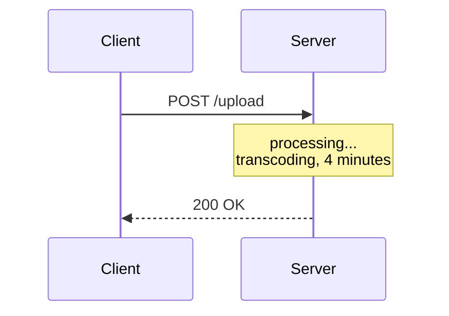
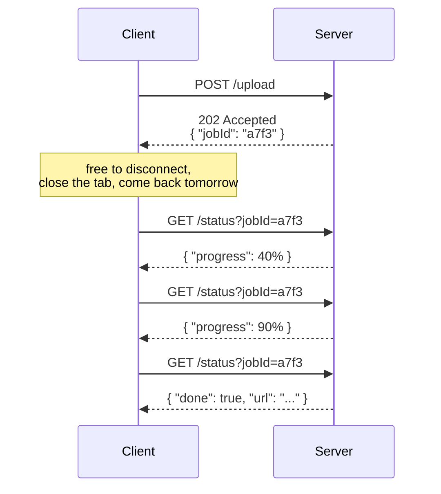
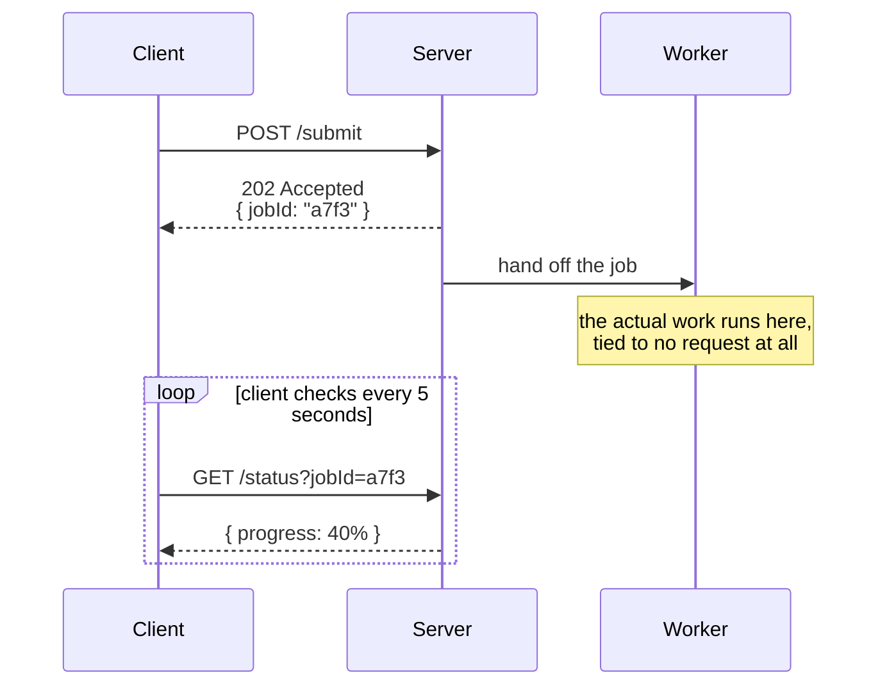
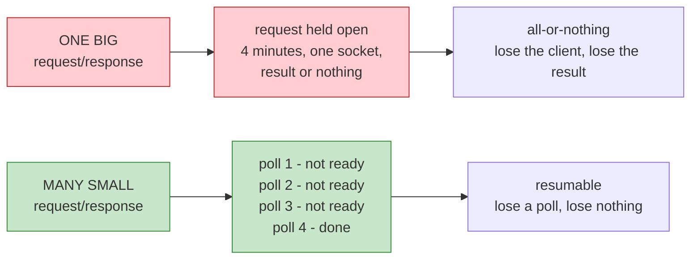
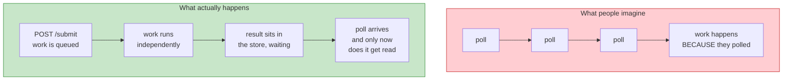
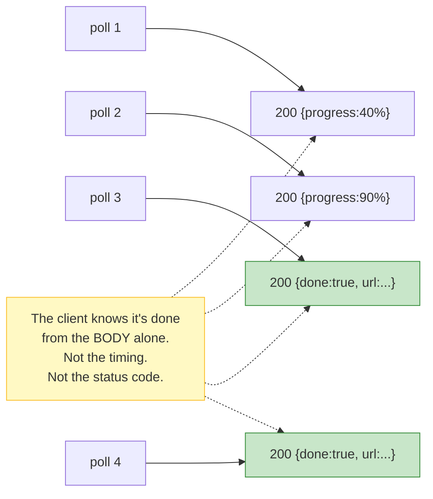
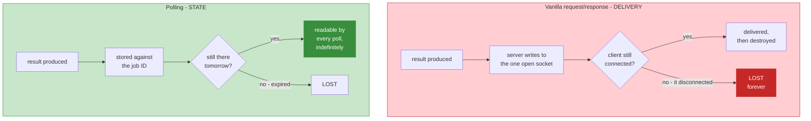
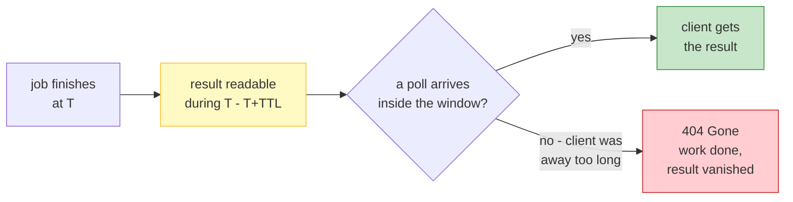

# Lecture 10: Polling — Built Up, Unit by Unit

## Status: In Progress 🔄 (Units 1–3 studied · Units 4–7 not yet delivered)

> ### 📋 Read this before continuing
>
> | Units | State | What that means |
> |---|---|---|
> | **1–3** | ✅ **Studied** | Worked through together. Concepts questioned and confirmed. |
> | **4–7** | ⬜ **Not yet delivered** | Only an outline. Nothing here is written from discussion. |
>
> **Units 1–3 are the mechanism — read them before the rest.** They are the load-bearing part: the problem, the shape, and the word "short." Units 4–7 are evaluation and critique; they're much easier once the mechanism is solid.
>
> **Two claims from the transcript are already in question.** One was flagged before Unit 1 (the in-memory store) and one *arose from our own discussion* — the TTL problem in Unit 3.4, which the transcript doesn't address at all. See *Open Questions*.

> **How to read this doc:** Each unit builds on the previous. Each unit ends with a **Checkpoint** — answer it in your own words before moving on.

---

## Lecture Map

| Unit | Content | State |
|---|---|---|
| **1** | **The problem polling solves** — long work, and you need a handle back | ✅ Studied |
| **2** | **The mechanism** — three lifetimes, and every poll is itself a Request/Response | ✅ Studied |
| **3** | **Why "short"** — and the delivery-vs-state distinction | ✅ Studied |
| 4 | The upside — simple, safe disconnect, fits long work | ⬜ |
| 5 | The downside — the scaling math, and why 99% is waste | ⬜ |
| 6 | The demo — two real bugs hiding in "elegant" code | ⬜ |
| 7 | Recap — and what Long Polling exists to fix | ⬜ |

**Why the order matters:** Units 5 and 6 are where the interesting material is. We only reach them after the mechanism is solid, because the cost argument is unintelligible without knowing exactly what each poll costs.

### Claims flagged for testing

Hussein's transcript makes three claims that this study pressure-tests rather than accepts:

| # | Claim | Why it needs testing | Status |
|---|---|---|---|
| 1 | "Client saves the job ID to disk, disconnects, another client picks it up" | His demo keeps jobs in a **Node.js dictionary in memory** — neither durable nor shared across servers | ⏳ Unit 6 |
| 2 | "Long polling — the better approach **used by Kafka**" | Kafka consumers *do* long-poll the broker, but Kafka's delivery model is log-based pub/sub | ⏳ Unit 7 |
| 3 | "It's a very elegant idea" | Elegant in the single-server case. What survives at 10,000 users? | ⏳ Unit 5 |

### And one the transcript never raises

| # | Gap | Why it matters |
|---|---|---|
| 4 | How long does a finished result stay readable? | Polling replaces "your result may never arrive" with "your result may expire." That's a policy decision the transcript skips entirely — covered in **Unit 3.4** |

---

## Unit 1 — The Problem Polling Solves

### 1.1 — The Shape of the Bad Situation

Start from [Lecture 7](lecture-07-request-response.md). Vanilla Request/Response, one request, one response:

**The client's connection is pinned for the entire duration.** It cannot do anything else. It cannot close the tab. If it does, the response goes nowhere.

### 1.2 — The Concrete Case: Video Upload

Hussein's example — you upload to YouTube.

| Step | Reality |
|---|---|
| 0:00 | You hit upload |
| 0:01 | **You get an upload ID immediately** |
| 0:01–4:00 | Progress bar advances |
| 4:00 | Done |

You are **not** holding one connection open for four minutes. You get a receipt in the first second, then you watch a progress bar.

> **That's polling's entire reason for existing: work that outlives a single request/response exchange.**

### 1.3 — Why Request/Response Can't Do This

Three reasons, and they're structural — not fixable by "just making the server faster":

**1. Duration is unbounded.** The server has no idea in advance whether this request takes 200ms or 40 minutes. One connection can't be held open for an unknown amount of time without risking timeouts, load balancer limits, and deploys that kill in-flight work.

**2. The client is stuck.** A thread, a socket, a browser tab — all occupied doing nothing but waiting.

**3. Failure destroys the work.** Client disconnects at 90%? With vanilla request/response:

> *"The server is not going to keep the response around… we just lost a beautiful response."*

The processing happened. The result existed. Nobody can ever have it.

### 1.4 — Polling's Answer

Change *what the first response contains*. Instead of the result, return a **handle**:

**Notice what moved.** The *waiting* left the request. The client now holds a string, and the string is durable — it survives a refresh, a crash, a redeploy.

This is [Lecture 9](lecture-09-sync-vs-async.md) Unit 7's queue + job ID pattern, seen from the **client's side**: the job ID *was* the handle. This lecture is about how the client cashes it in.

### 1.5 — The Naming, Decoded

Hussein says people saying "polling" almost always mean **short polling**. So:

| Term | Meaning |
|---|---|
| **Polling** | Broad family: *the client repeatedly checks* |
| **Short polling** | Each check returns **immediately**, result or not |

> **"Short" describes how long the server holds each poll — not the whole job.**

A 4-minute job checked every 5 seconds is short polling: each individual exchange is milliseconds long.

---

## Unit 2 — The Mechanism: Three Lifetimes

### 2.1 — The Single Move

Everything in Unit 1 comes down to one change to the first response:

| | Before | After |
|---|---|---|
| **POST /upload returns** | The finished video | `202 Accepted` + a job ID |

That's it. The client trades *waiting for a result* for *holding a reference*.

And a reference is fundamentally different from the thing it points at:

> **A handle is O(1) regardless of the result's size.** 8 characters of job ID whether the job returns a 1 KB JSON object or a 2 GB video.

This is why the pattern scales at all — the client never carries the work.

### 2.2 — Three Things With Three Different Lifetimes

This is the part people miss. Polling isn't two steps. It's **three**, and they don't share a lifetime:

| | What | Lifetime | Visible to client? |
|---|---|---|---|
| **1. The acceptance** | `POST /submit` → job ID | Milliseconds | ✅ Yes |
| **2. The work** | The actual processing | Minutes to hours | ❌ **No** |
| **3. The observation** | Repeated `GET /status` | Milliseconds each | ✅ Yes |

> **The work lives in the middle — and the client cannot see it, cannot hold it, and does not control it.**

That middle section is the whole architectural point. It's the *same* middle section as [Lecture 9](lecture-09-sync-vs-async.md) Unit 7's queue — seen from the server's side there, the client's side here. Same mechanism, two viewpoints.

### 2.3 — Every Poll Is Itself a Request/Response

Hussein says this almost in passing, and it's the conceptual unlock:

> *"Technically, it is request response when you look at the polling from a very narrow angle… multiple short requests as request response. As Paul's right, we broke down, instead of one big request-to-response into multiple requests response which are presented to us as polls."*

**Polling invented no new protocol.** It reused the existing one, N times.

Three consequences worth stating plainly:

**1. Nothing new to build.** No new framing, no new connection handling, no new failure mode. If you have HTTP, you have polling. That's why it survived from 1995 to now.

**2. The failure granularity changed.** In the one-big design, losing the connection loses everything. In the many-small design, losing a poll loses *one poll* — the next one carries on. **This is the resilience argument, and it's the strongest case for the pattern.**

**3. The cost moved.** You traded one long-held connection for many short ones. That's the bill Unit 5 comes due on.

### 2.4 — The Misconception Worth Killing Now

**Polling does not drive the work. It only observes it.**

The work proceeds whether or not anyone ever polls. Prove it: submit a job, never poll again, come back in an hour — the job still finished. Polling had zero influence on that.

**Why this matters practically:** it explains the limit of polling's responsiveness.

The job finishes at second 37. Your next poll is at second 40. **You find out 3 seconds late.** The interval *is* your latency floor — Unit 5's math has teeth because of this.

> **Polling latency is bounded below by the polling interval. No amount of server speed changes that.**

### 2.5 — Where Does the Job Live?

Hussein lists three options for what the backend does after handing out the ID:

| Option | Where the job sits | Survives restart? | Shared across servers? |
|---|---|---|---|
| **Queue** | A real queue | ✅ | ✅ |
| **Persist to disk** | File / database | ✅ | ✅ |
| **In memory** | A dictionary in the process | ❌ | ❌ |

All three are legitimate. The transcript's demo uses the third.

**The two "no" columns are the entire cost of the third** — and they will matter enormously. In Unit 6 we will find out what breaks when the job lives in memory. File that now.

---

## Unit 3 — Why "Short," and the Lost-Response Trap

### 3.1 — Why "Short": The Server Never Waits

> *"The reason we call it short is because we immediately go and get that result."*

Hussein's demo makes the point by sheer repetition:

> *"Is X ready? — Nope. Is it ready? — Nope. Is it ready? — Yes."*

Each answer arrives immediately. **The server never holds the request open.**

| | What the server does when polled |
|---|---|
| **Short polling** | **Looks up** the answer and returns instantly — ready or not |
| **Long polling** | **Waits** for the answer before responding — Lecture 11 |

> **Short polling is a lookup, not a wait.**

That's the whole distinction, and it's why the two have different names. Long polling isn't developed until Lecture 11 — but the contrast has to be stated here, because otherwise "short" is a word with nothing to be short *relative to*.

### 3.2 — Anatomy of One Poll

Three outcomes are possible, and only one is interesting:

| Server state | Response | Meaning |
|---|---|---|
| Job finished | `200` + the result | ✅ This is the one you wanted |
| Job still running | `200` + `{progress: 40%}` | ❓ Nothing new |
| **No such job** | `404` | ⚠️ Gone, expired, or never existed |

**Critical detail:** all three are complete, ordinary HTTP exchanges. The `200 + "not ready"` poll is not free — it consumed a connection, a request line, headers, and a response. Unit 5 prices this.

And here's the subtle part:

> **The poll that finally gets the result is byte-for-byte indistinguishable from the polls that got nothing.**

Same method, same URL, same latency, same status code. The client discovers completion from the **payload**, not from the fact that a response arrived:

**Note that poll 4 also returns the result.** Nothing was consumed by poll 3. This is the setup for 3.3.

### 3.3 — The Core Idea: Delivery vs. State

This is the distinction the entire lecture is built on. Two ways a result can reach a client:

> **In vanilla request/response the response is a delivery — a one-shot event. In polling the result is state — a readable fact.**

Hussein describes the vanilla failure precisely:

> *"If we disconnect, the server will try to respond. The client in this case was disconnected and we just lost a beautiful response. The server is not going to keep the response around."*

And then the polling version:

> *"We didn't deliver it to the client. We only delivered the response when the request was actually completed. So that next poll will actually have immediately the response."*

**Read those two quotes as a pair.** Same scenario, opposite outcomes — and the difference is entirely *whether the server stored the result*.

#### What this buys you

| | Vanilla R/R | Polling |
|---|---|---|
| Client disconnects at 95% | Work lost to you | **Work continues** |
| Client returns tomorrow | Nothing to check | **Result is there** |
| Result read twice | Impossible — it was consumed | **Fine — it's idempotent** |
| Server restart | Response gone | **Gone too — see Unit 6** |
| Client crash mid-transfer | Truncated response | **Just another missed poll** |

That last row is the deep one. **A failed delivery is no longer a failure — it's just a poll that didn't happen.** The system needs no recovery logic, because there's nothing to recover.

### 3.4 — The Bill Comes Due Immediately

Deferring delivery doesn't make the problem disappear. It **moves** it — and creates one genuinely new question.

Hussein raises it himself:

> *"How long do you keep a job that has been finished in the back end? It's up to you, the backend engineer, to configure."*

**A TTL on finished results is a design decision, and it's a real trade:**

| Choose | You get | You suffer |
|---|---|---|
| **Short** (minutes) | Cheap storage | Legitimate clients get `404`s |
| **Long** (days) | Clients can always catch up | **Storage grows with every job, forever** |

Notice the failure mode flips direction. Vanilla request/response loses results for clients that *disconnect*. Polling with an aggressive TTL loses results for clients that are *slow* — a different and larger population.

> **You have exchanged "the result might not arrive" for "the result might expire." Neither is free.**

And this is where polling starts revealing its seams. Unit 5 shows the cost of the *requests*. This cost — **storage and retention policy** — is the one that decides whether polling is viable at all at scale.

---

## Vocabulary

| Term | Meaning |
|---|---|
| **Polling** | Broad family — the client repeatedly checks for an update |
| **Short polling** | Each poll returns immediately, whether or not the result is ready |
| **Handle** | An opaque value the client holds to reference work it isn't waiting on |
| **Job ID / Task ID** | The handle for an async unit of work |
| **`202 Accepted`** | HTTP status meaning "understood, not finished yet" |
| **Progress** | How far along a long-running job is — usually a percentage |
| **Polling interval** | How often the client checks; a client-side setting |
| **Latency floor** | The polling interval — the best possible detection delay |
| **Long polling** | The poll *waits* for a result instead of returning empty — Lecture 11 |
| **Delivery** | A one-shot message to a connected client; lost if it isn't there |
| **State** | A stored fact that any client can read, as often as it likes |
| **Idempotent read** | Reading the same result repeatedly with no side effects |
| **TTL** | Time-to-live — how long a finished result stays readable |

---

## Checkpoints

### Unit 1

1. You upload a video. What does the server return in the **first second**, and why is that the whole trick?
2. Name three structural reasons a single long Request/Response can't handle a 4-minute job.
3. A job runs 40 minutes. The client polls every 5 seconds. What does **"short"** refer to?
4. In 1.4's diagram, what is the client actually *holding* while it waits — and why does that survive a browser refresh?

### Unit 2

1. Why is a job ID an O(1) handle? What specifically makes it O(1)?
2. Name the three things with three different lifetimes in a polling system. Which one is invisible to the client?
3. In Hussein's words, what did polling break "one big" exchange into? Why does that change the failure behaviour?
4. **A job finishes at second 37. Polling interval is 5 seconds.** What's the worst-case delay before the client knows? Now the interval is 1 second — what changed, and what didn't?
5. Two clients submit jobs. Client A polls job 1; client B polls job 2. Whose polling affects whose progress?

### Unit 3

1. Short polling: is the server *looking up* an answer or *waiting* for one? What does long polling do instead?
2. Three poll outcomes are listed in 3.2. What makes the "not ready" poll non-free?
3. **How does the client know the job is done?** Why isn't it the status code, the latency, or the fact that a response arrived?
4. **Delivery vs. state** — explain the difference in one sentence each. Which one does vanilla request/response use?
5. A client polls once, gets the result, and reads it. Then it polls again with the same job ID. What comes back? Why?
6. Name one failure that **only** polling survives, and one failure that **only** polling creates.
7. You set the result TTL to 60 seconds. Describe a user who is now worse off than they were under vanilla request/response.

---

## Open Questions

Logged as we go. ❓ = unverified, first pass.

### Unit 3 — the gap we found ourselves

| # | Question |
|---|---|
| 1 | ❓ What is a sensible production TTL for finished job results? Is it a fixed time, or sliding on each read? If sliding — does a result then **never** expire? |
| 2 | ❓ Should reading a result **consume** it (single-delivery), or should it stay readable (idempotent)? The demo is idempotent. What breaks if you switch to consuming? |
| 3 | ❓ The transcript's `404` is undifferentiated: expired, never existed, evicted by a cache, or wrong ID. Should a real system distinguish these — and does leaking "never existed" matter? |

### Carried from the transcript

| # | Question | Due |
|---|---|---|
| 4 | ❓ The demo stores jobs in an in-memory dictionary. Does that survive a restart? What happens to a client mid-job? | Unit 6 |
| 5 | ❓ Is long polling really "used by Kafka," or is Kafka's model log-based pub/sub with a different reason for long fetches? | Unit 7 |

---

*Units 1–3 of 7 studied together. Units 4–7 awaiting delivery.*