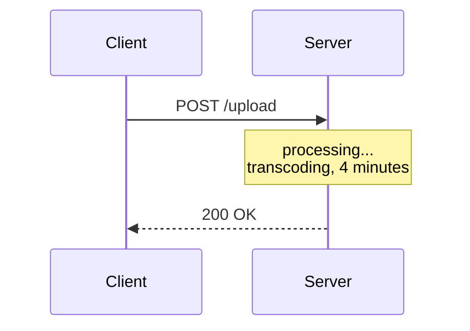
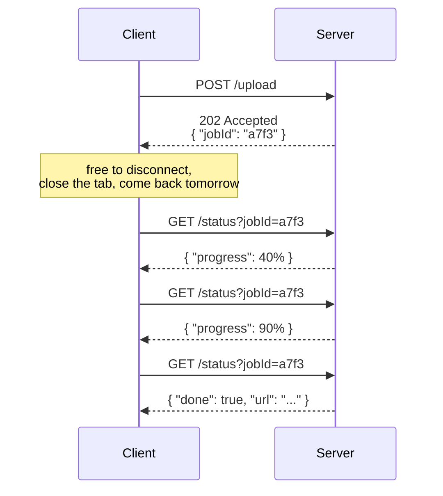

# Lecture 10: Polling — Built Up, Unit by Unit

## Status: In Progress 🔄 (Unit 1 studied · Units 2–7 not yet delivered)

> ### 📋 Read this before continuing
>
> | Units | State | What that means |
> |---|---|---|
> | **1** | ✅ **Studied** | Worked through together. Concepts questioned and confirmed. |
> | **2–7** | ⬜ **Not yet delivered** | Only an outline. Nothing here is written from discussion. |
>
> **Unit 1 is the foundation — read it before the rest.** Unit 2 assumes the handle from Unit 1, Unit 3 assumes Unit 2's two-request shape, and Unit 6 assumes the mechanism is already clear.
>
> **Three claims from the transcript are still untested.** They are listed at the bottom under *Open Questions*. Expect at least one to be corrected.

> **How to read this doc:** Each unit builds on the previous. Each unit ends with a **Checkpoint** — answer it in your own words before moving on.

---

## Lecture Map

| Unit | Content | State |
|---|---|---|
| **1** | **The problem polling solves** — long work, and you need a handle back | ✅ Studied |
| 2 | The mechanism — two requests, not one | ⬜ |
| 3 | Why "short" — and the lost-response trap | ⬜ |
| 4 | The upside — simple, safe disconnect, fits long work | ⬜ |
| 5 | The downside — the scaling math, and why 99% is waste | ⬜ |
| 6 | The demo — two real bugs hiding in "elegant" code | ⬜ |
| 7 | Recap — and what Long Polling exists to fix | ⬜ |

**Why the order matters:** Units 5 and 6 are where the interesting material is. We only reach them after the mechanism is solid, because the cost argument is unintelligible without knowing exactly what each poll costs.

### Three claims from the transcript, flagged for testing

Hussein's transcript makes three claims that this study will pressure-test rather than accept:

| # | Claim | Why it needs testing |
|---|---|---|
| 1 | "Client saves the job ID to disk, disconnects, another client picks it up" | His demo keeps jobs in a **Node.js dictionary in memory** — that is neither durable nor shared across servers |
| 2 | "Long polling — the better approach **used by Kafka**" | Kafka consumers *do* long-poll the broker, but Kafka's delivery model is log-based pub/sub. Different thing |
| 3 | "It's a very elegant idea" | Elegant in the single-server case. What survives at 10,000 users? |

---

## Unit 1 — The Problem Polling Solves

### 1.1 — The Shape of the Bad Situation

Start from [Lecture 7](lecture-07-request-response.md). Vanilla Request/Response, one request, one response:

**The client's connection is pinned for the entire duration.** It cannot do anything else. It cannot close the tab. If it does, the response goes nowhere.

### 1.2 — The Concrete Case: Video Upload

Hussein's example — you upload to YouTube.

| Step | Reality |
|---|---|
| 0:00 | You hit upload |
| 0:01 | **You get an upload ID immediately** |
| 0:01–4:00 | Progress bar advances |
| 4:00 | Done |

You are **not** holding one connection open for four minutes. You get a receipt in the first second, then you watch a progress bar.

> **That's polling's entire reason for existing: work that outlives a single request/response exchange.**

### 1.3 — Why Request/Response Can't Do This

Three reasons, and they're structural — not fixable by "just making the server faster":

**1. Duration is unbounded.** The server has no idea in advance whether this request takes 200ms or 40 minutes. One connection can't be held open for an unknown amount of time without risking timeouts, load balancer limits, and deploys that kill in-flight work.

**2. The client is stuck.** A thread, a socket, a browser tab — all occupied doing nothing but waiting.

**3. Failure destroys the work.** Client disconnects at 90%? With vanilla request/response:

> *"The server is not going to keep the response around… we just lost a beautiful response."*

The processing happened. The result existed. Nobody can ever have it.

### 1.4 — Polling's Answer

Change *what the first response contains*. Instead of the result, return a **handle**:

**Notice what moved.** The *waiting* left the request. The client now holds a string, and the string is durable — it survives a refresh, a crash, a redeploy.

This is [Lecture 9](lecture-09-sync-vs-async.md) Unit 7's queue + job ID pattern, seen from the **client's side**: the job ID *was* the handle. This lecture is about how the client cashes it in.

### 1.5 — The Naming, Decoded

Hussein says people saying "polling" almost always mean **short polling**. So:

| Term | Meaning |
|---|---|
| **Polling** | Broad family: *the client repeatedly checks* |
| **Short polling** | Each check returns **immediately**, result or not |

> **"Short" describes how long the server holds each poll — not the whole job.**

A 4-minute job checked every 5 seconds is short polling: each individual exchange is milliseconds long.

---

## Vocabulary

| Term | Meaning |
|---|---|
| **Polling** | Broad family — the client repeatedly checks for an update |
| **Short polling** | Each poll returns immediately, whether or not the result is ready |
| **Handle** | An opaque value the client holds to reference work it isn't waiting on |
| **Job ID / Task ID** | The handle for an async unit of work |
| **`202 Accepted`** | HTTP status meaning "understood, not finished yet" |
| **Progress** | How far along a long-running job is — usually a percentage |
| **Polling interval** | How often the client checks; a client-side setting |
| **Long polling** | The poll *waits* for a result instead of returning empty — Lecture 11 |

---

## Checkpoint — Unit 1

1. You upload a video. What does the server return in the **first second**, and why is that the whole trick?
2. Name three structural reasons a single long Request/Response can't handle a 4-minute job.
3. A job runs 40 minutes. The client polls every 5 seconds. What does **"short"** refer to?
4. In 1.4's diagram, what is the client actually *holding* while it waits — and why does that survive a browser refresh?

---

## Open Questions

Nothing logged yet — Units 2–7 haven't been studied. When we reach Unit 6, the first question will be whether the in-memory dictionary survives a restart.

---

*Unit 1 of 7 studied together. Units 2–7 awaiting delivery.*