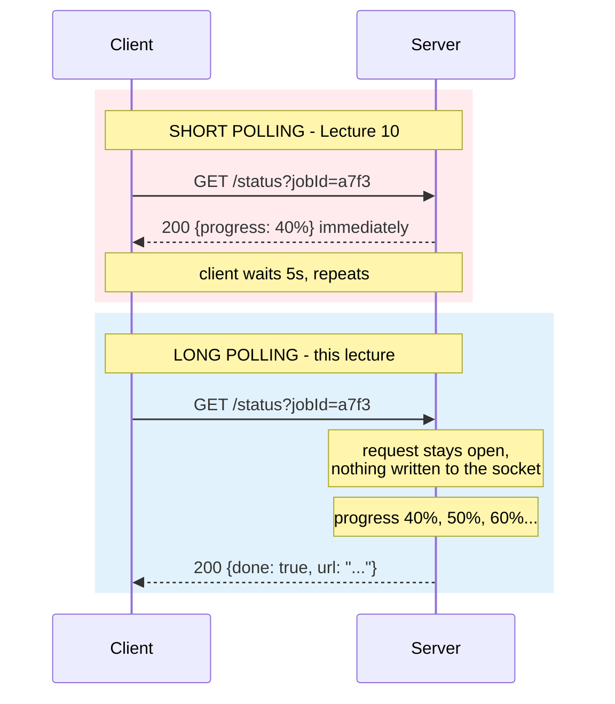
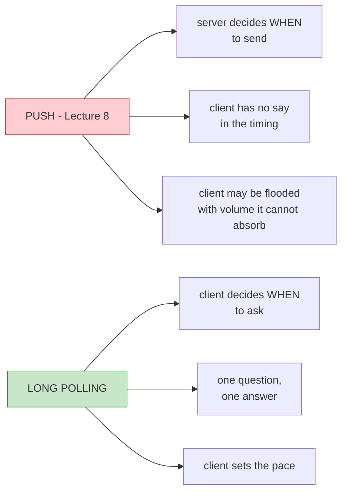

# Lecture 11: Long Polling — Built Up, Unit by Unit

## Status: In Progress 🔄 (Unit 1 studied · Units 2–7 not yet delivered)

> ### 📋 Read this before continuing
>
> | Units | State | What that means |
> |---|---|---|
> | **1** | ✅ **Studied** | Worked through together. Concepts questioned and confirmed. |
> | **2–7** | ⬜ **Not yet delivered** | Only an outline. Nothing here is written from discussion. |
>
> **Unit 1 is the mechanism.** Read it first — Units 2 and 3 are the cost analysis of exactly what Unit 1 describes, and unintelligible without it.
>
> **Unit 3 tests a prediction.** [Lecture 10](lecture-10-polling.md) Unit 7.4 predicted that long polling relocates short polling's cost rather than removing it. Hussein appears to confirm this. Unit 3 will press it.
>
> **Two claims are flagged for testing.** See *Claims flagged for testing* below.

> **How to read this doc:** Each unit builds on the previous. Each unit ends with a **Checkpoint** — answer it in your own words before moving on.

---

## Lecture Map

| Unit | Content | State |
|---|---|---|
| **1** | **The trick** — same request, the server just doesn't reply | ✅ Studied |
| 2 | Why it works — the empty response is deleted | ⬜ |
| 3 | The cost — polling moved server-side | ⬜ |
| 4 | Why Kafka chose it — backpressure, not the trick | ⬜ |
| 5 | The remaining gap — it is still not real time | ⬜ |
| 6 | The demo — the event-loop trap in the `while` loop | ⬜ |
| 7 | Recap — and the road to SSE | ⬜ |

### Claims flagged for testing

| # | Claim from the transcript | Why it needs testing | Status |
|---|---|---|---|
| 1 | "Clients can disconnect" — listed as a **pro** | But the server was *just told* a result exists and now has nobody to send it to. Is this Lecture 10 Unit 3.3's lost-response problem returning? | ⏳ Unit 3 |
| 2 | "Long polling is used by Kafka" | [Lecture 10](lecture-10-polling.md) Unit 7.3 said this is true but beside the point. This transcript gives the *real* reason — **backpressure** — which is neither efficiency nor trickery | ⏳ Unit 4 |
| 3 | *"I wouldn't say simple, to be honest. There's more nuance here"* | The demo contains a `while` loop that **kills the Node event loop**. Is that a transcription slip, or is long polling in Node genuinely this hard? | ⏳ Unit 6 |

### And one prediction from Lecture 10 to verify

[Lecture 10](lecture-10-polling.md) Unit 7.4 claimed:

> **Short polling: stateless server, wasteful traffic. Long polling: efficient traffic, N held connections.** You choose which cost you pay.

Hussein's own summary in this lecture: *"We effectively move the polling from the client side to the server side."*

**If that holds, Unit 7.4 was right.** Unit 3 settles it.

---

## Unit 1 — The Trick

### 1.1 — One Sentence

> **The client sends the exact same request. The server just doesn't respond.**

That's the whole mechanism. Everything else is consequence.

> *"You will make the poll request. Same thing. A request to poll. But the server just doesn't respond. Doesn't write anything to the socket. Instead of saying immediately, 'hey, it's not ready', it just waits there."*

### 1.2 — The Same Problem, Two Behaviours

Recall [Lecture 10](lecture-10-polling.md) Unit 1's setup: you want to know if your video finished transcoding. The **request is identical** in both designs:

Same verb. Same URL. Same method. **Different server behaviour — silence instead of an answer.**

### 1.3 — What "Not Responding" Actually Means

This is where precision matters, because "the server doesn't respond" sounds like a hang or a bug. It isn't:

| It's **not** | It **is** |
|---|---|
| The server is down | The server is healthy and waiting |
| The request timed out | The request is **alive and counted** |
| The client gave up | The client is blocked, holding a connection |
| An error | **A deliberate, temporary state** |

> **An unanswered request is not a failed request. It's a pending one.**

The server has accepted the work of "answer this eventually" and holds the obligation open. That obligation has a cost — but so does every unanswered request everywhere.

### 1.4 — Why It Isn't the Same as Push

[Lecture 8](lecture-08-push.md) taught push, so the confusion is natural: *"isn't this just push?"*

**The client still drives.** It asked, so it will get an answer. The server can't send anything unasked.

> **Push: the server talks, the client listens. Long polling: the client asks, the server waits for a reason to answer.**

This is why the name says *polling* and not *push*. The client is still the initiator of every exchange. The server's silence is not initiative — it's patience.

### 1.5 — The Detail That Sets Up Everything

Hussein is precise about what the server does while silent:

> *"Since it knows that the job is not ready, the response is not ready, it will just say, okay. I'll just do my own thing and I'll come back later."*

**The server keeps working.** It does not block, does not spin, does not sit in a busy loop. It registers "client `a7f3` wants to be told" and gets on with it.

That means:

- One silent request costs **one held connection**, not one held thread
- Many silent clients cost **many connections**, not many threads
- The server is *free to be busy* — but it is **not free to be absent**

Hold onto that last line. It's Unit 3.

---

## Vocabulary

| Term | Meaning |
|---|---|
| **Long polling** | A poll where the server withholds its response until it has something to say |
| **Pending request** | A request the server has accepted but not yet answered |
| **Silence** | The deliberate absence of a response while the server waits |
| **Held connection** | A connection kept open by an unanswered request |
| **Long poll timeout** | The limit after which the server gives up waiting and returns empty anyway |
| **Client-driven** | The client initiates every exchange; the server never speaks unasked |
| **Backpressure** | Letting the consumer set the pace so it isn't flooded — the reason Kafka chose this |
| **`maxWaitMillis`** | Kafka's long-poll ceiling on a `Fetch` request; 500ms by default |

---

## Checkpoint — Unit 1

1. In one sentence, what is long polling?
2. What's identical between a short poll and a long poll? What exactly differs?
3. **Is an unanswered request a failed request?** What's the difference in what the server owes the client?
4. Long polling vs. push: who decides *when* the exchange happens? Why does that make it polling and not push?
5. While a long poll is silent, is the server blocked? What is it actually doing?
6. If 500 clients are sitting on silent long polls, what does the server owe them — threads, or something cheaper? Name the thing.

---

## Open Questions

Logged as we go. ❓ = unverified, first pass.

### Unit 1

| # | Question |
|---|---|
| 1 | ❓ The server holds an obligation to answer eventually. **What happens if the client disconnects during the silence?** Is the result then undeliverable — Lecture 10 Unit 3.3's lost-response problem returning? |
| 2 | ❓ Long polling holds the waiting state *in the request itself*. Is that the least durable place possible? Does it inherit Lecture 10 Unit 6's shared-store problem wholesale? |
| 3 | ❓ A timeout must eventually fire, or the request hangs forever. What does the server return when it does — an empty `200`, or `408`? Does the client immediately re-poll, and does that create a tight loop of long polls with zero idle time? |

---

*Unit 1 of 7 studied together. Units 2–7 awaiting delivery.*