# Lecture 11: Long Polling — Built Up, Unit by Unit

## Status: In Progress 🔄 (Units 1–4 studied · Units 5–7 not yet delivered)

> ### 📋 Read this before continuing
>
> | Units | State | What that means |
> |---|---|---|
> | **1–4** | ✅ **Studied** | Worked through together. Concepts questioned and confirmed. |
> | **5–7** | ⬜ **Not yet delivered** | Only an outline. Nothing here is written from discussion. |
>
> **Unit 1 is the mechanism, Unit 2 the payoff, Unit 3 the bill, Unit 4 the reason anyone uses it.** Units 2 and 3 are a matched pair; Unit 4 answers the question Unit 3 left hanging. Read them in order or the argument doesn't land.
>
> **Unit 3 tests a prediction.** [Lecture 10](lecture-10-polling.md) Unit 7.4 predicted that long polling relocates short polling's cost rather than removing it. Hussein appears to confirm this. Unit 3 will press it.
>
> **Two claims are flagged for testing.** See *Claims flagged for testing* below.

> **How to read this doc:** Each unit builds on the previous. Each unit ends with a **Checkpoint** — answer it in your own words before moving on.

---

## Lecture Map

| Unit | Content | State |
|---|---|---|
| **1** | **The trick** — same request, the server just doesn't reply | ✅ Studied |
| **2** | **Why it works** — the empty response is deleted | ✅ Studied |
| **3** | **The cost** — polling moved server-side, and disconnect is not a pro | ✅ Studied |
| **4** | **Why Kafka chose it** — backpressure, not the trick | ✅ Studied |
| 5 | The remaining gap — it is still not real time | ⬜ |
| 6 | The demo — the event-loop trap in the `while` loop | ⬜ |
| 7 | Recap — and the road to SSE | ⬜ |

### Claims flagged for testing

| # | Claim from the transcript | Why it needs testing | Status |
|---|---|---|---|
| 1 | ✅ **ANSWERED in Unit 3.3** — true against a long-held request, **false against short polling**. Long polling turns Unit 10's *state* back into a *delivery*, so a disconnect can destroy the result | Closed |
| 2 | ✅ **ANSWERED in Unit 4** — neither efficiency nor trickery. **Backpressure**: push makes a slow consumer the broker's emergency; pull makes it a non-event. The log then makes long polling *safe* | Closed |
| 3 | *"I wouldn't say simple, to be honest. There's more nuance here"* | The demo contains a `while` loop that **kills the Node event loop**. Is that a transcription slip, or is long polling in Node genuinely this hard? | ⏳ Unit 6 |

### And one prediction from Lecture 10 to verify

[Lecture 10](lecture-10-polling.md) Unit 7.4 claimed:

> **Short polling: stateless server, wasteful traffic. Long polling: efficient traffic, N held connections.** You choose which cost you pay.

Hussein's own summary in this lecture: *"We effectively move the polling from the client side to the server side."*

**If that holds, Unit 7.4 was right.** Unit 3 settles it.

---

## Unit 1 — The Trick

### 1.1 — One Sentence

> **The client sends the exact same request. The server just doesn't respond.**

That's the whole mechanism. Everything else is consequence.

> *"You will make the poll request. Same thing. A request to poll. But the server just doesn't respond. Doesn't write anything to the socket. Instead of saying immediately, 'hey, it's not ready', it just waits there."*

### 1.2 — The Same Problem, Two Behaviours

Recall [Lecture 10](lecture-10-polling.md) Unit 1's setup: you want to know if your video finished transcoding. The **request is identical** in both designs:

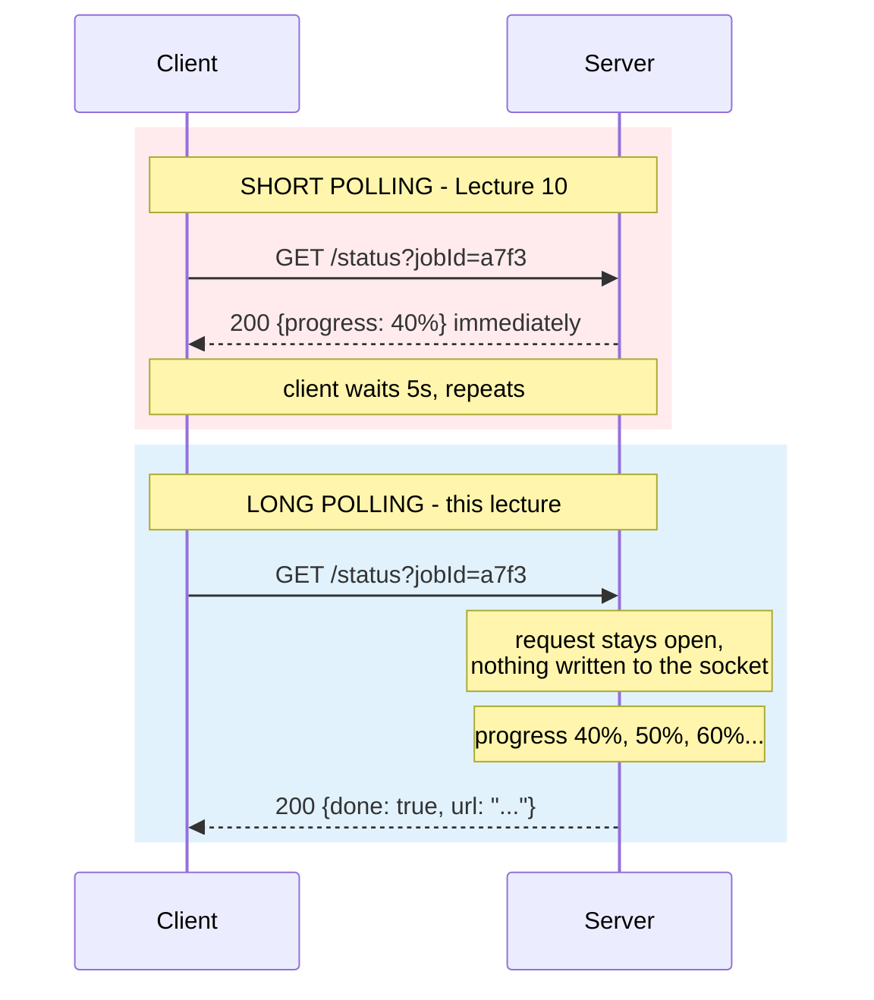

Same verb. Same URL. Same method. **Different server behaviour — silence instead of an answer.**

### 1.3 — What "Not Responding" Actually Means

This is where precision matters, because "the server doesn't respond" sounds like a hang or a bug. It isn't:

| It's **not** | It **is** |
|---|---|
| The server is down | The server is healthy and waiting |
| The request timed out | The request is **alive and counted** |
| The client gave up | The client is blocked, holding a connection |
| An error | **A deliberate, temporary state** |

> **An unanswered request is not a failed request. It's a pending one.**

The server has accepted the work of "answer this eventually" and holds the obligation open. That obligation has a cost — but so does every unanswered request everywhere.

### 1.4 — Why It Isn't the Same as Push

[Lecture 8](lecture-08-push.md) taught push, so the confusion is natural: *"isn't this just push?"*

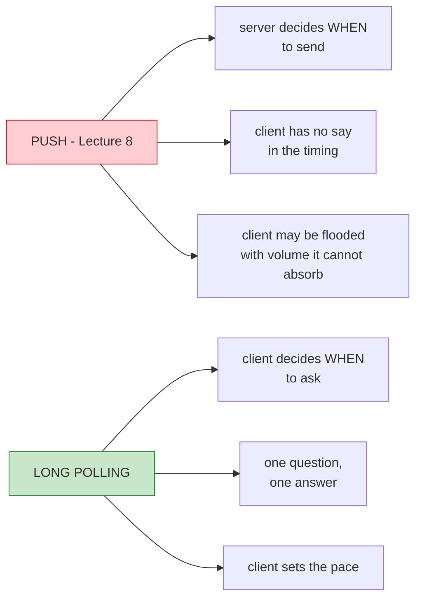

**The client still drives.** It asked, so it will get an answer. The server can't send anything unasked.

> **Push: the server talks, the client listens. Long polling: the client asks, the server waits for a reason to answer.**

This is why the name says *polling* and not *push*. The client is still the initiator of every exchange. The server's silence is not initiative — it's patience.

### 1.5 — The Detail That Sets Up Everything

Hussein is precise about what the server does while silent:

> *"Since it knows that the job is not ready, the response is not ready, it will just say, okay. I'll just do my own thing and I'll come back later."*

**The server keeps working.** It does not block, does not spin, does not sit in a busy loop. It registers "client `a7f3` wants to be told" and gets on with it.

That means:

- One silent request costs **one held connection**, not one held thread
- Many silent clients cost **many connections**, not many threads
- The server is *free to be busy* — but it is **not free to be absent**

Hold onto that last line. It's Unit 3.

---

## Unit 2 — Why It Works

Unit 1 was the mechanism. This unit is the payoff — and the payoff is **bigger than the transcript claims.**

### 2.1 — What Gets Deleted

[Lecture 10](lecture-10-polling.md)'s core finding was the waste:

> 47 of every 48 polls answered *"not ready"* — information the client already had, over a full HTTP round trip.

Hussein's claim:

> *"You did not really waste bandwidth by sending multiple pull requests. The moment Kafka gets a message, it writes back to the client's response. And that's the beauty here… we're less chatty."*

Correct — and the mechanism is subtraction:

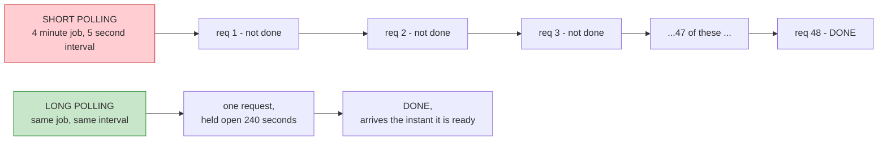

> **Long polling doesn't make the empty response cheaper. It deletes it.**

| | Short polling | Long polling |
|---|---|---|
| Empty responses | 47 per job | **Zero** |
| Meaningful responses | 1 | 1 |
| **Ratio of waste to signal** | **47 : 1** | **0 : 1** |

That is the entire trick. Everything else in this unit is a consequence.

### 2.2 — The Arithmetic

Same job — 4 minutes, 5-second interval:

| | Short polling | Long polling |
|---|---|---|
| Requests | **48** | **1** |
| Bytes on the wire | ~28.8 KB | ~0.6 KB |
| Connection-handshake events | 48 (or 48 keep-alive events) | 1 |
| Server lookup operations | 48 | 1 |

**48× fewer requests. ~48× fewer bytes.** Against [Lecture 10](lecture-10-polling.md) Unit 5.2 — 10,000 users × 2,000 rps — this is the difference between a fleet you scale for emptiness and one you don't.

### 2.3 — The Bigger Win Nobody Mentions

Here's the part the transcript undersells. The bandwidth saving is real, but it isn't the best part:

> **Long polling deletes the polling interval as a source of latency.**

Recall [Lecture 10](lecture-10-polling.md) Unit 2.4: short polling's latency floor *is* the interval, because the job could finish at any moment between polls.

| | Short polling (5s interval) | Long polling |
|---|---|---|
| Best case | 0s | ~0s |
| **Average case** | **2.5s** | **~0s** |
| **Worst case** | **5s** | ~0s |
| What the client experiences | *usually waiting* | *notified* |

With short polling, the job finished at second 237 of 240 and the client waited 3 more seconds anyway. **The work was done and nobody knew.** With long polling, the response is written the instant the job completes.

> **That is a change in kind, not degree.** Short polling means the client is *usually behind*. Long polling means the client is *only ever as late as the network*.

For a chat app, a live dashboard, or anything where "did it just happen?" is the question — this matters more than bandwidth.

**Two wins, and they're independent:**

| Win | What it removes |
|---|---|
| **Bandwidth** | Empty responses |
| **Latency** | The polling interval as a delay source |

Most treatments of long polling mention only the first.

### 2.4 — The Structural Change

Now the deepest form of this. Look at the *formula*:

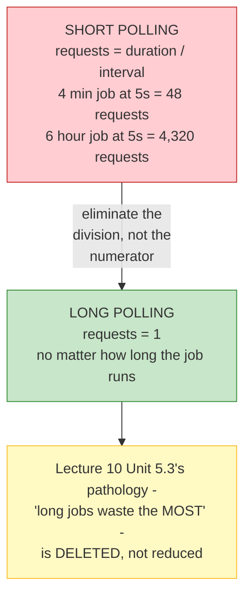

| Job duration | Short polling (5s) | Long polling |
|---|---|---|
| 30 seconds | 6 requests | **1** |
| 4 minutes | 48 requests | **1** |
| 6 hours | 4,320 requests | **1** |
| 3 days | 518,400 requests | **1** |

> **Long polling doesn't reduce the waste ratio — it removes the formula.** Request count stops being a function of duration.

Recall [Lecture 10](lecture-10-polling.md)'s most uncomfortable finding: **the workloads polling is *for* are the workloads where it wastes most**, because waste = `1 − interval/duration` *rises* with duration. Long polling **kills that pathology outright.** A three-day job costs the same single held connection a three-second job does.

**That's why long polling is the correct answer for long work — not just a cheaper version of the wrong one.**

### 2.5 — The Objection, and Why the Runtime Matters

The obvious objection: *aren't you just re-creating the "client stuck holding a request" problem from* [Lecture 9](lecture-09-sync-vs-async.md)?

Good instinct — and the answer is Lecture 9's own distinction:

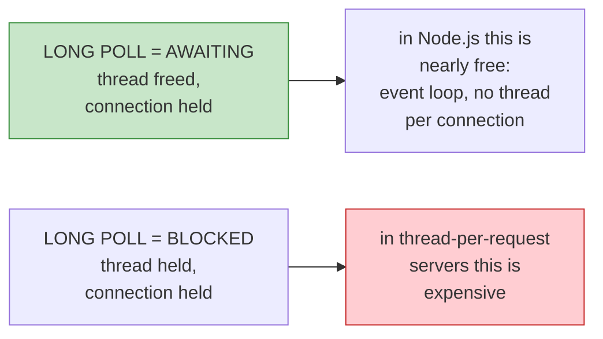

From [Lecture 9](lecture-09-sync-vs-async.md) Unit 1:

| | Thread | This request |
|---|---|---|
| **Blocked** | ❌ Suspended | ❌ Stopped |
| **Awaiting** | ✅ **Freed** | ✅ Paused, connection held |

**A long poll is *awaiting*, not *blocked*** — provided your runtime models it that way.

| Runtime | Long poll cost |
|---|---|
| **Node.js** (event loop, no thread per connection) | Cheap — this is Unit 6's world |
| **Go** (goroutine per connection, cheap) | Cheap |
| **Java / thread-per-request** | Expensive — a real thread parked per client |
| **PHP** (no shared memory, process model) | Awkward — long polls fight the model |

> **The same long polling is nearly free in Node.js and ruinous in a thread-per-request stack.** [Lecture 10](lecture-10-polling.md) Unit 4's "no new protocol" claim holds — but *"cheap"* is a property of the mechanism *and your runtime*.

That last row is why Unit 6's demo — a promise in Node.js — matters, and why it apparently needed extra work to get right.

### 2.6 — What Does NOT Improve

Planting Unit 3, because a unit that only lists wins isn't an analysis:

| | Short polling | Long polling | Verdict |
|---|---|---|---|
| Empty responses | 47 | **0** | ✅ Fixed |
| Detection latency | up to the interval | ~0 | ✅ Fixed |
| Requests scale with duration | Yes | **No** | ✅ Fixed |
| **Connections held** | ~1 briefly | **1 for the whole wait** | ❌ **Worse** |
| **Where the wait is stored** | nowhere (stateless) | **in the request** | ❌ **Worse** |
| **Survives server restart** | Yes (job in shared store) | **No — the wait dies with it** | ❌ **Worse** |
| **Client disconnect mid-wait** | Nothing lost, just stop polling | **Result may be undeliverable** | ❌ **New failure** |

Hussein calls disconnect a **pro** — Unit 3 tests that, because the table above suggests it might be the sharpest edge of all.

---

## Unit 3 — The Cost

Unit 2 listed five things long polling makes worse. This unit prices them — and lands on a conclusion that reframes the whole mechanism.

It settles two claims: [Lecture 10](lecture-10-polling.md) Unit 7.4's prediction, and the "we can disconnect" pro.

### 3.1 — The Scales Differently

The single most important economic fact about long polling:

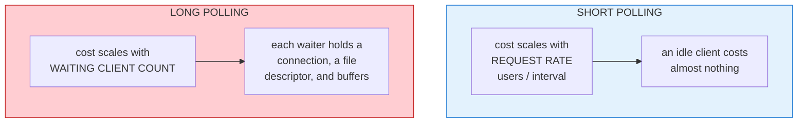

**Different denominators.** That single fact makes them incomparable without numbers:

| | Short polling | Long polling |
|---|---|---|
| 10,000 users, jobs not yet done | ~a handful of requests in flight | **10,000 connections held** |
| Per-waiting-client cost | ~0 | One socket + fd + buffers |
| Idle client | Free | Free (not polling) |
| Waiting client | Cheap and brief | **Held for the whole duration** |

And here's the hard wall — **every connection is a file descriptor.** Remember [Lecture 9](lecture-09-sync-vs-async.md)'s fd clarification? It's back, and it's the constraint that decides your ceiling:

| Resource | Per held long poll |
|---|---|
| File descriptor | 1 — bounded by `ulimit -n` (often 1024, sometimes 65535) |
| Socket buffers | ~4–64 KB of memory |
| Event-loop bookkeeping | Connection object, timers, pending-response state |

10,000 waiting clients ≈ **10,000 fds and roughly 160–640 MB of buffer memory**, depending on runtime.

> **You don't out-scale this with better hardware. You hit a file-descriptor limit, and then you fail.**

### 3.2 — The Relocation, Confirmed

The [Lecture 10](lecture-10-polling.md) Unit 7.4 prediction was:

> *Long polling gives you efficient traffic but N held connections. You choose which cost you pay.*

Hussein's own words:

> *"We effectively move the polling from the client side to the server side. Which is… polling. But hey, it works."*

**Prediction confirmed.** And the loop's ownership visibly changes:

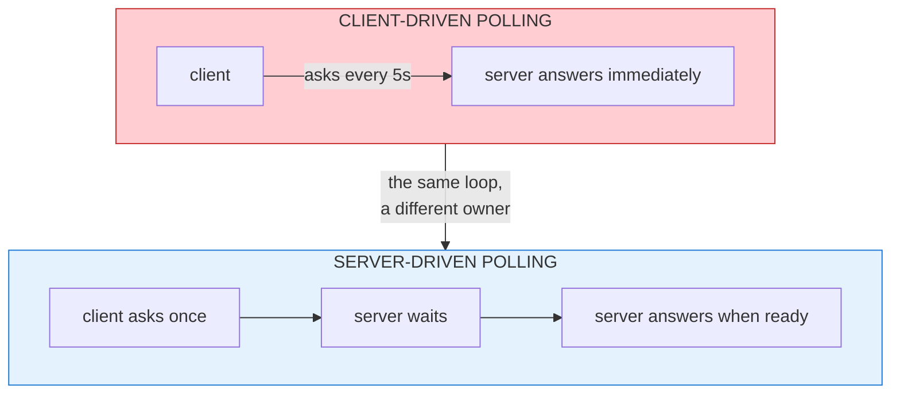

**One refinement the prediction missed.** It's slightly *worse* than [Lecture 8](lecture-08-push.md)'s push, not merely equal:

| | Push connection | Long-poll connection |
|---|---|---|
| Who closes it | The **client** can always hang up | The **server** must decide |
| Duration | Client-controlled | **Open-ended — the server can't bound it** |

> **A long poll gives the client no way to cap the server's obligation.** The server holds N sockets of unknown remaining duration, and it — not the client — owns their lifetime.

### 3.3 — "We Can Still Disconnect" Is Not a Pro

Hussein lists this twice, and it deserves a hard test:

> *"But it says we can disconnect… That's basically it, right? So that's the beauty. We can still disconnect."*

#### First, the charitable reading — he's right about *one* comparison

Against the **one-big-request** model of [Lecture 10](lecture-10-polling.md) Unit 1, he's correct. There the client was locked in for 4 minutes and *could not* leave without losing the result. Long polling **preserves the freedom to leave** that the original model destroyed.

So the claim is valid **against long-held requests**.

#### But the comparison is against short polling — and there it fails

```mermaid
flowchart TB
    subgraph SP["SHORT POLLING - disconnect is free"]
        A1["job finishes,<br/>result STORED on the server"] --> A2["client's connection dies"]
        A2 --> A3["client reconnects<br/>and asks again"]
        A3 --> A4["result is STILL THERE.<br/>State survives the disconnect."]
    end

    subgraph LP["LONG POLLING - disconnect can destroy it"]
        B1["job finishes,<br/>server WRITES to the one socket"] --> B2["client's connection dies<br/>before the bytes land"]
        B2 --> B3["result was a DELIVERY.<br/>Written, never read. GONE."]
        B3 --> B4["client cannot tell whether<br/>it missed something or<br/>nothing happened"]
    end

    style A4 fill:#c8e6c9,stroke:#388e3c
    style B3 fill:#c62828,stroke:#c62828,color:#ffffff
    style B4 fill:#fff9c4,stroke:#fbc02d
```

#### Why: long polling converts state back into delivery

Recall [Lecture 10](lecture-10-polling.md) Unit 3.3 — the central distinction of that lecture:

| | Vanilla request/response | Short polling | **Long polling** |
|---|---|---|---|
| Result is | Delivery | **State** | **Delivery** |
| Readable twice? | ❌ | ✅ | ❌ |
| Disconnect consequence | **Lost** | **Harmless** | **Lost** |

> **Long polling is a partial regression toward the fragile delivery model.** It keeps short polling's efficiency but re-adopts the exact fragility polling was invented to remove.

#### And the recovery is the sting

What does a long-polling client do after a disconnect? It **re-polls.** Which is… short polling.

> **Long polling's failure mode degrades it into short polling — and you only discover it by hitting the failure.**

Worse, the failure is **silent**. With short polling, asking again always gives a definitive answer. With long polling, a disconnected client knows only that it lost its connection — not whether anything happened in the gap.

#### The verdict

> **Long polling without a shared durable store is strictly worse than short polling.** You pay the connection cost, you keep the delivery fragility, and you get *less* reliability.

### 3.4 — The Timeout Is Mandatory — and It Resurrects the Arithmetic

Hussein is right that timeouts exist, and doesn't follow through:

> *"You cannot pull forever… there is a timeout, the client timeout, there is a server timeout and stuff like that so that you don't wait forever."*

**Mandatory, and not optional polish.** Reasons beyond politeness: your load balancer will kill the connection anyway (typically 30–60s), dead clients can't be reliably detected otherwise, and a restart must reclaim everything.

#### This answers ❓ question 4 from Unit 2

Unit 2 said request count = **1**. That was conditional. The honest formula:

$$\text{requests} = \left\lceil \frac{\text{duration}}{\text{server timeout}} \right\rceil$$

| | Short polling (5s) | Long polling (30s timeout) |
|---|---|---|
| 4-minute job | 48 requests | **8 requests** |
| 6-hour job | 4,320 requests | **720 requests** |
| 3-day job | 518,400 requests | **8,640 requests** |

Still vastly better — but **not 1**, and **Unit 2's "the formula is deleted" was overstated.** It's reduced by a factor of `interval ÷ timeout`.

#### And the timeout reintroduces what Unit 2 deleted

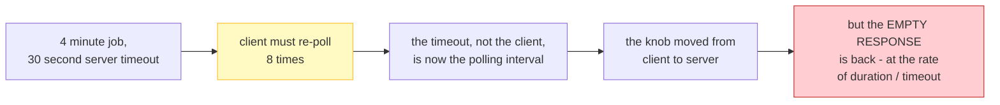

> **Long polling doesn't eliminate the empty response. It raises its interval from client-chosen to server-chosen.**

That's the honest version of Unit 2's claim, and it's still a big win. But "eliminated" was too strong, and ❓ question 4 is **closed with this formula**.

### 3.5 — It Is Still Not Real Time

Hussein's second con, and he's more precise here than most treatments:

> *"It's not really real time… if we got a message between the time I responded and then I got a message, the client has to still make a request, a pull request to check if there are messages in this period."*

The gap: after each response, the client must **issue the next request**. Events arriving in that gap are missed *by that long poll*.

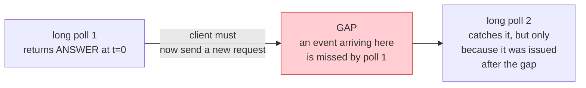

> **Long polling converts a stream into a sequence of snapshots.** Each long poll delivers one answer at one instant. Between them there is silence, and the gap length is the client's round-trip time.

#### This corrects our own Unit 2.3 claim

Unit 2 wrote that long polling makes you *"only ever as late as the network."* That's right **per event** and wrong **between events**. Real staleness is:

$$\text{staleness} = \text{re-poll gap} \approx \text{client RTT}$$

Local: milliseconds. Mobile radio: hundreds of milliseconds to seconds. Not zero.

**And Unit 2.6's own ❓ question 6 gets its answer here:** long polling delivers the *final result* beautifully and **intermediate progress not at all**. One long poll, one answer. A progress bar is fundamentally incompatible with it — which is precisely why [Lecture 10](lecture-10-polling.md)'s demo's progress reporting can't survive long polling.

### 3.6 — The Verdict

| | Short polling | Long polling | Winner |
|---|---|---|---|
| Empty responses | 47 per job | 0, or 1 per timeout | **Long** |
| Requests | 48 | 8 | **Long** |
| Detection latency | up to the interval | ~0 per event | **Long** |
| Requests scale with duration | Yes, badly | Yes, mildly | **Long** |
| **Connections held** | Brief | **Whole duration** | Short |
| **Per-waiter memory + fd** | Transient | **Persistent** | Short |
| **Disconnect** | Harmless | **Can destroy the result** | Short |
| **Progress reporting** | ✅ Possible | ❌ Impossible | Short |
| **Server owns connection lifetime** | No | **Yes, unbounded** | Short |

> **Long polling wins on every efficiency measure and loses on every reliability measure.** And the reliability losses are the ones that page you at 3am.

#### The condition under which it's actually safe

Pulling 3.3 and 3.6 together gives one rule:

> **Long polling is safe only when the server stores the result durably — so a reconnecting client can read state instead of relying on a single delivery.**

Now look at what that means for Kafka — and it closes [Lecture 10](lecture-10-polling.md) Unit 7.3 from a completely new angle:

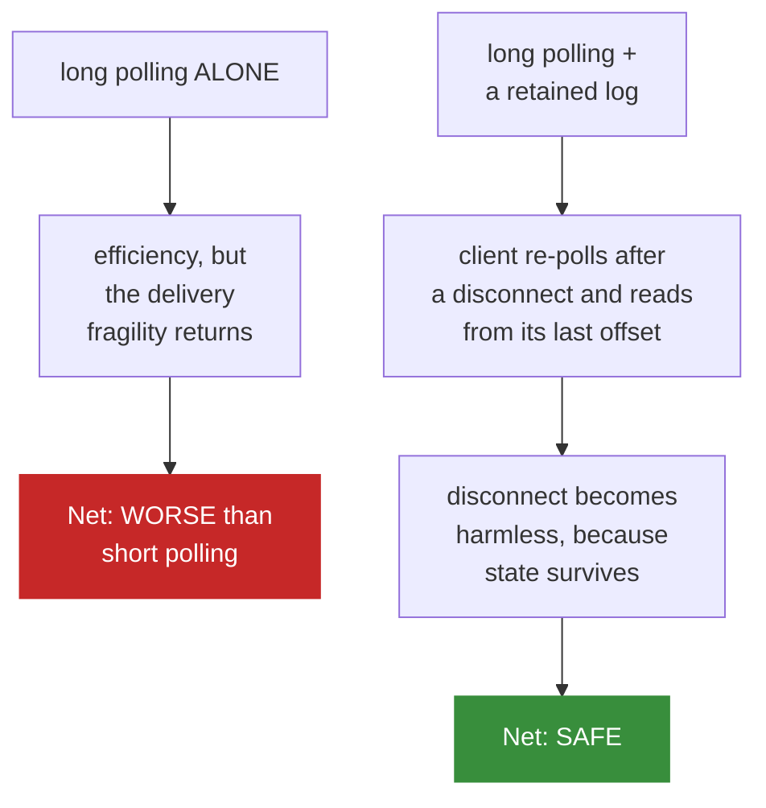

**So Kafka didn't choose long polling because it's efficient. It chose it because it had a durable log to make it safe.** The log isn't a separate feature bolted on — it is the thing that makes long polling viable.

That is why [Lecture 10](lecture-10-polling.md) Unit 7.3 said the offset log is what makes Kafka Kafka. Unit 3 shows the causal chain: *no log → no safe long polling → don't use it.*

---

## Unit 4 — Why Kafka Actually Chose It

Unit 3 closed the transcript's "long polling is used by Kafka" claim by saying it was *beside the point*. This unit gives the real reason — and it turns out to be the better answer.

### 4.1 — The Reason He Gives

> *"They did not like the push model because… you have a consumer and you connect it to a topic, and every time the topic has data, it pushes the data to the clients' throats, literally. The consumer sometimes cannot handle the volume of messages."*
>
> *"Hey — let the client pull at their leisure."*

That is the whole idea in six words. But *why* can't the consumer handle the volume? Because **nobody consulted it about the rate.**

### 4.2 — Backpressure: Who Sets the Rate?

The volume problem isn't a Kafka detail. It's the fundamental difference between push and pull at the data layer:

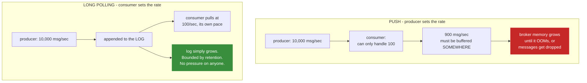

| | Push | Pull |
|---|---|---|
| Rate is set by | **Producer** | **Consumer** |
| Consumer is slow → | Broker buffers, then OOMs or drops | **Nothing. It waits.** |
| Who is the throttle? | The producer — unintentionally | **The consumer — deliberately** |
| Failure mode is visible as | Memory pressure, dropped messages | Log length |

> **Backpressure is a flow-control mechanism where the consumer's processing speed limits the producer's sending speed.** Pull doesn't *manage* backpressure — it makes violating it structurally impossible.

**The elegant consequence:** under push, a slow consumer is the broker's emergency. Under pull, a slow consumer is a non-event.

### 4.3 — Why This Is Worse for Kafka Than for Ordinary Push

[Lecture 8](lecture-08-push.md) taught that push's problems are your problems. Kafka makes three of them fatal:

**1. Volume is unbounded and unpredictable.** A topic can receive a traffic spike no consumer can absorb. Push requires the broker to buffer the difference — and its memory is finite.

**2. Push makes the broker stateful.** To push, the broker must track every consumer's position, decide routing, and handle in-flight messages per consumer. **Pull makes the consumer stateful instead** — the consumer holds an offset. Kafka moved that bookkeeping off the broker deliberately.

**3. Redelivery becomes trivial under pull.** Push: a consumer dies holding 500 in-flight messages — what happens to them? A distributed problem. Pull: restart from the **last committed offset** and re-read. At-least-once, trivially.

**4. Replay is free.** A new consumer joins, or you want last Tuesday's data for debugging — reset the offset and read again. Push cannot replay anything it already delivered.

> **Push is fine when consumer speed is predictable and roughly matched to producer speed. Kafka's whole premise is that it isn't.**

### 4.4 — The Log Repairs Unit 3's Regression

Now the payoff. Unit 3.3 concluded:

> *Long polling converts state back into delivery — so a disconnect can destroy the result.*

True in isolation. But Unit 3 also flagged ❓ question 8:

> *If the result must be stored durably anyway, isn't the honest design just SSE?*

Unit 4 answers it. Look at what the log does to the exact failure Unit 3.3 found:

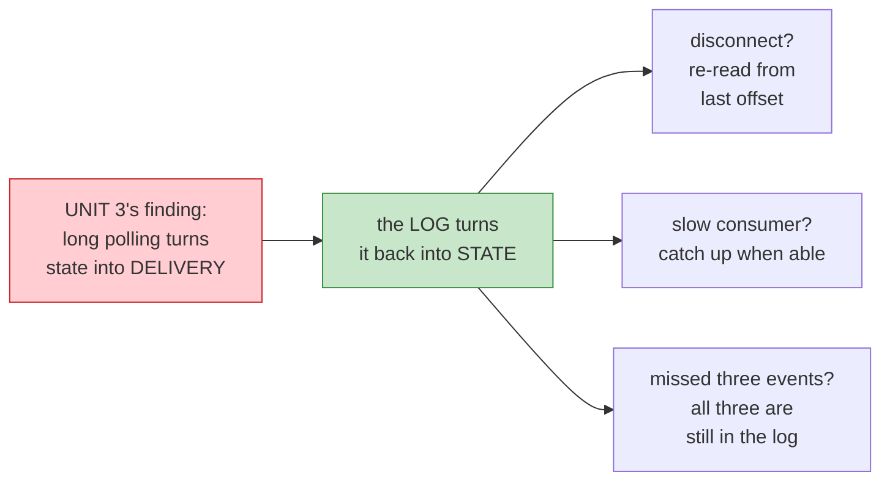

| Unit 3.3's failure | With a log |
|---|---|
| Disconnect after response written | **Nothing lost** — re-read from last offset |
| Client can't tell what it missed | **It knows exactly** — offsets are sequential |
| Slow client forces a decision | **It just takes longer** to catch up |

**So long polling alone is unsafe, and the log is precisely what makes it safe.** The two aren't adjacent features — the log is the other half of the design.

### 4.5 — The Log vs. a Queue

This is where the parked [broker doc](message-brokers-rabbitmq-vs-kafka.md) earns its place. The difference is small in code and enormous in consequences:

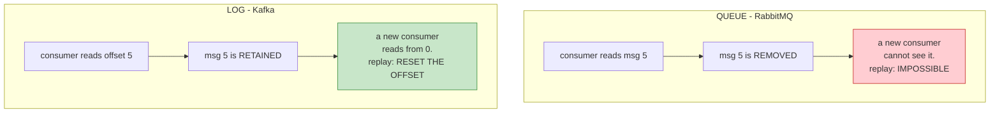

| | Queue | Log |
|---|---|---|
| After a consumer reads | **Deleted** | **Retained** |
| Two independent consumers | Each gets a copy, split the work | **Each reads everything** |
| New consumer joins | Seeks only what's left | **Reads from the beginning** |
| Replay for debugging | ❌ Impossible | ✅ One config change |
| Slow consumer | Messages pile up at the broker | **Log grows** — bounded by retention |
| **Who owns position** | The **broker** | **The consumer** |

> **A queue delivers each message once. A log *keeps* it and lets each reader decide how far to read.** Kafka chose "keeps," and nearly every capability above follows from that one decision.

**And the slow-consumer row explains Unit 3.1's apparently damning cost.** A waiting client's memory grows — so you *worry* about 10,000 held connections. But Kafka's held connection is cheap: an open TCP socket waiting on a read. The load is on the *log*, which is disk, retention-bounded, and cheap. **Kafka moved the pressure off RAM and onto disk.** That's a deliberate trade, not an accident.

### 4.6 — Two Corrections to Our Own Framing

**1. [Lecture 10](lecture-10-polling.md) Unit 7.3 was wrong in emphasis.** We wrote:

> *"Long polling gives you efficiency. Kafka's log gives you replay. **Different problems.**"*

Wrong. They are **one design's two halves**. Long polling without the log is unsafe (Unit 3.3); the log without long polling gives no live notification at all. They're not separable concerns — they're a mechanism and its safety net.

**2. Unit 3 was analysing a component in isolation.** We said "long polling without a durable store is strictly worse than short polling." True *as a standalone design* — but it implicitly assumed long polling was meant to be standalone. It isn't. **Long polling is a wire protocol, not a system design.**

The distinction matters: Unit 3's verdict was correct about the mechanism and wrong about its completeness.

### 4.7 — The Spine of This Unit

> **Pull costs the producer nothing, so the consumer is free to be as slow as it needs to be.** Everything durable in Kafka — replay, at-least-once, independent consumers, debugging — falls out of that one choice.

And the offset deserves its moment, because [Lecture 10](lecture-10-polling.md) Unit 7.7 predicted it:

> **"Kafka offsets — a resumable handle into a log."**

That's exactly what it is, and it's the same primitive as Unit 1's job ID, one level up:

| | Handle | Points into | Resumable? |
|---|---|---|---|
| Job ID (L10 Unit 1) | a record | A store | No — binary done/not-done |
| **Kafka offset** | a position | **An ordered log** | **Yes — read forward from any point** |

Unit 1's handle said *"this thing exists."* Kafka's handle says *"I've read up to here."* The second is strictly more powerful, and it's why Unit 7.7 called the handle the idea worth carrying to every lecture.

---

## Vocabulary

| Term | Meaning |
|---|---|
| **Long polling** | A poll where the server withholds its response until it has something to say |
| **Pending request** | A request the server has accepted but not yet answered |
| **Silence** | The deliberate absence of a response while the server waits |
| **Held connection** | A connection kept open by an unanswered request |
| **Long poll timeout** | The limit after which the server gives up waiting and returns empty anyway |
| **Client-driven** | The client initiates every exchange; the server never speaks unasked |
| **Backpressure** | Letting the consumer set the pace so it isn't flooded — the reason Kafka chose this |
| **`maxWaitMillis`** | Kafka's long-poll ceiling on a `Fetch` request; 500ms by default |
| **Empty response** | A poll's answer of "not ready" — deleted entirely by long polling |
| **Waste-to-signal ratio** | How many empty responses per meaningful one; 47:1 becomes 0:1 |
| **Detection latency** | Time between the work finishing and the client learning of it |
| **Connection budget** | How many open connections a server can hold — the currency long polling spends |
| **Awaiting vs. blocking** | Whether a held request costs a thread or just a connection |
| **Held request** | A long poll occupying a connection while the server waits |
| **Connection budget** | The number of open connections a server can hold — long polling's currency |
| **`ulimit -n`** | The file-descriptor ceiling; the hard wall on concurrent long polls |
| **Socket buffer** | Per-connection memory held by the OS/runtime; scales with waiter count |
| **Re-poll gap** | The interval between a long poll's response and the client's next request |
| **Sequence of snapshots** | Long polling's real shape — not a stream, one answer per request |
| **Backpressure** | Consumer processing speed limiting producer send rate |
| **Throttle** | Whoever sets the rate. Push: the producer. Pull: the consumer |
| **Offset** | A consumer's position in a log; the resumable handle |
| **Consumer group** | A set of consumers sharing one partition's read position |
| **Log vs. queue** | Queues delete on read; logs retain, and each reader picks its own position |
| **Retention** | How long a log keeps messages — the bound on growth |

---

## Checkpoints

### Unit 1

1. In one sentence, what is long polling?
2. What's identical between a short poll and a long poll? What exactly differs?
3. **Is an unanswered request a failed request?** What's the difference in what the server owes the client?
4. Long polling vs. push: who decides *when* the exchange happens? Why does that make it polling and not push?
5. While a long poll is silent, is the server blocked? What is it actually doing?
6. If 500 clients are sitting on silent long polls, what does the server owe them — threads, or something cheaper? Name the thing.

### Unit 2

1. What single thing does long polling delete? Give the waste-to-signal ratio before and after.
2. Same 4-minute job, 5-second interval: requests, and roughly bytes, for each design?
3. **The bigger win.** With a 5-second interval, what's the average detection latency for short polling? For long polling? Why is the second one a *categorical* improvement?
4. Request count for a 6-hour job: short polling vs long polling? Which lecture's finding does that kill?
5. Is a long poll *blocked* or *awaiting*? Which unit decides that, and what does it depend on?
6. **Name three things long polling makes worse.** Which one worries you most?
7. A 3-day job on short polling: how many requests? Now — what's the honest problem with the long-polling answer, given your answer to #4?
8. Short polling's cost scales with one thing; long polling's with another. Name both denominators.
9. Per held long poll, name three consumed resources. Which one is a **hard limit** you cannot buy your way out of?
10. **Steelman and then refute "we can still disconnect."** Against which design is he right? Against which is he wrong?
11. Run the disconnect test: job finishes at t=237, the client's connection drops at t=237.02. What was written, what was read, and what does the client know?
12. In [Lecture 10](lecture-10-polling.md)'s delivery-vs-state table, where does long polling sit — and why is that a regression?
13. What does a long-polling client do after a disconnect? Why is that the sting?
14. **Give the real request-count formula** for a long-polling job with a server timeout. Plug in 4 minutes and a 30-second timeout.
15. What does the timeout *reintroduce* that Unit 2 claimed to delete?
16. Per Hussein, why is long polling "not really real time"? **Does that correct our Unit 2.3 claim?** Say how.
17. What does the progress-bar problem have to do with this?
18. **The rule:** under what single condition is long polling safe?
19. Using Unit 3.6's causal chain — why did Kafka choose long polling? What would go wrong if it had no log?
20. Define backpressure in one sentence. Under push, who is the throttle? Under pull?
21. Producer at 10,000 msg/sec, consumer handling 100/sec. What happens under push? Under pull?
22. Why is "the log grows" a **feature** under pull and a **bug** under push?
23. Name three reasons push is wrong for Kafka specifically.
24. **How does the log repair Unit 3's regression?** Be precise: state, delivery, and what the reconnecting consumer does.
25. Queue vs. log: what happens to a message after a consumer reads it? What follows from that?
26. Whose state does pull move to the consumer, and what operational consequence does that have for a broker operator?

---

## Open Questions

Logged as we go. ❓ = unverified, first pass.

### Unit 2

| # | Question |
|---|---|
| 4 | ✅ **ANSWERED in Unit 3.4 — and we were partly wrong.** With a mandatory server timeout the count is `⌈duration / timeout⌉`, not 1. The structure survives (the server's timeout replaces the client's interval) but "the formula is deleted" was overstated. Corrected in place, not quietly patched | Closed |
| 5 | ❓ Unit 2.5 claims long polling is cheap in Node.js because of the event loop. But each held request still consumes a socket, a buffer, and an entry in the event loop's bookkeeping. **At what connection count does Node.js also start to suffer?** Is "cheap" merely "cheap until it isn't"? |
| 6 | ✅ **ANSWERED in Unit 3.5** — long polling delivers one answer per request, so **progress reporting is impossible** by construction. That's why Lecture 10's demo can't survive it | Closed |

### Unit 3

| # | Question |
|---|---|
| 7 | ❓ Unit 3.3 concludes long polling without a durable store is *worse than short polling*. Then what is long polling **for**, in a system that has a shared store? Is its advantage only latency (Unit 2.3)? |
| 8 | ❓ If the result must be stored durably anyway, isn't the honest design just **SSE** — one persistent connection, every update, no re-poll gap? What does long polling uniquely offer that SSE doesn't? Unit 7 must answer this. |
| 9 | ❓ The 160–640 MB figure in 3.1 is an estimate from assumed buffer sizes. What actually dominates per-connection memory in Node.js, and does it change the ceiling materially? |
| 10 | ❓ Hussein never mentions proxies, but load balancers and CDNs terminate idle connections aggressively. Does that make the *effective* server timeout much shorter than configured — and would it invalidate the request-count formula? |

### Unit 4

| # | Question |
|---|---|
| 11 | ❓ Unit 4.3 says push "makes the broker stateful" and pull "makes the consumer stateful." But Kafka's **committed offsets are stored broker-side** in `__consumer_offsets`. Is the claim actually right, or is the state merely *relocated* rather than *eliminated*? |
| 12 | ❓ Consumer groups were mentioned but not explained. If N consumers share one partition, how do they avoid all reading the same offsets? What does that cost, and does it change Unit 4.2's flow-control story? |
| 13 | ❓ If a consumer is genuinely slower than real time **forever**, the log grows without bound until retention evicts messages the consumer hasn't read. **That is silent data loss.** How does Kafka handle this, and should it change Unit 4.4's "nothing lost" claim? |
| 14 | ❓ Unit 4.5 says pull "costs the producer nothing." But a fast producer still pays for **retention storage** for messages nobody reads. Is that cost invisible? |

### Unit 1

| # | Question |
|---|---|
| 1 | ❓ The server holds an obligation to answer eventually. **What happens if the client disconnects during the silence?** Is the result then undeliverable — Lecture 10 Unit 3.3's lost-response problem returning? |
| 2 | ❓ Long polling holds the waiting state *in the request itself*. Is that the least durable place possible? Does it inherit Lecture 10 Unit 6's shared-store problem wholesale? |
| 3 | ❓ A timeout must eventually fire, or the request hangs forever. What does the server return when it does — an empty `200`, or `408`? Does the client immediately re-poll, and does that create a tight loop of long polls with zero idle time? |

---

*Units 1–4 of 7 studied together. Three of our own claims corrected (Units 3.4, 3.5, 4.6). Units 5–7 awaiting delivery.*