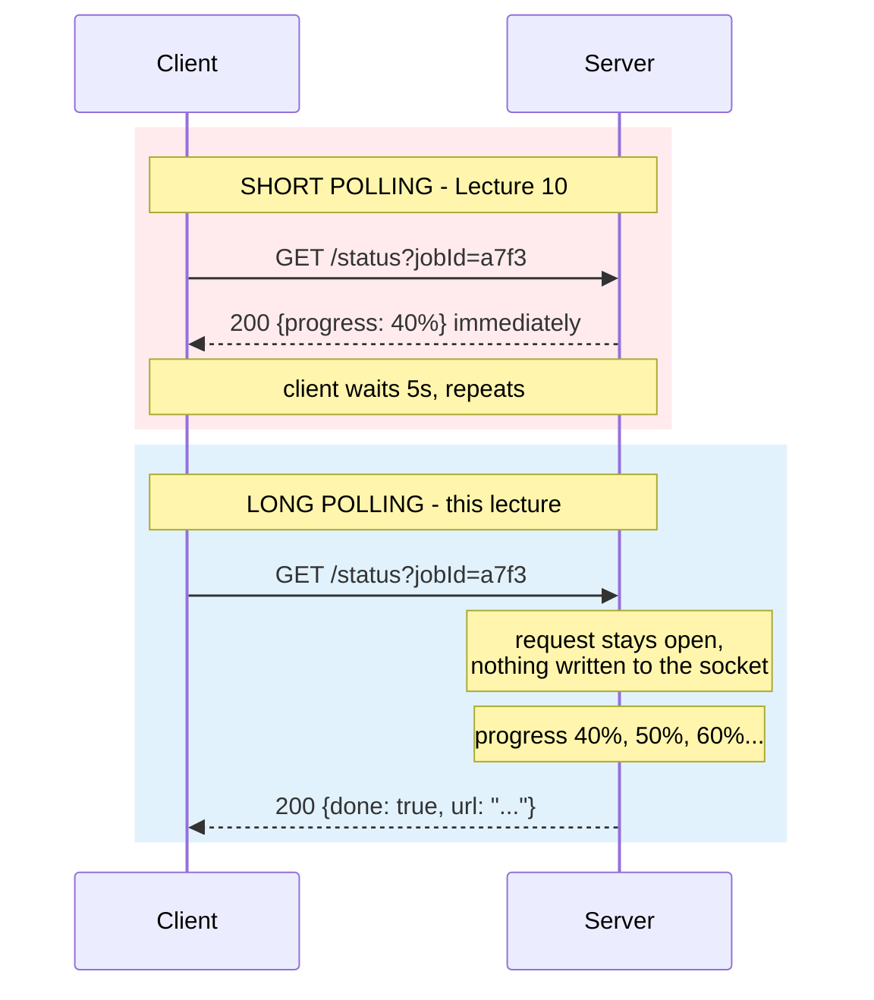
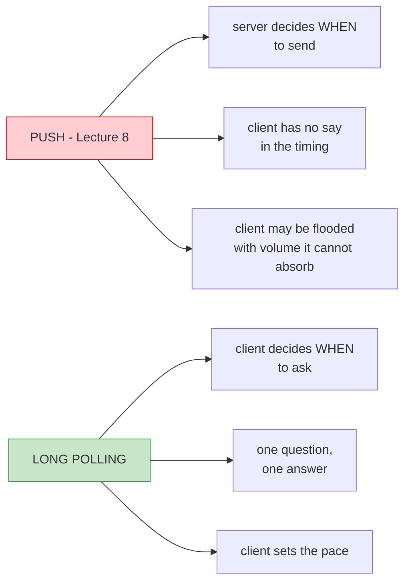
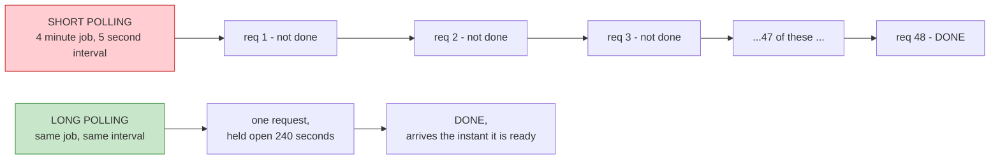
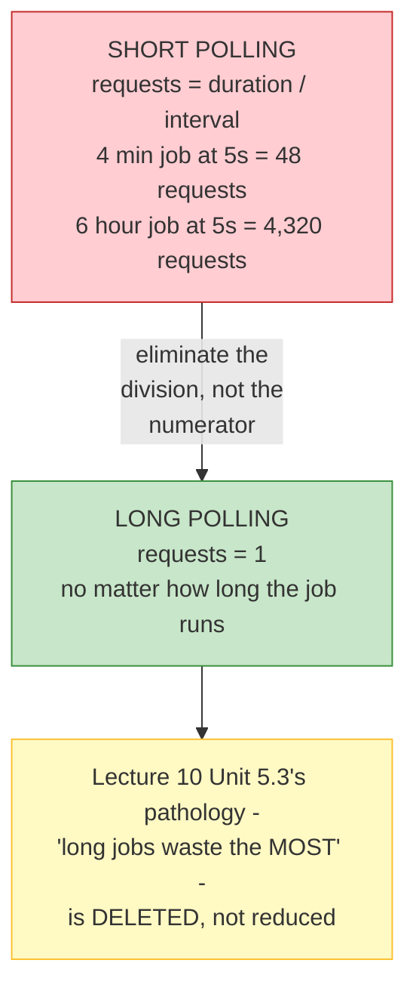
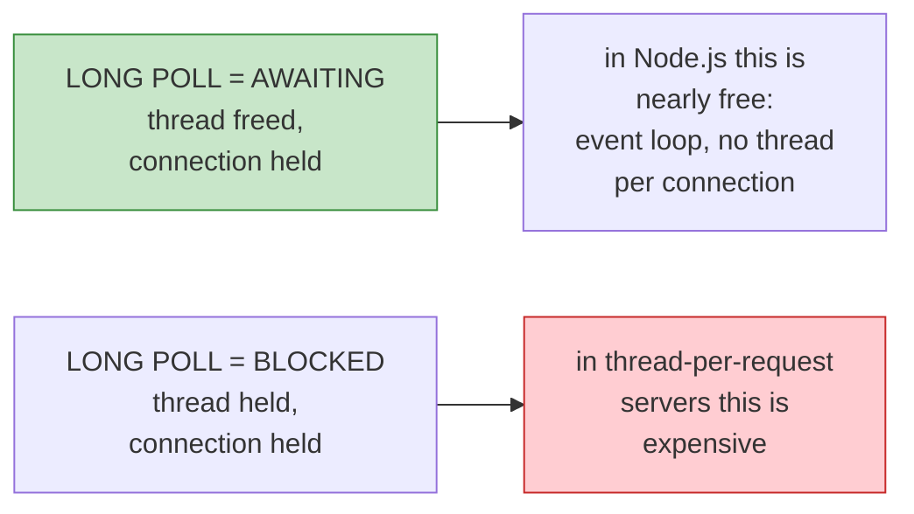

# Lecture 11: Long Polling — Built Up, Unit by Unit

## Status: In Progress 🔄 (Units 1–2 studied · Units 3–7 not yet delivered)

> ### 📋 Read this before continuing
>
> | Units | State | What that means |
> |---|---|---|
> | **1–2** | ✅ **Studied** | Worked through together. Concepts questioned and confirmed. |
> | **3–7** | ⬜ **Not yet delivered** | Only an outline. Nothing here is written from discussion. |
>
> **Unit 1 is the mechanism; Unit 2 is the payoff.** Read both in order. Unit 2 lists five wins and — just as importantly — five things long polling makes *worse*, which Unit 3 then prices.
>
> **Unit 3 tests a prediction.** [Lecture 10](lecture-10-polling.md) Unit 7.4 predicted that long polling relocates short polling's cost rather than removing it. Hussein appears to confirm this. Unit 3 will press it.
>
> **Two claims are flagged for testing.** See *Claims flagged for testing* below.

> **How to read this doc:** Each unit builds on the previous. Each unit ends with a **Checkpoint** — answer it in your own words before moving on.

---

## Lecture Map

| Unit | Content | State |
|---|---|---|
| **1** | **The trick** — same request, the server just doesn't reply | ✅ Studied |
| **2** | **Why it works** — the empty response is deleted | ✅ Studied |
| 3 | The cost — polling moved server-side, and disconnect is not a pro | ⬜ |
| 4 | Why Kafka chose it — backpressure, not the trick | ⬜ |
| 5 | The remaining gap — it is still not real time | ⬜ |
| 6 | The demo — the event-loop trap in the `while` loop | ⬜ |
| 7 | Recap — and the road to SSE | ⬜ |

### Claims flagged for testing

| # | Claim from the transcript | Why it needs testing | Status |
|---|---|---|---|
| 1 | "Clients can disconnect" — listed as a **pro** | But the server was *just told* a result exists and now has nobody to send it to. Is this Lecture 10 Unit 3.3's lost-response problem returning? | ⏳ Unit 3 |
| 2 | "Long polling is used by Kafka" | [Lecture 10](lecture-10-polling.md) Unit 7.3 said this is true but beside the point. This transcript gives the *real* reason — **backpressure** — which is neither efficiency nor trickery | ⏳ Unit 4 |
| 3 | *"I wouldn't say simple, to be honest. There's more nuance here"* | The demo contains a `while` loop that **kills the Node event loop**. Is that a transcription slip, or is long polling in Node genuinely this hard? | ⏳ Unit 6 |

### And one prediction from Lecture 10 to verify

[Lecture 10](lecture-10-polling.md) Unit 7.4 claimed:

> **Short polling: stateless server, wasteful traffic. Long polling: efficient traffic, N held connections.** You choose which cost you pay.

Hussein's own summary in this lecture: *"We effectively move the polling from the client side to the server side."*

**If that holds, Unit 7.4 was right.** Unit 3 settles it.

---

## Unit 1 — The Trick

### 1.1 — One Sentence

> **The client sends the exact same request. The server just doesn't respond.**

That's the whole mechanism. Everything else is consequence.

> *"You will make the poll request. Same thing. A request to poll. But the server just doesn't respond. Doesn't write anything to the socket. Instead of saying immediately, 'hey, it's not ready', it just waits there."*

### 1.2 — The Same Problem, Two Behaviours

Recall [Lecture 10](lecture-10-polling.md) Unit 1's setup: you want to know if your video finished transcoding. The **request is identical** in both designs:

Same verb. Same URL. Same method. **Different server behaviour — silence instead of an answer.**

### 1.3 — What "Not Responding" Actually Means

This is where precision matters, because "the server doesn't respond" sounds like a hang or a bug. It isn't:

| It's **not** | It **is** |
|---|---|
| The server is down | The server is healthy and waiting |
| The request timed out | The request is **alive and counted** |
| The client gave up | The client is blocked, holding a connection |
| An error | **A deliberate, temporary state** |

> **An unanswered request is not a failed request. It's a pending one.**

The server has accepted the work of "answer this eventually" and holds the obligation open. That obligation has a cost — but so does every unanswered request everywhere.

### 1.4 — Why It Isn't the Same as Push

[Lecture 8](lecture-08-push.md) taught push, so the confusion is natural: *"isn't this just push?"*

**The client still drives.** It asked, so it will get an answer. The server can't send anything unasked.

> **Push: the server talks, the client listens. Long polling: the client asks, the server waits for a reason to answer.**

This is why the name says *polling* and not *push*. The client is still the initiator of every exchange. The server's silence is not initiative — it's patience.

### 1.5 — The Detail That Sets Up Everything

Hussein is precise about what the server does while silent:

> *"Since it knows that the job is not ready, the response is not ready, it will just say, okay. I'll just do my own thing and I'll come back later."*

**The server keeps working.** It does not block, does not spin, does not sit in a busy loop. It registers "client `a7f3` wants to be told" and gets on with it.

That means:

- One silent request costs **one held connection**, not one held thread
- Many silent clients cost **many connections**, not many threads
- The server is *free to be busy* — but it is **not free to be absent**

Hold onto that last line. It's Unit 3.

---

## Unit 2 — Why It Works

Unit 1 was the mechanism. This unit is the payoff — and the payoff is **bigger than the transcript claims.**

### 2.1 — What Gets Deleted

[Lecture 10](lecture-10-polling.md)'s core finding was the waste:

> 47 of every 48 polls answered *"not ready"* — information the client already had, over a full HTTP round trip.

Hussein's claim:

> *"You did not really waste bandwidth by sending multiple pull requests. The moment Kafka gets a message, it writes back to the client's response. And that's the beauty here… we're less chatty."*

Correct — and the mechanism is subtraction:

> **Long polling doesn't make the empty response cheaper. It deletes it.**

| | Short polling | Long polling |
|---|---|---|
| Empty responses | 47 per job | **Zero** |
| Meaningful responses | 1 | 1 |
| **Ratio of waste to signal** | **47 : 1** | **0 : 1** |

That is the entire trick. Everything else in this unit is a consequence.

### 2.2 — The Arithmetic

Same job — 4 minutes, 5-second interval:

| | Short polling | Long polling |
|---|---|---|
| Requests | **48** | **1** |
| Bytes on the wire | ~28.8 KB | ~0.6 KB |
| Connection-handshake events | 48 (or 48 keep-alive events) | 1 |
| Server lookup operations | 48 | 1 |

**48× fewer requests. ~48× fewer bytes.** Against [Lecture 10](lecture-10-polling.md) Unit 5.2 — 10,000 users × 2,000 rps — this is the difference between a fleet you scale for emptiness and one you don't.

### 2.3 — The Bigger Win Nobody Mentions

Here's the part the transcript undersells. The bandwidth saving is real, but it isn't the best part:

> **Long polling deletes the polling interval as a source of latency.**

Recall [Lecture 10](lecture-10-polling.md) Unit 2.4: short polling's latency floor *is* the interval, because the job could finish at any moment between polls.

| | Short polling (5s interval) | Long polling |
|---|---|---|
| Best case | 0s | ~0s |
| **Average case** | **2.5s** | **~0s** |
| **Worst case** | **5s** | ~0s |
| What the client experiences | *usually waiting* | *notified* |

With short polling, the job finished at second 237 of 240 and the client waited 3 more seconds anyway. **The work was done and nobody knew.** With long polling, the response is written the instant the job completes.

> **That is a change in kind, not degree.** Short polling means the client is *usually behind*. Long polling means the client is *only ever as late as the network*.

For a chat app, a live dashboard, or anything where "did it just happen?" is the question — this matters more than bandwidth.

**Two wins, and they're independent:**

| Win | What it removes |
|---|---|
| **Bandwidth** | Empty responses |
| **Latency** | The polling interval as a delay source |

Most treatments of long polling mention only the first.

### 2.4 — The Structural Change

Now the deepest form of this. Look at the *formula*:

| Job duration | Short polling (5s) | Long polling |
|---|---|---|
| 30 seconds | 6 requests | **1** |
| 4 minutes | 48 requests | **1** |
| 6 hours | 4,320 requests | **1** |
| 3 days | 518,400 requests | **1** |

> **Long polling doesn't reduce the waste ratio — it removes the formula.** Request count stops being a function of duration.

Recall [Lecture 10](lecture-10-polling.md)'s most uncomfortable finding: **the workloads polling is *for* are the workloads where it wastes most**, because waste = `1 − interval/duration` *rises* with duration. Long polling **kills that pathology outright.** A three-day job costs the same single held connection a three-second job does.

**That's why long polling is the correct answer for long work — not just a cheaper version of the wrong one.**

### 2.5 — The Objection, and Why the Runtime Matters

The obvious objection: *aren't you just re-creating the "client stuck holding a request" problem from* [Lecture 9](lecture-09-sync-vs-async.md)?

Good instinct — and the answer is Lecture 9's own distinction:

From [Lecture 9](lecture-09-sync-vs-async.md) Unit 1:

| | Thread | This request |
|---|---|---|
| **Blocked** | ❌ Suspended | ❌ Stopped |
| **Awaiting** | ✅ **Freed** | ✅ Paused, connection held |

**A long poll is *awaiting*, not *blocked*** — provided your runtime models it that way.

| Runtime | Long poll cost |
|---|---|
| **Node.js** (event loop, no thread per connection) | Cheap — this is Unit 6's world |
| **Go** (goroutine per connection, cheap) | Cheap |
| **Java / thread-per-request** | Expensive — a real thread parked per client |
| **PHP** (no shared memory, process model) | Awkward — long polls fight the model |

> **The same long polling is nearly free in Node.js and ruinous in a thread-per-request stack.** [Lecture 10](lecture-10-polling.md) Unit 4's "no new protocol" claim holds — but *"cheap"* is a property of the mechanism *and your runtime*.

That last row is why Unit 6's demo — a promise in Node.js — matters, and why it apparently needed extra work to get right.

### 2.6 — What Does NOT Improve

Planting Unit 3, because a unit that only lists wins isn't an analysis:

| | Short polling | Long polling | Verdict |
|---|---|---|---|
| Empty responses | 47 | **0** | ✅ Fixed |
| Detection latency | up to the interval | ~0 | ✅ Fixed |
| Requests scale with duration | Yes | **No** | ✅ Fixed |
| **Connections held** | ~1 briefly | **1 for the whole wait** | ❌ **Worse** |
| **Where the wait is stored** | nowhere (stateless) | **in the request** | ❌ **Worse** |
| **Survives server restart** | Yes (job in shared store) | **No — the wait dies with it** | ❌ **Worse** |
| **Client disconnect mid-wait** | Nothing lost, just stop polling | **Result may be undeliverable** | ❌ **New failure** |

Hussein calls disconnect a **pro** — Unit 3 tests that, because the table above suggests it might be the sharpest edge of all.

---

## Vocabulary

| Term | Meaning |
|---|---|
| **Long polling** | A poll where the server withholds its response until it has something to say |
| **Pending request** | A request the server has accepted but not yet answered |
| **Silence** | The deliberate absence of a response while the server waits |
| **Held connection** | A connection kept open by an unanswered request |
| **Long poll timeout** | The limit after which the server gives up waiting and returns empty anyway |
| **Client-driven** | The client initiates every exchange; the server never speaks unasked |
| **Backpressure** | Letting the consumer set the pace so it isn't flooded — the reason Kafka chose this |
| **`maxWaitMillis`** | Kafka's long-poll ceiling on a `Fetch` request; 500ms by default |
| **Empty response** | A poll's answer of "not ready" — deleted entirely by long polling |
| **Waste-to-signal ratio** | How many empty responses per meaningful one; 47:1 becomes 0:1 |
| **Detection latency** | Time between the work finishing and the client learning of it |
| **Connection budget** | How many open connections a server can hold — the currency long polling spends |
| **Awaiting vs. blocking** | Whether a held request costs a thread or just a connection |
| **Held request** | A long poll occupying a connection while the server waits |

---

## Checkpoints

### Unit 1

1. In one sentence, what is long polling?
2. What's identical between a short poll and a long poll? What exactly differs?
3. **Is an unanswered request a failed request?** What's the difference in what the server owes the client?
4. Long polling vs. push: who decides *when* the exchange happens? Why does that make it polling and not push?
5. While a long poll is silent, is the server blocked? What is it actually doing?
6. If 500 clients are sitting on silent long polls, what does the server owe them — threads, or something cheaper? Name the thing.

### Unit 2

1. What single thing does long polling delete? Give the waste-to-signal ratio before and after.
2. Same 4-minute job, 5-second interval: requests, and roughly bytes, for each design?
3. **The bigger win.** With a 5-second interval, what's the average detection latency for short polling? For long polling? Why is the second one a *categorical* improvement?
4. Request count for a 6-hour job: short polling vs long polling? Which lecture's finding does that kill?
5. Is a long poll *blocked* or *awaiting*? Which unit decides that, and what does it depend on?
6. **Name three things long polling makes worse.** Which one worries you most?
7. A 3-day job on short polling: how many requests? Now — what's the honest problem with the long-polling answer, given your answer to #4?

---

## Open Questions

Logged as we go. ❓ = unverified, first pass.

### Unit 2

| # | Question |
|---|---|
| 4 | ❓ Every figure in Unit 2 assumes the client reconnects immediately on timeout. What happens to the "one request" count if a 6-hour job exceeds the server's long-poll timeout and must be re-polled 43 times? Is the formula really deleted, or just made *larger*? |
| 5 | ❓ Unit 2.5 claims long polling is cheap in Node.js because of the event loop. But each held request still consumes a socket, a buffer, and an entry in the event loop's bookkeeping. **At what connection count does Node.js also start to suffer?** Is "cheap" merely "cheap until it isn't"? |
| 6 | ❓ The latency win assumes the job's completion is what the client waits for. What if the client needs **intermediate progress** (like Lecture 10's demo)? Does long polling then only deliver the final result, losing progress reporting? |

### Unit 1

| # | Question |
|---|---|
| 1 | ❓ The server holds an obligation to answer eventually. **What happens if the client disconnects during the silence?** Is the result then undeliverable — Lecture 10 Unit 3.3's lost-response problem returning? |
| 2 | ❓ Long polling holds the waiting state *in the request itself*. Is that the least durable place possible? Does it inherit Lecture 10 Unit 6's shared-store problem wholesale? |
| 3 | ❓ A timeout must eventually fire, or the request hangs forever. What does the server return when it does — an empty `200`, or `408`? Does the client immediately re-poll, and does that create a tight loop of long polls with zero idle time? |

---

*Units 1–2 of 7 studied together. Units 3–7 awaiting delivery.*