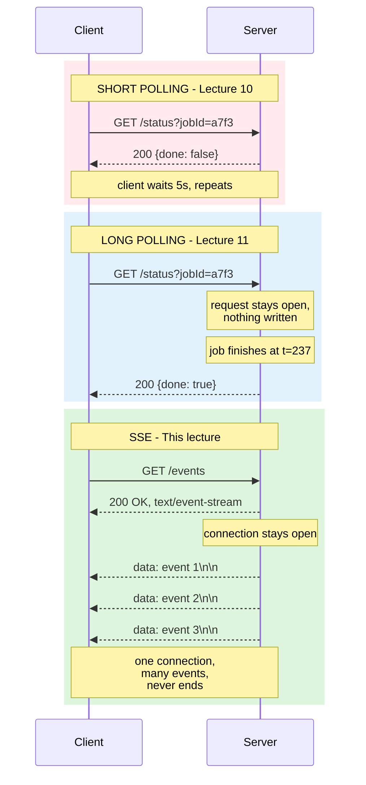
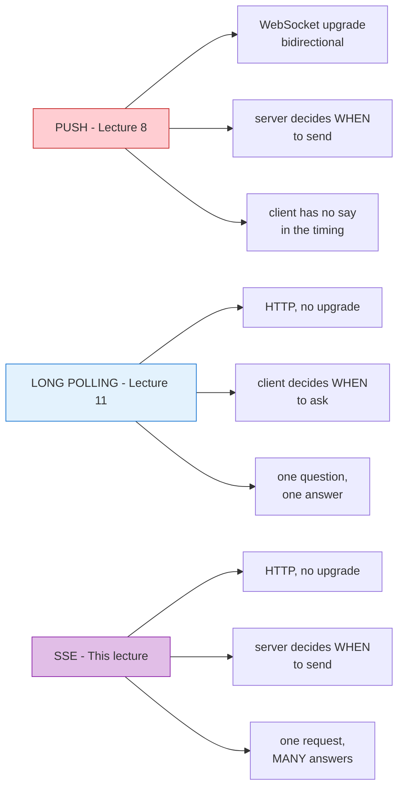

# Lecture 12: Server-Sent Events — Built Up, Unit by Unit

## Status: In Progress 🔄 (Unit 1 studied · Units 2–7 not yet delivered)

> ### 📋 Read this before continuing
>
> | Units | State | What that means |
> |---|---|---|
> | **1** | ✅ **Studied** | Worked through together. Concepts questioned and confirmed. |
> | **2–7** | ⬜ **Not yet delivered** | Only an outline. Nothing here is written from discussion. |
>
> **Unit 1 is the mechanism.** Read it first — Units 2 and 3 are the cost analysis of exactly what Unit 1 describes, and unintelligible without it.
>
> **Two claims are flagged for testing.** See *Claims flagged for testing* below.

> **How to read this doc:** Each unit builds on the previous. Each unit ends with a **Checkpoint** — answer it in your own words before moving on.

---

## Lecture Map

| Unit | Content | State |
|---|---|---|
| **1** | **The trick** — one request, an unending response | ✅ Studied |
| 2 | How it works — `text/event-stream`, `data:` format, `EventSource` | ⬜ |
| 3 | The problem it solves — real-time without WebSocket | ⬜ |
| 4 | The cost — connection limits, backpressure, no resume built-in | ⬜ |
| 5 | The HTTP/1.1 ceiling — 6 connections per domain | ⬜ |
| 6 | The HTTP/2 fix — multiplexing saves it | ⬜ |
| 7 | Recap — where SSE sits on the three axes | ⬜ |

### Claims flagged for testing

| # | Claim from the transcript | Why it needs testing | Status |
|---|---|---|---|
| 1 | *"I think this is elegant design... whoever designed SSE is brilliant"* | Elegant for the server. What about the client? The connection limit? The missing resume? | ⏳ Unit 4 |
| 2 | *"It works with vanilla HTTP... you don't even need to be a WebSocket server"* | True for HTTP/1.1 **until** you hit the 6-connection limit. Then it breaks the page. | ⏳ Unit 5 |
| 3 | *"The browser does the parsing for us... EventSource ships with every browser"* | True, but `EventSource` has **no automatic reconnect with `Last-Event-ID`** in all browsers, and no binary support. | ⏳ Unit 2 |
| 4 | *"The cause is that client must be online... same problem as Push"* | Long polling solved this with a durable store. Does SSE? | ⏳ Unit 4 |

### And one prediction from Lecture 11 to verify

[Lecture 11](lecture-11-long-polling.md) Unit 7.3 placed SSE on the three-axis model:

| | Axis 1: initiator | Axis 2: connection | Axis 3: failure mode |
|---|---|---|---|
| **SSE** | **Server** | **Always** | **Needs protocol** |

**If that holds, Unit 7 will confirm it.** Unit 4 presses the "needs protocol" claim — SSE has no built-in resume, heartbeat, or ordering guarantees.

---

## Unit 1 — The Trick

### 1.1 — One Sentence

> **The client makes one HTTP request. The server responds with a stream that never ends.**

That's the whole mechanism. Everything else is consequence.

> *"We are responding, but it doesn't have an end. Basically, the response doesn't have an end. That's basically what Server-Sent Events are — if you send a request, but you keep getting data, data, data... and just never ends."*

---

### 1.2 — The Same Problem, Three Behaviours

Recall the setup from [Lecture 10](lecture-10-polling.md) and [Lecture 11](lecture-11-long-polling.md): you want to know when something happens on the server — a notification, a message, a login.



Same verb. Same URL. Same method. **Different server behaviour — the response never closes.**

---

### 1.3 — What "Never Ends" Actually Means

This is where precision matters, because "the response never ends" sounds like a hang or a bug. It isn't:

| It's **not** | It **is** |
|---|---|
| The server is broken | The server is healthy and streaming |
| The request timed out | The request is **alive and counted** |
| An error | **A deliberate, infinite response** |
| A WebSocket upgrade | **Pure HTTP/1.1** — no upgrade header |

> **An unended response is not a failed response. It's a streaming response.**

The server has accepted the work of "send every event as it happens" and holds the obligation open **indefinitely**. That obligation has a cost — one connection, forever.

---

### 1.4 — Why It Isn't the Same as Push

[Lecture 8](lecture-08-push.md) taught push, and [Lecture 11](lecture-11-long-polling.md) taught long polling. The confusion is natural:



| | Push (WebSocket) | Long polling | SSE |
|---|---|---|---|
| Protocol | WebSocket (ws://) | HTTP | HTTP |
| Upgrade | Yes | No | No |
| Direction | Bidirectional | Client → Server | **Server → Client only** |
| Who initiates | Server | Client | **Server (after first request)** |
| Connection | Permanent | One wait | **Permanent** |
| Binary data | ✅ Yes | ✅ (in body) | ❌ Text only |

**The client still drives — once.** It opens the connection. After that, **the server controls timing completely**.

> **Push: server talks, client listens. Long polling: client asks, server waits. SSE: client opens, server streams.**

This is why the name says *Server-Sent* — the server is the sender after the initial handshake.

---

### 1.5 — The Detail That Sets Up Everything

Hussein is precise about the format:

> *"Anything that is sent after that as just part of the body will be interpreted by the client as different streams... as long as you start with the word data and you end with two new lines."*

The wire format:

```
data: hello from server

data: another event

data: {"type":"login","user":"alice"}

```

**Two newlines = event boundary.** That's the entire protocol.

And the client side:

> *"The browser does it for us. This is the EventSource object in the browser which ships with every browser."*

```javascript
const es = new EventSource('/stream');
es.onmessage = (event) => console.log(event.data);
```

**No library. No handshake. Pure HTTP.**

---

### 1.6 — The Limitation Hussein Flags Immediately

Before the pros, he gives the con:

> *"The cause is that client must be online... the client has to be there to receive the responses... And the client might not be able to handle it. It's the kind of same problem as Push."*

This is [Lecture 11](lecture-11-long-polling.md) Unit 3.3's **delivery vs state** distinction returning:

| | Short polling | Long polling | **SSE** |
|---|---|---|---|
| Result is | **State** | Delivery | **Delivery** |
| Disconnect consequence | Harmless | Lost | **Lost** |
| Resume | Automatic | Manual re-poll | **Manual (Last-Event-ID)** |

> **SSE is a delivery mechanism, not a state mechanism.** If the client disconnects, events sent during the gap are lost — unless you build the resume machinery yourself.

---

## Vocabulary

| Term | Meaning |
|---|---|
| **Server-Sent Events (SSE)** | One HTTP request, a response stream that never closes |
| **`text/event-stream`** | Content-Type telling the client "this is SSE" |
| **`data:`** | Prefix marking an event payload |
| **Double newline** | Event boundary — `\n\n` |
| **`EventSource`** | Browser API that parses SSE automatically |
| **Unending response** | A response stream the server keeps open indefinitely |
| **Chunked transfer** | HTTP mechanism allowing response body to be sent in pieces |
| **`Last-Event-ID`** | Header sent on reconnect to request missed events (not automatic) |

---

## Checkpoint — Unit 1

1. In one sentence, what is SSE?
2. What's identical between a long poll and an SSE request? What exactly differs?
3. **Is an unended response a failed response?** What's the difference in what the server owes the client?
4. SSE vs. WebSocket: what are three differences in the wire protocol?
5. While an SSE stream is open, who controls *when* events are sent? What does that mean for backpressure?
6. If a client disconnects at t=237, events sent at t=238–240 — what happens to them in SSE? In short polling?

---

## Open Questions

Logged as we go. ❓ = unverified, first pass.

### Unit 1

| # | Question |
|---|---|
| 1 | ❓ The server holds an obligation to stream forever. **What happens if the client disconnects during the stream?** Is the result undeliverable — Lecture 11 Unit 3.3's lost-response problem? |
| 2 | ❓ SSE is pure HTTP/1.1 — but Hussein says HTTP/1.1 **cannot** work for SSE ("At least it should be 1.1 cannot work... because it doesn't support streaming"). Contradiction? |
| 3 | ❓ The format is `data: ...\n\n`. **Why two newlines?** What breaks with one? Is this a real protocol or a "hacky" framing? |

---

*Unit 1 of 7 studied together. Units 2–7 awaiting delivery.*