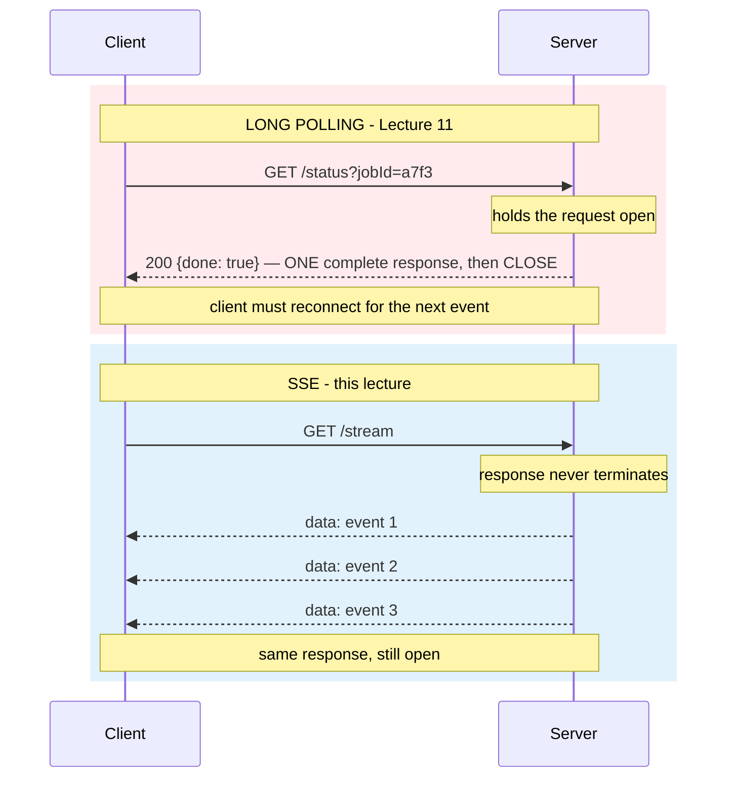
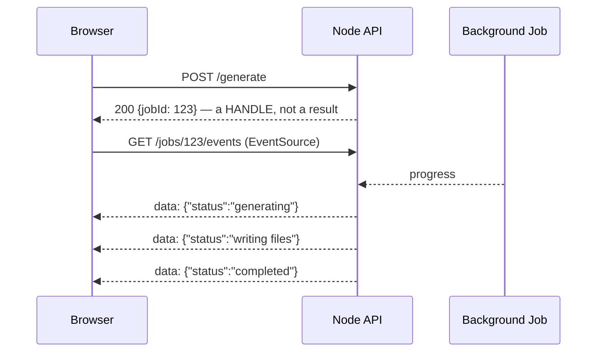
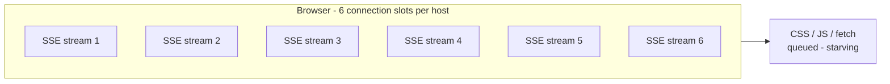

# Lecture 12: Server-Sent Events — Built Up, Unit by Unit

## Status: Complete ✅ (Units 1–7 studied)

> ### 📋 Read this before continuing
>
> | Units | State | What that means |
> |---|---|---|
> | **1–3** | ✅ **Studied** | Built from your own first-principles explanation; corrected and deepened |
> | **4–7** | ✅ **Studied** | Documented from the transcript; every claim tested against Lectures 6–11 |
>
> **Four transcript claims tested.** One is true-but-asymmetric, one is conditionally true, one needed a correction (resume *is* in the protocol — durability isn't), and one is worse than the transcript admits. See *Claims flagged for testing*.
>
> **The Lecture 11 prediction held.** Unit 7 confirms SSE = **server initiates / connection always held / needs a protocol** — with one refinement on Axis 3.
>
> **Three new open questions** (backpressure, the demo's interval leak, HTTP/2 stream-limit defaults) carried to the backlog.

> **How to read this doc:** Each unit builds on the previous. Each unit ends with a **Checkpoint** — answered in your own words before moving on.

---

## Lecture Map

| Unit | Content | State |
|---|---|---|
| **1** | **The trick** — one request, an unending response | ✅ Studied |
| **2** | **How it works** — `text/event-stream`, the `data:` format, `EventSource` | ✅ Studied |
| **3** | **The problem it solves** — real-time without WebSocket | ✅ Studied |
| **4** | **The cost** — client must be online, backpressure, no durability | ✅ Studied |
| **5** | **The HTTP/1.1 ceiling** — 6 connections per domain | ✅ Studied |
| **6** | **The HTTP/2 fix** — multiplexing saves it | ✅ Studied |
| **7** | **Recap** — where SSE sits on the three axes | ✅ Studied |

### Claims flagged for testing

| # | Claim from the transcript | Why it needs testing | Verdict |
|---|---|---|---|
| 1 | *"I think this is elegant design... whoever designed SSE is brilliant"* | Elegant for the server. What about the connection limit? The missing durability? | **True, but asymmetric** — Unit 7.3 |
| 2 | *"It works with vanilla HTTP... you don't even need to be a WebSocket server"* | True for HTTP/1.1 **until** you hit the 6-connection limit. Then it breaks the page. | **Conditionally true** — Units 3.2, 5 |
| 3 | *"The browser does the parsing for us... EventSource ships with every browser"* | True, but the transcript's "no resume built-in" needs precision: the *protocol* has resume hooks; *durability* is what's missing | **True, corrected** — Units 2.4, 4.3 |
| 4 | *"The cause is that client must be online... same problem as Push"* | Long polling solved this with a durable store. Does SSE? | **True, and worse than admitted** — Unit 4.1 |

### Prediction from Lecture 11 to verify

[Lecture 11](lecture-11-long-polling.md) Unit 7.3 placed SSE on the three-axis model:

| | Axis 1: initiator | Axis 2: connection | Axis 3: failure mode |
|---|---|---|---|
| **SSE** | **Server** | **Always** | **Needs protocol** |

**Unit 7 confirms it** — with one refinement: Axis 3's "needs protocol" means the protocol supplies *hooks* (`id:`, `Last-Event-ID`, `retry:`) but the *application* must supply durability, heartbeat, and cross-reconnect ordering.

---

## Unit 1 — The Trick

### 1.1 — One sentence

> **The client sends one normal request. The server responds — and never finishes the response.**

> *"The trick was one request. But the response is very, very, very long. We are responding, but it doesn't have an end."*

### 1.2 — What it breaks, and what it keeps

[Lecture 7](lecture-07-request-response.md) taught that a response is **bytes with a start and an end** — the final boundary is what makes a response a *message*. SSE deliberately **never writes that final boundary**. The HTTP response stays open forever.

But the application still needs discrete messages. So the trick has two layers:

| Layer | What happens |
|---|---|
| **Transport** | One request, one response, never terminated — chunked streaming |
| **Application** | The client parses "mini messages" out of the stream: `data: ...` lines terminated by a blank line |

> *"To the application, someone is making a request and it's streaming a bunch of response that is never ending... But to the client smart enough: I'm going to parse these mini messages and find my events."*

**This is Lecture 7's principle in reverse:** a request is bytes, not an object; TCP is a stream, not a message; *protocols create boundaries*. SSE is a protocol that creates **event boundaries inside the HTTP response stream**.

### 1.3 — Where it sits against what we already know

| Pattern | The trick |
|---|---|
| **Long polling** (L11) | Same request, server **doesn't reply yet** — one answer, late |
| **SSE** (L12) | Same request, server **never stops replying** — many answers, forever |
| **Push** (L8) | Server sends **without** a request at all |

SSE is the hybrid: the **client still initiates** (unlike push), but the **server controls the timing of the data** (unlike request/response). That is exactly the Axis 1 prediction from Lecture 11.



### 1.4 — Checkpoint 1

**Question:** Long polling and SSE both hold a connection open. What is the structural difference in what the server writes to the socket — and why does that difference make SSE real-time in a way long polling is not?

**Answer:** Long polling writes a **complete** response — terminating boundary included — then closes. One event per request/response cycle, and the client is **disconnected while it reconnects**, so there is always a gap between events. SSE writes **partial chunks and never the terminating boundary**: one response carries every event, so the server can write the *instant* an event happens. **Real-time = no reconnect gap.**

---

## Unit 2 — How It Works: The Wire Format

### 2.1 — The headers

The only header the SSE spec **requires** is:

```http
Content-Type: text/event-stream
```

`Cache-Control: no-cache` is conventional (stops proxies from buffering the stream). One correction to the common boilerplate: **`Connection: keep-alive` is unnecessary** — HTTP/1.1 is persistent by default, and the header is *forbidden* in HTTP/2.

### 2.2 — The event format

An event is text lines of `field: value`, terminated by a **blank line**:

```text
data: hello from server

```

The full field set (Hussein's demo uses only `data:`, but the format has more):

| Field | Purpose |
|---|---|
| `data:` | The payload. Multiple `data:` lines before the blank line are **joined with `\n`** into one multi-line event |
| `id:` | Event ID — the browser sends it back as `Last-Event-ID` on reconnect |
| `event:` | Named event — the client listens with `addEventListener('named', ...)` |
| `retry:` | Reconnect delay in milliseconds |
| `: comment` | Lines starting with `:` are comments — the classic **heartbeat** trick |

### 2.3 — The demo, decoded

The transcript's demo: express on `:8888`; `/` returns "hello" (same-origin, so no CORS issue); `/stream` sets the header, then a `send()` function fires **every second** with a counter. Client console:

```js
const sse = new EventSource("localhost:8888/stream");
sse.onmessage = (e) => console.log(e);  // e.data === "hello from server"
```

Two details worth noticing:

- The Network tab shows the request as **pending forever** — *"this is an unending request"*. The trick made visible.
- Hussein's own verdict on the format: *"little hacky, but who cares as long as it works."*

### 2.4 — What `EventSource` gives you for free

Parsing, event dispatch, **auto-reconnect** (sending `Last-Event-ID`), and `retry:` handling. What it does *not* give you: binary data (text only), custom headers or POST (it is always a GET), and — the big one for Unit 4 — any server-side durability.

### 2.5 — Checkpoint 2

**Question:** TCP gives you a byte stream with no message boundaries. Why is a blank line (`\n\n`) enough to create an event boundary inside that stream — and what does the browser do if it receives two `data:` lines before the blank line?

**Answer:** The blank line is an **application-level delimiter both sides agree on** — a convention implemented in the sender's writer and the browser's parser, so raw bytes become discrete events. Two `data:` lines before the blank line are **joined with `\n`** into a single multi-line event (per the SSE spec). The boundary lives in the *format*, not the transport.

---

## Unit 3 — The Problem It Solves

### 3.1 — Real-time without WebSocket

The need: the server must tell the browser something *when it happens* — a user logged in, a message arrived, a job progressed, an AI model produced another token. Request/response can't do it (the client would have to keep asking — polling). WebSocket can do it, but it is **restrictive**: a protocol upgrade, a WebSocket-capable server, stateful connection handling.

SSE threads the needle: **server-timed data over plain HTTP**.

### 3.2 — Claim 2 tested: "works with vanilla HTTP"

> *"It works with vanilla HTTP... you don't even need to be a WebSocket server."*

**Verdict: conditionally true.** Any HTTP server can serve an event stream — no upgrade, no special server. The constraint is not the *server*; it is the *client's connection budget* under HTTP/1.1 (Unit 5). Under HTTP/2 the claim holds fully (Unit 6).

### 3.3 — The architecture you described

Your own first-principles example is the canonical one — and it is the **section spine** from Lecture 10 (*return a handle, then buy the result back*):



SSE is one way to **buy the result back** — the cheapest way when the client is a browser and the flow is server→client.

### 3.4 — Checkpoint 3

**Question:** What does WebSocket give you that SSE doesn't — and what does SSE give you that WebSocket doesn't?

**Answer:** WebSocket: **bidirectional** flow and **binary** frames — necessary when the client must also push (chat, games). SSE: runs on **any HTTP server**, **auto-reconnects**, is plain HTTP (proxy/CDN friendly, no upgrade), and is *simpler* — necessary when the flow is server→client (notifications, progress, token streams). The choice is about **who talks**, not which is "better".

---

## Unit 4 — The Cost

### 4.1 — Claim 4 tested: "the client must be online"

> *"The cause is that client must be online... same problem as Push."*

**Verdict: true, and worse than the transcript admits.** [Lecture 11](lecture-11-long-polling.md) solved disconnect with a **durable store**: the result survives the client's absence. SSE has **no such story** — events sent during a disconnect are gone unless the *application* builds a store and honors `id:`/`Last-Event-ID`. SSE inherits push's availability problem **and** adds a held connection per client.

### 4.2 — Backpressure

`res.write()` returns **`false`** when the client can't keep up; Node buffers until the `'drain'` event. A fast producer + slow consumer = unbounded memory growth unless you handle it. And the demo itself has a leak: the `setInterval` keeps firing into a dead socket after the client disconnects — cleanup needs `req.on('close')`. **The elegance is asymmetric: cheap for the server to start, easy to get wrong under load.**

### 4.3 — Claim 3 corrected: "no resume built-in"

The transcript says SSE has no resume. **Precision matters:** the *protocol* has resume hooks — `id:`, `Last-Event-ID`, `retry:`, and `EventSource` auto-reconnects by default. What is **not** built in is **server-side durability** and **cross-reconnect ordering**. Resume is *opt-in*, not automatic end-to-end. Likewise there is no built-in heartbeat — the `: comment` line is the conventional workaround.

### 4.4 — When polling is still preferred

> *"If you want lighter clients that are not sophisticated enough, you might want to go with a polling approach."*

Held connections are server state. For simple clients or high churn, short or long polling can be the cheaper trade — the same conclusion Lecture 11 reached for long polling.

### 4.5 — Checkpoint 4

**Question:** Long polling solved the disconnect problem with a durable store. Does SSE?

**Answer:** **No.** The protocol gives you the *hooks* (`id:`, `Last-Event-ID`, `retry:`); the *infrastructure* — storing events, honoring the ID, ordering across reconnects — is on the application. A disconnected SSE client loses whatever the server didn't durably keep.

---

## Unit 5 — The HTTP/1.1 Ceiling

### 5.1 — Six connections per domain

> *"There's a limitation in Chrome today. If you connect to a domain, you can only establish six TCP connections to that domain."*

HTTP/1.1 allows **one request per connection** (pipelining exists but is problematic — nobody enables it). The moment a request is sent, the connection is **marked busy**. A pending SSE response marks its connection busy **forever**.

### 5.2 — Starvation

The browser opens up to six connections per host for CSS, JavaScript, images, `fetch()` — everything. If **all six are SSE streams**, every other request to that domain **queues behind them**:



> *"Other requests will starve to the same domain. Even if you cannot even make a GET request, you cannot even fetch a JavaScript file."*

### 5.3 — Checkpoint 5

**Question:** Why do six SSE connections starve a page under HTTP/1.1?

**Answer:** One request per connection, and an unending response keeps its connection busy forever. Six streams consume the entire per-host pool, so every other resource for that domain waits. The page hangs — not because the server failed, but because the **client's connection budget** was spent.

---

## Unit 6 — The HTTP/2 Fix

### 6.1 — Multiplexing

HTTP/2 lets **multiple streams share one TCP connection**. The SSE stream and all page resources travel together — no starvation, because the six-slot budget no longer exists.

### 6.2 — The new limit

The constraint becomes `SETTINGS_MAX_CONCURRENT_STREAMS` — commonly **100–200+**, configurable (Hussein: *"the limit is like 200 and you can configure it"*). One connection, hundreds of streams.

### 6.3 — Checkpoint 6

**Question:** How does HTTP/2 fix SSE's connection problem?

**Answer:** **Multiplexing**: many streams over one connection. The per-host pool of six disappears; the limit becomes the configurable stream cap, and SSE scales to far more concurrent feeds per client.

---

## Unit 7 — Recap: Where SSE Sits

### 7.1 — The Lecture 11 prediction, confirmed

| | Axis 1: who initiates | Axis 2: connection held | Axis 3: failure mode |
|---|---|---|---|
| **SSE** | **Server** | **Always** | **Needs a protocol** |

Refinement on Axis 3: the protocol supplies *hooks*; the application supplies *durability, heartbeat, and cross-reconnect ordering*.

### 7.2 — The unified model, with SSE in place

| | Axis 1: who initiates | Axis 2: connection held | Axis 3: failure mode |
|---|---|---|---|
| Short polling | Client | Never | Impossible |
| Long polling | Client | During the wait | Self-healing |
| **SSE** | **Server** | **Always** | **Needs a protocol** |
| Pub/Sub | Broker | Never | Invisible |

### 7.3 — Claim 1 tested: "elegant design"

> *"I think this is elegant design... whoever designed SSE is brilliant."*

**Verdict: true, but asymmetric.** Elegant **for the server**: any HTTP server, no upgrade, no special infrastructure, the browser does the parsing. The cost is **displaced**, not removed — to the client (connection budget under HTTP/1.1), to the protocol (text only, no built-in durability), and to the application (backpressure, cleanup, resume). This is the same lesson as [Lecture 11](lecture-11-long-polling.md)'s challenge: *elegance in one layer is often a cost in another.*

### 7.4 — The one-sentence trade

> **SSE buys real-time, server-timed delivery over plain HTTP — in exchange for a held connection per client and an application-built durability story.**

### 7.5 — Checkpoint 7

**Question:** Place SSE on the three axes, and state the trade in one sentence.

**Answer:** Server initiates / connection always held / failure mode: needs a protocol (hooks exist, durability doesn't). Trade: real-time server push over plain HTTP, paid for with a held connection per client and an application-built durability story.

---

## Open questions carried forward

| # | Question | Why it matters |
|---|---|---|
| 1 | What is the correct server-side backpressure handling for a slow SSE consumer (`drain`, pause/resume) — and how does it compare to the broker backpressure story in [Lecture 11](lecture-11-long-polling.md) Unit 4? | The demo's `setInterval` never checks `res.write()`'s return value |
| 2 | The demo's `setInterval` leaks on client disconnect — does the cleanup burden (`req.on('close')`) count against the "elegant" claim? | The L12 parallel of L11's challenge B: does the demo's elegance survive its own failure mode? |
| 3 | HTTP/2 stream limits: verify the "~200, configurable" claim against real server defaults (`SETTINGS_MAX_CONCURRENT_STREAMS`; Chrome default 100) | Precision for the Unit 6 conclusion |

---

*Documented after studying the transcript together. Units 1–3 built from your own first-principles explanation; Units 4–7 tested against Lectures 6–11.*
