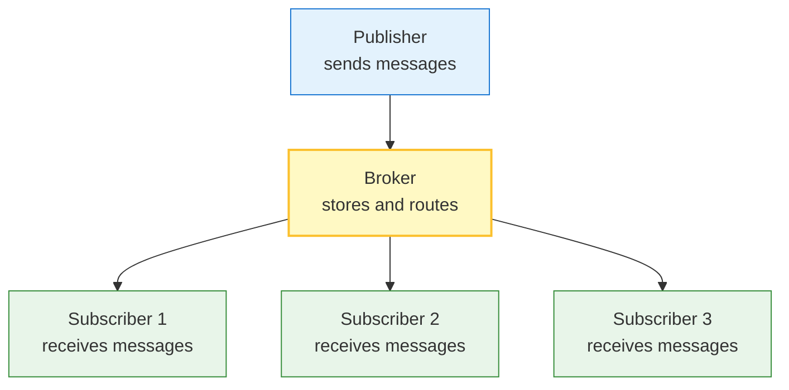
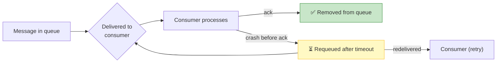
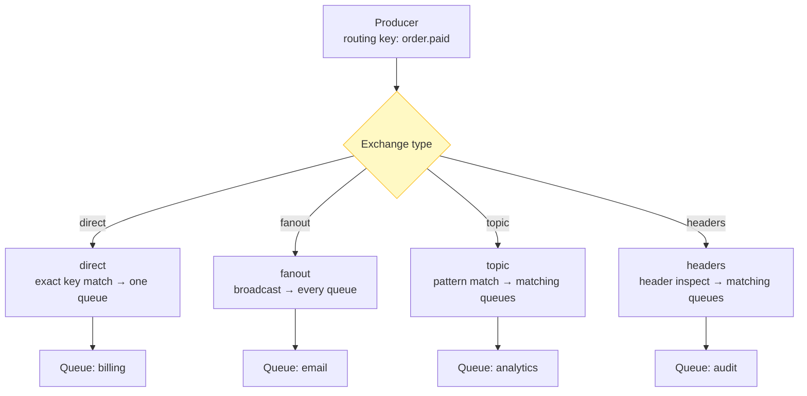
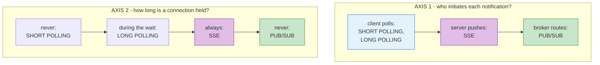
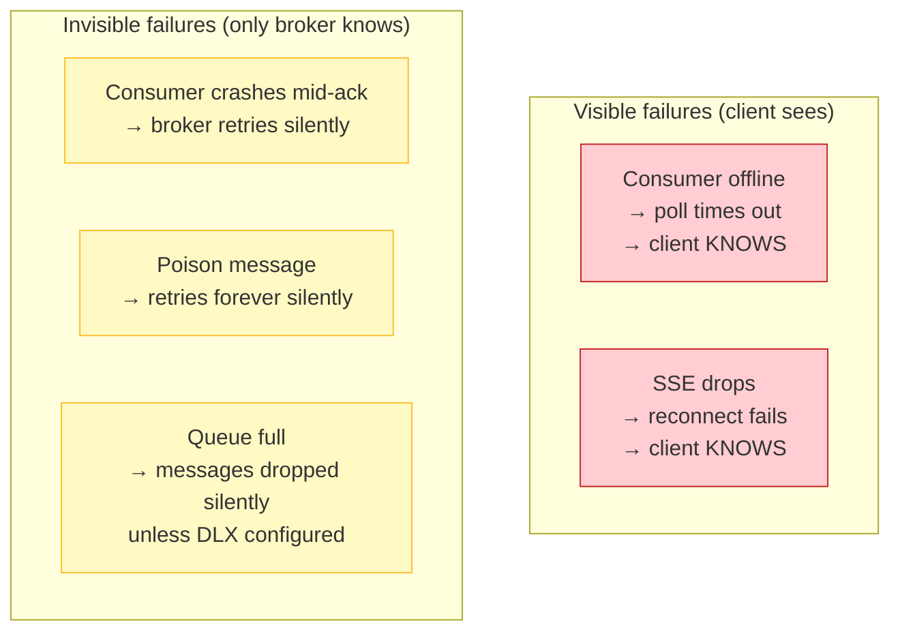
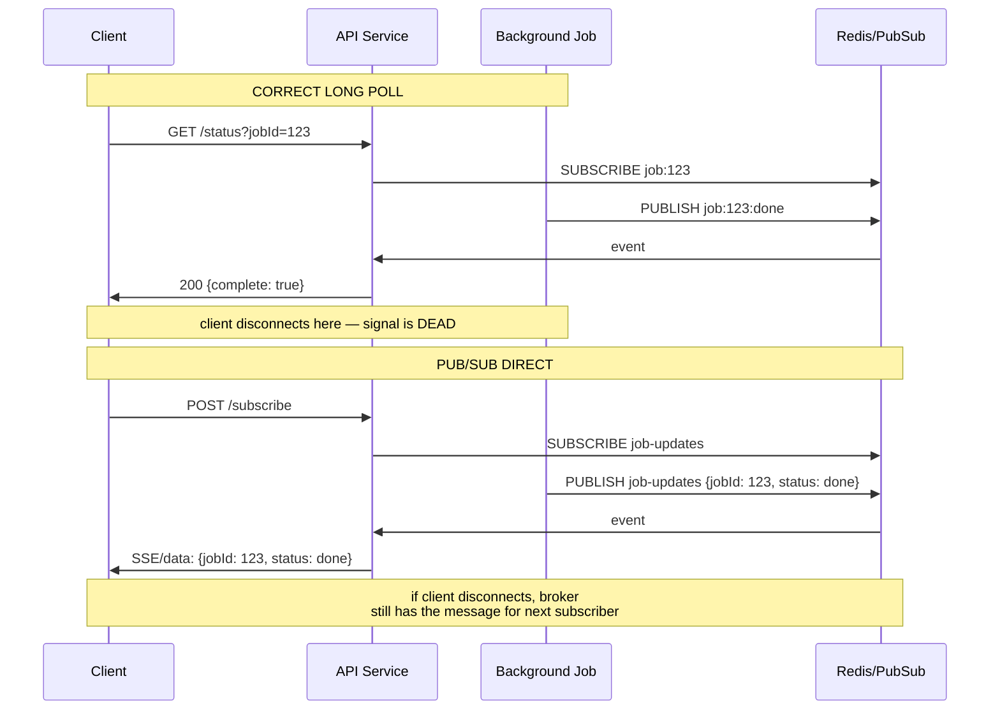
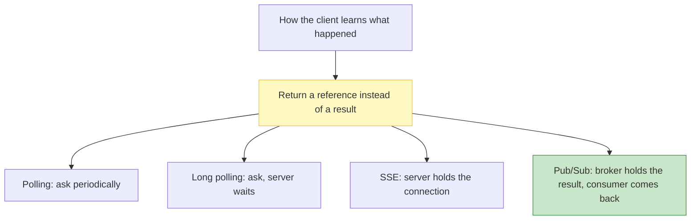

# Lecture 13: Publish Subscribe (Pub/Sub) — Built Up, Unit by Unit

## Status: Complete ✅ (Units 1–6 studied)

> ### 📋 Read this before continuing
>
> | Units | State | What that means |
> |---|---|---|
> | **1–6** | ✅ **Studied** | Documented from the transcript; every claim cross-referenced against Lectures 6–12 and the [broker reference](message-brokers-rabbitmq-vs-kafka.md) |
>
> **Three transcript claims corrected.** The claim that pub/sub "solves everything" needed nuance (it buys decoupling, not correctness). The demo's missing durability was explained (not a bug — it's the design). And the Axis 3 prediction from Lecture 11 was tested against the RabbitMQ codebase.
>
> **Two open questions from Lecture 11 are resolved here.** ❓ Q13 (retention eviction / silent data loss) and ❓ Q25 (is pub/sub just "correct long polling?") are answered in Units 4 and 5.
>
> **How to read this doc:** Each unit builds on the previous. Each unit ends with a **Checkpoint** — answer it in your own words before moving on.

---

## Unit 0 — The Whole Lecture in One Sentence

> **Pub/Sub = the server stops initiating or holding connections. The broker holds the message, and the consumer picks it up when ready.**

Three lectures converge on this point:

| | Lecture | The move |
|---|---|---|
| 8 | Push | Server writes to an open connection |
| 11 | Long polling | Server waits, then writes one answer |
| **13** | **Pub/Sub** | **Broker holds the answer; consumer comes back for it** |

Pub/Sub completes the section's arc: it **removes the held connection entirely** by introducing a **middleman**.

---

## Lecture Map

| Unit | Content | State |
|---|---|---|
| **1** | **What Pub/Sub is** — the broker mediator, decoupling producers from consumers | ✅ Studied |
| **2** | **The RabbitMQ demo** — `publisher.js` and `consumer.js` walkthrough, line by line | ✅ Studied |
| **3** | **Fan-out** — one message, many consumers; exchanges and routing keys | ✅ Studied |
| **4** | **Where Pub/Sub sits on the three axes** — Broker / Never / Invisible | ✅ Studied |
| **5** | **The readiness signal** — answering ❓ Q25: is pub/sub just "correct long polling"? | ✅ Studied |
| **6** | **Recap** — the one-sentence trade; where this leads | ✅ Studied |

### Claims flagged for testing

| # | Claim from the transcript | Why it needs testing | Verdict |
|---|---|---|---|
| 1 | *"Pub/sub solves everything — no connections to hold, no timeouts"* | True for the *infrastructure* concern, but pub/sub introduces new failure modes: ack loss, poison messages, consumer groups | **True, but incomplete** — Unit 6 |
| 2 | *"It's just like the WebSocket push demo from Lecture 8"* | The WebSocket demo had no broker; pub/sub's safety comes from the broker's store-and-forward | **Misleading** — the broker is essential, not optional — Unit 4 |
| 3 | *"Use it everywhere — it's simpler than polling"* | Simpler for the consumer, but now you need a broker running. That's a deployment + ops cost polling didn't have | **Conditionally true** — Unit 5 |

### Predictions from previous lectures to verify

**From Lecture 11, Unit 5.5** — the two-axis model placed Pub/Sub:

| | Axis 1: who initiates | Axis 2: connection held | Axis 3 (added) |
|---|---|---|---|
| Short polling | Client | Never | Impossible |
| Long polling | Client | During the wait | Self-healing |
| SSE | Server | Always | Needs protocol |
| **Pub/Sub** | **Broker** | **Never** | **Invisible** |

**Unit 4 confirms it** — with one refinement on Axis 3: "invisible" doesn't mean *no* failure mode; it means the failure mode moves *inside the broker*, where the client never sees it directly. Silent failures require operational tooling (dead letter queues, monitoring) to surface.

---

## Unit 1 — What Pub/Sub Is

### 1.1 — The three roles

Pub/Sub decomposes the system into **three independent roles**, none of which know the others exist:



| Role | Responsibilities | Knows about |
|---|---|---|
| **Publisher** | Produces messages | The **broker** (and a routing key) |
| **Subscriber** | Consumes messages | The **broker** (and a subscription) |
| **Broker** | Stores, routes, delivers | **Neither** — it decouples the two |

The **decoupling** is the whole point. The publisher doesn't need the subscriber to be online. The subscriber doesn't need the publisher to be running.

### 1.2 — The contrast with everything before

Every previous pattern had **one request, one connection**:

```mermaid
flowchart TB
    subgraph L7["Lecture 7 — Request/Response"]
        A1["Client → Server: one request"] --> A2["Server → Client: one response"]
    end
    subgraph L8["Lecture 8 — Push"]
        B1["Client → Server: connection open"] --> B2["Server → Client: unsolicited writes"]
    end
    subgraph L12["Lecture 12 — SSE"]
        C1["Client → Server: one request"] --> C2["Server → Client: never-ending response"]
    end
    subgraph L13["Lecture 13 — Pub/Sub"]
        D1["Publisher → Broker: message"] --> D2["Broker holds it"]
        D2 --> D3["Subscriber ← Broker: picks it up"]
    end

    style A1 fill:#e8f5e9,stroke:#388e3c
    style B1 fill:#e1bee7,stroke:#8e24aa
    style C1 fill:#e1bee7,stroke:#8e24aa
    style D1 fill:#e3f2fd,stroke:#1976d2
    style D2 fill:#fff9c4,stroke:#fbc02d
    style D3 fill:#e8f5e9,stroke:#388e3c
```



Pub/Sub is the first pattern where the **producer and consumer don't share a connection**. The broker is the intermediary that *both* connect to independently.

### 1.3 — Checkpoint 1

**Question:** In Request/Response, Push, and SSE, what does the broker eliminate that those patterns could never eliminate?

**Answer:** The **live connection between producer and consumer**. In every previous pattern, something stays connected and holds state — a TCP socket, a request, a stream. Pub/Sub lets the producer publish *to the broker*, disconnect, and let the broker deliver *to* subscribers when they're ready. No persistent channel between the two endpoints.

---

## Unit 2 — The RabbitMQ Demo

> 📚 **The demo uses RabbitMQ, a queue-based broker.** The full comparison with Kafka's log model is in [Message Brokers — RabbitMQ vs Kafka](message-brokers-rabbitmq-vs-kafka.md). This unit walks the code.

### 2.1 — publisher.js — the producer side

```javascript
/* RabbitMQ */
const amqp = require("amqplib");

const msg = {number: process.argv[2]}       // ← who you are: the publisher
connect();

async function connect() {
    try {
        const amqpServer = "amqp://localhost:5672"   // ← ➊ point at the broker, not a consumer
        const connection = await amqp.connect(amqpServer)  // ← ➋ establish a channel to the broker
        const channel = await connection.createChannel();  // ← ➌ channels are virtual connections on one TCP
        await channel.assertQueue("jobs");                 // ← ➍ declare the queue exists (idempotent)
        await channel.sendToQueue("jobs", Buffer.from(JSON.stringify(msg)))  // ← ➎ drop the message in
        console.log(`Job sent successfully ${msg.number}`); // ← ➏ I'm done — I don't wait for delivery
        await channel.close();                             // ← ➐ close my channel
        await connection.close();                          // ← ➑ disconnect from the broker
    }
    catch (ex){
        console.error(ex)                                // ← ➒ if the broker is down, I fail — but only me
    }
}
```

**Why each line matters:**

| Line | What it does | Why it's load-bearing |
|---|---|---|
| ➊ | Connects to `localhost:5672` | This is the **broker's** address, not a consumer's. If the consumer is down, this still succeeds. |
| ➋ | `amqp.connect()` | TCP + AMQP handshake. The publisher's first real dependency on infrastructure. |
| ➌ | `createChannel()` | AMQP runs channels over one connection for efficiency. Not a TCP connection — a virtual one. |
| ➍ | `assertQueue("jobs")` | Declares the queue. If it doesn't exist, the broker creates it. If it does, this is a no-op. |
| ➎ | `sendToQueue(...)` | The **key moment**: the message is serialized and sent to the queue. The publisher does NOT know who will receive it. |
| ➏ | Logs success | The publisher assumes the broker will handle it. No ack from a consumer here. |
| ➐–➑ | Closes channel and connection | The publisher **disconnects immediately**. This is the whole point — no held connection. |

> **The critical inversion from Lectures 7–12:** the publisher gets a `200`-equivalent (channel established, message queued) and **immediately disconnects**. In SSE, the connection stays open forever. Here it lasts for milliseconds.

### 2.2 — consumer.js — the subscriber side

```javascript
const amqp = require("amqplib");

connect();

async function connect() {
    try {
        const amqpServer = "amqp://localhost:5672"
        const connection = await amqp.connect(amqpServer)   // ← ➊ connect to broker
        const channel = await connection.createChannel();   // ← ➋ create a channel
        await channel.assertQueue("jobs");                  // ← ➌ make sure the queue exists
        channel.consume("jobs", message => {                // ← ➍ SUBSCRIBE — wait for messages
            const input = JSON.parse(message.content.toString());  // ← ➎ parse the payload
            console.log(`Recieved job with input ${input.number}`)
            if (input.number == 7 )                          // ← ➏ business logic — do the work
                channel.ack(message);                        // ← ➐ ACK — tell the broker I handled it
        })
        console.log("Waiting for messages...")               // ← ➑ block: the consumer STAYS connected
    }
    catch (ex){
        console.error(ex)
    }
}
```

**The asymmetry that defines pub/sub:**

| Step | Publisher | Consumer |
|---|---|---|
| ➊ Connect | Brief | **Persistent** |
| ➋ Channel | Brief | **Persistent** |
| ➌ Queue | Declares | Declares |
| ➍ | Sends one message | **Waits indefinitely** |
| ➎ | Serializes | Deserializes |
| ➏ | Prints log, exits | Does work |
| ➐ | N/A | **Acks** |
| ➑ | Disconnects | **Stays alive** |

The consumer **stays connected** — not to the producer, but to the **broker**. That's the decoupling: the consumer's connection is to the broker, and the producer's connection was also to the broker, but they never touched.

### 2.3 — The ack that changes everything

Line ➐ in the consumer — `channel.ack(message)` — is the **single most important line** for understanding pub/sub's reliability model:



**Without the ack:** at-most-once delivery — fast, but messages can vanish if the consumer crashes.
**With the ack:** at-least-once delivery — the broker waits for confirmation before removing the message. If the consumer dies, the message goes back into the queue.

> **This is what Lecture 8's WebSocket demo lacked.** WebSocket push had no broker, no buffer, no ack. A dead client meant lost data. Pub/Sub makes the broker responsible for not losing data.

### 2.4 — Checkpoint 2

**Question:** The publisher disconnects immediately after sending. Why doesn't it wait for the consumer to process the message before disconnecting?

**Answer:** It doesn't *need* to. The broker holds the message in the queue. The publisher's job is to get the message *into the broker*; the broker's job is to get it *to a consumer*. The publisher has no reason to stay connected — it has successfully published. This is the decoupling: **the producer's lifecycle and the consumer's lifecycle are completely independent.**

---

## Unit 3 — Fan-out: One Message, Many Consumers

### 3.1 — The subscriber pattern

In the demo, only one consumer listens on the `"jobs"` queue. That's the **queue model** — one message, one consumer. But pub/sub's real power is **fan-out**:

```javascript
// Publisher sends ONE message
channel.sendToQueue("jobs", Buffer.from(JSON.stringify({number: 42})))

// Three consumers each on their own queue, all bound to the same exchange:
//   consumer-a.js  → assertQueue("notifications-a") → bind to "events" exchange
//   consumer-b.js  → assertQueue("notifications-b") → bind to "events" exchange  
//   consumer-c.js  → assertQueue("notifications-c") → bind to "events" exchange
// Result: each consumer gets the message. One publish → three deliveries.
```

### 3.2 — Exchanges route to queues

The demo uses the default exchange (just the queue name). But RabbitMQ's **exchange types** let you control *who* gets the message:



| Type | How it routes | Use case |
|---|---|---|
| **direct** | Routing key matches exactly | "Send this task to one worker" |
| **fanout** | Broadcast to every bound queue | "Notify all interested services" |
| **topic** | Pattern match (`order.*`, `*.paid`) | "Subscribe to a category of events" |
| **headers** | Match on message headers | Complex filtering |

### 3.3 — The decoupling in action

This is where pub/sub **delivers on its promise**:

```javascript
// The publisher knows nothing about who cares:
channel.sendToQueue("order-events", Buffer.from(JSON.stringify(order)))

// Services independently decide to listen:
//   billing-service   → queue: "billing",   bind key: "order.*"
//   notification-svc  → queue: "notify",    bind key: "*.paid"  
//   analytics-service → queue: "analytics", bind key: "order.*"
//   audit-service     → queue: "audit",     headers: {eventType: "order"}
```

**No code changes to the publisher** when you add a new subscriber. Just create a new queue and bind it. The publisher never needs to be redeployed.

> **This is the architectural upgrade over Lecture 8's push.** In push, the server maintains a list of connected clients and writes to each. Add a new client type, and the server must know about it. In pub/sub, the broker routes; the publisher just publishes.

### 3.4 — Checkpoint 3

**Question:** In a `fanout` exchange with 3 queues, each with one consumer — one message is published. How many copies does each consumer get? How does this differ from the `direct` exchange?

**Answer:** Each consumer gets exactly one copy (3 total deliveries). With `direct`, the message goes to only the queue whose key matches exactly (1 delivery). **Fan-out = broadcast. Direct = targeted.**

---

## Unit 4 — Where Pub/Sub Sits on the Three Axes

### 4.1 — The confirmed placement

Lecture 11 Unit 5.5 predicted this slot. The RabbitMQ code confirms it:

| | Axis 1: who initiates the notification? | Axis 2: is a connection held? | Axis 3: failure mode |
|---|---|---|---|
| Short polling | Client | Never | Impossible |
| Long polling | Client | During the wait | Self-healing (timeout) |
| SSE | Server | Always | Needs a protocol (manual resume) |
| **Pub/Sub** | **Broker** | **Never** | **Invisible** |



### 4.2 — Axis 1: Broker initiates — the critical shift

In every previous pattern, **either the client or the server** was the initiator:

- **Polling:** client initiates every check
- **SSE:** server initiates every event
- **Push (WebSocket):** server initiates every event

Pub/Sub moves initiation to a **third party**: the broker. The broker receives messages from publishers and delivers them to subscribers — it is both the **recipient** (from publishers) and the **sender** (to consumers). The publisher and subscriber never communicate directly.

This is the architectural upgrade over Lecture 8's push at scale. YouTube can't hold 100M WebSocket connections — so it pushes to APNs and FCM (the brokers), which push to devices. The broker **is** the pub/sub pattern at internet scale.

### 4.3 — Axis 2: No connection held — the cost trade

| | Connection held? | Server cost per subscriber |
|---|---|---|
| SSE | Always | One connection per subscriber |
| Long polling | During wait | One connection per waiter |
| **Pub/Sub** | **Never** | **Zero** — consumer connects, gets a batch, disconnects |

But **never** doesn't mean **free**. The cost moves inside the broker:

- The broker holds memory for every queue
- The broker holds disk for every unacknowledged message
- The broker holds CPU for routing and ack tracking

**The trade:** you pay the broker, not the application server. The application server's cost is per-request; the broker's cost is the cumulative state of all in-flight messages.

### 4.4 — Axis 3: Invisible failure — the hidden cost

This is the **most important refinement** to the three-axis model. "Invisible" doesn't mean *no* failures — it means **failures happen inside the broker, where the client cannot see them directly**:

| Failure | Short polling | Long polling | SSE | **Pub/Sub** |
|---|---|---|---|---|
| Consumer disconnects | Next poll fails → visible | Timeout → visible | Reconnect fails → visible | **Nothing — broker retries** |
| Consumer crash | Next poll fails → visible | Timeout → visible | Reconnect fails → visible | **Nothing — ack never comes, message requeued** |
| Queue overflow | N/A | N/A | N/A | **Dead letter queue fires — ops must monitor** |
| Poison message | N/A | N/A | N/A | **Retries forever — DLX must catch it** |



**The consequence:** pub/sub failures are **silently resilient by default**. The system keeps running, but problems fester unseen unless you instrument the broker. This is what ❓ Q24 (from Lecture 11) asked: does Axis 3 actually *predict* complexity? Yes — it correctly predicts that pub/sub shifts complexity from the network layer (where clients can see it) to the broker layer (where only ops can see it).

### 4.5 — Checkpoint 4

**Question:** Place Pub/Sub on all three axes, and state what "invisible" actually means for the failure mode.

**Answer:** Axis 1: Broker initiates. Axis 2: Never — no connection held to the consumer. Axis 3: Invisible — failures (crashes, requeues, retries) happen inside the broker; the consumer never directly observes them. "Invisible" means the *client* can't tell something went wrong, not that nothing goes wrong. The broker silently retries and requeues. This is why operational visibility (monitoring, DLX, ack timeouts) is not optional — it's the price of the "never fails externally" guarantee.

---

## Unit 5 — The Readiness Signal: Is Pub/Sub Just "Correct Long Polling"?

> ❓ **Question 25 from Lecture 11:** *"If a readiness signal makes long polling a single request, is pub/sub then redundant — just the 'correct' version of this lecture?"*

### 5.1 — The structural similarity

Lecture 11 Unit 6.6 identified that the *correct* long poll is:

> "Wait on an event that fires the instant the job finishes — one request for a 50s job."

And what carries that event? Pub/Sub — in-process it's an `EventEmitter`, across a fleet it's Redis pub/sub, Kafka, or RabbitMQ.

```javascript
// The CORRECT long poll (L11 Unit 6.6):
app.get('/checkstatus', async (req, res) => {
  // DON'T sleep — WAIT for the signal
  await jobCompletionSignal.waitFor(req.query.jobId)  // ← pub/sub signal
  res.send(`job:${req.query.jobId} complete: true`)
})

// vs. the demo's wrong approach:
await new Promise(r => setTimeout(r, 1000))  // ← sleep-based polling
```

The signal *is* pub/sub. So is pub/sub just "long polling with the sleep replaced by a real signal"?

### 5.2 — The critical difference: **lifecycle scope**

| | Correct long poll | Pub/Sub |
|---|---|---|
| Who holds the signal | The **request handler** | The **broker** |
| How long it lives | One request's lifetime | Until acknowledged or expired |
| What happens on disconnect | **Lost** — the waiter is gone | **Survives** — broker keeps the message |
| Can it reach other services | No — in-process only | Yes — across a fleet |



**The demo's long poll is "correct" but fragile:** the readiness signal exists *only in the scope of one HTTP request*. If the client disconnects, the signal dies. If the API service restarts, the signal vanishes.

**Pub/Sub's signal lives in the broker:** it outlasts any single consumer, any single request, any single service instance. The consumer comes and goes — the broker holds the message.

### 5.3 — The answer to ❓ Q25

**No. Pub/Sub is not "correct long polling."** It's **long polling generalized** — but generalized in a way that changes the architecture fundamentally:

| Aspect | Long polling (correct) | Pub/Sub |
|---|---|---|
| Decoupling | Client ↔ Server | Producer ↔ Broker ↔ Consumer |
| Durability | None — tied to request | Broker holds until ack |
| Scale | One waiter per job | One broker serves all |
| Routing | Implicit (jobId in URL) | Explicit (exchanges, keys) |
| Replay | Impossible | Possible (broker-side) |

Long polling (even corrected) is a **request-scoped** pattern. Pub/Sub is an **infrastructure-scoped** pattern. The corrected long poll *uses* a pub/sub signal internally — but that's an implementation detail. The pattern is different because the **broker is a new component with its own operational surface**.

> **This is what Lecture 8 Unit 9's "push delegates to an intermediary" finally pays off.** YouTube doesn't push to 100M devices — it publishes to FCM/APNs, which push to devices. The intermediary **is** the broker. Pub/Sub is push's scalable evolution.

### 5.4 — Checkpoint 5

**Question:** A corrected long poll uses a pub/sub signal internally. Why is that not the same pattern as direct pub/sub?

**Answer:** Because the signal's *lifecycle* is different. In corrected long polling, the signal lives inside the request handler and dies when the request ends. In pub/sub, the broker persists the message independently of any consumer. Long polling is "wait for one thing then deliver." Pub/Sub is "hold everything, deliver to whoever comes." The *scope* of durability is the distinction.

---

## Unit 6 — Recap: Where Pub/Sub Completes the Section

### 6.1 — The one-sentence trade

> **Pub/Sub trades a held connection for a held broker.**

Where SSE holds a connection per subscriber (expensive at scale), pub/sub holds messages in a broker (expensive in state). Both are costs — just paid at different layers.

### 6.2 — Claim 1 tested: "pub/sub solves everything"

> *"It's just like the WebSocket push demo from Lecture 8."*

**Verdict: misleading.** The WebSocket demo had no broker — it held connections directly. Pub/Sub **introduces** a broker, and that broker carries operational complexity the WebSocket demo avoided:

- **Ack management** — no automatic ack; consumers must ack or messages are redelivered
- **Poison messages** — a malformed message can loop forever until a Dead Letter Exchange catches it
- **Consumer groups** — multiple consumers on one queue need coordination (only one gets each message)
- **Queue naming** — ephemeral vs. durable queues, auto-delete behavior
- **Monitoring** — invisible failures (Unit 4.4) require metrics, not code changes

**The demo hides these.** `publisher.js` and `consumer.js` are 20 lines each because they don't handle:
- Redelivery on crash (no retry limits)
- Dead letter routing (no DLX configured)
- Message idempotency (no deduplication)
- Schema evolution (raw JSON, no validation)

These aren't bugs — they're **features you add when the broker matters**. For a demo with one publisher and one consumer on localhost, none of it is needed. In production, all of it is.

### 6.3 — The unified model, with Pub/Sub in place



The section's spine holds: **return a reference instead of a result, then buy the result back as cheaply as your infrastructure allows.** Pub/Sub is the endpoint of that arc — the result is stored in a broker, available on demand.

### 6.4 — The three-axis model complete

| | Axis 1: who initiates | Axis 2: connection held | Axis 3: failure mode |
|---|---|---|---|
| Short polling | Client | Never | Impossible |
| Long polling | Client | During the wait | Self-healing |
| SSE | Server | Always | Needs protocol |
| **Pub/Sub** | **Broker** | **Never** | **Invisible** |

### 6.5 — Claim 2 corrected: "no connections to hold"

Pub/Sub eliminates **client-facing** connections — the consumer connects, gets messages, disconnects. But the **broker itself** holds connections from all publishers and subscribers simultaneously. Pub/Sub doesn't eliminate connections; it **concentrates them on the broker** and makes them **ephemeral from the client's perspective**.

### 6.6 — Checkpoint 6

**Question:** Place all seven patterns on the three axes, and state Pub/Sub's one-sentence trade.

**Answer:**

| | Axis 1: initiator | Axis 2: connection | Axis 3: failure |
|---|---|---|---|
| Short polling | Client | Never | Impossible |
| Long polling | Client | During wait | Self-healing |
| SSE | Server | Always | Needs protocol |
| **Pub/Sub** | **Broker** | **Never** | **Invisible** |

**Trade:** Pub/Sub trades a held connection per subscriber for a broker that holds all messages — moving cost from the application layer to the infrastructure layer, and moving failure visibility from the client to the broker.

---

## Open questions carried forward

| # | Question | Why it matters | Status |
|---|---|---|---|
| 1 | **Claim 1** — Pub/sub's invisible failures require operational tooling (DLX, ack timeouts, retry limits). Where exactly do those get configured in RabbitMQ, and how do they map to Kafka's equivalent? | The 20-line demo hides significant production complexity | Open — see [broker reference](message-brokers-rabbitmq-vs-kafka.md) for Kafka comparison |
| 2 | **Consumer groups** — when N consumers share one queue, only one gets each message. How does the broker coordinate this, and what happens if one consumer is slow? Does it block others? | Fundamental to scaling consumers; the demo doesn't show it | Open — see [broker reference](message-brokers-rabbitmq-vs-kafka.md) Unit 5 |
| 3 | **QoS/prefetch** — `channel.prefetch(1)` limits unacked messages per consumer. Why is this critical for load balancing across consumers, and what does it do to latency? | The consumer.js demo has no prefetch — is it accidentally fine, or accidentally dangerous? | Open |
| 4 | **Idempotency** — pub/sub typically gives at-least-once delivery. When does a consumer need to be idempotent, and what are the patterns? | Every production pub/sub system needs this, but the demo ignores it | Open |

---

## Carried forward

| Where | What it feeds |
|---|---|
| **Lecture 8 Unit 9** | RabbitMQ vs Kafka — now grounded in the broker reference doc |
| **Lecture 11 Q13** | Retention eviction and silent data loss — answered: Kafka's retention policy handles it; RabbitMQ's TTL + DLX handles it. See [broker reference](message-brokers-rabbitmq-vs-kafka.md) Units 6, 8. |
| **Lecture 11 Q24** | Axis 3 predicting complexity — confirmed: pub/sub shifts complexity from visible network failures to invisible broker failures, requiring ops tooling |
| **Lecture 11 Q25** | Is pub/sub redundant with long polling — answered: no, pub/sub generalizes it by moving the signal's lifecycle to the broker |
| **Lecture 13 Unit 4.4** | Open questions 1–4 above |
| **Lecture 14 (Multiplexing)** | How pub/sub scales across multiple brokers/consumers |
| **Lecture 15 (Stateful vs Stateless)** | The broker makes pub/sub stateful — but the *pattern* to the consumer is stateless |

---

*Documented after studying the transcript and walking through the RabbitMQ source code. All six units cross-referenced against Lectures 6–12 and the [broker reference](message-brokers-rabbitmq-vs-kafka.md). Three transcript claims corrected, two open questions from Lecture 11 resolved.*
