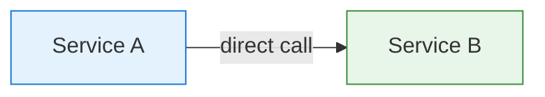
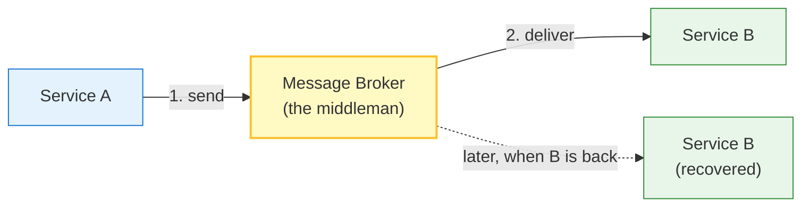
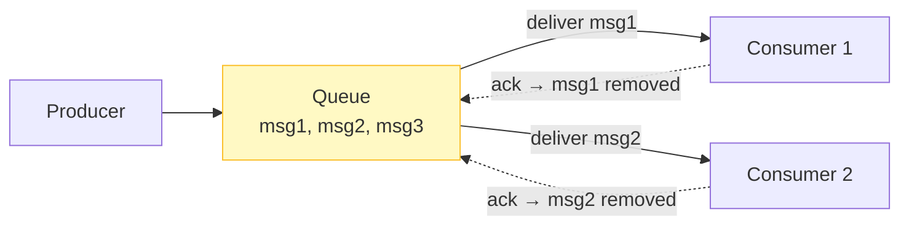
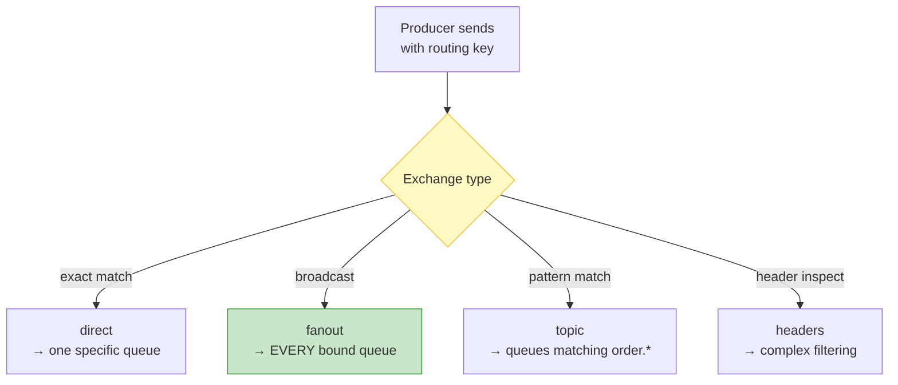
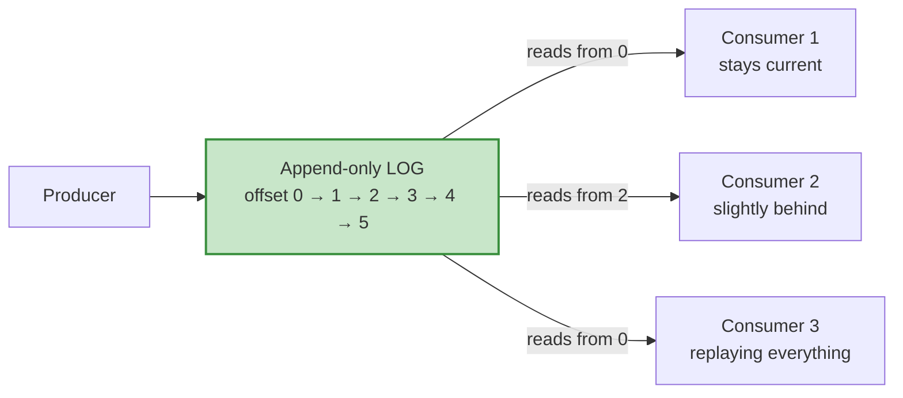
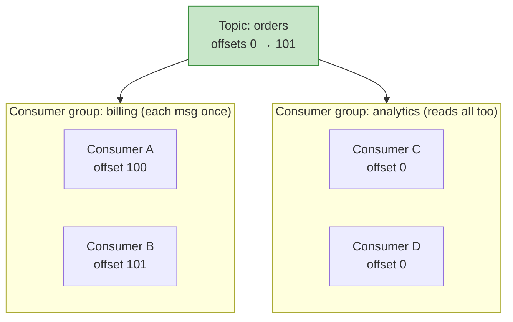
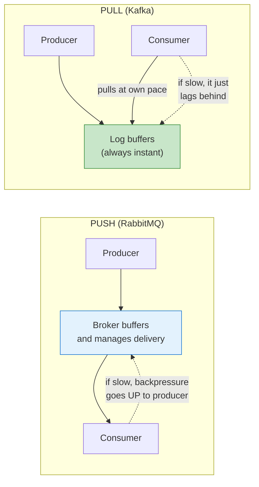
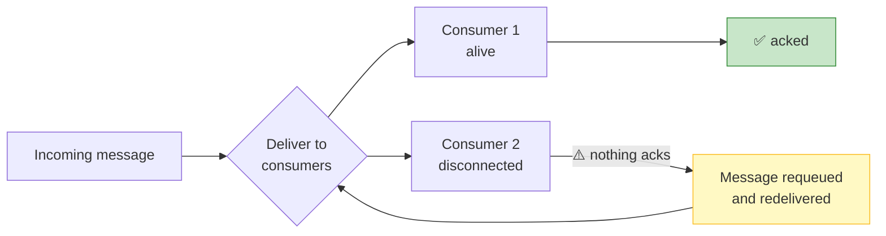
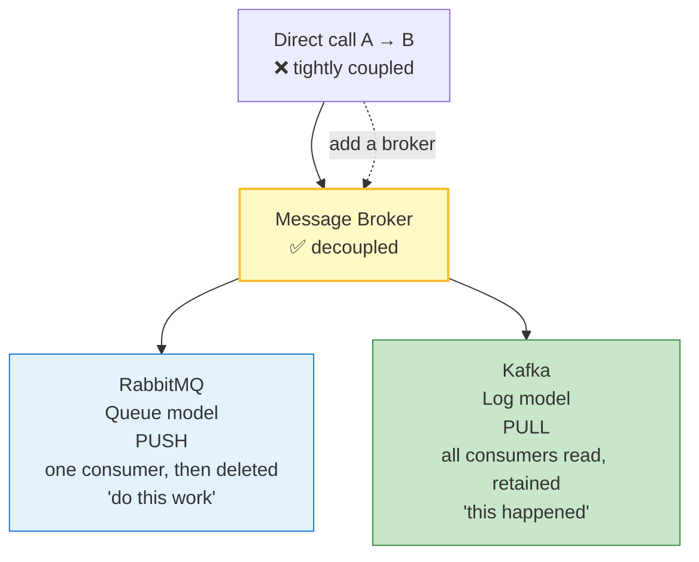

# Reference: Message Brokers — RabbitMQ vs Kafka

## Status: Reference Document 📚

> **Why this is a separate doc:** Brokers are a **distribution** pattern, not a pure communication pattern. We needed the foundation to understand Lecture 8's RabbitMQ-vs-Kafka contrast (Unit 9), and it becomes the core of **Lecture 13 (Pub/Sub)** and **Lecture 9 (Sync vs Async)**. Documented here so all three can link to one authoritative explanation.
>
> **How to read this doc:** Units build on each other. Don't skip Units 1–3 — if the vocabulary isn't solid, the RabbitMQ/Kafka comparison won't make sense.

---

## Unit 0 — The Whole Topic in One Sentence

> **RabbitMQ delivers a message once, to one consumer. Kafka stores a message once, and lets every consumer read it at their own pace.**

Everything below explains why that sentence is true.

---

## Unit 1 — The Problem: Direct Coupling

Say Service A must tell Service B something.



Simple. And it has four serious problems:

| Problem | What happens |
|---|---|
| **B is down** | A fails too — even though the event is still valid |
| **B is slow** | A blocks behind it (backpressure propagates backwards) |
| **A must survive B's outage** | Notifications shouldn't vanish because of a downstream failure |
| **B has 10 instances** | Now A must track which ones are alive |

> **The root issue: A and B are tightly coupled.** A's fate is tied to B's availability.

**Recall Lecture 8, Unit 9:** this is exactly the coupling push was supposed to break. Push removed the *client→server* coupling. A broker removes the *service→service* coupling.

---

## Unit 2 — The Solution: A Middleman



Now A and B **don't know each other exists.** A drops a message in; B picks it up when it can.

That's a **message broker**. That's the entire concept.

**What decoupling buys us:**

| Property | Explanation |
|---|---|
| **Survivability** | A can publish while B is down; the broker holds the message |
| **Load leveling** | 10 producers, 2 consumers → broker smooths the spikes |
| **Fan-out** | One event → 50 interested consumers, without producers knowing |
| **Independence** | Teams deploy and scale A and B separately |
| **Resilience** | Retries and redelivery handled centrally |

**Checkpoint:** If A no longer needs to know B exists, what new failure mode appears?

---

## Unit 3 — The Vocabulary

You need these terms before anything else makes sense.

| Term | Meaning | Everyday analogy |
|---|---|---|
| **Producer** | Whoever sends messages | The person dropping a letter in a mailbox |
| **Consumer** | Whoever receives messages | The person collecting the mail |
| **Broker** | The middleman that stores and routes messages | The postal service |
| **Message** | The data being sent | The letter itself |
| **Queue** | A holding area messages wait in | A pile of unopened letters |
| **Acknowledgment (ack)** | Consumer confirms "I got it and handled it" | Signing for the delivery |
| **Delivery guarantee** | The rules about whether a message definitely arrives | Registered mail with tracking |

**Note the deliberate overlap with Lecture 8's vocabulary:**
- **Push** (Lecture 8) = the server writes to an open connection
- **Broker push** (here) = the *broker* writes to a *consumer connection*

RabbitMQ's delivery model **is** the push model, applied to messages instead of UI updates. That's the connection between the two lectures.

**Checkpoint:** What's the difference between a message being *delivered* and a message being *acknowledged*?

---

## Unit 4 — RabbitMQ: Think "Task Queue"

RabbitMQ's model is **deliver the message to one consumer, then remove it.**



> **The core rule: a message goes to exactly ONE consumer, then it's gone from the queue.**

Think of a **restaurant kitchen**:
- Orders pile up (the queue)
- The kitchen hands each order to one waiter (one consumer)
- Once handed off, that order is no longer in the pile

### Key concepts

| Concept | What it does |
|---|---|
| **Exchange** | The "front desk" that decides *which* queue a message goes to |
| **Binding** | The rule connecting an exchange to a queue |
| **Routing key** | The label used to match a message to a queue |
| **Ack** | Consumer confirms it handled the message. No ack → requeued |
| **Prefetch (QoS)** | "Don't send me 1000 — give me 5 at a time until I ack" |

### Exchange types — RabbitMQ's real power



| Type | Routes to | Use |
|---|---|---|
| `direct` | Queue whose routing key matches exactly | Specific task to specific worker |
| `fanout` | **Every** bound queue (broadcast) | Notifications to all subscribers |
| `topic` | Queues matching a pattern like `order.*` | Subscribe to categories |
| `headers` | By inspecting message headers | Complex filtering |

**Example routing with `topic`:**
```
Message routing key: order.paid

Bound queues:
  order.*          → gets it  (matches "order.paid")
  order.#          → gets it  (matches anything after "order.")
  payment.*        → no
  *.paid           → gets it
```

### RabbitMQ's defining property

> **Messages are transient.** They exist only until consumed. If nobody consumes, they are gone.

**Delivery guarantee:** typically **at-least-once** (with manual acks) — a message may be delivered twice if the consumer crashes before acking. That's why consumers must be **idempotent**.

---

## Unit 5 — Kafka: Think "Event Log"

Kafka's model is entirely different: **append everything to a permanent, ordered log and let everyone read at their own pace.**



> **The core rule: messages are STORED, not delivered-and-deleted. Each consumer reads independently and tracks its own position (offset).**

Think of a **newspaper archive**:
- Every issue is published and kept (the log)
- Each subscriber reads at their own pace and can re-read any old issue
- One slow subscriber doesn't stop the publisher or other subscribers

### Key concepts

| Concept | What it does |
|---|---|
| **Topic** | A named stream of events (e.g. `orders-created`) |
| **Partition** | A slice of a topic = the unit of parallelism |
| **Offset** | A consumer's position within a partition |
| **Consumer group** | Consumers that split the work of a topic |
| **Retention policy** | How long Kafka keeps messages |

### Consumer groups — the concept that trips everyone up



- **Within one consumer group**, each message goes to **one** member (like RabbitMQ — this is where parallelism comes from)
- **Across different groups**, **every group reads everything** independently

That single mechanism gives you both *work distribution* and *broadcast* at once.

### Kafka's defining property

> **Messages are retained per policy** (e.g. 7 days), whether or not anyone reads them.

**Delivery guarantee:** **at-least-once** per partition, with exactly-once possible via transactions (at a cost).

---

## Unit 6 — The Core Difference

| | **RabbitMQ** | **Kafka** |
|---|---|---|
| **Mental model** | A **task queue** — "someone, do this job" | An **event log** — "here's everything that happened" |
| **Message lifetime** | Transient — removed once consumed | Durable — retained per policy |
| **Delivered to** | **One** consumer, then deleted | **Every** interested reader, independently |
| **Delivery style** | **Push** (broker pushes to consumer) | **Pull** (consumer pulls at its offset) |
| **Slow consumer** | Blocks the broker / producer | Only delays itself |
| **Consumer offline** | Message lost (unless acked & requeued) | Message **waits in the log** |
| **Replay history** | ❌ Impossible — gone once consumed | ✅ Trivial — reset offset to 0 |
| **Routing** | Rich (exchange types, routing keys) | Simple (topic + partition only) |
| **Throughput** | Thousands/sec | Millions/sec |
| **Best for** | Task distribution, routing, RPC, work queues | Event streaming, log aggregation, analytics, CDC |
| **Analogy** | Postal service | Newspaper archive |

### The trade in one line

> **RabbitMQ optimises for *delivery now*. Kafka optimises for *retaining everything*.**

**Checkpoint:** In RabbitMQ with a `fanout` exchange and 3 queues, one message is published. Each queue receives one copy — but how many copies does a *single* consumer attached to one queue get?

---

## Unit 7 — Why This Is Lecture 8's Push/Pull Story

This is where Lecture 8, Unit 9 finally lands.

### RabbitMQ chose PUSH

- Consumer connects → broker pushes messages to it
- **Why:** lowest latency. The job is available *now*, so deliver it *now*
- **Cost:** the broker owns delivery. Slow consumer → broker waits. Dead consumer → messages pile up. Absent consumer → need to buffer elsewhere

That is **exactly Lecture 8's push cost model (Units 4, 5, 6)** — idle connections cost, no flow control, delivery correctness is the server's problem.

### Kafka chose PULL

- Consumer periodically asks "give me everything after offset N"
- **Why:** the log itself is the buffer. The producer never blocks
- **Bonus:** replay, history, and offline consumers all become free



### The Unifying Insight

> **The trade-off is *where the buffer lives*:**
> - **Push** → the *broker* buffers and manages delivery → the broker is the bottleneck
> - **Pull** → the *log* buffers → the producer is never blocked

Recall Lecture 8, Unit 9: *"Where backpressure lives."*
- **RabbitMQ:** backpressure pushes back to the **producer**
- **Kafka:** the consumer **absorbs** it by simply lagging behind

**Checkpoint:** A RabbitMQ consumer disconnects while messages are being pushed. What happens, and what's the fix?

---

## Unit 8 — RabbitMQ Has the Same Bug as Unit 13

Lecture 8, Unit 13 showed a WebSocket broadcast crashing when a client was dead. **RabbitMQ push has exactly the same hazard**, and it's why the ack exists:



**The difference:** RabbitMQ *detects* the dead consumer via the ack timeout and **requeues** the message. That's far better than the WebSocket demo, which just lost the data.

**The remaining hazard:** if the message was acked but the consumer crashed mid-processing, the message is gone. That's why **at-least-once + idempotent consumers** is the standard pairing.

**Checkpoint:** Why must a RabbitMQ consumer be idempotent?

---

## Unit 9 — Which Should You Use?

| Situation | Choose | Why |
|---|---|---|
| "Do these 10 jobs, one worker each" | **RabbitMQ** | Task distribution via `direct` exchange |
| "Notify all 1000 users" | **RabbitMQ** | `fanout` exchange |
| "Video uploaded → transcode + notify + index" | **RabbitMQ** | Routing to different consumers |
| "Collect 50k events/sec from 100 services" | **Kafka** | High throughput, durable log |
| "Feed a data warehouse, replay if needed" | **Kafka** | Replay from offset 0 |
| "Event sourcing — rebuild all state" | **Kafka** | Full history retained |
| "Billing *and* analytics both need every event" | **Kafka** | Multiple consumer groups |
| "Guaranteed delivery even if consumer is offline for days" | **Kafka** | Retention policy |

### The rule of thumb

> **RabbitMQ = "do this work"** → **commands**, tasks, RPC
> **Kafka = "this happened"** → **events**, facts, changes

**The command/event distinction (event storming vocabulary):**
- A **command** is an *imperative instruction*: "SendEmail", "ProcessVideo" — may be rejected
- An **event** is a *past-tense fact*: "EmailSent", "VideoProcessed" — already true, cannot be rejected

RabbitMQ routes commands. Kafka records events. That's why Kafka's retention makes sense (history is valuable) while RabbitMQ's deletion makes sense (a completed task has no further use).

**Checkpoint:** Which handles "handle these 500 image resizes"? Which handles "record every click, for analytics"?

---

## Summary — The Mental Model to Keep



### Three things to remember

1. **A broker breaks service-to-service coupling** — producers and consumers don't know each other exists.
2. **RabbitMQ optimises for delivery now; Kafka optimises for retaining everything.** Different goals, different designs.
3. **The buffer location is the real trade-off.** Push → broker buffers. Pull → log buffers.

---

## Vocabulary

| Term | Meaning |
|---|---|
| **Message broker** | Middleman decoupling producers from consumers |
| **Producer / Consumer** | Sender / receiver of messages |
| **Decoupling** | Components depend only on the broker, not on each other |
| **Exchange** | RabbitMQ's front desk; routes messages to queues |
| **Routing key** | The label matched against bindings to select a queue |
| **Binding** | The rule linking an exchange to a queue |
| **direct / fanout / topic / headers** | RabbitMQ exchange types: exact / broadcast / pattern / header-filter |
| **Acknowledgment (ack)** | Confirmation the consumer handled the message |
| **Prefetch / QoS** | Limit on unacked messages per consumer |
| **Requeue** | Return an unacked message to the queue for redelivery |
| **Dead letter queue** | Where messages go after repeated failures |
| **Topic** | A named stream of events in Kafka |
| **Partition** | A slice of a topic; the unit of parallelism |
| **Offset** | A consumer's position within a partition |
| **Consumer group** | Consumers that split a topic's messages between them |
| **Retention policy** | How long Kafka keeps messages regardless of consumption |
| **Replay** | Re-reading a Kafka log from an earlier offset |
| **Event sourcing** | Rebuilding application state by replaying an event log |
| **Idempotent consumer** | A consumer that is safe to run twice on the same message |
| **At-least-once** | Delivery guarantee where duplicates are possible |
| **Backpressure** | Propagation of slowness backwards through the system |
| **Command vs Event** | Imperative instruction vs. past-tense immutable fact |

---

## Self-Test — Can You Answer These?

1. Service A calls Service B directly and B goes down. What happens to A, and what is the root cause called? *(Unit 1)*
2. If A no longer knows B exists, what new responsibility does A take on? *(Unit 2)*
3. What is the difference between a message being *delivered* and being *acknowledged*? *(Unit 3)*
4. In RabbitMQ with a `fanout` exchange and 3 queues, how many copies of one message exist? How many does a single consumer on one queue get? *(Unit 6)*
5. Why can't a RabbitMQ consumer re-read last week's messages, but a Kafka consumer can? *(Unit 6)*
6. Explain the push/pull difference purely in terms of *where the buffer lives*. *(Unit 7)*
7. What happens to a message pushed to a RabbitMQ consumer that just disconnected? *(Unit 8)*
8. Why must a RabbitMQ consumer be idempotent? *(Unit 8)*
9. Which broker for "handle 500 image resizes"? Which for "record every click for analytics"? *(Unit 9)*
10. What problem do Kafka **consumer groups** solve that a single-level broker can't? *(Unit 5)*

---

## Carried Forward

| Where | What it feeds |
|---|---|
| **Lecture 9 — Sync vs Async** | Why queues are the backbone of asynchronous work |
| **Lecture 13 — Pub/Sub** | Brokers *are* the pub/sub implementation — routing, fan-out, delivery guarantees |
| **Lecture 15 — Stateful vs Stateless** | Whether broker state (offsets, queues, acks) makes a system stateful |

---

*Reference document. Referenced from Lecture 8 Unit 9 and used as the foundation for Lecture 13.*